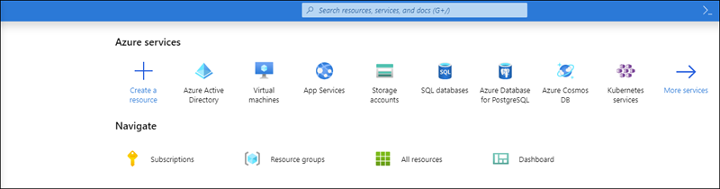
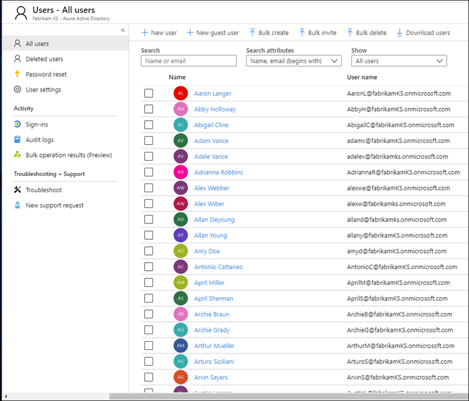
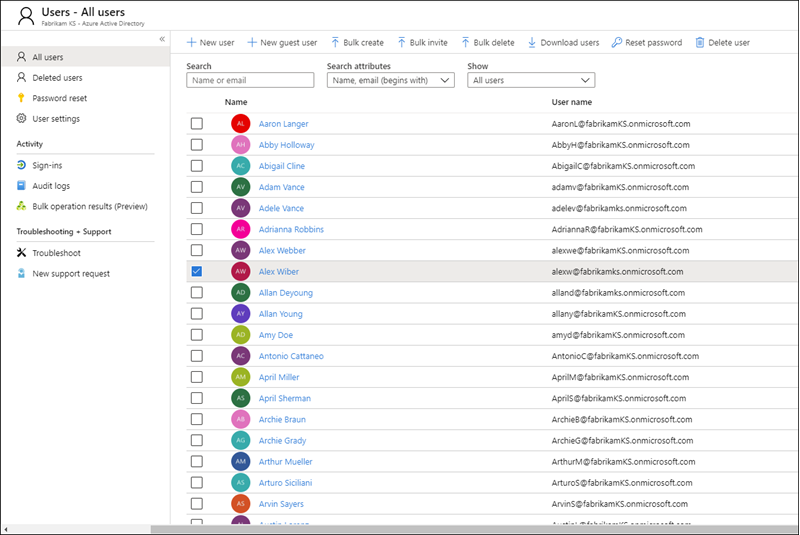
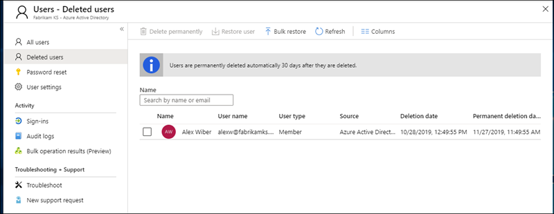
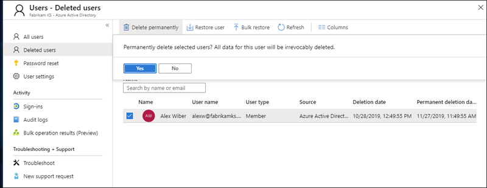
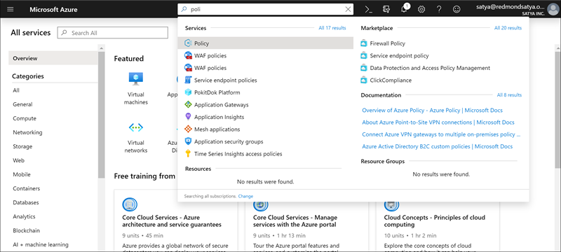
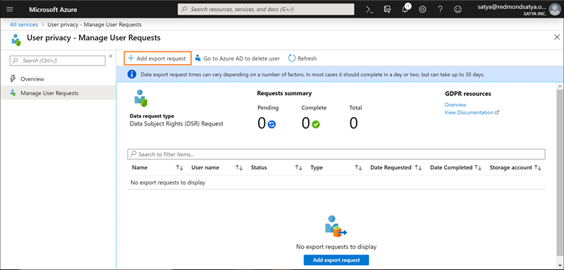

# Azure Data Subject Requests for the GDPR and CCPA

## Introduction to Data Subject Requests (DSRs)

The European Union [General Data Protection Regulation (GDPR)](https://ec.europa.eu/justice/data-protection/reform/index_en.htm) gives rights to people (known in the regulation as *data subjects*) to manage the personal data that has been collected by an employer or other type of agency or organization (known as the *data controller* or just *controller*). Personal data is defined very broadly under the GDPR as any data that relates to an identified or identifiable natural person. The GDPR gives data subjects specific rights to their personal data; these rights include obtaining copies of personal data, requesting corrections to it, restricting the processing of it, deleting it, or receiving it in an electronic format so it can be moved to another controller. A formal request by a data subject to a controller to take an action on their personal data is called a *Data Subject Request* or DSR.

Similarly, the California Consumer Privacy Act (CCPA), provides privacy rights and obligations to California consumers, including rights similar to GDPR's Data Subject Rights, such as the right to delete, access and receive (portability) their personal information. The CCPA also provides for certain disclosures, protections against discrimination when electing exercise rights, and "opt-out/ opt-in" requirements for certain data transfers classified as "sales". Sales are broadly defined to include the sharing of data for a valuable consideration. For more information about the CCPA, see the [California Consumer Privacy Act](offering-ccpa.md) and the [California Consumer Privacy Act FAQ](ccpa-faq.md).

The guide discusses how to use Microsoft products, services and administrative tools to help our controller customers find and act on personal data to respond to DSRs. Specifically, this includes how to find, access, and act on personal data that reside in the Microsoft cloud. Here's a quick overview of the processes outlined in this guide:

- **Discover:** Use search and discovery tools to more easily find customer data that may be the subject of a DSR. Once potentially responsive documents are collected, you can perform one or more of the DSR actions described in the following steps to respond to the request. Alternatively, you may determine that the request doesn't meet your organization's guidelines for responding to DSRs.
- **Access:** Retrieve personal data that resides in the Microsoft cloud and, if requested, make a copy of it that can be available to the data subject.
- **Rectify:** Make changes or implement other requested actions on the personal data, where applicable.
- **Restrict:** Restrict the processing of personal data, either by removing licenses for various Azure services or turning off the desired services where possible. You can also remove data from the Microsoft cloud and retain it on-premises or at another location.
- **Delete:** Permanently remove personal data that resided in the Microsoft cloud.
- **Export/Receive (Portability):** Provide an electronic copy (in a machine-readable format) of personal data or personal information to the data subject. Personal information under the CCPA is any information relating to an identified or identifiable person. There is no distinction between a person's private, public, or work roles. The defined term "personal information" roughly lines up with "personal data" under GDPR. However, the CCPA also includes family and household data. For more information about the CCPA, see the [California Consumer Privacy Act](offering-ccpa.md) and the [California Consumer Privacy Act FAQ](ccpa-faq.md).

Each section in this guide outlines the technical procedures that a data controller organization can take to respond to a DSR for personal data in the Microsoft cloud.

## Terminology

The following provides definitions of terms that are relevant to this guide.

- **Controller:** The natural or legal person, public authority, agency or other body which, alone or jointly with others, determines the purposes and means of the processing of personal data; where the purposes and means of such processing are determined by Union or Member State law, the controller, or the specific criteria for its nomination may be provided for by Union or Member State law.
- **Personal data and data subject:** Any information relating to an identified or identifiable natural person ('data subject'); an identifiable natural person is one who can be identified, directly or indirectly, in particular by reference to an identifier such as a name, an identification number, location data, an online identifier or to one or more factors specific to the physical, physiological, genetic, mental, economic, cultural, or social identity of that natural person.
- **Processor:** A natural or legal person, public authority, agency, or other body, which processes personal data on behalf of the controller.
- **Customer Data:** All data, including all text, sound, video, or image files, and software, that are provided to Microsoft by, or on behalf of, a customer through use of the enterprise service. Customer Data includes both (1) identifiable information of end users (for example, user names and contact information in Azure Active Directory) and Customer Content that a customer uploads into or creates in specific services (for example, customer content in an Azure Storage account, customer content of an Azure SQL Database, or a customer's virtual machine image in Azure Virtual Machines).
- **System-Generated Logs:** Logs and related data generated by Microsoft that help Microsoft provide enterprise services to users. System-generated logs contain primarily pseudonymized data, such as unique identifiers — typically a number generated by the system that cannot on its own identify an individual person but is used to deliver the enterprise services to users. System-generated logs may also contain identifiable information about end users, such as a user name.

## How to use this guide

This guide consists of two parts:

- **Part 1: Responding to Data Subject Requests for Customer Data:** Part 1 of this guide discusses how to access, rectify, restrict, delete, and export data from applications in which you have authored data. This section details how to execute DSRs against both Customer Content and also identifiable information of end users.
- **Part 2: Responding to Data Subject Requests for System-Generated Logs:** When you use Microsoft's enterprise services, Microsoft generates some information, known as System-Generated Logs, in order to provide the service. Part 2 of this guide discusses how to access, delete, and export such information for Azure.

## Understanding DSRs for Azure Active Directory and Microsoft service accounts

When considering services provided to enterprise customers, execution of DSRs must always be understood within the context of a specific Azure Active Directory (AAD) tenant. Notably, DSRs are always executed within a given AAD tenant. If a user is participating in multiple tenants, it is important to emphasize that a given DSR is *only* executed within the context of the specific tenant the request was received within. This is critical to understand as it means the execution of a DSR by one enterprise customer **will not** impact the data of an adjacent enterprise customer.

The same also applies for Microsoft Service Accounts (MSA) within the context of services provided to an enterprise customer: execution of a DSR against an MSA account *associated with an AAD tenant* **will only** pertain to data within the tenant. In addition, it is important to understand the following when handling MSA accounts within a tenant:

- If an MSA user creates an Azure subscription, the subscription will be handled as if it were an AAD tenant. Consequently, DSRs are scoped within the tenant as described above.
- If an Azure subscription created via an MSA account is deleted, **it will not affect** the actual MSA account. Again, as noted above, DSRs executing within the Azure subscription are limited to the scope of the tenant itself.

DSRs against an MSA account itself, **outside a given tenant**, are executed via the Consumer Privacy Dashboard. Please refer to the Windows Data Subject Request Guide for further details.

## Part 1: DSR Guide for customer data

### Executing DSRs against customer data

Microsoft provides the ability to access, delete, and export certain Customer Data through the Azure Portal and also directly via pre-existing application programming interfaces (APIs) or user interfaces (UIs) for specific services (also referred to as *in-product experiences*). Details regarding such in-product experiences are described in the respective services' reference documentation.

>[!IMPORTANT]  
> Services supporting in-product DSRs require direct usage of the service's application programming interface (API) or user interface (UI), describing applicable CRUD (create, read, update, delete) operations. Consequently, execution of DSRs within a given service must be done in addition to execution of a DSR within the Azure Portal in order to complete a full request for a given data subject. Please refer to specific services' reference documentation for further details.

### Step 1: Discover

The first step in responding to a DSR is to find the personal data that is the subject of the request. This first step — finding and reviewing the personal data at issue — will help you determine whether a DSR meets your organization's requirements for honoring or declining a DSR. For example, after finding and reviewing the personal data at issue, you may determine the request doesn't meet your organization's requirements because doing so may adversely affect the rights and freedoms of others.

After you find the data, you can then perform the specific action to satisfy the request by the data subject.

[Azure Active Directory](https://azure.microsoft.com/services/active-directory/) is Microsoft's cloud-based, multi-tenant directory and identity management service. You can locate identifiable information of end users, such as customer and employee user profiles and user work information that contain personal data in your [Azure Active Directory](https://azure.microsoft.com/services/active-directory/) (AAD) environment by using the [Azure portal](https://portal.azure.com/).

This is particularly helpful if you want to find or change personal data for a specific user. You can also add or change user profile and work information. You must sign in with an account that's a global admin for the directory.

#### How do I locate or view user profile and work information?

1. Sign in to the [Azure portal](https://portal.azure.com/) with an account that's a global admin for the directory.

2. Select **Azure Active Directory**.

     

3. Select **Users**.

     

4. On the **All users** blade, select a user from the list, and then, on the blade for the selected user, select **Profile** to view user profile information that might contain personal data.

    

5. If you need to add or change user profile information, you can do so by selecting **Edit** in the command bar, then select **Save** after making changes.

#### Service-specific interfaces

Microsoft provides the ability to discover Customer Data directly via pre-existing application programming interfaces (APIs) or user interfaces (UIs) for specific services. Details are described in the respective services' reference documentation, describing applicable CRUD (create, read, update, delete) operations.

### Step 2: Access

After you've found Customer Data containing personal data that is potentially responsive to a DSR, it is up to you and your organization to decide which data to provide to the data subject. You can provide them with a copy of the actual document, an appropriately redacted version, or a screenshot of the portions you have deemed appropriate to share. For each of these responses to an access request, you will have to retrieve a copy of the document or other item that contains the responsive data.

When providing a copy to the data subject, you may have to remove or redact personal information about other data subjects and any confidential information.

#### Azure Active Directory

Microsoft offers both a portal and in-product experiences providing the enterprise customer's tenant administrator the capability to manage DSR access requests. DSR Access requests allow for access of the personal data of the user, including: (a) identifiable information about an end-user and (b) system-generated logs.

#### Service-specific interfaces

Microsoft provides the ability to discover Customer Data directly via pre-existing application programming interfaces (APIs) or user interfaces (UIs) for specific services. Details are described in the respective services' reference documentation, describing applicable CRUD (create, read, update, delete) operations.

### Step 3: Rectify

If a data subject has asked you to rectify the personal data that resides in your organization's data, you and your organization will have to determine whether it's appropriate to honor the request. Rectifying the data may include taking actions such as editing, redacting, or removing personal data from a document or other type or item. The most expedient way to do this for Microsoft Support and FastTrack data is provided below.

#### Azure Active Directory

Enterprise customers have the ability to manage DSR rectify requests, including limited editing features per the nature of a given Microsoft service. As a data processor, Microsoft does not offer the ability to correct system-generated logs as it reflects factual activities and constitutes a historical record of events within Microsoft services. With respect to Azure Active Directory, limited editing features exist to rectify identifiable information about an end-user, as described further below.

##### Azure Active Directory: rectify/correct inaccurate or incomplete personal data

You can correct, update, or delete identifiable information about end users, such as customer and employee user profiles and user work information that contain personal data, such as a user's name, work title, address, or phone number, in your [Azure Active Directory](https://azure.microsoft.com/services/active-directory/) (AAD) environment by using the [Azure portal](https://portal.azure.com/). You must sign in with an account that's a global admin for the directory.

###### How do I correct or update user profile and work information in Azure Active Directory?

1. Sign in to the [Azure portal](https://portal.azure.com/) with an account that's a global admin for the directory.

2. Select **Azure Active Directory**.

    

3. Select **Users**.

    

4. On the **All users** blade, select a user from the list, and then, on the blade for the selected user, select **Profile** to view the user profile information that needs to be corrected or updated.

    

5. Correct or update the user profile information including work information by selecting **Edit** in the command bar, then select **Save** after making changes.

    

#### Service-Specific Interfaces

Microsoft provides the ability to discover Customer Data directly via pre-existing application programming interfaces (APIs) or user interfaces (UIs) for specific services. Details are described in the respective services' reference documentation, describing applicable CRUD (create, read, update, delete) operations.

### Step 4: Restrict

Data subjects may request that you restrict processing of their personal data. We provide both the Azure Portal and pre-existing application programming interfaces (APIs) or user interfaces (UIs). These experiences provide the enterprise customer's tenant administrator the capability to manage such DSRs through a combination of data export and data deletion. A customer may (1) export an electronic copy of the personal data of the user, including (a) account(s), (b) system-generated logs, and (c) associated logs, followed with (2) deletion of the account and associated data residing within Microsoft systems.

### Step 5: Delete

The "right to erasure" by the removal of personal data from an organization's Customer Data is a key protection in the GDPR. Removing personal data includes removing all personal data and system-generated logs, except audit log information. When a user is **soft deleted** (see details below), the account is disabled for 30 days. If no further action is taken during this 30-day period, the user is **permanently deleted** (again, see details below). Upon a **permanent delete**, the user's account, personal data, and system-generated logs are expunged within an additional 30 days. If a tenant admin immediately issues a **permanent delete**, the user's account, personal data, and system-generated logs are expunged within 30 days of issuance.

> [!IMPORTANT]
> You must be a tenant administrator to delete a user from the tenant.

#### Delete a user and associated data through the Azure portal

After you receive a delete request for a data subject, you can use the Azure portal to delete both a user and the associated personal information as well as system-generated logs.

Deleting this data also means deleting the user from the tenant. Users are initially soft-deleted, which means the account can be recovered by a tenant admin within 30 days of being marked for soft-delete. After 30 days, the account is automatically, and permanently, deleted from the tenant. Prior to that 30 days, you can manually delete a soft-deleted user from the recycle bin.

Here's the high-level process for deleting users from your tenant.

1. Go to the Azure portal and locate the user.

2. Delete the user. When you initially delete the user, the user's account is sent to the Recycle Bin. **At this point, the user is soft deleted, meaning the account is disabled, but not expunged from Azure Active Directory.**

3. Go to the Recently deleted users list and permanently delete the user. **At this point the user is permanently deleted (also known as hard deleted), meaning the account has been expunged from Azure Active Directory**

###### To delete a user from an Azure tenant

1. Sign in to the [Azure portal](https://portal.azure.com/) with an account that's a global admin for the directory.

2. Select **Azure Active Directory**.

    

3. Select **Users**.

    

4. Check the box next to the user you want to delete, select **Delete user**, and then select **Yes** in the box asking if you want to delete the user.

    

5. On the **All users** blade, select **Deleted users**.

    

4. Select the same user again, select **Delete permanently** in the command bar, and then select **Yes** in the box asking if you're sure.

>[!IMPORTANT]  
>Be aware that by clicking **Yes** you are permanently, and irrevocably, deleting the user and all associated data and system-generated logs. If you do this by mistake, you'll have to manually add the user back to the tenant. The associated data and system-generated logs are non-recoverable.

   

#### Service-specific interfaces

Microsoft provides the ability to discover Customer Data directly via pre-existing application programming interfaces (APIs) or user interfaces (UIs) for specific services. Details are described in the respective services' reference documentation, describing applicable CRUD (create, read, update, delete) operations.

## Step 6: Export

The "right of data portability" allows a data subject to request a copy of their personal data in an electronic format (that's a "structured, commonly used, machine read-able, and interoperable format") that may be transmitted to another data controller. Azure supports this by enabling your organization to export the data in the native JSON format, to your specified Azure Storage Container.

>[!IMPORTANT]
>You must be a tenant administrator to export user data from the tenant.

### Azure Active Directory

With respect to Customer Data, Microsoft offers both a portal and in-product experiences providing the enterprise customer's tenant administrator the capability to manage export requests for identifiable information about an end user.

### Service-specific interfaces

Microsoft provides the ability to discover Customer Data directly via pre-existing application programming interfaces (APIs) or user interfaces (UIs) for specific services. Details are described in the respective services' reference documentation, describing applicable CRUD (create, read, update, delete) operations.

## Part 2: System-Generated Logs

Microsoft also provides you with the ability to access, delete, and export certain system-generated logs associated with a user's use of Azure.

>[!IMPORTANT]
> The ability to restrict or rectify system-generated logs is not supported. System-generated logs constitute factual actions conducted within the Microsoft cloud and diagnostic data, and modifications to such data would compromise the historical record of actions, increasing fraud and security risks.

### Executing DSRs against System-Generated Logs

Microsoft provides the ability to access, delete, and export certain system-generated logs through the Azure Portal and also directly via programmatic interfaces or user interfaces for specific services. Details are described in the respective services' reference documentation.

>[!IMPORTANT]  
> Services supporting in-product DSRs require direct usage of the service's application programming interface (API) or user interface (UI). Consequently, execution of an in-product DSRs **must be done in addition to execution of a DSR within the Azure Portal in order to complete a full request for a given data subject. Please refer to specific services' reference documentation for further details.**

### Step 1: Access

The tenant admin is the only person within your organization who can access system-generated logs associated with a particular user's use of Azure. The data retrieved for an access request will be provided in a machine-readable format and will be provided in files that will allow the user to know which services the data is associated with. As noted above, the data retrieved will not include data that may compromise the security of the service.

#### Azure Active Directory

Microsoft offers both a portal and in-product experiences providing the enterprise customer's tenant administrator the capability to manage access requests. Access requests will allow for access of the personal data of the user, including: (a) identifiable information about an end user and (b) service-generated logs. The process is identical to that described in the Azure Active Directory section of Part 1, Step 2: Access.

#### Service-specific interfaces

Microsoft provides the ability to discover Customer Data directly via pre-existing application programming interfaces (APIs) or user interfaces (UIs) for specific services. Details are described in the respective services' reference documentation, describing applicable CRUD (create, read, update, delete) operations.

### Step 2: Delete

The tenant admin is the only person within your organization who can execute a DSR delete request for a particular user within an Azure tenant.

#### Azure Active Directory

Microsoft offers both a portal and in-product experiences providing the enterprise customer's tenant administrator the capability to manage DSR delete requests. DSR delete requests follow the same as described in the Delete a user and associated data through the Azure portal section of Part 1, Step 5: Delete.

#### Service-specific interfaces

Microsoft provides the ability to discover Customer Data directly via pre-existing application programming interfaces (APIs) or user interfaces (UIs) for specific services. Details are described in the respective services' reference documentation, describing applicable CRUD (create, read, update, delete) operations.

### Step 3: Export

The tenant admin is the only person within your organization who can access system-generated logs associated with a particular user's use of Azure. The data retrieved for an export request will be provided in a machine-readable format and will be provided in files that will allow the user to know which services the data is associated with. As noted above, the data retrieved will not include data that may compromise the security or stability of the service.

#### Export system-generated logs using the Azure portal

After you receive an export request for a data subject, you can use the Azure portal to export system-generated logs associated with a given user.

Here's the high-level process for exporting data from your tenant.

1. Go to the Azure portal and create an export request on behalf of the user.
2. Export the data and send file to user.

###### To export a user's info from an Azure tenant

1. Open the Azure portal, select **All services**, type *policy* into the filter, and then select **Policy**.

     

2. In the **Policy** blade, select **User privacy**, select **Manage User Requests**, and then select **Add export request**.

    

3. Complete the **Export data request**:

    

- **User.** Type the email address of the Azure Active Directory user that requested the export.
- **Subscription.** Select the account you use to report resource usage and to bill for services. This is also the location of your Azure storage account.
- **Storage account.** Select the location of your Azure Storage (Blob). For more info, see the [Introduction to Microsoft Azure Storage — Blob storage](https://docs.microsoft.com/azure/storage/common/storage-introduction#blob-storage) article.
- **Container.** Create a new (or select an existing) container as the storage location for the user's exported privacy data.

4. Select **Create**.

The export request goes into **Pending** status. You can view the report status on the **User privacy — Overview** blade.

>[!IMPORTANT]  
>Because personal data can come from multiple systems, it's possible that the export process might take up to one month to complete.

#### Service-Specific Interfaces

Microsoft provides the ability to discover Customer Data directly via pre-existing application programming interfaces (APIs) or user interfaces (UIs) for specific services. Details are described in the respective services' reference documentation, describing applicable CRUD (create, read, update, delete) operations.

### Notify about exporting or deleting issues

If you run into issues while exporting or deleting data from the Azure portal, go to the Azure portal **Help + Support** blade and submit a new ticket under **Subscription Management > Other Security and Compliance Request > Privacy Blade and GDPR Requests**.

## Learn more

- [Microsoft Trust Center](https://www.microsoft.com/trust-center/privacy/gdpr-overview)
