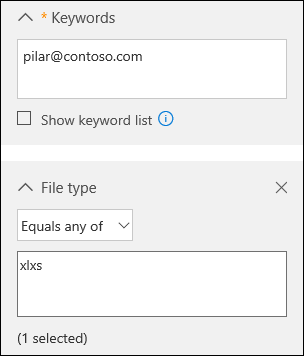
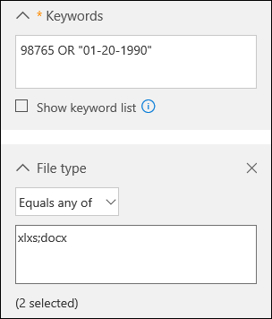
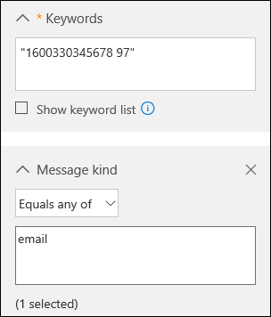

# Office 365 Data Subject Requests for the GDPR and CCPA

## Introduction to DSRs

The European Union [General Data Protection Regulation (GDPR)](https://ec.europa.eu/justice/data-protection/reform/index_en.htm) gives rights to people (known in the regulation as *data subjects*) to manage the personal data that has been collected by an employer or other type of agency or organization (known as the *data controller* or just *controller*). Personal data is defined broadly under the GDPR as any data that relates to an identified or identifiable natural person. The GDPR gives data subjects specific rights to their personal data; these rights include obtaining copies of it, requesting changes to it, restricting the processing of it, deleting it, or receiving it in an electronic format so it can be moved to another controller. A formal request by a data subject to a controller to take an action on their personal data is called a *Data Subject Request* or DSR. The controller is obligated to promptly consider each DSR and provide a substantive response either by taking the requested action or by providing an explanation for why the DSR cannot be accommodated by the controller. A controller should consult with its own legal or compliance advisers regarding the proper disposition of any given DSR.

Similarly, the California Consumer Privacy Act (CCPA), provides privacy rights and obligations to California consumers, including rights similar to GDPR's Data Subject Rights, such as the right to delete, access and receive (portability) their personal information. The CCPA also provides for certain disclosures, protections against discrimination when electing exercise rights, and "opt-out/ opt-in" requirements for certain data transfers classified as "sales". Sales are broadly defined to include the sharing of data for a valuable consideration. For more information about the CCPA, see the [California Consumer Privacy Act](offering-ccpa.md) and the [California Consumer Privacy Act FAQ](ccpa-faq.md).

The guide discusses how to use Office 365 products, services, and administrative tools to help you find and act on personal data or personal information to respond to DSRs. Specifically, this includes how to find, access, and act on personal data or personal information that resides in Microsoft's cloud. Here's a quick overview of the processes outlined in this guide:

- **Discover:** Use search and discovery tools to more easily find customer data that may be the subject of a DSR. Once potentially responsive documents are collected, you can perform one or more of the DSR actions described in the following steps to respond to the request. Alternatively, you may determine that the request doesn't meet your organization's guidelines for responding to DSRs.
- **Access:** Retrieve personal data that resides in the Microsoft cloud and, if requested, make a copy of it that can be available to the data subject.
- **Rectify:** Make changes or implement other requested actions on the personal data, where applicable.
- **Restrict:** Restrict the processing of personal data, either by removing licenses for various Microsoft cloud services or turning off the desired services where possible. You can also remove data from the Microsoft cloud and retain it on-premises or at another location.
- **Delete:** Permanently remove personal data that resided in the Microsoft cloud.
- **Export/Receive (Portability):** Provide an electronic copy (in a machine-readable format) of personal data or personal information to the data subject. Personal information under the CCPA is any information relating to an identified or identifiable person. There is no distinction between a person's private, public, or work roles. The defined term "personal information" roughly lines up with "personal data" under GDPR. However, the CCPA also includes family and household data. For more information about the CCPA, see the [California Consumer Privacy Act](offering-ccpa.md) and the [California Consumer Privacy Act FAQ](ccpa-faq.md).

### Terminology

Here are definitions of terms from the GDPR that are relevant to this guide.

- **Controller:** The natural or legal person, public authority, agency or other body which, alone or jointly with others, determines the purposes and means of the processing of personal data; where the purposes and means of such processing are determined by Union or Member State law, the controller, or the specific criteria for its nomination may be provided for by Union or Member State law.
- **Personal data and data subject:** Any information relating to an identified or identifiable natural person ('data subject'); an identifiable natural person is one who can be identified, directly or indirectly, in particular by reference to an identifier such as a name, an identification number, location data, an online identifier or to one or more factors specific to the physical, physiological, genetic, mental, economic, cultural, or social identity of that natural person.
- **Processor:** A natural or legal person, public authority, agency, or other body, which processes personal data on behalf of the controller.
- **Customer Data:** All data, including all text, sound, video, or image files, and software, that is provided to Microsoft by, or on behalf of, a customer through use of the enterprise service. Customer Data includes both (1) identifiable information of end users (for example, user names and contact information in Azure Active Directory) and Customer Content that a customer uploads into or creates in specific services (for example, customer content in a Word or Excel document, or in the text of an Exchange Online email; customer content added to a SharePoint Online site, or saved to a OneDrive for Business account).
- **System-Generated Logs:** Logs and related data generated by Microsoft that help Microsoft provide enterprise services to users. System-generated logs contain primarily pseudonymized data, such as unique identifiers — typically a number generated by the system - cannot on its own identify an individual person but is used to deliver the enterprise services to users. System-generated logs may also contain identifiable information about end users, such as a user name.

### How to use this guide

To help you find information relevant to your use case, this guide is divided into four parts.

- **[Part 1: Responding to DSRs for Customer Data](#part-1-responding-to-dsrs-for-customer-data):** *Customer Data* is data produced and stored in Office 365 in the day-to-day operations of running your business. Examples of the most commonly used Office 365 applications that allow you to author data include Word, Excel, PowerPoint, Outlook, and OneNote. Office 365 also consists of applications such as SharePoint Online, Teams, and Forms that allow you to better collaborate with others. Part 1 of this guide discusses how to discover access, rectify, restrict, delete, and export data from Office 365 applications that have been used to author and store data in Office 365 online services. It addresses products and services for which Microsoft is acting as a data processor to your organization, and thus DSR capability is made available to your tenant administrator.
- **[Part 2: Responding to DSRs with Respect to Insights Generated by Office 365](#part-2-responding-to-dsrs-with-respect-to-insights-generated-by-office-365):** Office 365 provides certain insights through services like Delve, MyAnalytics, and Workplace Analytics. How these insights are generated and how to respond to DSRs related to them are explained in Part 2 of this guide.
- **[Part 3: Responding to DSRs for system-generated Logs](#part-3-responding-to-dsrs-for-system-generated-logs):** When you use Office 365 enterprise services, Microsoft generates some information such as service logs that record the use or performance of features in the online services. Most service-generated data contain pseudonymous identifiers generated by Microsoft and this category is thus generally referred to within this document as *system-generated logs*. Although this data can't be attributed to a specific data subject without the use of additional information, some of it may be deemed personal under GDPR's definition for "personal data." Part 3 of this guide discusses how to access, delete, and export system-generated logs.
- **[Part 4: Additional resources to assist you with DSRs](#part-4-additional-resources-to-assist-you-with-dsrs):** Part 4 of this guide lists limited scenarios in which Microsoft is the data controller when certain Office 365 products and services are used.

> [!NOTE]
> In most cases, when users in your organization use Microsoft Office 365 products and services, you are the data controller and Microsoft is the processor. As a data controller, you are responsible for responding to the data subject directly. To assist you with this, Parts 1-3 of this guide detail the technical capabilities available to your organization to respond to a DSR request. In some limited scenarios, however, Microsoft will be the data controller when people use certain Office 365 products and services. In these cases, the information in Part 4 provides guidance on how data subjects can submit DSR requests to Microsoft.

### Office 365 national clouds

The Microsoft Office 365 services are also available in the following national cloud environments: [Office 365 Germany](https://docs.microsoft.com/microsoft-365/admin/admin-overview/learn-about-office-365-germany), [Office 365 operated by 21Vianet (China)](https://docs.microsoft.com/microsoft-365/admin/services-in-china/services-in-china), and [Office 365 US Government](https://www.microsoft.com/microsoft-365/government/compare-office-365-government-plans). Most of the guidance for managing data subject requests described in this document applies to these national cloud environments. However, due to the isolated nature of these environments, there are some exceptions. Where notable for a given subsection, these exceptions are called out in a corresponding note.

### Hybrid deployments

Your organization may consist of Microsoft offerings that are a combination of cloud-based services and on-premises server products. In general, a hybrid deployment is typically the sharing of user accounts (identity management) and resources (such as mailboxes, web sites, and data) that exist in the cloud and on-premises. Common hybrid scenarios include:

- Exchange hybrid deployments, where some users have an on-premises mailbox and other users have Exchange Online mailboxes.
- SharePoint hybrid deployments, where site and file servers are on-premises and OneDrive for Business accounts are in Office 365.
- The on-premises identity management system (Active Directory) that is synchronized with Azure Activity Directory, which is the underlying directory service in Office 365.

When responding to a DSR request, you may have to determine if data that's responsive to a DSR request is in the Microsoft cloud or in your on-premise organization, and then take the appropriate steps to respond to that request. The Office 365 Data Subject Request Guide (this guide) provides guidance for responding to cloud-based data. For guidance for data in your on-premises organization, see [GDPR for Office on-premises Servers](https://docs.microsoft.com/Office365/Enterprise/gdpr-for-office-servers).

## Part 1: Responding to DSRs for Customer Data

The guidance for responding to DSRs for Customer Data is divided into the following four sections:

- [Using the Content Search eDiscovery tool to respond to DSRs](#using-the-content-search-ediscovery-tool-to-respond-to-dsrs)
- [Using In-App functionality to respond to DSRs](#using-in-app-functionality-to-respond-to-dsrs)
- [Responding to DSR rectification requests](#responding-to-dsr-rectification-requests)
- [Responding to DSR restriction requests](#responding-to-dsr-restriction-requests)

### How to determine the Office 365 applications that may be in scope for a DSR for Customer Data

To help you determine where to search for personal data or what to search for, it helps to identify the Office 365 applications that people in your organization can use to create and store data in Office 365. Knowing this narrows the Office 365 applications that are in-scope for a DSR and helps you determine how to search for and access personal data that's related to a DSR. Specifically, this means whether you can use the Content Search tool or if you'll have to use the in-app functionality of the application the data was created in.

A quick way to identify the Office 365 applications that people in your organization are using to create Customer Data is to determine which applications are included in your organization's Microsoft 365 for business subscription. To do this, you can access user accounts in the Office 365 admin portal and look at the product licensing information. See [Assign licenses to users](../admin/manage/assign-licenses-to-users.md).

## Using the Content Search eDiscovery tool to respond to DSRs

When looking for personal data within the larger set of data your organization creates and stores using in Office 365, you may want to first consider which applications people have most likely used to author the data you're looking for. Microsoft estimates that over 90% of an organization's data that is stored in Office 365 is authored in Word, Excel, PowerPoint, OneNote, and Outlook. Documents authored in these Office applications, even if purchased through Microsoft 365 Apps for enterprise or an Office perpetual license, are most likely stored on a SharePoint Online site, in a user's OneDrive for Business account, or in a user's Exchange Online mailbox. That means you can use the Content Search eDiscovery tool to search (and perform other DSR-related actions) across SharePoint Online sites, OneDrive for Business accounts, and Exchange Online mailboxes (including the sites and mailboxes associated with Microsoft 365 Groups, Microsoft Teams, EDU Assignments) to find documents and mailbox items that may be relevant to the DSR you're investigating. You can also use the Content Search tool to discover Customer Data authored in other Office 365 applications.

The following table lists the Office 365 applications that people use to create Customer Authored Content and that can be discovered by using Content Search. This section of the DSR guide provides guidance about how to discover, access, export, and delete data created with these Office 365 applications.

***Table 1: Applications where Content Search can be used to find Customer Data***

| | |
| :---: | :---:|
 <br> Calendar |  <br> SharePoint  |
|  <br> Excel |  <br> Skype for Business |
|  <br> Office Lens |  <br> Tasks |
|  <br> OneDrive for Business | <br> Teams |
|  <br> OneNote|  <br> To Do |
|  <br> Outlook/Exchange |  <br> Video |
|  <br> People |  <br> Visio |
|  <br> PowerPoint |  <br> Word
||

> [!NOTE]
> The Content Search eDiscovery tool is not available in [Office 365 operated by 21Vianet (China)](https://docs.microsoft.com/microsoft-365/admin/services-in-china/services-in-china). This means you won't able to use this tool to search for and export Customer Data in the Office 365 applications shown in Table 1. However, you can use the In-Place eDiscovery tool in Exchange Online to search for content in user mailboxes. You can also use the eDiscovery Center in SharePoint Online to search for content in SharePoint sites and OneDrive accounts. Alternatively, you can ask a document owner to help you find and make changes or deletions to content or export it if necessary. For more information, see:</br><br> * [Create an In-Place eDiscovery search](https://docs.microsoft.com/exchange/create-in-place-ediscovery-search-exchange-2013-help)<br> * [Set up an eDiscovery Center in SharePoint Online](https://support.office.com/article/Set-up-an-eDiscovery-Center-in-SharePoint-Online-A18F8975-AA7F-43B4-A7D6-001D14744D8E)

### Using Content Search to find personal data

The first step in responding to a DSR is to find the personal data that is the subject of the DSR. This consists of using Office 365 eDiscovery tools to search for personal data (among all your organization's data in Office 365) or going directly to the native application in which the data was created. This first step - finding and reviewing the personal data at issue — will help you determine whether a DSR meets your organization's requirements for honoring or declining a data subject request. For example, after finding and reviewing the personal data at issue, you may determine the request doesn't meet your organization's requirements because doing so may adversely affect the rights and freedoms of others, or because the personal data is contained in a business record your organization has a legitimate business interest in retaining.

As previously stated, Microsoft estimates that over 90% of an organization's data is created with Office applications, such as Word and Excel. This means that you can use the Content Search in the Security & Compliance Center to search for most DSR-related data.

This guide assumes that you or the person searching for personal data that may be responsive to a DSR request is familiar with or has experience using the Content Search tool in the Security & Compliance Center. For general guidance on using Content Search, see [Content Search in Office 365](https://docs.microsoft.com/microsoft-365/compliance/content-search). Be sure that the person running the searches has been assigned the necessary permissions in the Security & Compliance Center. This person should be added as a member of the eDiscovery Manager role group in the Security & Compliance Center; see [Assign eDiscovery permissions in the Security & Compliance Center](https://docs.microsoft.com/microsoft-365/compliance/assign-ediscovery-permissions). Consider adding other people in your organization who are involved in investigating DSRs to the eDiscovery Manager role group, so they can perform the necessary actions in the Content Search tool such as previewing and exporting search results. However, unless you set up compliance boundaries (as described [here](#set-up-compliance-boundaries-to-limit-the-scope-of-content-searches)) be aware that an eDiscovery Manager can search all content locations in your organization, including ones that may not be related to a DSR investigation.

After you find the data, you can then perform the specific action to satisfy the request by the data subject.

> [!NOTE]
> In Office 365 Germany, the Security & Compliance Center is located at https://protection.office.de.

#### Searching content locations

You can search the following types of content locations with the Content Search tool.

- Exchange Online mailboxes. This includes the mailboxes associated with Microsoft 365 Groups and Microsoft Teams
- Exchange Online public folders
- SharePoint Online sites. This includes the sites associated with Microsoft 365 Groups and Microsoft Teams
- OneDrive for Business accounts

> [!NOTE]
> This guide assumes that all data that might be relevant to a DSR investigation is stored in Office 365; in other words, stored in the Microsoft cloud. Data stored on a user's local computer or on-premises on your organization's file servers is outside the scope of a DSR investigation for data stored in Office 365. For guidance about responding to DSR requests for data in on-premises organizations, see [GDPR for Office on-premises Servers](https://docs.microsoft.com/Office365/Enterprise/gdpr-for-office-servers).

#### Tips for searching content locations

- Begin by searching all content locations in your organization (which you can search in a single search) to quickly determine which content locations contain items that match your search query. Then you can rerun the search and narrow the search scope to the specific locations that contain relevant items.
- Use search statistics to identify the top locations that contain items that match your search query. See [View keyword statistics for Content Search results](https://docs.microsoft.com/microsoft-365/compliance/view-keyword-statistics-for-content-search).
- Search the audit log for recent file and folder activities performed by the user who is the subject of the DSR. Searching the audit log returns a list of auditing records that contain the name and location of resources the user has recently interacted with. You may be able to use this information to build a content search query. See [Search the audit log in the Security & Compliance Center](https://docs.microsoft.com/microsoft-365/compliance/search-the-audit-log-in-security-and-compliance).

#### Building search queries to find personal data

The DSR you're investigating most likely contains identifiers that you can use in the keyword search query to search for the personal data. Here are some common identifiers that can be used in a search query to find personal data:

- Email address or alias
- Phone number
- Mailing address
- Employee ID number
- National ID number or EU member version of a Social Security Number

The DSR that you're investigating most likely will have an identifier and other details about the personal data that is the subject of the request that you can use in a search query.

Searching for just an email address or employee ID will probably return many results. To narrow the scope of your search so it returns content most relevant to the DSR, you can add conditions to the search query. When you add a condition, the keyword and a search condition are logically connected by the **AND** Boolean operator. This means only items that match *both* the keyword and the condition will be returned in the search results.

The following table lists some conditions you can use to narrow the scope of a search. The table also lists the values that you can use for each condition to search for specific document types and mailbox items.

***Table 2: Narrow scope of search by using conditions***

| Condition | Description | Example of condition value |
| :--- | :--- |:--- |
| File type | The extension of a document or file. Use this condition to search for Office documents and files created by Office 365 applications. Use this condition when searching for documents on SharePoint Online sites and OneDrive for Business accounts.<br/>The corresponding document property is filetype. <br/>For a complete list of file extensions that you can search for, see that Default crawled file name extensions and parsed file types in SharePoint](https://technet.microsoft.com/library/jj219530.aspx).|&nbsp;&bull;&nbsp;&nbsp;csv — Searches for comma-separated value (CSV) files; Excel files can be saved in CSV format and CSV file can easily be imported into Excel<br><br>&bull;&nbsp;&nbsp;docx — Searches for Word file <br><br>&bull;&nbsp;&nbsp;mpp — Searches for Project files<br/><br>&bull;&nbsp;&nbsp;one — Searches for OneNote files <br><br>&bull;&nbsp;&nbsp;pdf — Search for files saved in a PDF format <br><br>&bull;&nbsp;&nbsp;pptx — Searches for PowerPoint files <br><br>&bull;&nbsp;&nbsp;xlxs — Searches for Excel files <br><br>&bull;&nbsp;&nbsp;vsd — Searches for Visio files <br><br>&bull;&nbsp;&nbsp;wmv — Searches for Windows Media video files <br>|
| Message type | The email message type to search for. Use this condition to search mailboxes for contacts (People), meetings (Calendar) tasks, or Skype for Business conversations. The corresponding email property is *kind*.|&bull;&nbsp;&nbsp;*contacts — Searches the My Contacts list (People) of a mailbox <br><br>&bull;&nbsp;&nbsp;*email — Searches email messages <br><br>&bull;&nbsp;&nbsp;*im — Searches Skype for Business conversations<br><br>&bull;&nbsp;&nbsp;*meetings — Searches appointments and meeting requests (Calendar) <br><br>&bull;&nbsp;&nbsp;*tasks — Searches the My Tasks list (Tasks); using this value will also return tasks created in Microsoft To Do.<br>|
| Compliance tag |The label assigned to an email message or a document. Labels are used to classify email and documents for data governance and enforce retention rules based on the classification defined by the label. Use this condition to search for items that have been automatically or manually assigned a label.<br/>This is a useful condition for DSR investigations because your organization may be using labels to classify content related to data privacy or that contains personal data or sensitive information. See the "Using Content Search to find all content with a specific label applied to it" section in [Learn about retention policies and retention labels](https://docs.microsoft.com/microsoft-365/compliance/labels)|compliancetag="personal data"|
||||

There are many more email and document properties and search conditions that you can use to build more complex search queries. See the following sections in the [Keyword queries and search conditions for Content Search](https://docs.microsoft.com/microsoft-365/compliance/keyword-queries-and-search-conditions) help topic for more information.

- [Searchable email properties](https://docs.microsoft.com/microsoft-365/compliance/keyword-queries-and-search-conditions)
- [Searchable site (document) properties](https://docs.microsoft.com/microsoft-365/compliance/keyword-queries-and-search-conditions)
- [Search conditions](https://docs.microsoft.com/microsoft-365/compliance/keyword-queries-and-search-conditions)

#### Searching for personal data in SharePoint lists, discussions, and forms

In addition to searching for personal data in documents, you can also use Content Search to search for other types of data that's created by using native SharePoint Online apps. This includes data created by using SharePoint lists, discussions, and forms. When you run a Content Search and search SharePoint Online sites (or OneDrive for Business accounts) data from lists, discussions, and forms that match the search criteria will be returned in the search results.

##### Examples of search queries

Here are some examples of search queries that use keywords and conditions to search for personal data in response to a DSR. The examples show two versions of the query: one showing the keyword syntax (where the condition is included in Keyword box) and one showing the GUI-based version of the query with conditions.

##### Example 1

This example returns Excel files on SharePoint Online sites and OneDrive for Business accounts that contain the specified email address. Files might be returned if the email address appears in the file metadata.

***Keyword syntax***

```Query
pilar@contoso.com AND filetype="xlxs"
```

***GUI***



##### Example 2

This example returns Excel or Word files on SharePoint Online sites and OneDrive for Business accounts that contain the specified employee ID or birth date.

(98765 OR "01-20-1990") AND (filetype="xlxs" OR filetype="docx")

***GUI***



##### Example 3

This example returns email messages that contain the specified ID number, which is a France Social Security Number (INSEE)

```Query
"1600330345678 97" AND kind="email"
```

***GUI***



#### Working with partially indexed items in Content Search

Partially indexed items (also called *unindexed items*) are Exchange Online mailbox items and documents on SharePoint Online and OneDrive for Business sites that for some reason weren't indexed for search, which means they aren't searchable by using Content Search. Most email messages and site documents are successfully indexed because they fall within the [indexing limits for Office 365](https://docs.microsoft.com/microsoft-365/compliance/limits-for-content-search). The reasons that email messages or files aren't indexed for search include:

- The file type is [unrecognized or unsupported for indexing](https://docs.microsoft.com/microsoft-365/compliance/partially-indexed-items-in-content-search). Though sometimes the file type is supported for indexing but an indexing error occurred for a specific file
- Email messages have an attached file without a valid handler, such as image file (this is the most common cause of partially indexed email items)
- Files attached to email messages are too large or there are too many attached files

We recommend that you learn more about partially indexed items so that you can work with them when responding to DSR requests. For more information, see:

- [Partially indexed items in Content Search in Office 365](https://docs.microsoft.com/microsoft-365/compliance/partially-indexed-items-in-content-search)
- [Investigating partially indexed items in Office 365 eDiscovery](https://docs.microsoft.com/microsoft-365/compliance/investigating-partially-indexed-items-in-ediscovery)
- [Exporting unindexed items](export-search-results.md)

#### Tips for working with partially indexed items

It's possible that data responsive to a DSR investigation may be in a partially indexed item. Here's some suggestions for working with partially indexed items:

- After you run a search, the number of estimated partially items is displayed in the search statistics. This estimate doesn't include partially indexed items in SharePoint Online and OneDrive for Business. Export the reports for a Content Search to get information about partially indexed items. The **Unindexed Items.csv** report contains information about unindexed items, including the location of the item, the URL if the item is in SharePoint Online or OneDrive for Business, and the subject line (for messages) or name of the document. For more information, see [Export a Content Search report](https://docs.microsoft.com/microsoft-365/compliance/export-a-content-search-report).

- The statistics and list of partially indexed items that are returned with the results of a Content Search are all the partially items from the content locations that are searched.

- To retrieve partially indexed items that are potentially responsive to a DSR investigation, you can do one of the following things:

##### Export all partially indexed items

You export both the results of a content search and the partially indexed items from the content location that were search. You can also export only the partially indexed items. Then you can open them in their native application and review the content. You have to use this option to export items from SharePoint Online and OneDrive for Business. See [Export Content Search results from the Security & Compliance Center](export-search-results.md).

##### Export a specific set of partially indexed items from mailboxes

Instead of exporting all partially indexed mailbox items from a search, you can rerun a Content Search to search for a specific list of partially indexed items, and then export them. You can do this only for mailbox items. See [Prepare a CSV file for a targeted Content Search in Office 365](https://docs.microsoft.com/microsoft-365/compliance/csv-file-for-an-id-list-content-search).

### Next steps

After you find the personal data that's relevant to the DSR, be sure to retain the specific Content Search that you used to find the data. You will likely reuse this search to complete other steps in the DSR response process, such as [obtaining a copy of it](#providing-a-copy-of-personal-data), [exporting it](#exporting-personal-data), or  [permanently deleting it](#deleting-personal-data).

### Additional considerations for selected applications

The following sections describe things you should keep in mind when searching for data in the following Office 365 applications.

- [Office Lens](#office-lens)
- [OneDrive for Business and SharePoint Experience Settings](#onedrive-for-business-and-sharepoint-online-experience-settings)
- [Microsoft Teams for Education](#microsoft-teams-for-education)
- [Microsoft To Do](#microsoft-to-do)
- [Skype for Business](#skype-for-business)

#### Office Lens

A person using Office Lens (a camera app supported by devices running iOS, Android, and Windows) can take a picture of whiteboards, hardcopy documents, business cards, and other things that contain a lot of text. Office Lens uses optical character recognition technology that extracts text in an image and save it to an Office document such as a Word, PowerPoint, and OneNote or to a PDF file. Users can then upload the file that contains the text from the image to their OneDrive for Business account in Office 365. That means you can use the Content Search tool to search, access, delete, and export data in files that were created from an Office Lens image. For more information about Office Lens, see:

- [Office Lens for iOS](https://support.microsoft.com/office/microsoft-office-lens-for-ios-fbdca5f4-1b1b-4391-a931-dc1c2582397b)
- [Office Lens for Android](https://support.office.com/article/Office-Lens-for-Android-ec124207-0049-4201-afaf-b5874a8e6f2b)
- [Office Lens for Windows](https://support.microsoft.com/office/office-lens-for-windows-577ec09d-8da2-4029-8bb7-12f8114f472a)

#### OneDrive for Business and SharePoint Online experience settings

In addition to user-created files stored in OneDrive for Business accounts and SharePoint Online sites, these services store information about the user that is used to enable various experiences. Users still in your organization can access much of this information by using in-product functionality. The following information provides guidance on how to access, view, and export OneDrive for Business and SharePoint Online application data.

##### SharePoint user profiles

The user's Delve profile allows users to maintain properties stored in the SharePoint Online user profile, including birthday, mobile phone number (and other contact information), about me, projects, skills and expertise, schools and education, interests, and hobbies.

###### End users

End users can discover, access, and rectify SharePoint Online user profile data using the Delve profile experience. See [View and update your profile in Office Delve](https://support.office.com/article/view-and-update-your-profile-in-office-delve-4e84343b-eedf-45a1-aeb9-8627ccca14ba) for more details.

Another way for users to access their SharePoint profile data is to navigate to the **edit profile page** in their OneDrive for Business account, which can be accessed by going to the **EditProfile.aspx** path under the OneDrive for Business account URL. For example, for a user <strong>user1@contoso.com</strong>, the user's OneDrive for Business account is at:

```URL
`https://contoso-my.sharepoint.com/personal/user1\_contoso\_com/\_layouts/15/OneDrive.aspx`
```

The URL for the edit profile page would be:

```URL
`https://contoso-my.sharepoint.com/personal/user1\_contoso\_com/\_layouts/15/EditProfile.aspx`
```

Properties sourced in Azure Active Directory can't be changed within SharePoint Online. However, users can go to their **Account** page by selecting their **photo** in the Office 365 header, and then selecting **My account**. Changing the properties here may require users to work with their admins to discover, access, or rectify a user profile property.

###### Admins

An admin can access and rectify profile properties in the SharePoint admin center. In the **SharePoint admin center**, click the **user profiles** tab. Click **Manage user profiles**, enter a user's name, and then click **Find**. The admin can right-click any user and select **Edit My Profile**. Properties sourced in Azure Active Directory can't be changed within SharePoint Online.

An admin can export all User Profile properties for a user by using the **Export-SPOUserProfile** cmdlet in SharePoint Online PowerShell. See  [Export-SPOUserProfile](https://docs.microsoft.com/powershell/module/sharepoint-online/export-spouserprofile?view=sharepoint-ps).

For more information about user profiles, see [Manage user profiles in the SharePoint admin center](https://docs.microsoft.com/sharepoint/manage-user-profiles).

##### User Information list on SharePoint Online sites

A subset of a user's SharePoint user profile is synchronized to the User information list of every site that they visit or have permissions to access. This is used by SharePoint Online experiences, such as People columns in document libraries, to display basic information about the user, such as the name of the creator of a document. The data in a User Information list matches the information stored in SharePoint user profile and will be automatically rectified if the source is changed. For deleted users, this data remains in the sites they interacted with for referential integrity of SharePoint column fields. 

Admins can control which properties are replicable inside the SharePoint admin center. To do this:

1. Go to the **SharePoint admin center** and click the **user profiles** tab.
2. Click **Manage User Properties** to see a list of properties.
3. Right-click any property and select **Edit** and adjust various settings.
4. Under **Policy Settings**, the replicable property controls whether the property will be represented in the User information list. Not all properties support adjusting this.

An admin can export all User information properties for a user on a given site by using the **Export-SPOUserInfo** cmdlet in SharePoint Online PowerShell. See [Export-SPOUserInfo](https://docs.microsoft.com/powershell/module/sharepoint-online/export-spouserinfo?view=sharepoint-ps).

##### OneDrive for Business experience settings

A user's OneDrive for Business experience stores information to help the user find and navigate content of interest to them. Most of this information can be accessed by end users using in-product features. An admin can export the information using a [PowerShell Script](https://docs.microsoft.com/powershell/scripting/overview) and [SharePoint Client-Side Object Model (CSOM)](https://docs.microsoft.com/sharepoint/dev/sp-add-ins/complete-basic-operations-using-sharepoint-client-library-code) commands.

See [Export OneDrive for Business experience settings](https://docs.microsoft.com/sharepoint/export-odfb-lists) for more information about the settings, how they are stored, and how to export them.

##### OneDrive for Business and SharePoint Online search

The in-app search experience in OneDrive for Business and SharePoint Online stores a user's search queries for 30 days to increase relevance of search results. An admin can export search queries for a user by using the **Export-SPOQueryLogs** cmdlet in SharePoint Online PowerShell. See [Export-SPOQueryLogs](https://docs.microsoft.com/powershell/module/sharepoint-online/export-spoquerylogs?view=sharepoint-ps).

#### Microsoft Teams for Education

Microsoft Teams for Education offers two additional collaboration features that teachers and students can use that creates and stores personal data: Assignments and OneNote Class Notebook. You can use Content Search to discover data in both.

##### Assignments

Students files associated with an Assignment are stored in a document library in the corresponding Teams SharePoint Online site. IT admins can use the Content Search tool to search for student files that are related to assignments. For example, an admin could search all SharePoint Online sites in the organization and use the student's name and class or assignment name in the search query to find data relevant to a DSR.

There's other data related to Assignments that isn't stored in the class team SharePoint Online site, which means it's not discoverable with Content Search. This includes:

- Files that the teacher assigns to students as part of the assignment
- Student grades and feedback from the teacher
- The list of documents submitted for an assignment by each student
- Assignment metadata

For this type if data, an IT admin or data owner (such as a teacher) may have to go into the Assignment in the class team to find data relevant to a DSR.

##### OneNote Class Notebook

The OneNote Class Notebook is stored in the class team SharePoint Online site. Every student in a class has a private notebook that's shared with the teacher. There's also a content library where a teacher can share documents with students, and a collaboration space for all students in the class. Data related to these capabilities is discoverable with Content Search.

Here's specific guidance to search for a Class Notebook.

1. Run a Content Search using the following search criteria:

   - Search all SharePoint Online sites
   - Include the name of the class team as a search keyword; for example, "9C Biology."

2. Preview the search results and look for the item that corresponds to the Class Notebook.
3. Select that item, and then copy the folder path that's displayed in the details pane. This is the root folder for the Class Notebook.
4. Edit the search that you created in step 1 and replace the class name in the keyword query with the folder path of the Class Notebook and precede the folder path with the **path** site property; for example, **path:"<https://contosoedu.onmicrosoft.com/sites/9C> Biology/SiteAssets/9C Biology Notebook/"**. Be sure to include the quotation marks and the trailing forward slash.
5. Add a search condition and select the File Type condition and use one for the value of the file type. This returns all OneNote files in the search results. The resulting keyword syntax would look something like [this](#building-search-queries-to-find-personal-data):

   ```Query
   path:"<https://contosoedu.onmicrosoft.com/sites/9C> Biology/SiteAssets/9C Biology Notebook/" AND filetype="one"
   ```

6. Rerun the Content Search. The search results should include all OneNote files for the Class Notebook from the class team.

#### Microsoft To Do

Tasks (called *to-dos*, which are saved in *to-do lists*) in Microsoft To Do are saved as tasks in a user's Exchange Online mailbox. That means that you can use the Content Search tool to search, access, delete, and export to-dos. For more information, see [Set up Microsoft To Do](https://support.microsoft.com/office/set-up-microsoft-to-do-490c1a8c-2333-4952-8125-841afadb9620).

#### Skype for Business

Here some additional information about how to access, view, and export personal data in Skype for Business.

- Files attached to a meeting are retained in the actual meeting for 180 days and then become inaccessible. These files can be accessed by meeting participants by joining the meeting from the meeting request and then viewing or downloading the attached file. See the "Use the attachments in the meeting" section in [Preload attachments for a Skype for Business meeting](https://support.microsoft.com/office/preload-attachments-for-a-skype-for-business-meeting-fd3d9f9d-b448-4754-b813-02e49393f251).
- Conversations in Skype for Business are retained in the Conversation History folder in user mailboxes. You can use Content Search to search mailboxes for data in Skype conversations.
- A data subject can export their contacts in Skype for Business. To do this, they would right-click a contact group in Skype for Business and click **Copy**. Then they can paste the list of email addresses into a text or Word document.
- If the Exchange Online mailbox of a meeting participant is placed on Litigation Hold or assigned to an Office 365 retention policy, files attached to a meeting are retained in the participants mailbox. You can use Content Search to search for those files in the participant's mailbox if the retention period for the file has not expired. For more information about retaining files, see [Retaining large files attached to a Skype for Business meeting](https://docs.microsoft.com/skypeforbusiness/set-up-policies-in-your-organization/retaining-large-files-attached-to-a-meeting).

## Providing a copy of personal data

After you've found personal data that is potentially responsive to a DSR, it's up to you and your organization to decide which data to provide the data subject. For example, you can provide them with a copy of the actual document, an appropriately redacted version, or a screenshot of the portions that you've deemed appropriate to share. For each of these responses to an access request, you'll have to retrieve a copy of the document or other item that contains the responsive data.

When providing a copy to the data subject, you may have to remove or redact personal information about other data subjects and any confidential information.

### Using Content Search to get a copy of personal data

There are two ways to use the Content Search tool to get a copy of a document or mailbox item that you've found after running a search.

- Preview the search results and then download a copy of the document or item. This is a good way to download a few items or files.
- Export the search results and then download a copy of all items returned by the search. This method is more complex, but it's a good way to download lots of items that are responsive to the DSR. Useful reports are also included with you export search results. You can use these reports to get additional information about each item. The **Results.csv** report is useful because it contains a lot of information about the exported items, such as the exact location of the item (for example, the mailbox for email messages or the URL for documents or lists on SharePoint Online and OneDrive for Business sites). This information helps you identify the owner of the item, in case you need to contact them during the DSR investigation process. For more information about the reports that are included when you export search results, see [Export a Content Search report](https://docs.microsoft.com/microsoft-365/compliance/export-a-content-search-report).

#### Preview and download items

After you run a new search or open an existing search, you can preview each item that matched the search query to verify that it's related to the DSR you're investigating. This also includes SharePoint lists and web pages that are returned in the search results. You can also download the original file if you have to provide it to the data subject. In both cases, you could take a screenshot to satisfy the data subject's request obtain the information.

Some types of items can't be previewed. If an item or file type isn't supported for preview, you have the option to download an individual item to your local computer or to a mapped network drive or other network location. You can only preview [supported file types](https://docs.microsoft.com/microsoft-365/compliance/content-search).

To preview and download items:

1. Open the Content Search in the Security & Compliance Center.
2. If the results aren't displayed, click **Preview results**.
3. Click an item to view it.
4. Click **Download original file** to download the item to your local computer. You'll also have to download items that can't be previewed.

For more information about previewing search results, see [Preview search results](https://docs.microsoft.com/microsoft-365/compliance/content-search).

#### Export and download items

You can also export the results of a content search to get a copy of email messages, documents, lists, and web pages containing the personal data, though this method is more involved than previewing items. See the next section for details about [exporting the results of a Content Search](#export-and-download-content-using-content-search).

## Exporting personal data

The "right of data portability" allows a data subject to request an electronic copy of personal data that's in a "structured, commonly used, machine-readable format", and to request that your organization transmit these electronic files to another data controller. Microsoft supports this right in two ways:

- Offering Office 365 applications that save data in native, machine-readable, commonly used electronic format. For more information about Office file formats, see [Office File Formats-Technical Documents](https://msdn.microsoft.com/library/office/cc313105(v=office.12).aspx).
- Enabling your organization to export the data in the native file format, or a format (such as CSV, TXT, and JSON) that can be easily imported to another application.

To meet a DSR export request, you can export Office documents in their native file format and export data from other Office 365 applications.

### Export and download content using Content Search

When you export the results of a Content Search, email items can be downloaded as PST files or as individual messages (.msg files). When you export documents and lists from SharePoint Online and OneDrive for Business sites, copies in the native file formats are exported. For example, SharePoint lists are exported as CSV files and Web pages are exported as .aspx or html files.

> [!NOTE]
> Exporting mailbox items from a user's mailbox using Content Search requires that the user (whose mailbox you're exporting items from) is assigned an Exchange Online Plan 2 license. 

To export and download items:

1. Open the Content Search in the Security & Compliance Center.
2. On the search fly out page, click  **More**, and then click **Export results**. You can also export a report.
3. Complete the sections on the **Export results** fly out page. Be sure to use the scroll bar to view all export options.
4. Go back to the Content search page in the Security & Compliance Center, and click the **Export** tab.
5. Click **Refresh** to update the page.
6. Under the **Name** column, click the export job that you created. The name of the export job is the name of the content search appended with **\_Export**.
7. On the export fly out page, under **Export key**, **click Copy to clipboard**. You'll use this key in step 10 to download the search results
8. On the top of the fly out page, click  **Download results**.
9. If you're prompted to install the **Microsoft Office 365 eDiscovery Export Tool**, click **Install**.
10. In the **eDiscovery Export Tool**, paste the export key that you copied in step 7 in the appropriate box.
11. Click **Browse** to specify the location where you want to download the search result files.
12. Click **Start** to download the search results to your computer.

When the export process is complete, you can access the files in the location on your local computer where they were downloaded. Results of a content search are downloaded to a folder named after the Content Search. Documents from sites are copied to a subfolder named **SharePoint**. Mailbox items are copied to subfolder named **Exchange**.

For detailed step-by-step instructions, see [Export Content Search results from the Security & Compliance Center](export-search-results.md).

### Downloading documents and lists from SharePoint Online and OneDrive for Business

Another way to export data from SharePoint Online and OneDrive for Business is to download documents and lists directly from a SharePoint Online site or a OneDrive for Business account. You would have to get assigned the permissions to access a site, and then go to the site and download the contents. See:

- [Download files and folders from OneDrive or SharePoint](https://support.office.com/article/download-files-and-folders-from-onedrive-or-sharepoint-5c7397b7-19c7-4893-84fe-d02e8fa5df05)
- [Export SharePoint lists to Excel](https://support.office.com/article/export-to-excel-from-sharepoint-bfb2ea48-6118-4fa9-abb6-cced9424e5d9)

For some DSR export requests, you may want to allow the data subject to download content themselves. This enables the data subject to go to a SharePoint Online site or shared folder and click **Sync** to sync all contents in the document library or selected folders. See:

- [Enable users to sync SharePoint files with the new OneDrive sync client](https://docs.microsoft.com/sharepoint/let-users-use-new-onedrive-sync-client)
- [Sync SharePoint files with the new OneDrive sync client](https://support.office.com/article/sync-sharepoint-files-with-the-new-onedrive-sync-client-6de9ede8-5b6e-4503-80b2-6190f3354a88)

## Deleting personal data

The "right to erasure" by the removal of personal data from an organization's Customer Data is a key protection in the GDPR. Removing personal data includes deleting entire documents or files or deleting specific data within a document or file (which would be an action and process like the ones described in the Rectify section in this guide).

As you investigate or prepare to delete personal data in response to a DSR, here are a few important things to understand about how data deletion (and retention) works in Office 365.

- **Soft delete vs. hard delete:** In Office 365 services such as Exchange Online, SharePoint Online, and OneDrive for Business there is the concept of *soft deletion* and *hard deletion*, which relates to the recoverability of a deleted item (usually for a limited period) before it's permanently removed from the Microsoft cloud with no chance of recovery. In this context, a soft-deleted item can be recovered by a user and/or an admin for a limited amount of time before it's hard-deleted. When an item has been hard-deleted, it's marked for permanent removal and is purged when it's processed by the corresponding Office 365 service. Here's how soft delete and hard delete works for items in mailboxes and sites (regardless of whether the data owner or an admin deletes an item):

  - **Mailboxes:** An item is soft-deleted when it's deleted from the Deleted Items folder or when a user deletes an item by pressing **Shift + Delete**. When item is soft-deleted, it's moved to the Recoverable Items folder in the mailbox. At this point, the item can be recovered by the user until the deleted item retention period expires (in Office 365, the deleted item retention period is 14 days, but can be increased up to 30 days by an admin). After the retention period expires, the item is hard-deleted and moved to a hidden folder (called the *Purges* folder). The item will be permanently removed (purged) from Office 365 the next time the mailbox is processed (mailboxes are processed once every seven days).

  - **SharePoint Online and OneDrive for Business sites**: When a file or documented is deleted, it is moved to the site's Recycle Bin (also called the *first-stage Recycle Bin* (which is like the Recycle Bin in Windows). The item remains in the Recycle Bin for 93 days (the deleted item retention period for sites in Office 365). After that period, the item is automatically moved to Recycle Bin for the site collection, which also called the *second-stage Recycle Bin*. (Note that users or admins--with the appropriate permissions--can also delete items from the first-stage Recycle Bin). At this point, the item becomes soft-deleted; it can still be recovered by a site collection administrator in SharePoint Online or by the user or admin in OneDrive for Business). When an item is deleted from the second-stage Recycle Bin (either manually or automatically), it becomes hard-deleted and isn't accessible by user or an admin. The retention period is 93 days for both the first-stage and second-stage recycle bins. That means the second-stage Recycle Bin retention starts when the item is first deleted. Therefore, the total maximum retention time is 93 days for both recycle bins.

> [!NOTE]
> Understanding the actions that result in an item being soft-deleted or hard-deleted will help you determine how to delete data in a way that meets GDPR requirements when responding to a deletion request.

- **Legal holds and retention policies:** In Office 365, a "hold" can be place on mailboxes and sites. In short, this means that nothing is permanently removed (hard-deleted) if a mailbox or site is on hold, until the retention period for an item expires or until the hold is removed. This is important in the context of deleting Customer Content in response to a DSR: if an item is hard-deleted from a content location that is on hold, the item is not permanently removed from Office 365. That means it could conceivably be recovered by an IT admin. If your organization has a requirement or policy that data be permanently deleted and unrecoverable in Office 365 in response to DSR, then a hold would have to be removed from a mailbox or site to permanently delete data in Office 365. More than likely, your organization's guidelines for responding to DSRs have a process in place to determine whether a specific DSR deletion request or a legal hold takes precedence. If a hold is removed to delete items, it can be reimplemented after the item is deleted.

### Deleting documents in SharePoint Online and OneDrive for Business

After you find the document on a SharePoint Online site or in a OneDrive for Business account (by following the guidance in Discover section of this guide) that needs to be deleted, a data privacy officer or IT admin would need to be assigned the necessary permissions to access the site and delete the document. If appropriate, the document owner can also be instructed to delete the document.

Here's the high-level process for deleting documents from sites.

1. Go to the site and locate the document.
2. Delete the document. When you delete a document from a site, it's sent to the first-stage Recycle Bin.
3. Go to the first-stage Recycle Bin (the site Recycle Bin) and delete the same document you deleted in the previous step. The document is sent to the second-stage Recycle Bin. **At this point, the document is soft-deleted**.
4. Go to the second-stage Recycle Bin (which is the site collection Recycle Bin) and delete the same document that you deleted from the first-stage Recycle Bin. **At this point, the document is hard-deleted.**

> [!IMPORTANT]
> You can't delete a document that is located on a site that is on hold (with one of the retention or legal hold features in Office 365). In the case where a DSR delete request takes precedence over a legal hold, the hold would have to be removed from the site before a document could be permanently deleted.

See the following topics for detailed procedures.

- [Delete a file, folder, or link from a SharePoint document library](https://support.microsoft.com/office/delete-a-file-folder-or-link-from-a-sharepoint-document-library-71f3c90a-0d24-4d80-8b66-f88234b79a52)
- [Delete items or empty the Recycle Bin of a SharePoint site](https://support.microsoft.com/office/delete-items-or-empty-the-recycle-bin-of-a-sharepoint-site-2e713599-d13e-40d6-96dc-66f0a366f74e)
- [Delete items from the site collection recycle bin](https://support.microsoft.com/office/delete-items-from-the-site-collection-recycle-bin-dd5c00c2-aef6-4458-9d04-80b185077653)
- "Get access to the former employee's OneDrive for Business documents" section in [Get access to and back up a former user's data](https://docs.microsoft.com/microsoft-365/admin/add-users/get-access-to-and-back-up-a-former-user-s-data)
- [Delete files or folders in OneDrive for Business](https://support.office.com/article/Delete-files-or-folders-in-OneDrive-21fe345a-e488-4fa7-932b-f053c1bebe8a)
- [Delete a list in SharePoint](https://support.microsoft.com/office/delete-a-list-in-sharepoint-2a7bca5b-b8fd-4e5b-8f4b-2ac034f3070d)
- [Delete list items in SharePoint Online](https://support.office.com/article/delete-list-items-in-sharepoint-online-db722233-4a38-4889-a6cf-4b33fe5c60c0)

### Deleting a SharePoint site

You may determine that the best way to respond to a DSR delete request is to delete an entire SharePoint site, which will delete all that data located in the site. You can do this by running cmdlets in SharePoint Online PowerShell.

- Use the [Remove-SPOSite](https://docs.microsoft.com/powershell/module/sharepoint-online/remove-sposite?view=sharepoint-ps) cmdlet to delete the site and move it the SharePoint Online Recycle Bin (soft-delete).
- Use the [Remove-SPODeletedSite](https://docs.microsoft.com/powershell/module/sharepoint-online/remove-spodeletedsite?view=sharepoint-ps) cmdlet to permanently delete the site (hard-delete).

You can't delete a site that is placed on an eDiscovery hold or is assigned to a retention policy. Sites must be removed from an eDiscovery hold or retention policy before you can delete it.

### Deleting a OneDrive for Business site

Similarly, you may determine to delete a user's OneDrive for Business site in response to a DSR deletion request. If you delete the user's Office 365 account, their OneDrive for Business site is retained (and restorable) for 30 days. After 30 days, it's moved to the SharePoint Online Recycle Bin (soft-deleted), and then after 93 days, it's permanently deleted (hard-deleted). To accelerate this process, you can use the [Remove-SPOSite](https://docs.microsoft.com/powershell/module/sharepoint-online/remove-sposite?view=sharepoint-ps) cmdlet to move the OneDrive for Business site to the Recycle Bin and then use the [Remove-SPODeletedSite](https://docs.microsoft.com/powershell/module/sharepoint-online/remove-spodeletedsite?view=sharepoint-ps) cmdlet to permanently delete it. As with sites in SharePoint Online, you can't delete a user's OneDrive for Business site if it was assigned to an eDiscovery hold or a retention policy before the user's account was deleted.

### Deleting OneDrive for Business and SharePoint Online Experience Settings

In addition to user-created files stored in OneDrive for Business accounts and SharePoint Online sites, these services store information about the user that is used to enable various experiences. These were previously documented in this document. See the [Additional considerations for selected applications](#additional-considerations-for-selected-applications) section under [Using the Content Search eDiscovery tool to respond to DSRs](#using-the-content-search-ediscovery-tool-to-respond-to-dsrs) for information about how to access, view, and export OneDrive for Business and SharePoint Online application data.

#### Deleting a SharePoint user profile

The SharePoint user profile will be permanently deleted 30 days after the user account is deleted in Azure Active Directory. However, you can hard-delete the user account, which will remove the SharePoint user profile. For more information, see the [Deleting a user section in this guide](#deleting-a-user).

An admin can expedite the deletion of the User Profile for a user by using the **Remove-SPOUserProfile** cmdlet in SharePoint Online PowerShell. See [Remove-SPOUserProfile](https://docs.microsoft.com/powershell/module/sharepoint-online/remove-spouserprofile?view=sharepoint-ps). This requires the user to be at least soft-deleted in Azure Active Directory.

#### Deleting User Information lists on SharePoint Online sites

For users that have left the organization, this data remains in the sites they interacted with for referential integrity of SharePoint column fields. An admin can delete all User information properties for a user on a given site by using the **Remove-SPOUserInfo** command in SharePoint Online PowerShell. See [Remove-SPOUserInfo](https://docs.microsoft.com/powershell/module/sharepoint-online/remove-spouserinfo?view=sharepoint-ps) for information about running this PowerShell cmdlet.

By default, this command retains the display name of the user and deleted properties such as telephone number, email address, skills and expertise, or other properties that were copied from the SharePoint Online user profile. An admin can use the **RedactUser** parameter to specify an alternate display name for the user in the User Information list. This affects several parts of the user experience and will result in information loss when looking at the history of files in the site.

Finally, the redaction capability will not remove all metadata or content referencing a user from documents. The way to achieve redaction of file content and metadata is described in the [Making changes to content in OneDrive for Business and SharePoint Online](#making-changes-to-content-in-onedrive-for-business-and-sharepoint-online) section in this guide. This method consists of downloading, deleting, and then uploading a redacted copy of the file.

#### Deleting OneDrive for Business experience settings

The recommended way to delete all OneDrive for Business experience settings and information is to remove the user's OneDrive for Business site, after reassigning any retained files to other users. An admin can delete these lists using [PowerShell Script](https://docs.microsoft.com/powershell/scripting/overview) and [SharePoint Client-Side Object Model (CSOM)](https://docs.microsoft.com/sharepoint/dev/sp-add-ins/complete-basic-operations-using-sharepoint-client-library-code) commands. See [Deleting OneDrive for Business experience settings](https://docs.microsoft.com/sharepoint/delete-odfb-lists) for more information about the settings, how they are stored, and how to delete them.

#### OneDrive for Business and SharePoint Online search queries

A user's search queries created in the OneDrive for Business and SharePoint Online search experience are automatically deleted 30 days after the user creates the query.

### Deleting items in Exchange Online mailboxes

You may have to delete items in Exchange Online mailboxes to satisfy a DSR delete request. There are two ways that an IT admin can delete items in mailbox, depending on whether to soft-delete or hard-delete the target items. Like documents on SharePoint Online or OneDrive for Business sites, items in a mailbox that is on hold can't be permanently deleted from Office 365. The hold must be removed before the item can be deleted. Again, you'll have to determine whether the hold on the mailbox or the DSR delete request takes precedence.

You can use the Content Search Action functionality to soft-delete or hard-delete items that are returned by a Content Search. As previously explained, soft-deleted items are moved to the Recoverable Items folder in the mailbox while hard-deleted items are permantly deleted and cannot be recovered.

Here's a quick overview of this process:

1. Create and run a Content Search to find the items that you want to delete from the user mailbox. You may have to rerun the search to narrow that search results so that only the items that you want to delete are returned in the search results.
2. Use the **New-ComplianceSearchAction** **-Purge** **PurgeType** **SoftDelete** or **New-ComplianceSearchAction** **-Purge** **PurgeType** **HardDelete** command in Office 365 PowerShell to delete items that are returned by the Content Search that was created in the previous step.

For detailed instructions, see [Search for and delete email messages in your organization](https://docs.microsoft.com/microsoft-365/compliance/search-for-and-delete-messages-in-your-organization).

#### Hard-delete items in a mailbox on hold

As previously explained, if you hard-delete items in a mailbox on hold, items are not removed from the mailbox. They are moved to a hidden folder in the Recoverable Items folder (the **Purges** folder) and will remain there until the hold duration for the item expires or until the hold is removed from the mailbox. If either of those things happen, the items will be purged from Office 365 the next time that the mailbox is processed.

Your organization might determine that items being permanently deleted when the hold duration expires meets the requirements for a DSR deletion request. However, if you determine that mailbox items must be immediately purged from Office 365, you would have to remove the hold from the mailbox and then hard-deleted the items from the mailbox. For detailed instructions, see [Delete items in the Recoverable Items folder of cloud-based mailboxes on hold](https://docs.microsoft.com/microsoft-365/compliance/delete-items-in-the-recoverable-items-folder-of-mailboxes-on-hold).

> [!NOTE]
> To hard-delete mailbox items to satisfy a DSR deletion request by following the procedure in the previous topic, you may have to soft-delete those items while the mailbox is still on hold so that they are moved to the Recoverable Items folder.

## Deleting a user

In addition to deleting personal data in response to a DSR deletion request, a data subject's "right to be forgotten" may also be fulfilled by deleting their user account. Here are some reasons that you might want to delete a user:

- The data subject has left (or is in the process of leaving) your organization.
- The data subject has requested that you delete system-generated logs that have been collected about them. Examples of data in system-generated logs include Office 365 app and service usage data, information about search requests performed by the data subject, and data generated by product and services as a product of system functionality and interaction by users or other systems. For more information, see [Part 3: Responding to DSRs for system-generated Logs](#part-3-responding-to-dsrs-for-system-generated-logs) in this guide.
- Permanently prevent the data subject from accessing or processing data in Office 365 (as opposed to temporarily restriction access by the methods described in the section [Responding to DSR restriction requests](#responding-to-dsr-restriction-requests).

After you delete an user account:

- The user can no longer sign-in to Office 365 or access any of your organization's Microsoft resources, such as their OneDrive for Business account, SharePoint Online sites, or their Exchange Online mailbox.
- Personal data, such as email address, alias, phone number, and mailing address, that's associated with the user account is deleted
- Some Office 365 apps remove information about the user. For example, in Microsoft Flow, the deleted user is removed from the list of owners for a shared flow.
- System-generated logs about the data subject, with the exception of data that may compromise the security or stability of the service, will be deleted 30 days after the user account is deleted. For more information, see the section [Deleting system-generated logs](#deleting-system-generated-logs).

> [!IMPORTANT]
> After you delete a user account, that person will lose the ability to sign in to Office 365 and the ability to sign in to any products or services for which he or she formerly relied upon for a work or school account. That person would also be unable to initiate any DSR requests through Microsoft directly in instances where Microsoft is the data controller. For more information, see the [Product and services authenticated with an Org ID for which Microsoft is a data controller](#product-and-services-authenticated-with-an-org-id-for-which-microsoft-is-a-data-controller) section in Part 4 of this guide.

> [!NOTE]
> In the event that you are a customer currently engaged in FastTrack migrations, deleting the user account will not delete the data copy held by the Microsoft FastTrack team, which is held for the sole purpose of completing the migration. If, during the migration, you would like the Microsoft FastTrack team to also delete the data copy, you can [submit a request](https://go.microsoft.com/fwlink/?linkid=874544). In the ordinary course of business, Microsoft FastTrack will delete all data copies once the migration is complete.

Like the soft-deletion and hard-deletion of data that was described in the previous section on deleting personal data, when you delete a user account, there is also a soft-deleted and hard-deleted state.

- When you initially delete a user account (by deleting the user in the admin center or in the Azure portal), the user account is soft-deleted, and moved the Recycle Bin in Azure for up to 30 days. At this point, the user account can be restored.
- If you permanently deleted the user account, the user account is hard-deleted and removed from the Recycle Bin in Azure. At this point, the user account can't be restored, and any data associated with the user account will be permanently removed from the Microsoft cloud. Hard-deleting an account deletes system-generated logs about the data subject, except for data that may compromise the security or stability of the service.

Here's the high-level process for deleting a user from your organization.

1. Go to the admin center or the Azure portal and locate the user.

2. Delete the user. When you initially delete the user, the user's account is sent to the Recycle Bin. At this point, the user is soft-deleted. The account is retained in the soft-deleted for 30 days, which allows you to restore the account. After 30 days, the account is automatically hard-deleted. For specific instructions, see [Delete users from Azure AD](https://docs.microsoft.com/azure/active-directory/add-users-azure-active-directory).<br><br> You can also soft-delete a user account in the admin center. See [Delete a user from your organization](https://docs.microsoft.com/microsoft-365/admin/add-users/delete-a-user).

3. If you don't want to wait for 30-days for the user account to be hard-deleted, you can manually hard-delete it. To do this in the Azure portal, go to the Recently deleted users list and permanently delete the user. At this point, the user is hard-deleted. For instructions, see [How to permanently delete a recently deleted user](https://docs.microsoft.com/azure/active-directory/active-directory-users-restore).

You can't hard-delete a user in the Office 365 admin portal.

> [!NOTE]
> In Office 365 operated by 21Vianet (China), you can't permanently delete a user as previously described. To permanently delete a user, you can submit a request via the Office 365 admin portal at this [URL](https://portal.partner.microsoftonline.cn/AdminPortal/Home#/homepage). Go to **Commerce** and then select **Subscription** -> **Privacy** ->  **GDPR** and enter the required information.

### Removing Exchange Online data

One thing to understand when deleting a user is what happens to the user's Exchange Online mailbox. After the user account is hard-deleted (in step 3 in the previous process) the deleted user's mailbox isn't automatically purged from Office 365. It takes up to 60 days after the user account is hard-deleted to permanently remove it from Office 365. Here's the mailbox lifecycle after the user account is deleted and a description of the state of the mailbox data during that time:

- **Day 1-Day 30** — The mailbox can be fully restored by restoring the soft-deleted user account.
- **Day 31-Day 60** — For 30 days after the user account is hard-deleted, an admin in your organization can recover the data in the mailbox and import it into a different mailbox. This provides organizations the ability to recover the mailbox data if necessary.
- **Day 61-Day 90** - An admin can no longer recover the data in the mailbox. The mailbox data will be marked for permanent removal, and it takes up to 30 more days for the mailbox data to be purged from Office 365.

If you determine that this mailbox lifecycle doesn't meet your organization's requirements for responding to a DSR deletion request, you can [contact Microsoft Support](https://support.microsoft.com/) *after* you hard-delete the user account, and request Microsoft to manually initiate the process to permanently remove the mailbox data. This process to permanently remove mailbox data starts automatically after day 61 in the lifecycle, so there would be no reason to contact Microsoft after this point in the lifecycle.

## Using In-App functionality to respond to DSRs

While most Customer Data is authored and produced using the applications described in the previous section, Office 365 also offers many other applications that customers can use to produce and store Customer Data. However, Content Search doesn't currently have the ability to find data authored in these other Office 365 applications. To find data generated by these applications, you or the data owner must use in-product functionality or features to find data that may be relevant to a DSR. The following table lists these Office 365 applications. Click the application icon to go the section in this guide that describes how to respond to DSR requests for data authored in the application.

***Table 3: Applications where in-app functionality can be used to find Customer Data***

||||
|:-----:|:-----:|:-----:|:-----:|
|  <br> [Access](#access) |  <br> [Business App <br> for Office 365](#business-apps-for-office-365) |  <br> [Education](#education)|
|  <br> [Flow](#flow) |  <br> [Forms](#forms) | <br> [Kaizala](#kaizala) |
|  <br> [Planner](#planner) | <br> [Power Apps](#powerapps) | <br> [Power BI](#power-bi) |
| <br> [Project](#project-online) | <br> [Publisher](#publisher) | <br> [Stream](#stream) | <br> [Sway](#sway) |  <br> [Whiteboard](#whiteboard) |
| <br> [Yammer](#yammer) |
|||

### Access

The following sections explain how to use the in-app functionality in Microsoft Access to find, access, export, and delete personal data.

##### Discover

There are several ways that you can search for records in an Access database that might be responsive to a DSR request. For a DSR investigation, you can search for records that related to the data subject or search for records that contain specific data. For example, you could either search or go to a record that corresponds to the data subject. Or you can search for records that contain specific data, such as personal data about the data subject. For more information, see:

- [Find records in an Access database](https://support.microsoft.com/office/find-records-in-an-access-database-705220b7-0255-4ef9-9349-6bd7442d1b7e) 
- [Create a simple select query](https://support.office.com/article/create-a-simple-select-query-de8b1c8d-14e9-4b25-8e22-70888d54de59)

##### Access

After you find the records or fields that are relevant to the DSR request, you can take a screenshot of the data or export it to an Excel file, Word file, or a text file. You can also create and print a report based on a record source, or a select query that you created to find the data. See:

- [Introduction to reports in Access](https://support.office.com/article/introduction-to-reports-in-access-e0869f59-7536-4d19-8e05-7158dcd3681c)
- [Export data to Excel](https://support.office.com/article/export-data-to-excel-64e974e6-ae43-4301-a53e-20463655b1a9)
- [Export data to a Word document](https://support.microsoft.com/office/export-access-data-to-a-word-document-6e954c8e-2243-4cb9-8544-607e5b7bfc12)
- [Export data to a text file](https://support.microsoft.com/office/export-data-to-a-text-file-f72dfc38-a8a0-4c5b-8c2c-bf2950814140)

##### Export

As previously explained, you can export data from an Access database to different file formats. The export file format that you choose might be determined by the specific DSR export request from a data subject. See [Import and export](https://support.microsoft.com/office/import-and-export-c060505b-d8ac-4499-8879-733e56c6106f) for a list of topics that describe how to export Access data in different file formats.

##### Delete

You can delete an entire record or just a field from an Access database. The quickest way to delete a record from an Access database is to open the table in Datasheet view, select the record (row) or just the data in a field that you want to delete, and then press Delete. You can also use a select query that you created to find data and then convert it to a delete query. See:

- [Delete one or more records from a database](https://support.office.com/article/ways-to-add-edit-and-delete-records-5e90a80c-106d-4c55-996e-07d7200980ce)
- [Create and run a delete query](https://support.office.com/article/create-and-run-a-delete-query-6da65fe1-0fc7-4a64-8ef0-c052cd4c3ec5)

### Business Apps for Office 365

This section explains how to use the in-app functionality in each of the following Business Apps for Office 365 to respond to DSR requests.

- [Bookings](#bookings)
- [Listings](#listings)
- [Connections](#connections)
- [Outlook Customer Manager](#outlook-customer-manager)
- [Invoicing](#invoicing)

#### Bookings

The following sections explain how to use the in-app functionality in Microsoft Bookings to find, access, export, and delete personal data. This applies to both the standalone Bookings app and to Bookings when accessed through the Business center.

Microsoft Bookings allows administrators and users or staff, with a Bookings license in their organization, to set up booking pages so customers can schedule and make changes to appointments, receive confirmation emails, updates, cancellation, and reminders email. Business owners and their staff can also book events on behalf of their customers with Bookings. 

The following types of data are created by customers, administrators, or staff:

- **Contact information of customers, partners, and friends** - This data contains name, phone number, email address, address, and notes.

    - Contacts for anyone can be manually created by using the Bookings Web, iOS, and Android clients.
    
    - Contacts for anyone can be imported from a C1's mobile device into Bookings with the Bookings iOS and Android clients.
    
    - Contacts are also auto-created at the time of booking creation through the booking workflow for anyone booked, whether the booking is created by a user on a customer's behalf or if it's created by the customer using the owner's booking page.

- **Booking events** - These are meetings between the business owner or their designated staff and a customer, which are created either by the business owner or the customer through the business owner's public booking page. This data includes name, address, email address, phone number, and any other info the business owner collects from the customer at the time of booking.

- **Email confirmations/cancellations/updates** - These are email messages generated and sent by the system in association with specific booking events. They contain personal data about the staff who is scheduled to deliver the relevant service and they contain personal data about the customer that was entered by either the business owner or the customer at the time of booking.

All customer content is stored in the Exchange Online mailbox that hosts the organization's Bookings. This content is retained for as long as the business owner and customer are active in the service, unless they explicitly request that the data be deleted or if they leave the service. This content can be deleted with in-product UI, with a cmdlet, or through deletion of the relevant booking mailbox. Once the deleted action is initiated, the data is deleted within the time period set by the business owner. 

If a customer decides to leave the service, their customer contents is deleted after 90 days. For more information about when mailbox content is deleted after a user account in deleted, see [Removing Exchange Online data](#removing-exchange-online-data).

#### End User Identifiable Information

End user Identifiable Information (EUII) includes personal and contact information about the staff that gets scheduled in Bookings. It's added to the Staff details pages when the business owner sets up Bookings and makes updates after the setup. It contains staff member's name, initials, email address, and phone number. This data is stored in the Exchange Online mailbox that hosts Bookings.

This data is retained for as long as the staff member is active in the service unless it's explicitly deleted the business owner or an admin using the in-app UI or by deleting the relevant booking mailbox. When the admin initiates the deletion of staff's details, or if the staff member leaves the service, their details are deleted in accordance with the Exchange Online mailbox's content retention policies set by the business owner or admin.

##### Discover/Access

Bookings gather and store the following types of data:

- **Business profile information:** Customer content about the business using Bookings is collected through the Bookings' Business information form and is synchronized with the Business Center Business Profile if a customer is using Bookings along with the Business center. The only EUII associated with this data is an email address of the C1. This address is where new booking notifications and update emails are sent.
- **Customer contacts:** Contacts can be manually created in the Bookings Web, iOS, and Android clients, or they can be imported from a mobile device. Contacts are also automatically created during the use of the self-service booking page. They contain EUII and are stored in the Bookings mailbox.
- **Staff details:** Customer content includes data about the staff that are eligible to deliver the services created from either the Bookings Web, iOS, or Android clients. Staff details can contain name, email address, and phone number.
- **Booking events:** These are customer meetings and related customer content created by the business using a Web client or Android/iOS app, or created by the customer using a public booking page (or a Facebook page). These events can include name, address, email address, phone number, and appointment details.
- **Meeting requests, email confirmations/cancellations/updates, and email reminders:** These are email messages sent by the system in association with bookings. They contain staff data and customer data that was entered at time of booking.

##### Export

To export data corresponding to the business owner, staff and customers, you can use the Business center privacy portal. See [Export or delete user data using Business center privacy portal](https://support.office.com/article/export-or-delete-user-data-using-business-center-privacy-portal-eb48e2c1-4c91-4421-988d-5de497d1e8d8).

##### Delete

You can delete the following types of Bookings data in response to a DSR deleting request:

- **Business profile information and contacts:** You can delete the Bookings mailbox in the admin center. After you delete the mailbox, you can restore it with 30 days. After 30 days, the account and the corresponding mailbox are permanently deleted. For details about deleting a user account, see the section [Deleting a user](#deleting-a-user).
- **Staff details:** You can delete staff from the Bookings dashboard. To permanently detail staff, you can delete their Office 365 account.
- **Bookings events:** You can delete bookings events from the Bookings calendar, which will remove the customer's information.
- **Meeting requests, email confirmations/cancellations/updates, and email reminders:** You can delete these from the Bookings calendar, which will remove the customer's information.

Business owners and admins can also delete their customer's data by using the Business center privacy portal. See [Export or delete user data using Business center privacy portal](https://support.office.com/article/export-or-delete-user-data-using-business-center-privacy-portal-eb48e2c1-4c91-4421-988d-5de497d1e8d8).

Additionally, you can delete business owner and staff data, you can delete the corresponding user account. See the section  [Deleting a user](#deleting-a-user).

#### Listings

The following sections explain how to use the in-app functionality in Microsoft Listings to find, access, export, and delete personal data.

##### Discover

Listings owner can connect their business to Google, Bing, Yelp, and Facebook to see an aggregated view of ratings and reviews. Listings collect and store the following types of data:

- Google reviews and ratings
- Bing reviews and ratings
- Yelp reviews and ratings
- Facebook reviews and ratings

##### Access
Listings owner can sign in to the Listings dashboard to see their reviews and ratings.

##### Export

To export business owner, staff and customer data, use the Business center privacy portal. See [Export or delete user data using Business center privacy portal](https://support.office.com/article/export-or-delete-user-data-using-business-center-privacy-portal-eb48e2c1-4c91-4421-988d-5de497d1e8d8).

##### Delete

If a Listings owner would like to delete their Listings information, they can disconnect from the provider on the Listings page. After they disconnect, their Listings information will be deleted.

#### Connections

The following sections explain how to use the in-app functionality in Microsoft Connections to find, access, export, and delete personal data.

##### Discover

Connections collect and store the following types of data: 

- Customers/contacts are created by the business using the web client or mobile app (iOS, Android), or by using the app when a business contact is sent an email marketing campaign. Customer data can include name, address, email address, and tax ID numbers. Contacts are shared across all Business center apps.
- Customers can sign up on the Connections sign-up page and save their personal information.
- Links from email campaigns

##### Access

A Connections owner can sign in to the Connections dashboard and see the email campaigns they've sent.

##### Export

To export business owner, staff and customer data, use the Business center privacy portal. See [Export or delete user data using Business center privacy portal](https://support.office.com/article/export-or-delete-user-data-using-business-center-privacy-portal-eb48e2c1-4c91-4421-988d-5de497d1e8d8).

##### Delete

After a Connections owner sends an email campaign, they can't delete the campaign. If there are any draft campaigns they want to delete, they can sign in to the Connections dashboard and delete the draft campaigns.

#### Outlook Customer Manager

The following sections explain how to use the in-app functionality in Outlook Customer Manager to find, access, export, and delete personal data.

##### Discover

Outlook Customer Manager gathers and stores user information for both the Outlook Customer Manager owner and their customers and business contacts.

- Owner data. This includes name, address, and email address. Documents and files that an owner shares with a customer are stored in OneDrive for Business, SharePoint Online, and as tasks in Outlook.
- Customer and business contact data. Customer data can include name, address, and email address. Customer and contact data is created by the business in Outlook or Outlook web app. Contacts are shared across Business center. Documents and files that a customer shares with a business are stored in OneDrive for Business, SharePoint Online, and as tasks in Outlook.

Outlook Customer Manager also stores activities and insights about customers in Exchange.

##### Access

Outlook Customer Manager owners can sign in to Outlook or Outlook web app, and then go to the Outlook Customer Manager dashboard to see the interactions they've had with their customers.

##### Export

To export business owner and customer data, use the Outlook Customer Manager privacy portal. For details. See [Export or delete user data using the Outlook Customer Manager privacy portal](https://support.office.com/article/export-or-delete-user-data-using-business-center-privacy-portal-eb48e2c1-4c91-4421-988d-5de497d1e8d8).

##### Delete

To delete customer data, use the Outlook Customer Manager privacy portal. See [Export or delete user data using the Outlook Customer Manager privacy portal](https://support.office.com/article/export-or-delete-user-data-using-business-center-privacy-portal-eb48e2c1-4c91-4421-988d-5de497d1e8d8).

#### Invoicing

The following sections explain how to use the in-app functionality in Microsoft Invoicing to find, access, export, and delete personal data.

##### Discover

Invoicing collects and stores the following types of data:

- **Contacts:** These are created by the business when an invoice or estimate is created for a customer/business contact. Contacts are shared across Business center. Customer data includes name, address, email address, and tax ID numbers.
- **Invoices:** These are created and sent to customers and represent both a debt and a tax liability.
- **Estimates:** The business can also send estimates to customers. If a customer accepts an estimate, it is converted to an invoice. An estimate is converted to an invoice after it's accepted by the customer. Records of estimates aren't kept once they're converted to an invoice.

##### Access

Users can go to the Invoicing dashboard in their Business center to see drafts of the invoices they've created and the invoices that have been seen to customers.

##### Export

To export customer invoicing data, use the Business center privacy portal. See [Export or delete user data using Business center privacy portal](https://support.office.com/article/export-or-delete-user-data-using-business-center-privacy-portal-eb48e2c1-4c91-4421-988d-5de497d1e8d8).

##### Delete

After an invoice is created and sent, it can't be deleted due to accounting laws. The Invoicing owner can request that Microsoft delete some or all their information from Office 365.

Alternatively, you can delete the invoicing owner's user account in Office 365. See the section [Deleting a user](#deleting-a-user).

### Education

This section explains how to use the in-app functionality of the following Microsoft Education apps to respond to DSR requests.

- Assignments
- Class Notebook

#### Assignments

The following sections explain how to use the in-app functionality in Assignments to find, access, export, and delete personal data.

##### Discover/Access

Assignments stores information that is generated both by teachers and students. Some of this information is store in SharePoint and some is stored in a non-SharePoint location.

##### Finding Assignments data stored in SharePoint

Students files associated with a Submission for Assignment are stored in a document library (named **Student Work**) and files associated with Assignments that are created by teachers and (accessible by students) are stored in a different document library (named **Class Files**). Both document libraries are in the corresponding Class Team SharePoint site.

An admin can use the Content Search tool in the Security & Compliance Center to search for student files (in the Student Work and Class Files libraries) that are related to submissions on assignments and files related to assignments. For example, an admin could search all SharePoint sites in the organization and use the student's name and class or assignment name in the search query to find data relevant to a DSR request.

Similarly, an admin can search for teacher files related to assignments for files that a teacher distributed to students. For example, an admin could search all SharePoint sites in the organization and use the teacher's name and class or assignment name in the search query to find data relevant to a DSR request.

For more information, see:

- [Assignments Admin Documentation](https://docs.microsoft.com/microsoft-365/education/deploy/assignments-admin-documentation)
- [Using the Content Search eDiscovery tool to respond to DSRs](#using-the-content-search-ediscovery-tool-to-respond-to-dsrs) (in this guide)

##### Finding Assignments data not stored in SharePoint

The following types of Assignments data are not stored in the class team SharePoint site, and therefore aren't discoverable by using Content Search. This data this includes the following:

- Student grades and feedback from the teacher
- The list of documents submitted for an assignment by each student
- Assignment details, like the date the assignment is due

To find data, an admin or a teacher would have to go into the Assignment in the Class Team site to find data that may be relevant to a DSR request. An admin can add themselves as an owner to the class and view all the assignments for that class team.

Even if a student is no longer part of a class, their data might still be present in the class and marked as "no longer enrolled". In this case, a student submitting a DSR request would have to provide the admin the list of classes that they were formally enrolled it.

##### Export

You can export Assignments data for a specific student for all classes in which the student is enrolled by using a PowerShell script to get a list of classes for the student and then using a PowerShell script to export the data. See:

- [Configure Assignments for Teams](https://docs.microsoft.com/microsoft-365/education/deploy/configure-assignments-for-teams)
- [Get a list of classes for a specific student](https://docs.microsoft.com/microsoft-365/education/deploy/assignments-script-get)
- [Export student and teacher data from Assignments](https://docs.microsoft.com/microsoft-365/education/deploy/assignments-script-export)

If the student has been removed from the Team Class site, the admin can add the student back to the site before running the export script. Or the admin can use the input file for the script to identify every class that the student was ever enrolled in. You can also use the Assignment export script to export submissions data for all assignments that a teacher has access to.

##### Delete

You can delete Assignments data for a specific student for all classes in which the student is enrolled by using a PowerShell script to get a list of classes for the student and then using a PowerShell script to delete the data. You should do this before you remove the student from the class. See:

- [Configure Assignments for Teams](https://docs.microsoft.com/microsoft-365/education/deploy/configure-assignments-for-teams)
- [Get a list of classes for a specific student](https://docs.microsoft.com/microsoft-365/education/deploy/assignments-script-get)
- [Delete student data from Assignments](https://docs.microsoft.com/microsoft-365/education/deploy/assignments-script-delete)

If the student has been removed from the Team Class site, the admin can add the student back to the site before running the export script. Or the admin can use the input file for the script to identify every class that the student was ever enrolled in. You can't use the Assignments deletion script to delete teacher data because all Assignments are shared across the Class Team site. As an alternative, an admin would have to add themselves to the Class Team site and then delete a specific Assignment.

#### Class Notebook

Searching for content in Class Notebook is discussed previously in this guide. See the [OneNote Class Notebook](#onenote-class-notebook) section. You can also use the Content Search tool to export data from a Class Notebook. Alternatively, an admin or the data subject can export data from a Class Notebook. See [Save a copy of a Class Notebook](https://support.office.com/article/44733e18-0ef1-4d4b-be51-fc2ac5bfe9ec).

### Flow

The following sections explain how to use the in-app functionality in Microsoft Flow to find, access, export, and delete personal data.

#### Discover

People can use Flow to perform data-related tasks such as synchronizing files between applications, copying files from one Office 365 service to another, and collecting data from one Office 365 app and storing it in another. For example, a user could set up a Flow to save Outlook email attachments to their OneDrive for Business account. In this example, you could use the Content Search tool to search the user's mailbox for the email message that contained the attachment or search their OneDrive for Business account for the file. This is an example where data handled by Flow might be discoverable in the Office 365 services connected by a Flow workflow.

Additionally, people can use Flow to copy or upload files from Office 365 to an external service, such as Dropbox. In these cases, a DSR request concerning the data in an external service would have to be submitted to the external service, who is processing the data in this type of scenario.

If an admin receives a DSR request, they can add themselves as an owner of a user's flows. This enables an admin to perform functions including exporting flow definitions, running histories, and performing flow permission reassignments. See [Manage Flows in the Admin Center](https://flow.microsoft.com/blog/managing-flow-resources-in-the-admin-center/).

An admin's ability to add themselves as an owner of a Flow requires an account with the following permissions:

- Flow/PowerApps Plan 2 license (paid or trial)

- [Global administrator\
  ](https://docs.microsoft.com/microsoft-365/admin/add-users/assign-admin-roles)

    or

- [Azure Active Directory global administrator](https://docs.microsoft.com/azure/active-directory/active-directory-assign-admin-roles-azure-portal)

Having these privileges enables the admin to use the Flow admin center to access all Flows in the organization.

To add yourself as an owner of a flow.

1. Go to <https://admin.flow.microsoft.com>
2. Sign in with your Office 365 credentials.
3. On the **Environments** page, click the environment for the flows that you want to access. organizations have a default environment.
4. On the page for the environment that you selected, click **Resources**, and then click **Flows.** A list of all flows in the environment is displayed.
5. Click **View details** for the flow that you want to add yourself as a member.
6. Under **Owners**, click **Manage sharing**.
7. On the **Share** flyout, add yourself as a member and then save the change.

After you make yourself an owner, go to **Flow** \> **My flows** \> **Team flows** to access the flow. From there, you can download the run history or export the flow. See:

- [Download flow run history](https://flow.microsoft.com/blog/download-history-recurrence/)
- [Export and import your flows across environments with packaging](https://flow.microsoft.com/blog/import-export-bap-packages/)

#### Access

A user can access the definitions and run histories of their flows.

- **Flow definitions:** A user can export the definition of a flow (which is exported as a Flow package, formatted as JSON in a zipped file). See [Export and import your flows across environments with packaging](https://flow.microsoft.com/blog/import-export-bap-packages/).
- **Flow run histories:** A user can download the run history of each of their flows. A flow run history is downloaded as a CSV file, which can be opened in Excel to filter or search. Users can also download the run history of multiple flows. See [Download flow run history](https://flow.microsoft.com/blog/download-history-recurrence/).

#### Delete

An admin can add themselves as an owner of a user's flows in the Flow admin center. If a user leaves your organization and their Office 365 account is deleted, the flows that they are the sole owner of will be retained. This is to help your organization transition the flows to new owners and avoid any disruption to your business for flows that may be used for shared business processes. An admin then needs to determine whether to delete the flows that were owned by the user or reassign to new owners, and take that action.

For shared flows, when a user is deleted from your organization, their name is removed from the list of owners.

#### Export

An admin can export the definition and run history of a user's flows. To do this, an admin must add themselves as an owner of the user's flow in the Flow admin center

- **Flow definitions:** After an admin adds themselves as an owner of a flow, they can go to **Flow** \> **My Flows** \> **Teams flows** to export the flow definition (which is exported as a Flow package, formatted as JSON in a zipped file). See [Export and import your flows across environments with packaging](https://flow.microsoft.com/blog/import-export-bap-packages/).

- **Flow run histories:** Similarly, an admin must add themselves as an owner of a Flow to export its flow run history. The Flow run history is downloaded as a CSV file, which means you can use Excel to filter or search. You can also download the run history of multiple Flows, as long as you have ownership. See [Download flow run history](https://flow.microsoft.com/blog/download-history-recurrence/).

#### Connections and custom connectors in Flow

Connections require users to provide credentials to connect to APIs, SaaS applications, and custom developed systems. These connections are owned by the user that established the connection and can be [managed](https://docs.microsoft.com/flow/add-manage-connections) in-product. After Flows have been reassigned, an admin can use PowerShell cmdlets to list and delete these connections as part of deleting user data.

Custom connectors allow organizations to extend the capabilities of Flow by connecting to systems where an out-of-box connector is not available. A custom connector author can [share](https://docs.microsoft.com/flow/register-custom-api) their connector with others in an organization. After receiving a DSR deleting request, an admin should consider reassigning ownership of these connectors to avoid business disruption. To expedite this process, an admin can use PowerShell cmdlets to list, reassign, or delete custom connectors.

### Forms

The following sections explain how to use the in-app functionality in Microsoft Forms to find, access, export, and delete personal data.

#### Discover

Forms users can go to <https://forms.office.com> and select **My forms** to see the Forms they've created. They can also select **Shared with me** to view Forms others have shared via a link. If there are many Forms to sort through, users can use the in-product search bar to search for Forms by title or author. To determine whether Microsoft Forms is a place where personal data responsive to your DSR is likely to reside, you can ask the Data Subject to search his or her **Shared with me** list to determine which users ("Forms owners") have sent Forms to the Data Subject. You can then ask the forms owners to select **Share** in the top navigation bar and send you a link to a specific form so you can view it and further determine whether it is material to your DSR.

#### Access

After the relevant Forms are found, you can access the responses to the Form by clicking the **Responses** tab. Learn more about how to [check your quiz results](https://support.microsoft.com/office/check-and-share-your-quiz-results-c4a9b45c-d62f-4eb7-b5db-ad81892c7c07) or [form results](https://support.office.com/article/02859424-341d-406f-b32a-9a0fbaf357af). To review response results in Excel, select the **Responses** tab, and then click **Open in Excel**. If you would like to send the Data Subject a copy of the Form, you can either take screenshots of the relevant questions and answers that are in shown in the application in rich text format or send the Data Subject an Excel copy of the results. If you are using Excel and would like to share with the Data Subject only portions of the survey result, you can delete certain rows or columns or redact the remaining sections before sharing the results. Alternatively, you can go to **Share \> Get a link to duplicate** (under Share as a template) to provide the Data Subject with a replicate of the entire Form.

#### Delete

Any survey, quiz, questionnaire, or poll can be permanently deleted by its owner. If you would like to honor a DSR "forget me" and delete a form in its entirety, find the Form in the list of forms, select the series of dots (ellipsis) in the upper right corner of the form preview window, and then click **Delete**. Once a Form is deleted, it can't be retrieved. For information, see [Delete a Form](https://support.microsoft.com/office/delete-a-form-2207e468-ce1b-4c4a-a256-caf631d87af0).

#### Export

To export form questions and responses to an Excel file, open the form, select the **Responses** tab, and then select **Open in Excel**.

### Kaizala

The following sections explain how to use the in-app functionality in Microsoft Kaizala to find, access, export, and delete personal data.

#### Discover

A user's organizational data, which is data that is shared in organizational groups, can be accessed by an admin from the Kaizala management portal. Organizational data is retained for a duration of time determined by your organization's retention policies. In addition to user data, Kaizala servers also store the following types of organizational data:

- List of members who are part of the organization's groups
- Organization group messages data, which are messages and responses shared across organizational groups
- A list of users in the organizations
- Product and service usage data captured for all users in the organization.
- Kaizala Actions created by the organization
- Kaizala connectors data

A user's consumer data can be accessed by the data subject using the Kaizala mobile app for consumer data. Consumer data includes the following types of data:

- Data belonging to private groups on Kaizala (stored on Kaizala servers for 90 days)
- A user's profile information and the user's contacts
- List of members who are part of the same groups as the user
- Group messages and responses shared across groups
- The user's contact list (stored on Kaizala service)
- Transactions made by the user on Kaizala (applies to Kaizala users in India only)
- Product and service usage data for the user

#### Access

Kaizala users can go to their mobile device to see Kaizala content they've created on their device. To determine whether Kaizala mobile apps is a place where personal data responsive to a DSR is likely to reside, you can ask the data subject to search their Kaizala app for the requested information.

#### Export

When users in your organization use Kaizala, consumer data is generated, and organizational data may be generated if the user participates in an organization group. Admins can export a user's organizational data from the Kaizala management portal. Kaizala consumer users can export their private data from the Kaizala mobile app. In both cases, note that product and service usage data is also export when an admin or user exports Kaizala data. 
For details, see:

- [Export or delete a user's organizational data in Kaizala](https://docs.microsoft.com/office365/kaizala/export-or-delete-a-user-s-data)
- [Export or delete your data in the Kaizala mobile app](https://docs.microsoft.com/office365/kaizala/export-or-delete-your-data)

#### Delete

A Kaizala admin can remove a Kaizala user's account in the Kaizala management portal. After a user account is deleted, the user is removed from all groups that belong to your organization and organizational data is deleted from their device. 

To remove all private data from the user's mobile device, the Kaizala user can delete their Kaizala account. After the account is deleted, all related Kaizala content including, chats, photos, and other data will be deleted from the device.

For details, see:

- [Export or delete a user's organizational data in Kaizala](https://docs.microsoft.com/office365/kaizala/export-or-delete-a-user-s-data)
- [Export or delete your data in the Kaizala mobile app](https://docs.microsoft.com/office365/kaizala/export-or-delete-your-data)

### Planner

The following sections explain how to use the in-app functionality in Microsoft Planner to find, access, export, and delete personal data.

#### Discover

Planner plans are associated with an Microsoft 365 Group, and the files for Microsoft 365 Groups are stored in an associated SharePoint Online site for the group. That means that you can use Content Search to find Planner files by searching the site for the Microsoft 365 Group. To do this, you need to have the URL for the Microsoft 365 Group. See [Searching Microsoft Teams and Microsoft 365 Groups](https://docs.microsoft.com/microsoft-365/compliance/content-search) in the "Content Search in Office 365" help topic for tips about getting information about Microsoft 365 Groups to help you search for Planner files in the corresponding SharePoint Online site.

#### Access

As previously explained, you can search the underlying SharePoint Online site and mailbox that are associated with a plan. Then you can preview or download the related search results to access data.

#### Delete

You can manually delete a user's personally information by either giving yourself permissions to access the plans the user is part of or signing in as the user to make the changes. See [Delete user data in Microsoft Planner](https://support.office.com/article/delete-user-data-in-microsoft-planner-4349ded2-1891-4896-8e27-05fd40f3929f).

#### Export

You can use a PowerShell script to export a user's data from Planner. When you export the data, a separate JSON file is export for each plan that the user is a part of. See [Export user data from Microsoft Planner](https://support.office.com/article/export-user-data-from-microsoft-planner-91258c96-b353-4da1-b6d9-d78e4809cf08).

### Power BI

The following sections explain how to use the in-app functionality in Microsoft Power BI to find, access, export, and delete personal data.

#### Discover
You can search for content in the different workspaces in Power BI, including dashboards, reports, workbooks, and datasets. Each type of workspace contains a search field that you can use to search that workspace. See [Searching, finding, and sorting content in Power BI service](https://docs.microsoft.com/power-bi/service-navigation-search-filter-sort).

#### Access

You can print dashboards, reports, and visuals from reports in Power BI to produce a physical copy. You can't print entire reports; you can only print one page at a time. To do this, go to a report, use the search field to find specific data, and then print that page. See [Printing from Power BI service](https://docs.microsoft.com/power-bi/service-print).

#### Delete

To delete dashboards, reports, and workbooks, see [Delete almost anything in Power BI service](https://docs.microsoft.com/power-bi/service-delete).

Deleting a dashboard, report, or workbook doesn't delete the underlying dataset. Because Power BI relies on a live connection to the underlying source data to be complete and accurate, deleting personal data must be done there. (For example, if you created a Power BI report that is connected to Dynamics 365 for Sales as the live data source, you would have to make any corrections to the data in Dynamics 365 for Sales.)

After the data is deleted, you can use the [scheduled data refresh](https://docs.microsoft.com/power-bi/refresh-scheduled-refresh) capabilities in Power BI to update the dataset that is stored in Power BI, after which the deleted data will no longer be reflected in any Power BI reports or dashboards that used that data. To help comply with GDPR requirements, you should have policies in place to ensure that you are refreshing your data at an appropriate cadence.

#### Export

To facilitate a data portability request, you can export dashboards and reports in Power BI:

- You can export the underlying data for dashboards and reports to a static Excel file. See the video in [Printing from Power BI service](https://docs.microsoft.com/power-bi/service-print). Using Excel, you can then edit the personal data to be included in the portability request, and save it in a commonly used, machine-readable format such as .csv or .xml.
- You can export (download) a report from the Power BI service in Office 365 to a .pbix file if it was originally published using Power BI Desktop. You can then import this file to Power BI Desktop and publish (export) it to the Power BI service of another organization. See [Export a report from Power BI service to Desktop](https://docs.microsoft.com/power-bi/service-export-to-pbix).

### PowerApps

The following sections explain how to use the in-app functionality in Microsoft Power Apps to find, access, export, and delete personal data. These steps outline how an admin can transition apps and their dependent resources to new owners to limit business disruption.

#### Discover

PowerApps is a service for building apps that can be shared and used within your organization. As a part of the process of building or running an app, a user ends up storing several types of resources and data in the PowerApps service, including apps, environments, connections, custom connectors, and permissions.

To help facilitate a DSR request related to PowerApps, you can use the administration operations exposed in the [PowerApps Admin Center](https://admin.powerapps.com/) and [PowerApps Admin PowerShell cmdlets](https://go.microsoft.com/fwlink/?linkid=871804). Access to these tools requires an account with the following permissions:

- A paid PowerApps Plan 2 license or a PowerApps Plan 2 trial license. You can sign up for a 30-day trial license [here](https://web.powerapps.com/trial).
- [Global administrator](https://docs.microsoft.com/microsoft-365/admin/add-users/assign-admin-roles)
    or
- [Azure Active Directory global administrator](https://docs.microsoft.com/azure/active-directory/active-directory-assign-admin-roles-azure-portal)

For more information about finding personal data, see [Discover PowerApps personal data](https://go.microsoft.com/fwlink/?linkid=871880).

The PowerApps service also includes the Common Data Service For Apps, which enables users to store data in standard and custom entities within a Common Data Service database. You can view the data stored in these entities from the [PowerApps Maker portal](https://web.powerapps.com), and use the in-product search capabilities of [Advanced Find](https://docs.microsoft.com/dynamics365/customer-engagement/basics/save-advanced-find-search) to search for specific data in the entity. For more information around discovering personal data in the Common Data Service, see [Discover Common Data Service personal data](https://go.microsoft.com/fwlink/?linkid=871881).

#### Access

Admins have the ability to assign themselves privileges to access and run the apps and associated resources (including flows, connections, and custom connectors) using the [PowerApps Admin Center](https://admin.powerapps.com/) or [PowerApps Admin PowerShell cmdlets](https://go.microsoft.com/fwlink/?linkid=871804).

After you have access to the user's app, you can use a web browser to open the app. After you open an app, you can take a screenshot of the data. See [Use PowerApps in a web browser](https://docs.microsoft.com/powerapps/run-app-browser).

#### Delete

Because PowerApps allow users to build line-of-business application that can be a critical part of your organization's day-to-day operations, when a user leaves your organization and their Office 365 account is deleted, the admin needs to determine whether to delete the apps owned by the user or reassign to new owners. This is to help your organization transition apps to new owners and avoid any disruption to your business for apps that may be used for shared business processes.

For shared data, like apps, admins must decide whether to permanently delete that user's shared data or keep them by reassigning the data to themselves or someone else within their organization. See [Delete PowerApps personal data](https://go.microsoft.com/fwlink/?linkid=871883).

Any data that was stored by a user in an entity in a Common Data Service For Apps database will also need to be reviewed and (if desired) deleted by an admin using the in-product capabilities. See [Delete Common Data Service user personal data](https://go.microsoft.com/fwlink/?linkid=871886).

#### Export

Admins have the ability to export personal data stored for a user within the PowerApps service using the [PowerApps Admin Center](https://admin.powerapps.com/) and [PowerApps Admin PowerShell cmdlets](https://go.microsoft.com/fwlink/?linkid=871804). See [Export PowerApps personal data](https://go.microsoft.com/fwlink/?linkid=871883).

You can also use the in-product search capabilities of [Advanced Find](https://docs.microsoft.com/dynamics365/customer-engagement/basics/save-advanced-find-search) to search for a user's personal data in any entity. For details about exporting personal data in the Common Data Service, see [Export Common Data Service personal data](https://go.microsoft.com/fwlink/?linkid=871889).

#### Connections and custom connectors in PowerApps

Connections require users to provide credentials to connect to APIs, SaaS applications, and custom developed systems. These connections are owned by the user that established the connection and can be [managed](https://docs.microsoft.com/powerapps/maker/canvas-apps/add-data-connection) in-product. After PowerApps have been reassigned, an admin can use PowerShell cmdlets to list and delete these connections as part of deleting user data.

Custom connectors allow organizations to extend the capabilities of PowerApps by connecting to systems where an out-of-box connector is not available. A custom connector author can [share](https://docs.microsoft.com/connectors/custom-connectors/use-custom-connector-powerapps) their connector with others in an organization. After receiving a DSR deleting request, an admin should consider reassigning ownership of these connectors to avoid business disruption. To expedite this process, an admin can use PowerShell cmdlets to list, reassign, or delete custom connectors.

### Project Online

The following sections explain how to use the in-app functionality in Microsoft Project Online to find, access, export, and delete personal data.

#### Discover and access

You can use Content Search to search the SharePoint Online site that's associated with a Project (when a Project is first created, there's an option to create an associated SharePoint Online site); Content Search doesn't search the data in an actual project in Project Online, only the associated site. Though Content Search searches for metadata about projects such as people mentioned in the subject) However, this may help you find (and access) the Project that contains the data related to the DSR.

> [!TIP]
> The URL for the site collection in your organization where sites associated with Projects is `https://<your org>.sharepoint.com/sites/pwa`; for example, **<https://contoso.sharepoint.com/pwa>**. You can use this specific site collection as the location of your content search and then the name of the Project in the search query. Additionally, an IT admin can use the Site Collections page in the SharePoint admin center to get a list of PWA site collections in the organization.

#### Delete

You can delete information about a user from your Project Online environment. See [Delete user data from Project Online](https://support.office.com/article/delete-user-data-from-project-online-252fa593-9c25-47ed-b861-643fe8bf1cb7).

#### Export

You can a specific user's content from your Project Online environment. This data is exported to multiple files in the JSON format. For step-by instructions see, [Export user data from Project Online](https://support.office.com/article/export-user-data-from-project-online-27f3838d-3dbe-4b98-80dc-df55f851154d). For detailed information about the files that are exported, see [Project Online export json object definitions](https://support.office.com/article/project-online-export-json-object-definitions-ce5faeae-9af4-4696-b847-a1f4f20327c7).

### Publisher

The following sections explain how to use the in-app functionality in Microsoft Publisher to find, access, export, and delete personal data.

#### Discover

You can use the in-app search feature to find text in a Publisher file the same way as you can in most Office applications. See [Find and replace text](https://support.office.com/article/find-and-replace-text-bfe54275-b7c7-4d0f-904d-a2f38d322268).

#### Access

After you find data, you can take a screenshot of it or copy and paste it into a Word or text file and provide that to the data subject. You can also save a publication as a Word, PDF, or XPS file. See:

  - [Save a publication as a Word document](https://support.microsoft.com/office/save-a-publication-as-a-word-document-b5eaaae5-6f1b-48c1-bebc-44460376b693)
  - [Save As or convert a publication to .pdf or .xps using Publisher](https://support.microsoft.com/office/save-as-or-convert-a-publication-to-pdf-or-xps-using-publisher-657332d0-d2c2-464a-9870-e9b3d22e6469)

#### Export

You can provide a data subject with the actual Publisher file or as previously explained, you can save a publication as a Word, PDF, or XPS file. See:

  - [Save a publication as a Word document](https://support.microsoft.com/office/save-a-publication-as-a-word-document-b5eaaae5-6f1b-48c1-bebc-44460376b693)
  - [Save As or convert a publication to .pdf or .xps using Publisher](https://support.microsoft.com/office/save-as-or-convert-a-publication-to-pdf-or-xps-using-publisher-657332d0-d2c2-464a-9870-e9b3d22e6469)

#### Delete

You can delete content from a publication, delete entire pages, or delete an entire Publisher file. See [Add or delete pages](https://support.office.com/article/add-or-delete-pages-daf71e39-86e0-4bbc-a186-d5ec70450b08).

### Stream

The following sections explain how to use the in-app functionality in Microsoft Stream to find, access, export, and delete personal data.

#### Discover

To discover content that is generated or uploaded to Stream that may be relevant to a data subject request, a Stream admin can run a user report to determine what videos, video descriptions, groups, channels, or comments a Stream user may have uploaded, created, or posted by a user. For instructions on how to generate a report, see [Managing user data in Microsoft Stream](https://docs.microsoft.com/stream/managing-user-data). The report output is in HTML format and contains hyperlinks that can be used to navigate to videos of potential interest. If you would like to view a video that has custom permission set and you are not part of the original users for whom the video was intended, you can view in admin mode, See [Admin capabilities in Microsoft Stream](https://docs.microsoft.com/stream/manage-content-permissions).  

#### Access

Depending on the nature of the data subject request, a copy of the report described above can be used help satisfy a data subject request. The user report includes the Stream user's name and unique ID, a list of videos the user uploaded, a list of videos the user has access to, a list of channels the user created, a list of all the groups the user is a member of, and a list of all comments the user left on videos. The report further shows whether the user viewed each video listed in the user report. If you would like to provide the data subject with access to a video to satisfy a DSR request, you can share the video.

#### Export

See the Access section for Stream. 

#### Delete

To delete or edit videos or any other Stream content, a Stream admin can select view in admin mode to perform the necessary function. See [Admin capabilities in Microsoft Stream](https://docs.microsoft.com/stream/manage-content-permissions). If a user has left the organization and would like to have their name removed from appearing next to videos that they uploaded, you can remove their name or replace it with another. See [Managing deleted users in Microsoft Stream](https://docs.microsoft.com/stream/managing-deleted-users).

### Sway

The following sections explain how to use the in-app functionality in Microsoft Sway to find, access, export, and delete personal data.

#### Discover

Content created using Sway (found at [www.sway.com](https://sway.office.com/)) can only be seen by the owner and those that the author has permitted to view the Sway. See [Privacy Settings in Sway](https://support.microsoft.com/office/privacy-settings-in-sway-394b551c-be6f-4bd7-a70a-f318d72bf217). To determine whether Sway is a place where personal data responsive to your DSR is likely to reside, you can ask the Data Subject and organizational users who are likely to have generated content about the Data Subject to search their Sways and share with you any Sways that are likely to contain personal data responsive to the Data Subject's request. For information on how to share a Sway, see "Share a Sway from your Organizational Account" in this [Share your Sway](https://support.microsoft.com/office/share-your-sway-1cf853b8-ef7e-46b0-b704-003e58d28998) article.

#### Access

If you have found personal data in a Sway that you would like to share with the Data Subject, you can provide the Data Subject with access to the data through one of several means. You can provide the Data Subject a copy of the online version of Sway (as described above); you can take screenshots of the relevant portion of the Sway that you would like to share; or you can print or download the Sway to Word or convert it to a PDF. How to download a Sway is further described in the "export" section below.

#### Delete

To learn how to delete a Sway, go to the "How do I delete my Sway?" section in [Privacy settings in Sway](https://support.microsoft.com/office/privacy-settings-in-sway-394b551c-be6f-4bd7-a70a-f318d72bf217).

#### Export

To export a Sway, open the Sway that you would like to download, select the series of dots (ellipsis) in the upper right corner, select **Export,** and then choose either **Word** or **PDF**.

### Whiteboard

The following sections explain how to use the in-app functionality in Microsoft Whiteboard to find, access, export, and delete personal data.

- [Whiteboard 2016 on Surface Hub](#whiteboard-2016-on-surface-hub)
- [Whiteboard on all other platforms](#whiteboard-for-pc-surface-hub-and-other-platforms)

#### Whiteboard 2016 on Surface Hub

This section describes responding to DSR requests for data created using the built-in Whiteboard 2016 app on Surface Hub.

##### Discover

Whiteboard files (.wbx files) are stored in users' OneDrive for Business account. You can ask the data subject or other users if whiteboards they created may contain personal data responsive to a DSR request. They can share a whiteboard with you, or you can get a copy of it to give to the data subject.

To access and transfer whiteboards: 

1. Give yourself access to the user's OneDrive for Business account. See the "Get access to the former employee's OneDrive for Business documents" section in [Get access to and back up a former user's data](https://docs.microsoft.com/microsoft-365/admin/add-users/get-access-to-and-back-up-a-former-user-s-data).
2. Go to the Whiteboard App Data folder in the user's OneDrive for Business account and copy the .wbx files of the whiteboards that you want to transfer.
3. Give yourself access to the data subject's OneDrive for Business account, and then go to Whiteboard App Data folder.
4. Paste the .wbx files that you copied in the previous step.

##### Access

If you find personal data in a whiteboard that's responsive to a DSR access request, you can provide the data subject access to a whiteboard in several ways:

- Take screenshots of the relevant portions of a whiteboard.
- Upload a copy of the .wbx file to the data subject's OneDrive for Business account. See the previous section for steps on accessing and transferring .wbx files.
- Export a copy of whiteboard as a .png file.

##### Export

If you've obtained a copy of a whiteboard, you can export it. 

1. Launch Whiteboard on the Surface Hub.
2. Tap the Share button and then select Export a copy.
You can export a whiteboard to a OneNote (.one) file or to an image (.png) file.

##### Delete

You can give yourself access to the user's OneDrive for Business account and then delete the whiteboards.

1. Give yourself access to the data subject's OneDrive for Business account. See the "Get access to the former employee's OneDrive for Business documents" section in [Get access to and back up a former user's data](https://docs.microsoft.com/microsoft-365/admin/add-users/get-access-to-and-back-up-a-former-user-s-data)
2. Go to the Whiteboard App Data folder and then delete the contents of this folder.

#### Whiteboard for PC, Surface Hub, and other platforms

If an admin receives a DSR request for data in the new Whiteboard app, they can use Whiteboard PowerShell to add themselves (or other users) as an owner of a user's whiteboards. This enables an admin to perform actions including accessing, exporting, and deleting whiteboards. Use either the **Set-WhiteboardOwner** cmdlet to add yourself or another user as the owner of a whiteboard or use the **Invoke-TransferAllWhiteboards** cmdlet to transfer the ownership of all whiteboards for a specific user to a new owner. For information about using these cmdlets and installing the Whiteboard PowerShell module, see Microsoft Whiteboard cmdlet reference.
After you or another person has ownership of a whiteboard, see [Microsoft Whiteboard cmdlet reference](https://docs.microsoft.com/powershell/module/whiteboard/?view=whiteboard-ps).

After you or another person has ownership of a whiteboard, see the [Whiteboard support article](https://go.microsoft.com/fwlink/?linkid=872780) for detailed guidance about accessing, exporting, and deleting whiteboards.

### Yammer

The following sections explain how to use the in-app functionality in Microsoft Yammer to find, access, export, and delete personal data.

#### Discover

From the Yammer admin center, a Yammer verified admin (global admin or verified admin set up in Yammer) can export data pertaining to a given user. The export includes the messages and files posted and modified by the user, and information about topics and groups created by the user. When a user-specific data export is run, the admin will also receive an inbox message with the user's account activity data that they can provide to the user if they so choose. For detailed instructions, see [Yammer Enterprise: Privacy](https://docs.microsoft.com/yammer/manage-security-and-compliance/gdpr-requests-in-yammer-enterprise).

User-specific exports are for a single network, so if the user is in an external Yammer network, the admin must export data for that external network, and for the home network.

To access data not included in data export, screenshots can be taken for the user's profile, settings, group memberships, bookmarked messages, followed users, and followed topics. Users or admins can collect this information. For more information, see [Yammer Enterprise: Privacy](https://docs.microsoft.com/yammer/manage-security-and-compliance/gdpr-requests-in-yammer-enterprise).

#### Access

You can view data in the exported files, including the full text of messages and the contents of files. You can also click links in the exported files to go directly to the posted messages and files in Yammer, and to groups, and topics the user created, messages the user liked, messages where the user is @mentioned, polls the user has voted on, and links the user has added.

Per-user data export does not include:

- The user's profile:
    - If the user has a Yammer identity, the user has full control of their profile. For information on how to view and modify the profile, see [Change my Yammer profile and settings](https://support.office.com/article/change-my-yammer-profile-and-settings-a3aeca0e-de34-4897-9b59-de6516542851).
    
    - If the user has an Office 365 identity, the Yammer user profile is pulled automatically from Office 365, which gets the profile information from Azure Active Directory (AAD). Yammer users can temporarily change their profiles in Yammer, but these changes are overwritten when there is a change in AAD, so you must view and change directory data in AAD. See [Manage Yammer users across their lifecycle from Office 365](https://docs.microsoft.com/yammer/manage-yammer-users/manage-users-across-their-lifecycle) and [Add or change profile information for a user in Azure Active Directory](https://docs.microsoft.com/azure/active-directory/active-directory-users-profile-azure-portal).

-   The user's settings:

- The user can view and change their own settings. For information on how to view and modify user settings, see [Change my Yammer profile and settings](https://support.office.com/article/change-my-yammer-profile-and-settings-a3aeca0e-de34-4897-9b59-de6516542851). An admin can view this information and take screenshots, but can't change it. Go to Yammer settings \> **People**, and then click the name of the user.<br/>
    - The user's group membership, bookmarked messages, followed users, and followed topics.
    
    - The user can view this information. For information on how, see [Tips for staying organized in Yammer](https://support.office.com/article/tips-for-staying-organized-in-yammer-40ae9666-75c0-4254-a84c-d87a9542f380). An admin can view this information and take screenshots, but can't change it. Go to Yammer settings \> **People**, and then click the name of the user.

#### Export

For instructions for how to export data, see [Manage GDPR data subject requests in Yammer Enterprise](https://docs.microsoft.com/yammer/manage-security-and-compliance/gdpr-requests-in-yammer-enterprise). You must run a per-user export for each Yammer network the user is a member of.

Yammer has data retention settings that either soft-delete or hard-delete data when a user deletes a message or file. If this is set to soft-delete, data a user has deleted will be included in the export. If the Yammer data retention setting is set to hard-delete, the deleted information is no longer stored in Yammer, so will not be included in the export.

#### Delete

Yammer allows verified admins to execute a GDPR-compliant delete via the Yammer admin center if they receive a DSR. This option is called Erase User, and it suspends the user for 14 days and then removes all their personal data, excluding files and messages. If the user is a guest user, this must be done for each external network the guest user is a member of.

> [!NOTE]
> If an admin wants to remove the files and messages of a user during the 14-day window, they will have to perform a user level export to identify the files and messages, and then decide which ones to delete either by in-product deletion or by using a PowerShell script. After the 14-day window, the admin can no longer associate the user with their files or messages.

When a user is deleted with the Erase User option, notification is sent to the Yammer Inbox of all network admins and verified admins. The Erase User option deletes the user's Yammer profile, but does not delete their Office 365 or Azure Active Directory profile.

For detailed steps to remove a user, see [Manage GDPR data subject requests in Yammer Enterprise](https://docs.microsoft.com/yammer/manage-security-and-compliance/gdpr-requests-in-yammer-enterprise).

## Responding to DSR rectification requests

If a data subject has asked you to rectify the personal data that resides in your organization's data stored in Office 365, you and your organization have to determine whether it's appropriate to honor the request. If you choose to honor the request, then rectifying the data may include taking actions such as editing, redacting, or removing personal data from a document or other type or item. The most expedient way to do this is to ask the data/document owner to use the appropriate Office 365 application to make the requested change. An alternative is to have an IT admin in your organization make the change. This will probably require the IT admin (or other people in your organization with the appropriate privileges, such as a SharePoint Online site collection administrator) to assign to themselves or someone else working on the DSR the necessary permissions to gain access to the document or the content location where the document is located to make the change directly to the document.

### Requesting that the data owner to make the approved change

The most direct way to rectify personal data is to ask the data owner to make the change. After you locate the data that is the subject of the DSR, you can provide the following information so that they can make the change.

- The location and file name (for documents and other files) of the item that needs to be changed. Locating the data in question is part of the discovery process [discovery process](#using-content-search-to-find-personal-data) that was previously explained.
- The approved change the data owner should make

You may want to consider implementing a confirmation process where you or another person involved in the DSR investigation verifies that the requested change has been made.

### Gaining access to a SharePoint Online site or OneDrive for Business account to make changes

If it's not feasible for the data owner to implement the data subject's request for rectification, an IT admin or SharePoint admin in your organization can get access to the content location and make the required changes. Or, an admin can assign you or another data privacy officer the necessary permissions.

#### SharePoint Online

To assign administrator or owner permissions to a SharePoint Online site so that you or someone else can access and edit that document, see

- [Manage administrators for a site collection](https://docs.microsoft.com/sharepoint/manage-site-collection-administrators)

- [Edit and manage permissions for a SharePoint list or library](https://support.office.com/article/Edit-and-manage-permissions-for-a-SharePoint-list-or-library-02d770f3-59eb-4910-a608-5f84cc297782)

#### OneDrive for Business

An global admin can access a user's OneDrive for Business account by using the .

1. Sign in to Office 365 with your global admin credentials.
2. Go to the admin center.
3. Go to **Active users** and select the user.
4. Expand **OneDrive for Business Settings** in the details pane, and then click **Access files**.
5. Click the URL to go to the user's OneDrive for Business account.

### Gaining access to an Exchange Online mailbox to make changes to data

A global admin can assign themselves the permissions necessary to open and edit (or delete) items in another user's mailbox, as if they were the mailbox owner. A global admin can also assign these permissions to another user. Specifically, the global admin needs to add the **Read and manage** permission, which is the Full Access permission in Exchange Online. For details, see:

- [Give mailbox permissions to another user in Office 365](https://docs.microsoft.com/microsoft-365/admin/add-users/give-mailbox-permissions-to-another-user)
- [Access another person's mailbox](https://support.office.com/article/Access-another-person-s-mailbox-A909AD30-E413-40B5-A487-0EA70B763081)

If the user mailbox is place on a legal hold or has been assigned to a retention policy, all versions of a mailbox are retained until the retention period expires or the hold is removed from the mailbox. That means if a mailbox item is changed in response to DSR rectification request, a copy of original item (before the change was made) is retained and stored in a hidden folder in the Recoverable Items folder in the user's mailbox.

### Making changes to content in OneDrive for Business and SharePoint Online

Admins or data owners can make changes to SharePoint Online documents, lists, and pages. Keep the following things in mind when making changes to SharePoint content:

- Updating a document saves a new version of the document, which will contain the revision. Older versions of the document will not be updated. That means it's possible that the data that's the subject of a DSR rectification request may persist in older versions of the topic. Older versions of a topic can be deleted and then permanently removed from Office 365. See the [Deleting documents in SharePoint Online and OneDrive for Business](#deleting-documents-in-sharepoint-online-and-onedrive-for-business) section in this guide.
- To completely redact a SharePoint file in a way that removes all traces of a data subject from the file, including all versions of the file and all recorded activity performed by the data subject, you have to perform the following steps:

    1. Download a copy of the file to your local computer.
    2. Permanently delete the file from SharePoint Online, by deleting the file, and then deleting if from the first-stage and second-stage Recycle Bin. See the [Deleting documents in SharePoint Online and OneDrive for Business](#deleting-documents-in-sharepoint-online-and-onedrive-for-business) section in this guide.
    3. Make the revisions to the copy of the document on your local computer.
    4. Upload the revised file to the original SharePoint Online location.

- Data in SharePoint lists can be edited. See [Add, edit, or delete list items](https://support.microsoft.com/office/add-edit-or-delete-list-items-a4b31f53-f044-470e-9823-4526594bacde).

IT admins can also correct certain personal properties associated with a document:

User information from the SharePoint User Profile or Office 365 is often associated with OneDrive for Business and SharePoint Online documents to represent that person. For example, a user's name in a Created By or Modified By People column for a document or list item. This user information can be rectified in several ways, depending on the source:

- Rectify user properties in their own on-premises Active Directory. For customers syncing user properties such as user Display Name, First Name, etc. from an on-premises AD, those properties should be rectified there. Appropriately mapped properties flow into Office 365, and then OneDrive for Business and SharePoint Online.
- Rectify user properties in the admin center. Changes made to account information there will automatically be reflected in OneDrive for Business and SharePoint Online experiences. For info, see [Add or change profile information for a user in Azure Active Directory](https://go.microsoft.com/fwlink/?linkid=864809). For properties sourced in Office 365, no changes can be made on the SharePoint side.
- Rectify user properties in the SharePoint user profile experience of the SharePoint admin center. In the user profiles tab of the SharePoint admin center, admins can click **Manage user profiles**, and look up any user's properties. Then they can choose to Edit the user's properties.
- Rectify user properties in a custom source. Custom SharePoint profile properties may be syncing from a custom source via Microsoft Identity Manager (MIM) or another method.

This won't affect all experiences, which may retain the older information. For example, the user's name as text in the document.

### Making changes to content in Power BI

Power BI relies on the underlying source data used in its dashboards and reports to be complete and accurate, so correcting inaccurate or incomplete source data must be done there. For example, if you created a Power BI report that is connected to Dynamics 365 for Sales as the live data source, you would have to make any corrections to the data in Dynamics 365 for Sales.

After those changes are made, you can take advantage of the [scheduled data refresh](https://docs.microsoft.com/power-bi/refresh-scheduled-refresh) capabilities to update the dataset that is stored in Power BI so that the revised data is reflected in the dependent Power BI assets. To help comply with GDPR requirements, you should have policies in place to ensure that you are refreshing your data at an appropriate cadence.

### Making changes to content in Yammer

For messages, a user can edit a given message to rectify any inaccuracies. They can request a list of all their messages from a Yammer verified admin, and then click a link in the file to review each message.

For files, a user can edit a given file to rectify any inaccuracies. They can request a list of all the files they posted from a Yammer verified admin, and then access the files in Yammer. Files that are exported into the Files folder can be viewed by searching for the file by number. For example, for a file named 12345678.ppx in the export, use the Search box in Yammer to search for 1235678.ppx. Or, go to <strong>https://www.yammer.com/\<network\_name\>/\#/files/\<file\_number\></strong>; for example, <strong>https://www.yammer.com/contosomkt.onmicrosoft.com/\#/files/12345678</strong>.

For data that the user can access through their profile and settings, the user can make any needed changes.

- The user's profile:

    - If the user has a Yammer identity, the user has full control of their profile. For information on how to view and modify the profile, see [Change my Yammer profile and settings](https://support.office.com/article/change-my-yammer-profile-and-settings-a3aeca0e-de34-4897-9b59-de6516542851).
    - If the user has an Office 365 identity, the Yammer user profile is pulled automatically from Office 365, which gets the profile information from Azure Active Directory (AAD). Yammer users can temporarily change their profiles in Yammer, but these changes are overwritten when there is a change in AAD, so the best place to view and change directory data is AAD. The user needs to request that AAD be updated. See [Manage Yammer users across their lifecycle from Office 365](https://docs.microsoft.com/yammer/manage-yammer-users/manage-users-across-their-lifecycle) and [Add or change profile information for a user in Azure Active Directory](https://docs.microsoft.com/azure/active-directory/active-directory-users-profile-azure-portal).

- The user's settings:

    - The user can change their own settings. For information on how to view and modify user settings, see [Change my Yammer profile and settings](https://support.office.com/article/change-my-yammer-profile-and-settings-a3aeca0e-de34-4897-9b59-de6516542851).
    - The user's group membership, bookmarked messages, followed users, and followed topics. The user can change this information; see [Tips for staying organized in Yammer](https://support.office.com/article/tips-for-staying-organized-in-yammer-40ae9666-75c0-4254-a84c-d87a9542f380).

## Responding to DSR restriction requests

Here are the ways to restrict the processing of data in Office 365:

- Remove an Office 365 application license to prevent users from accessing data via an application
- Prevent users from accessing their OneDrive for Business account
- Turn off an Office 365 service from processing the data
- Temporarily remove the data from SharePoint Online and OneDrive for Business and retain it on-premises
- Temporarily restrict all access to a SharePoint Online site
- Prevent a user from signing in to Office 365

If your organization determines later that a restriction no longer applies, you can end the restriction by reversing the steps you took to restrict it; such as reassigning licenses, turning a service back on, or allowing a user to sign in to Office 365.

### Removing the license for an Office 365 application

As previously explained, licenses for all Office 365 applications that are included in your organization's Microsoft 365 for business subscription are assigned to all users by default. If necessary to restrict,  access to data that's subject to a DSR, an IT admin can use the Office 365 admin portal temporarily turn off a user's license for an application. If a user then tries to use that application, they'll receive an unlicensed product notification or a message saying they no longer have access. For details, see [Remove licenses from users in Office 365 for business](https://docs.microsoft.com/microsoft-365/admin/add-users/delete-a-user).

**Notes:**

- To restrict a user from accessing Yammer, you must first [enforce Office 365 identify for a Yammer user](https://docs.microsoft.com/yammer/configure-your-yammer-network/enforce-office-365-identity) and then remove the user's Yammer license.

- For scenarios that take advantage of Power BI Embedded, you can restrict access to the independent software vendor (ISV) application that the content is embedded in.

### Preventing users from accessing their OneDrive for Business account

Removing a user's SharePoint Online license won't prevent them from accessing their OneDrive for Business account if it exists. You have to remove the user's permissions to their OneDrive for Business account to. You can do this by removing the user as a site collection owner of their OneDrive for Business account. Specifically, you have to remove the user from the Primary Site Collection Administrator and Site Collection Administrators groups in their user profile. See the "Add and remove admins on a OneDrive for Business account" section in [Manage user profiles in the SharePoint admin center](https://docs.microsoft.com/sharepoint/manage-user-profiles).

### Turning off an Office 365 Service

Another way to address a DSR request to restrict the processing of data is to turn off an Office 365 service. This impacts all users in your entire organization and prevents everyone from using the service or accessing data in the service.

The most expedient way to turn off a service is to use Office 365 PowerShell and remove the corresponding user license from all users in the organization. This will in effect restrict anyone from access data in that service. For detailed instructions, see [Disable access to services with Office 365 PowerShell](https://docs.microsoft.com/microsoft-365/enterprise/disable-access-to-services-with-microsoft-365-powershell) and follow the procedures to disable Office 365 services for users from a single licensing plan.

> [!NOTE]
> For Yammer, in additional to removing the Yammer license from user accounts, you also must disable users' ability to sign in to Yammer with Yammer credentials (by enforcing the use of their Office 365 credentials when signing in). For detailed instructions, see [Turn off Yammer access for Microsoft 365 users](https://support.office.com/article/Turn-off-Yammer-access-for-Office-365-users-1f79bfad-f713-4143-aa5d-5584985ce53a).

### Temporarily removing data from SharePoint Online or OneDrive for Business sites

Another way to restrict the processing of personal data is to temporarily remove it from Office 365 in response to a DSR. When your organization determines that the restriction no longer applies, you can import the data back into Office 365.

Because most Office documents are on a SharePoint Online or OneDrive for Business site, here's a high-level process for removing documents from sites and then re-importing them.

1. Get a copy of the document that is the subject of the restriction request. You may have to request either access to the site or ask a global admin or a site collection administrator to provide you with a copy of the document.
2. Store the document in an on-premises location (such as a file server or a file share) or another location other than your Office 365 tenant in the Microsoft cloud.
3. Permanently delete (purge) the original document from Office 365. This is a 3-step process:

    a.  Delete the original copy of the document. When you delete a document from a site, it's sent to the site Recycle Bin (also called the *first-stage Recycle Bin*).

    b.  Go to the site Recycle Bin and delete that copy of the document. When you delete a document from the site Recycle Bin, it's sent to the site collection Recycle Bin (also called the *second-stage Recycle Bin*). See [Delete a file, folder, or link from a SharePoint document library](https://support.microsoft.com/office/delete-a-file-folder-or-link-from-a-sharepoint-document-library-71f3c90a-0d24-4d80-8b66-f88234b79a52).

    c.  Go to the site collection Recycle Bin and delete that copy of the document, which permanently removes it from Office 365. See [Delete items from the site collection recycle bin](https://support.microsoft.com/office/delete-items-from-the-site-collection-recycle-bin-dd5c00c2-aef6-4458-9d04-80b185077653).

4. When the restriction no longer applies, the copy of the document that was stored on-premises can be re-uploaded to the site in Office 365.

> [!IMPORTANT]
> The preceding procedure won't work if the document is located on a site that is on hold (with one of the retention or legal hold features in Office 365). In the case where a restriction request for a DSR takes precedence over a legal hold, the hold would have to be removed from the site before a document could be permanently deleted. Additionally, the document history for deleted documents is permanently removed.

### Temporarily restricting access to SharePoint Online sites

A SharePoint Online administrator can temporarily prevent all users from accessing a SharePoint Online site collection by locking the site collection (by using the **Set-SPOSite -LockState** command in SharePoint Online PowerShell). This prevents users for accessing the site collection and any content or data that's located in the site. If you then determine that users should be able to access the site, the administrator can unlock the site. See [Set-SPOSite](https://docs.microsoft.com/powershell/module/sharepoint-online/set-sposite) for information about running this PowerShell cmdlet.

### Preventing a user from signing in to Office 365

An IT admin can also prevent a user from signing into Office 365, which would prevent the user from accessing any Office 365 online service or processing any data stored in Office 365. See [Block a former employee's access to Office 365 data](https://docs.microsoft.com/microsoft-365/admin/add-users/remove-former-employee).

## Part 2: Responding to DSRs with Respect to Insights Generated by Office 365

The Microsoft suite of Office 365 services includes online services that provide insights to users and organizations that have opted to use them.

- Delve and MyAnalytics provide insights to individual users
- Workplace Analytics provides insights to organizations.

These services are described in the following sections:

### Delve

In Delve, users can manage their Office 365 profile and discover people and documents that may be relevant to them. Users can only see documents that they have access to. For a series of helpful articles about Delve, see [Office Delve](https://support.office.com/article/What-is-Office-Delve-1315665a-c6af-4409-a28d-49f8916878ca).

#### Access and export

Admins can't access or export a users' Delve data. This means that users have to access and export Delve data themselves. Most of the data types can be accessed and exported directly from Delve, but some data types are only available through other services.

##### Data available in the Delve user interface

- **Profile data:** This is the profile information from your organization's Global Address List in Azure Active Directory, and optional information that users have chosen to add about themselves. To access or export profile data in Delve, a user can click **Me** \> **Update profile**. They can either copy the content directly from the page or
- **Blog data:** This is blog posts published by a user. To access or export blog data, a user can click **Me** \> **All posts**. They can either copy the content directly from the page or take a screenshot.
- **Recent people data:** These are the people in the organization that Delve has inferred are most relevant to the user at a given time. When a user clicks **Me** \> **See all** in the "Click a person to see what they're working on" pane, Delve shows the most relevant people for a user at a given time.

##### Data available through an export link in Delve

- **People list data:** These are the people the user has viewed in Delve. The **People** list is shown in the left pane on the home page. Users can export the list of people they have most recently viewed in Delve.
- **Favorites data:** These are boards and documents that the user has marked as their favorite. The **Favorites** page shows boards and documents that the user has added to their favorites. Users can export a list of their current favorite boards and documents.
- **Feature settings data:** These are Delve configurations or actions that result from a user's use of Delve. Users can export a full list of these settings.

To access or export the above data, the user can click the gear icon in the upper-right corner in Delve, and then click **Feature settings** > **Export data**. Information is exported in JSON format.

##### Data that's available through other services

- **Popular documents data:** These are documents and email attachments that may be relevant to the user. Delve dynamically organizes these documents and email messages based on the user's activities and people they work with in Office 365. When a user opens Delve or clicks **Home**, Delve shows the most relevant documents or attachments for the user at a given time. To access or export the actual documents and attachments, the user can go to the Office 365 service through which the document or attachment was made available (such as Office.com, SharePoint Online, OneDrive for Business, or Exchange Online).
- **Recent documents and email attachments data:** These are the most recent documents and email attachments that the user has modified. When a user clicks **Me** \> **See all** in the "Get back to your recent documents and email attachments" pane, Delve shows the latest documents and email attachments the user has modified at a given time. To access or export the actual documents and attachments, the user can go to the Office 365 service through which the document or attachment was made available; for example, Office.com, SharePoint Online, OneDrive for Business, or Exchange Online.
- **Documents from people around your data:** These are the documents that Delve has inferred are most relevant to the user at a given time. When a user clicks **Me** \> **See all** in the "Discover documents from people around you" pane, Delve shows the most relevant documents for a user at a given time. To access or export the actual documents, the user can go to the Office 365 service through which the document or attachment was made available (for example, Office.com, SharePoint Online, OneDrive for Business, or Exchange Online).

#### Rectify

Users can modify the following information in Delve:

- **Profile information:** A user can click **Me** \> **Update profile** to update their information. Depending on your organization's settings in the Global Address List, users may not be able to modify all their profile information, such as their name or job title.
- **Feature settings:** A user can click the gear icon in the upper-right corner in Delve, and then click **Feature settings** \> to change the desired settings.

#### Restrict

To restrict processing in Delve for your organization, you can turn off the Office Graph. Learn more [here](https://docs.microsoft.com/sharepoint/delve-for-office-365-admins).

#### Delete

Users can delete the following information in Delve:

- **Profile information:** To delete profile information, a user can click **Me** \> **Update profile** and either delete free-form text. Depending on your organization's settings in the Global Address List, users may not be able to delete all their profile information, such as their name or job title.
- **Documents and email attachments:** To delete a document or attachment, users must go to the service where the document or attachment is stored (such as SharePoint Online, OneDrive for Business, or Exchange Online) and delete the document there.

### MyAnalytics

MyAnalytics provides statistics to users to help them understand how they spend their time at work. To help your users better understand the data that is presented to them in their personal dashboard and how that data is calculated, direct your users to the [MyAnalytics personal dashboard](https://docs.microsoft.com/workplace-analytics/myanalytics/use/dashboard-2) help topic.

#### Access and export

If your organization uses MyAnalytics, then Microsoft generates insights for all users. All MyAnalytics insights are derived from email and meeting headers in the user's mailbox. Users can go to the [MyAnalytics dashboard](https://delve.office.com) while signed in to their Office 365 account to view the insights that are generated about how they spend their time at work. They can take screenshots of MyAnalytics insights if they want to have permanent copies of their information.

#### Rectify

All insights generated by MyAnalytics are derived from the user's mail and calendar items. Therefore, there is nothing to rectify other than the source email or calendar items.

#### Restrict

To restrict processing for a specific user, you can opt them out of MyAnalytics. To see how, see [Configure MyAnalytics user settings](https://docs.microsoft.com/workplace-analytics/myanalytics/setup/configure-myanalytics).

#### Delete

All mailbox content, including MyAnalytics data, is purged when a user account is "hard-deleted" from Active Directory. For more information, see the [Deleting a user](#deleting-a-user) section in this guide.

### Workplace Analytics

Workplace Analytics allows organizations to augment Office 365 data with their own business data to gain insights about organizational productivity, collaboration patterns, and employee engagement. [This article](https://docs.microsoft.com/workplace-analytics/index-orig) explains the control that your organization has over the data that Workplace Analytics processes and who has access to that data.

To assist you with DSRs in Workplace Analytics: 

1. Determine whether your organization is using Workplace Analytics. For more information, see [Assign licenses to users](../admin/manage/assign-licenses-to-users.md). If your organization is not using Workplace Analytics, there is no further action.

2. If your organization is using Workplace Analytics, then see who in your organization has been assigned to the role of Workplace Analytics administrator. You should also determine if the data subject's mailbox is licensed for Workplace Analytics. If necessary, have your Workplace Analytics administrator contact Microsoft Support in handling the following DSR requests: 

#### Access and export

Workplace Analytics insight reports created by you may or may not contain personal data of users that your organization licensed for Workplace Analytics, depending on the information that your organization used to supplement the Office 365 data. Your Workplace Analytics administrator needs to review those reports to determine if they contain a user's personal data. If a report does contain a user's personal data, then you need to decide if you want to provide a copy of that report to the user. Workplace Analytics allows you to export the report. 

#### Rectify

As explained above, Workplace Analytics uses Office 365 data with the organizational data that you provide to generate reports of interest to you. The Office 365 data can't be rectified; it's based on a user's email and calendar activities. However, the organizational data that you have uploaded into Workplace Analytics to generate the report can be rectified. To do this, you need to correct the source data, upload it, and rerun the report to generate a new Workplace Analytics report.

#### Restrict

To restrict processing for a specific user, you can remove their Workplace Analytics license.

#### Delete

If a data subject would like to be removed from a Workplace Analytics report or set of reports, you can delete the report. It is your responsibility to delete users from any organizational data that you used to generate the report, and reupload the data. All data about the user is removed when a user account is "hard-deleted" from Azure Active Directory. 

To remove the personal data of a data subject, a global administrator can take the following steps: 

1. Remove the Workplace Analytics license from the data subject.
2. Delete the Azure Active Directory (AAD) entry for the data subject. (For more information, see [Delete a user](https://docs.microsoft.com/azure/active-directory/fundamentals/add-users-azure-active-directory#delete-a-user).)
3. Contact support and have support open a ticket for a Data Subject Rights (DSR) user-delete request. In this ticket, identify the data subject by using their User Principal Name (UPN).
4. Export a copy of the HR data from the company's HR system (see [Export data](https://docs.microsoft.com/workplace-analytics/setup/prepare-organizational-data)), remove the data subject's information from that HR data file, and then upload the edited HR data file in .csv format into Workplace Analytics (see [Upload organizational data](https://docs.microsoft.com/workplace-analytics/setup/upload-organizational-data)).

## Part 3: Responding to DSRs for system-generated Logs

Microsoft also provides you with the ability to access, export, and delete system-generated logs that may be deemed personal under the GDPR's broad definition of "personal data." Examples of system-generated logs that may be deemed personal under GDPR include:

- Product and service usage data such as user activity logs
- User search requests and query data
- Data generated by product and services as a product of system functionality and interaction by users or other systems

The ability to restrict or rectify data in system-generated logs is not supported. Data in system-generated logs constitutes factual actions conducted within the Microsoft cloud and diagnostic data, and modifications to such data would compromise the historical record of actions and increase fraud and security risks.

### Accessing and exporting system-generated logs

The tenant admin is the only person within your organization who can access system-generated logs associated with a particular user's use of Office 365 services and applications. The data retrieved for an export request will be provided in a machine-readable format and will be provided in files that will allow the user to know which services the data is associated with. As noted above, the data retrieved will not include data that may compromise the security or stability of the service.

To access and export system-generated logs:

1. Sign in to the Azure portal and select **All services**.
2. Type policy into the filter, and then select **Policy**.
3. In the **Policy** blade, select **User privacy**, select **Manage User Requests**, and then select **Add export request**.
4. Complete the **Export data request**:

    - **User**. Type the email address of the Azure Active Directory user that requested the export.
    - **Subscription**. Select the account you use to report resource usage and to bill for services. This is also the location of your Azure storage account.
    - **Storage account**. Select the location of your Azure Storage (Blob). For more info, see the Introduction to Microsoft Azure Storage — Blob storage article.
    - **Container**. Create a new (or select an existing) container as the storage location for the user's exported privacy data.

5. Select **Create**.

The export request goes into **Pending** status. You can view the report status on the **User privacy** > **Overview blade**.

> [!IMPORTANT]
> Because personal data can come from multiple systems, it's possible that the export process might take up to one month to complete.

### Notify about exporting or deleting issues

If you run into issues while exporting or deleting data from the Azure portal, go to the Azure portal **Help + Support** blade and submit a new ticket under **Subscription Management** > **Other Security and Compliance Request** > **Privacy Blade and GDPR Requests**.

> [!NOTE]
> When you export data from the Azure portal, system-generated data for a few applications will not be exported. To export data for these applications, see [Additional steps to export system-generated log data](https://docs.microsoft.com/microsoft-365/compliance/gdpr-system-generated-log-data).

The following summarizes accessing and exporting system-generated logs:

- **How long does an export request using the Azure portal take to complete a request?**: This can depend on several factors. Usually it should complete in one or two days, but it can take up to 30 days.
- **What format will the output be in?**: The output is structured machine-readable files such as XML, CSV, or JSON.
- **Who has access to Azure portal to submit access requests for system-generated data?**: Office 365 global administrators have access to the Azure portal.
- **What data do the export results return?**: The results contain system-generated logs that Microsoft stores. Exported data spans across various Microsoft services including Office 365, Azure, and Dynamics. The results do not include data that may compromise the security or stability of the service.
- **How is data returned to the user?**: Data is exported to your organization's Azure storage location; it's up to admins in your organization to determine how they will show/return this data to users.
- **What will system-generated log data look like?**: Below is an example, the data are in JSON format:

    ```JSON
    [{
    "DateTime": "2017-04-28T12:09:29-07:00",
    "AppName": "SharePoint",
    "Action": "OpenFile",
    "IP": "154.192.13.131",
    "DevicePlatform": "Windows 1.0.1607"
    }]
    ```

Product and service usage data for some of Microsoft’s most often-used services, such as Exchange Online, SharePoint Online, Skype for Business, Yammer, and Office 365 Groups can also be retrieved by searching the Office 365 audit log in the Security & Compliance Center. For more information, see [Use the Office 365 audit log search tool in DSR investigations](#use-the-audit-log-search-tool-in-dsr-investigations) in Appendix A. Using the audit log may be of interest to you because it's possible to assign permissions to other people in your organization (such as your compliance officer) to search the audit log to access this data.

### Deleting system-generated logs

To delete system-generated logs retrieved through an access request, you must remove the user from the service and permanently delete their Azure Active Directory account. For instructions about permanently delete a user, see the [Deleting a user section](#deleting-a-user) in this guide. It's important to note that permanently deleting a user account is irreversible once initiated.

Permanently deleting a user account removes the user's data from system-generated logs, except for data that may compromise the security or stability of the service, for nearly all Office 365 services within 30 days. 

One exception to this 30-day period is that the permanent deletion of the user account in Exchange Online takes takes longer than 30 days. This is due to the critical nature of Exchange Online content and to prevent accidental data loss. Exchange Online has been engineered to intentionally place data in a holding state for up to 60 days after a user account has been permanently deleted. To permanently delete a user's Exchange Online data in a 30-day time frame, permanently delete the user account in Azure Active Directory and then contact [Microsoft Support](https://support.microsoft.com/) and request that the user's Exchange Online data be manually removed outside the scheduled delete process. For more information, see [Removing Exchange Online data](#removing-exchange-online-data), which was previously explained in this guide

Deleting a user's account will not remove system-generated logs for Yammer and Kaizala. To remove the data from these applications, see one of the following:

- Yammer - [Manage GDPR data subject requests in Yammer Enterprise](https://docs.microsoft.com/yammer/manage-security-and-compliance/gdpr-requests-in-yammer-enterprise)
- Kaizala - [Export or delete a user's organizational data in Kaizala](https://docs.microsoft.com/office365/kaizala/export-or-delete-a-user-s-data)

#### National clouds

A global IT admin needs to do the following to export system-generated log data in the following national clouds:

- **Office 365 Germany**: Follow the steps above.
- **Office 365 US Government**: [Go to the Office 365 admin portal](https://portal.office365.us) and submit a request to Microsoft Support.
- **Office 365 operated by 21Vianet (China)**: [Go to the Office 365 operated by 21Vianet admin portal](https://portal.partner.microsoftonline.cn/AdminPortal/Home#/homepage) and then go to **Commerce** > **Subscription** > **Privacy** > **GDPR** and enter the required information.

## Part 4: Additional resources to assist you with DSRs

### DSR guides for other Microsoft enterprise services

This guide is dedicated to the topic of how to find and act on personal data to respond to DSRs when using Office 365 products, services, and administrative tools. Go to the [Microsoft Service Trust Portal](https://servicetrust.microsoft.com/) to access similar guides for other Microsoft enterprise services.

### Microsoft Support

"Support Data" is the data you and your users provide to Microsoft if your organization or your users engage with Microsoft to receive product support related to Office 365 or other Microsoft products and services (for example, to troubleshoot unexpected product behavior). Some of this data may contain personal data. For more information, see [Microsoft Support and Professional Services Data Subject Requests for the GDPR](https://docs.microsoft.com/microsoft-365/compliance/gdpr-dsr-prof-services).

### Product and services authenticated with an Org ID for which Microsoft is a data controller

Parts 1–3 of this guide covers products and services for which Microsoft is a data processor to your organization, and thus DSR capability is made available to your tenant administrator. There are various circumstances where your organization's users may use their work or school account (also referred to as "Azure Active Directory ID" or "AAD") to sign in to Microsoft products and services for which Microsoft is a data controller. For all such products and services, your users need to initiate their own data subject requests directly to Microsoft and Microsoft will fulfill the requests directly to the user. By design, products and services involving storage of user-authored content enable users to access, export, rectify, and delete their user-authored content as part of the inherent functionality of the products. Scenarios where this may apply include the following:

- **Optional connected online services:** Microsoft 365 Apps for enterprise makes certain optional connected online services available to the user. The list of services and related user controls are listed [here](https://support.office.com/article/microsoft-s-other-connected-services-92c234f1-dc91-4dc1-925d-6c90fc3816d8). You can decide whether you would like to allow your end users to use these services. For more information, see [How admins can manage controller services in Microsoft 365 Apps for enterprise](https://docs.microsoft.com/DeployOffice/manage-controller-services-office-365-proplus). If these optional services process personal data, Microsoft is a data controller for these services.
- **User feedback:** If your users elect to provide feedback on Microsoft products and services, Microsoft is a data controller for such feedback to the extent it contains personal data. Microsoft fulfills any data subject requests for feedback collected by Microsoft (including feedback managed by Microsoft subprocessors) except in cases where Microsoft has instructed users not to include personal data during the feedback collection process. Exceptions: If Microsoft has instructed users not to include personal data during the feedback collection process, Microsoft relies on that instruction and will assume that no personal data has been provided. Users who have created a separate account with third-party feedback service providers need to fulfill their DSR directly with those providers.
- **Windows authenticated via work or school account:** If your organization has purchased Windows licenses, and your users authenticate to organization-provided Windows with their work or school account, Microsoft acts as a data controller.
- **User-acquired products or services:** If you allow your users, acting in their individual capacity, to acquire Microsoft products or services that use AAD for authentication (for example, Office add-ons or applications available in a Microsoft Store), Microsoft may be a data controller. For any such Microsoft products or services, users need to contact Microsoft directly to initiate a DSR.

> [!IMPORTANT]
> If you delete a user as enabled via Azure Active Directory, your (former) user will lose the ability to sign in to any products or services for which he or she formerly relied upon for a work or school account. Additionally, Microsoft will no longer be able to authenticate the user in connection with a DSR request for products or services for which Microsoft is a data controller. If you wish to enable a user to initiate DSRs against such services, it is important you instruct your user to do so before you delete the user's AAD account.

### Personal accounts

If your users have used Microsoft accounts (that is, personal accounts) to acquire products and services from Microsoft for their own use and for which Microsoft is a data controller, they may initiate DSR requests by using the [Microsoft privacy dashboard](https://account.microsoft.com/account/privacy).

### Third-party products

If your organization, or your users acting in their individual capacity, have acquired products or services from third parties and use their Microsoft work or school account for authentication, any data subject requests should be directed to the applicable third party.

## Appendix A: Preparing for DSR investigations

To help prepare your organization to undertake DSR investigations using Office 365 services, consider the following recommendations:

- Use the DSR eDiscovery case tool in the Security & Compliance Center to manage DSR investigations
- Set up Compliance Boundaries to limit the scope of Content Searches
- Use the audit log search tool in DSR investigations

### Use the DSR case tool to manage DSR investigations

We recommend that you use the DSR case tool in Security & Compliance Center to manage DSR investigations. By using the DSR case tool, you can:

- Create a separate case for each DSR investigation.

- Use the built-in to search for all content related to a specific data subject. When you create a case and start the search, these content locations are searched:

   - All mailboxes in your organization (including the mailboxes associated with all Microsoft Teams and Microsoft 365 Groups)
   - All SharePoint Online sites and OneDrive for Business accounts in your organization
   - All Microsoft Teams sites and Microsoft 365 group sites in your organization
   - All public folders in Exchange Online

- Revise the default search query and rerun the search to narrow the search results.

- Control who has access to the case by adding people as members of the case; only members can access the case and are only able to see their cases in the list of cases on the DSR cases page in the Security & Compliance Center. Additionally, you can assign different permissions to different members of the same case. For example, you could allow some members to only view the case and the results of a Content Search and allow other members to create searches and export search results.

- Create export jobs to export the search results in response to a DSR export request. You can export all content returned by the Content Search. Other Office 365 data related to a data subject is also exported.

- Create export jobs to export the search results in response to a DSR export request. You can export all content returned by the Content Search. You can also export system-generated logs for Office Roaming service.

- Delete cases when the DSR investigation process is complete. This removes all the content searches and export jobs associated with the case.

To get started with using DSR cases, see [Manage GDPR data subject requests with the DSR case tool in the Security & Compliance Center](https://docs.microsoft.com/microsoft-365/compliance/manage-gdpr-data-subject-requests-with-the-dsr-case-tool).

> [!IMPORTANT]
> An eDiscovery Administrator can view and manage all DSR cases in your organization. For more information about the different roles related to eDiscovery, see [Assign eDiscovery permissions to potential case members](https://docs.microsoft.com/Office365/SecurityCompliance/assign-ediscovery-permissions).

### Set up Compliance Boundaries to limit the scope of Content Searches

Compliance Boundaries are implemented by using the search permissions filtering functionality in the Security & Compliance Center. Compliance Boundaries create logical search boundaries within an organization that control/limit which content locations (for example Exchange Online mailboxes and SharePoint Online sites) that an IT admin or compliance officer can search. Compliance Boundaries are useful for multi-national organizations that need to respect geographical boundaries, governmental organizations that need to separate different agencies, and business organizations that segregated into business unit or department. For all these scenarios, Compliance Boundaries can be used in DSR investigations to limit which mailboxes and sites can be searched by people involved in the investigation.

You can use Compliance Boundaries together with eDiscovery cases to limit the content locations that can be searched in an investigation to those locations only within the agency or business unit.

Here's a high-level overview of how to implement Compliance Boundaries (together with eDiscovery cases) for DSR investigations.

1. Determine the agencies in your organization that will be designated as a compliance boundary.

2. Determine which user object attribute in Azure Active Directory will be used to define the compliance boundary. For example, you might choose the Country, CountryCode, or Department attribute, so that members of the admin role group that you create in the next step can only search the content locations of the users that have a specific value for that attribute. This is how you limit who can search for content in a specific agency.

   > [!NOTE]
   > Currently, you must perform an additional step for OneDrive for Business and file a Microsoft Support request to have the attribute synchronized to OneDrive for Business accounts.

3. Create an admin role group in the Security & Compliance Center for each compliance boundary. We recommend that you create these role groups by copying the built-in eDiscovery Manager role group and then removing any roles as necessary.

4. Add members to each of the specific role groups as eDiscovery Managers. Members are the people responsible for investigating and responding to DSRs, and will typically consist of IT admins, data privacy officers, compliance managers, and human resource representatives.

5. Create a search permissions filter for each compliance boundary so that the members of the corresponding admin role group can only search mailboxes and sites for users within that agency/compliance boundary. The search permissions filter allows members of the corresponding role group to search only the content locations with user object attribute value that corresponds to the agency/compliance boundary.

For step-by-step instructions, see [Set up compliance boundaries for eDiscovery investigations in Office 365](https://docs.microsoft.com/microsoft-365/compliance/set-up-compliance-boundaries).

### Use the audit log search tool in DSR investigations

IT admins can use the audit log search tool in the Security & Compliance Center to identity documents, files, and other Office 365 resources that users have created, accessed, changed, or deleted. Searching for this kind activity can be useful in DSR investigations. For example, in SharePoint Online and OneDrive for Business, auditing events are logged when users perform these activities:

- Accessed a file
- Modified a file
- Moved a file
- Uploaded or downloaded a file

You can search the audit log for specific activities, types of activities, activities performed by a specific user, and other search criteria. In addition to SharePoint Online and OneDrive for Business activities, you can also search for activities in Flow, Power BI, and Microsoft Teams. Auditing records are retained for 90 days. Therefore, you won't be able to search for user activities that occurred more than 90 days ago. For a complete list of audited activities and how to search the audit log, see [Search the audit log in the Security & Compliance Center](search-the-audit-log-in-security-and-compliance.md).

> [!TIP]
> To work around the 90-day limitation discussed above and maintain a running history of your organization's auditing records, you could export all activities on a recurring schedule (for example, every 30 days) to have a continuous record of your organization's auditing records.

## Appendix B: Change log

The following table lists the changes to the Office 365 DSR guide since its initial publication on May 25, 2018.

|Date  |Section/App |Change  |
|:---------|:---------|:---------|
|9/18/2018 | [Whiteboard](#whiteboard) |Whiteboard Preview is no longer in preview and has been released to general availability. Therefore, the section on Whiteboard Preview was renamed to "Whiteboard for PC, Surface Hub, and other platforms"; procedures to access, export, and delete data were removed from this section and replaced with a link to the Whiteboard support article.|
|11/08/2018 | [Workplace Analytics](#workplace-analytics) |Added step-by-step guidance to the Delete section about removing a data subject from Workplace Analytics and removing information about a data subject from a Workplace Analytics report.|
|11/12/2018| All| Fixed broken bookmarks and broken links to external topics.|
|1/9/2019| StaffHub |In the Delete section, updated the description of what happens when a user account is permanently deleted.|
|5/8/2019| [Publisher](#publisher)|Added content about responding to DSRs for Publisher.|
|7/11/2019| [MyAnalytics](#myanalytics)|The ability for an admin to use the DSR case tool in the Security & Compliance Center to export MyAnalytics data was removed because all users can now view their data in the MyAnalytics app. |
|11/6/2019|[Education](#education)|Linked to new topics on using PowerShell scripts to get a list of classes for a specific student and then exporting or deleting their data.|
|1/28/2020| All | Removed StaffHub from document, StaffHub is retired. |
||||
