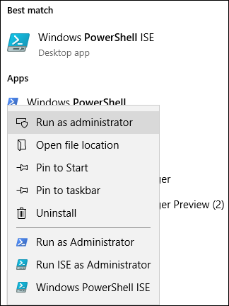

# FastTrack Migration Toolset for Submitting Delete Request

## Toolset purpose

In the event that you are a customer currently engaged in FastTrack migrations, deleting the user account will not delete the data copy held by the Microsoft FastTrack team, which is held for the sole purpose of completing the migration. If during the migration you would like the Microsoft FastTrack team to also delete the data copy, submit a request via this tool set. In the ordinary course of business, Microsoft FastTrack will delete all data copies once the migration is complete.

### Supported platforms

Microsoft supports the initial release of this  toolset in the Windows platform and PowerShell console. The following known platforms are supported by this toolset:

***Table 1 — Platforms supported by this toolset***

****

|PowerShell version|Windows 7|Windows 8|Windows 10|Windows Server 2012|Windows Server 2016|
|:---:|:---:|:---:|:---:|:---:|:---:|
|5.0|Not Supported|Supported|Supported|Supported|Supported|
|5.1|Not Supported|Supported|Supported|Supported|Supported|
|

### Obtaining the toolset

This toolset is available in the PowerShell Gallery on the PowerShell console application.  To locate and load this cmdlet module, first open PowerShell in administrator mode so it has the appropriate permissions to install the module. If you have not used PowerShell previously go to your Windows Task Bar and in the search box type “PowerShell”. Select the console app using right-click and choose **Run as administrator**, then click **Yes** to run Windows PowerShell.




Now that the console is open, you need to set permissions for script execution. Type the following command to allow the scripts to run:

```powershell
Set-ExecutionPolicy -ExecutionPolicy Bypass -Scope Process
```

You will be prompted to confirm this action, as the administrator can change the scope at their discretion.

***Set Execution Policy***


Now that the console is set to allow the script, run this next command to install the module:

```powershell
Install-Module -Name Microsoft.FastTrack -Repository PSGallery -WarningAction SilentlyContinue -Force
```

### Prerequisites for module

To successfully execute this module, you may need to install dependent modules for use if they are not already installed. You may need to restart PowerShell.

In order to submit a DSR, you must first log in using your Office 365 credentials. Entering the proper credentials will validate your global administrator status and collect tenant information.

```powershell
Login-FastTrackAccount -ApiKey <API Key provided by FastTrack MVM>
```

Once successfully logged in, the credentials and key will be stored for use with FastTrack modules for the remainder of the current PowerShell session.

If you need to connect to a cloud environment, other than commercial, *-Environment* will need to be added to *Log in* command with one of the following valid environments:

- AzureCloud
- AzureChinaCloud
- AzureGermanCloud
- AzureUSGovernmentCloud

```powershell
Login-FastTrackAccount -ApiKey <API Key provided by FastTrack MVM> -Environment <cloud environment>
```

To submit a DSR request, run the following command:

```powershell
Submit-FastTrackGdprDsrRequest -DsrRequestUserEmail SubjectUserEmail@mycompany.com
```

On success, the cmdlet will return a Transaction ID object. Please retain the Transaction ID.

#### Checking the status of a request transaction

Run the following function using the previously obtained Transaction ID:

```powershell
Get-FastTrackGdprDsrRequest -TransactionID "YourTransactionID"
```

#### Transaction Status Codes

|Transaction|Status|
|---|---|
|**Created**|Request has been created.|
|**Failed**|Request failed to create, please resubmit, or contact support.|
|**Completed**|Request has been completed and sanitized.|
|

<!-- original version: **Created**	Request has been created<br/>**Failed**	Request failed to create, please resubmit, or contact support<br/>**Completed**	Request has been completed and sanitized -->

## Learn more

[Microsoft Trust Center](https://www.microsoft.com/trust-center/privacy/gdpr-overview)
