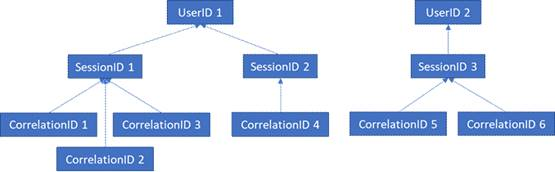

# GDPR for Office Web Apps Server and Office Online Server

Office Online Server and Office Web Apps Server telemetry data is stored in the form of ULS logs. You can use [ULS Viewer](https://www.microsoft.com/download/details.aspx?id=44020) to view ULS logs from your on-premises tenant.

Every log line contains a CorrelationID. Related log lines share the same CorrelationID. Each CorrelationID is tied to a single SessionID, and one SessionID may be related to many CorrelationIDs. Each SessionID may be related to a single UserID, although some sessions can be anonymous and therefore not have an associated UserID. In order to determine what data is associated with a particular user, it is therefore possible to map from a single UserID to the SessionIDs associated with that user, from those SessionIDs to the associated CorrelationIDs, and from those CorrelationIDs to all the logs in those correlations. See the below diagram for the relationship between the different IDs.

## Gathering Logs

In order to gather all logs associated with UserID 1, for example, the first step would be to gather all sessions associated with UserID 1 (i.e. SessionID 1 and SessionID2). The next step would be to gather all correlations associated with SessionID 1 (i.e. CorrelationIDs 1, 2, and 3) and with SessionID 2 (i.e. CorrelationID 4). Finally, gather all logs associated with each of the correlations in the list.

1. Launch UlsViewer

2. Open up the uls log corresponding to the intended timeframe; ULS logs are stored in %PROGRAMDATA%\\Microsoft\\OfficeWebApps\\Data\\Logs\\ULS

3. Edit | Modify Filter

4. Apply a filter that is:

    - EventID equals apr3y

      Or

    - EventID equals bp2d6

5. Hashed UserIds will be in the Message of either one of these two events

6. For apr3y, the Message will contain a UserID value and a PUID value

7. For bp2d6, the Message will contain quite a bit of information. The LoggableUserId Value field is the hashed UserID.

8. Once the hashed UserId is obtained from either of these two tags, the WacSessionId value of that row in ULSViewer will contain the WacSessionId associated with that user

9. Collect all of the WacSessionId values associated with the user in question

10. Filter for all EventId equals "xmnv", Message equals "UserSessionId=\<WacSessionId\>" for the first WacSessionId in the list (replacing the \<WacSessionId\> part of the filter with your WacSessionId)

11. Collect all values of Correlation that match that WacSessionId

12. Repeat steps 10-11 for all values of WacSessionId in your list for the user in question

13. Filter for all Correlation equals the first Correlation in your list

14. Collect all logs matching that Correlation

15. Repeat steps 13-14 for all values of Correlation in your list for the user in question

## Types of Data

Office logs contain a variety of different types of data. The following are examples of the data that ULS logs may contain:

- Error codes for issues encountered during use of the product

- Button clicks and other pieces of data about app usage

- Performance data about the app and/or particular features within the app

- General location information about where the user’s computer is (e.g. country / region, state, and city, derived from the IP address), but not precise geo location.

- Basic metadata about the browser, e.g. browser name and version, and the computer, e.g. OS type and version

- Error messages from the document host (e.g. OneDrive, SharePoint, Exchange)

- Information about processes internal to the app, unrelated to any action the user has taken
