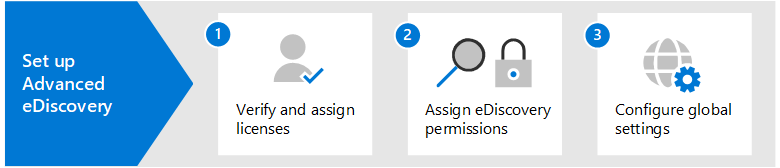

# Set up Microsoft 365 Advanced eDiscovery

Advanced eDiscovery in Microsoft 365 provides an end-to-end workflow to preserve, collect, review, analyze, and export data that's responsive to your organization's internal and external investigations. Nothing is needed to deploy Advanced eDiscovery, but there are some prerequisite tasks that an IT admin and eDiscovery manager have to complete before your organization can start to create and use Advanced eDiscovery cases to manage your investigations.

This article discusses the following steps necessary to set up Advanced eDiscovery.

This includes ensuring the proper licensing required to access Advanced eDiscovery and add custodians to cases, and assigning permissions to your legal and investigation team so they can access and manage cases.

## Step 1: Verify and assign appropriate licenses

Licensing for Advanced eDiscovery requires the appropriate organization subscription and per-user licensing. For a list of licensing requirements for Advanced eDiscovery, see [Subscriptions and licensing](overview-ediscovery-20.md#subscriptions-and-licensing).

## Step 2: Assign eDiscovery permissions

To access Advanced eDiscovery or added as a member of an Advanced eDiscovery case, a user must be assigned the appropriate permissions. Specifically, a user must be added as a member of the eDiscovery Manager role group in the Security & Compliance Center. Members of this role group can create and manage Advanced eDiscovery cases. They can add and remove members, place custodians and content locations on hold, manage legal hold notifications, create and edit searches associated in a case, add search results to a review set, analyze data in a review set, and export and download from an Advanced eDiscovery case.

Complete the following steps to add users to the eDiscovery Manager role group:

1. Go to <https://protection.office.com/permissions> and sign in using the credentials for an admin account in your Microsoft 365 organization.

2. On the **Permissions** page, select the **eDiscovery Manager** role group.

3. On the eDiscovery Manager flyout page, click **Edit** next to the **eDiscovery Manager** section.

4. On the **Choose eDiscovery Manager** page in the edit role group wizard, click **Choose eDiscovery Manager**.

5. Click **Add** then select the checkbox for all users you want to add to the role group.

6. Click **Add** to add the selected users, and then click **Done**.

7. Click **Save** to add the users to the role group, and then click **Close** to complete the step.

### More information about the eDiscovery Manager role group

There are two subgroups in the eDiscovery Manager role group. The difference between these subgroups is based on scope.

- **eDiscovery Manager**: Can view and manage the Advanced eDiscovery cases they create or are a member of. If another eDiscovery Manager creates a case but doesn't add a second eDiscovery Manager as a member of that case, the second eDiscovery Manager won't be able to view or open the case on the Advanced eDiscovery page in the compliance center. In general, most people in your organization can be added to the eDiscovery Manager subgroup.

- **eDiscovery Administrator**: Can perform all case management tasks that an eDiscovery Manager can do. Additionally, an eDiscovery Administrator can:

  - View all cases that are listed on the Advanced eDiscovery page.
  
  - Manage any case in the organization after they add themselves as a member of the case.

  - Access and export case data for any case in the organization.

  Because of the broad scope of access, an organization should have only a few admins who are members of the eDiscovery Administrators subgroup.

For more information about eDiscovery permissions and a description of each role that's assigned to the eDiscovery Manager role group, see [Assign eDiscovery permissions](assign-ediscovery-permissions.md).

## Step 3: Configure global settings for Advanced eDiscovery

The last step to complete before people in your organization start to create and use cases is to configure global settings that apply to all cases in your organization. At this time, the only global setting is *attorney-client privilege detection* (more global settings will be available in the future). This setting enables the attorney-client privilege model to run when you analyze data in a review set. The model uses machine learning to determine the likelihood that a document contains content that is legal in nature. It also compares the participants of documents with an attorney list (that you submit when setting up the model) to determine if a document has at least one participant who is an attorney.

For more information about setting up and using the attorney-client privilege detection model, see [Set up attorney-client privilege detection in Advanced eDiscovery](attorney-privilege-detection.md).

> [!NOTE]
> This is an optional step that you can perform anytime. Not implementing the attorney-client privilege detection model doesn't prevent you from creating and using Advanced eDiscovery cases.

## Next steps

After you set up Advanced eDiscovery, you're ready to [create a case](create-and-manage-advanced-ediscoveryv2-case.md).