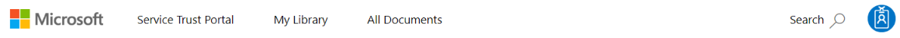

# Get started with Microsoft Service Trust Portal

The Microsoft Service Trust Portal provides a variety of content, tools, and other resources about how Microsoft cloud services protect your data, and how you can manage cloud data security and compliance for your organization.

## Accessing the Service Trust Portal

The Service Trust Portal is Microsoft's public site for publishing audit reports and other compliance-related information associated with Microsoft’s cloud services. STP users can download audit reports produced by external auditors and gain insight from Microsoft-authored whitepapers that provide details on how Microsoft cloud services protect your data, and how you can manage cloud data security and compliance for your organization. To access some of the resources on the Service Trust Portal, you must log in as an authenticated user with your Microsoft cloud services account (Azure Active Directory organization account) and review and accept the Microsoft Non-Disclosure Agreement for Compliance Materials.

### Existing customers

Existing customers can access the Service Trust Portal at <https://aka.ms/STP> with one of the following online subscriptions (trial or paid):

- Microsoft 365
- Dynamics 365
- Azure

 > [!NOTE]
 > Azure Active Directory accounts associated with organizations have access to the full range of documents and resources like Compliance Manager.

### New customers and customers evaluating Microsoft online services

To create a new account or to create a trial account, use one of the following sign-up forms (also used for trial accounts) to get access to the STP.

- Sign up for a new [Microsoft 365 Apps for business trial account](https://go.microsoft.com/fwlink/p/?LinkID=507653) or a new [Office 365 Enterprise trial account](https://go.microsoft.com/fwlink/p/?LinkID=698279)

- Sign up for a new [Dynamics 365 trial account](https://go.microsoft.com/fwlink/?LinkId=252780)

- Sign up for a new [Azure trial account](https://go.microsoft.com/fwlink/?LinkId=722737).

When you sign up for either a free trial, or a subscription, you must enable Azure Active Directory to support your access to the STP.

## Using the Service Trust Portal

The Service Trust Portal features and content are accessible from the main menu.

The following sections describe each item in the main menu.

### Service Trust Portal

The **Service Trust Portal** link displays the home page. It provides a quick way to get back to the home page.

### Certifications, Regulations and Standards

Provides a wealth of security implementation and design information with the goal of making it easier for you to meet regulatory compliance objectives by understanding how Microsoft Cloud services keep your data secure. To review content, select one of the following tiles.

- **ISO/IEC** - International Organization for Standardization (ISO) / International Electrotechnical Commission (IEC)
- **SOC** - System and Organization Controls (SOC) 1, 2, and 3 Reports
- **GDPR** - General Data Protection Regulation
- **FedRAMP** - Federal Risk and Authorization Management Program
- **PCI** - Payment Card Industry (PCI) Data Security Standards (DSS)
- **CSA Star** - Cloud Security Alliance (CSA) Security, Trust and Assurance Registry (STAR)
- **Australia IRAP** - Australia Information Security Registered Assesors Program (IRAP)
- **Singapore MTCS** - Multi-Tier Cloud Security (MTCS) Singapore Standard
- **Spain ENS** - Spain Esquema Nacional de Seguridad (ENS)

### Reports, Whitepapers, and Artifacts

General documents relating to the following categories:

- **BCP and DR** - Business Continuity and Disaster Recovery
- **Pen Test and Security Assessments** - Attestation of Penetration tests and security assessments conducted by third parties
- **Privacy and Data Protection** - Privacy and Data Protection Resources
- **FAQ and Whitepapers** - Whitepapers and answers to frequently asked questions

### Industry and Regional Resources

Documents the apply to the following industries and regions:

- **Financial Services** - Resources elaborating regulatory compliance guidance for FSI (by country)
- **Healthcare and Life Sciences** - Capabilities offered by Microsoft for Healthcare Industry
- **Media and Entertainment** - Media and Entertainment Industry Resources
- **United States Government** - Resources exclusively for US Government customers
- **Regional Resources** - Documents describing compliance of Microsoft's online services with various regional policies and regulations

### Resources for your Organization

Documents applying to your organization (restricted by tenant).

- **Resources for your Organization** - Documents based on your organization’s subscription and permissions

Resources with the series check mark indicate that the document has multiple versions, which can be viewed once you click on the document and click “view all versions” on the download page.  

:::image type="content" source="../media/stp-series.png" alt-text="Document series are marked and can be viewed on the download page.":::

Filter by date and cloud service - When viewing the available documents, you can filter the results by date range by selecting **Dates** and then selecting the range you want to use.

:::image type="content" source="../media/stp-documents-filter-date.png" alt-text="Filter available documents by date range.":::

Document download view - When viewing the available documents, you can filter the results by the applicable **Cloud Service**.

:::image type="content" source="../media/stp-documents-filter-service.png" alt-text="Filter available documents by cloud service.":::

> [!NOTE]
> Many of the files on the STP require acceptance of a license agreement. Some browser-based PDF viewers do not allow Javascript to run, which prevents the license agreement from being displayed and the file from opening.

### All Documents

This section displays all available documents. Select the documents to save into your My Library section. Documents are sorted under the same categories shown under Certifications, Standards, Regulations, and Industry Resources. To view all resources for a particular cloud service use the **Cloud Service** filter.

### Search

Click the magnifying glass in the upper right-hand corner of the Service Trust Portal page to expand the box, enter your search terms, and press **Enter**. The **Search** page is displayed, with the search term displayed in the search box and the search results listed below.

:::image type="content" source="../media/stp-search.png" alt-text="Search for documents and filter results.":::

By default, the search returns document results. You can filter the results by using the dropdown lists to refine the list of documents displayed. You can use multiple filters to narrow the list of documents. Filters include the specific cloud services, and regions. Click the document name link to download the document.

> [!NOTE]
> Service Trust Portal reports and documents are available to download for at least 12 months after publishing or until a new version of document becomes available.

## My Library

Use the My Library feature to add documents and resources on the Service Trust Portal to your My Library page. This lets you access documents that are relevant to you in a single place.  To add a document to your My Library, click the elipsis (**...**) menu to the right of a document and then select **Save to library**. You can add multiple documents to your My Library by clicking the checkbox next to one or more documents, and then clicking **Save to library** at the top of the page.

Additionally, the notifications feature lets you configure your My Library so that an email message is sent to you whenever Microsoft updates a document that you've added to your My Library. To set up notifications, go to your My Library and click **Notification Settings**. You can choose the frequency of notifications and specify an email address in your organization to send notifications to. Email notifications include links to the documents that have been updated and a brief description of the update.

If a document is part of a series, you will be subscribed to the series and will receive notifications when there is an update to that series. You can view the individual documents and Series documents that you have subscribed to, in 2 sections as shown below:

:::image type="content" source="../media/stp-my-library.png" alt-text="My Library displays the documents you have subscribed to in two sections.":::

## Localization support

The Service Trust Portal enables you to view the page content in different languages. To change the page language, simply click on the globe icon in the lower left corner of the page and select the language of your choice.

## Give feedback

We can help with questions about the Service Trust Portal, or errors you experience when you use the portal. You can also contact us with questions and feedback about Service Trust Portal compliance reports and trust resources by using the Feedback link on the bottom of the STP pages.

Your feedback is important to us. Click on the Feedback button at the bottom of the page to send us comments about what you did or did not like, or suggestions you may have for improving our products or product features.

