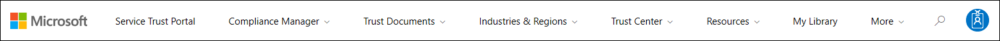
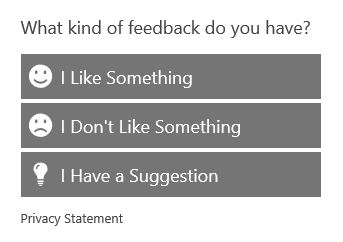

# Get started with the Microsoft Service Trust Portal

The Microsoft Service Trust Portal provides a variety of content, tools, and other resources about Microsoft security, privacy, and compliance practices.

## Accessing the Service Trust Portal

The Service Trust Portal contains details about Microsoft's implementation of controls and processes that protect our cloud services and the customer data therein. To access some of the resources on the Service Trust Portal, you must log in as an authenticated user with your Microsoft cloud services account (either an Azure Active Directory organization account or a Microsoft Account) and review and accept the Microsoft Non-Disclosure Agreement for Compliance Materials.

### Existing customers

Existing customers can access the Service Trust Portal at <https://aka.ms/STP> with one of the following online subscriptions (trial or paid):

- Microsoft 365
- Dynamics 365
- Azure

 > [!NOTE]
 > Azure Active Directory accounts associated with organizations have access to the full range of documents and features like Compliance Manager. Microsoft accounts created for personal use have limited access to Service Trust Portal content.

### New customers and customers evaluating Microsoft online services

To create a new account or to create a trial account, use one of the following sign-up forms (also used for trial accounts) to get access to the STP.

- Sign up for a new [Microsoft 365 Apps for business trial account](https://go.microsoft.com/fwlink/p/?LinkID=507653) or a new [Office 365 Enterprise trial account](https://go.microsoft.com/fwlink/p/?LinkID=698279)

- Sign up for a new [Dynamics 365 trial account](https://go.microsoft.com/fwlink/?LinkId=252780)

- Sign up for a new [Azure trial account](https://go.microsoft.com/fwlink/?LinkId=722737).

When you sign up for either a free trial, or a subscription, you must enable Azure Active Directory to support your access to the STP.

## Using the Service Trust Portal

The Service Trust Portal features and content are accessible from the main menu.

The following sections describe each item in the main menu.

### Service Trust Portal

The **Service Trust Portal** link displays the home page. It provides a quick way to get back to the home page.

### Compliance Manager

> [!IMPORTANT]
> Compliance Manager has moved from the Service Trust Portal to its new location in the [Microsoft 365 compliance center](https://compliance.microsoft.com/). All customer data has been moved over to the new location, so you can continue using Compliance Manager without interruption. Refer to the [Compliance Manager documentation](compliance-manager.md) for setup information and to learn about new features. Although the classic version of Compliance Manager remains in the Service Trust Portal, all users are encouraged to use Compliance Manager in the Microsoft 365 compliance center.

### Trust Documents

Provides a wealth of security implementation and design information with the goal of making it easier for you to meet regulatory compliance objectives by understanding how Microsoft Cloud services keep your data secure. To review content, select one of the following options on the **Trust Documents** pull-down menu.

- **Audit Reports:** A list of independent audit and assessment reports on Microsoft's Cloud services is displayed. These reports provide information about Microsoft Cloud services compliance with data protection standards and regulatory requirements, such as:

  - International Organization for Standardization (ISO)
  - Service Organization Controls (SOC)
  - National Institute of Standards and Technology (NIST)
  - Federal Risk and Authorization Management Program (FedRAMP)
  - General Data Protection Regulation (GDPR)

- **Data Protection:** Contains a wealth of resources such as audited controls, white papers, FAQs, penetration tests, risk assessment tools, and compliance guides.

- **Azure Security and Compliance Blueprints:** Resources that help you build secure and compliant cloud-based applications. This area contain blueprint-guidance for government, finance, healthcare, and retail verticals.

### Industries & Regions

Provides industry- and region-specific compliance information about Microsoft Cloud services.

- **Industries:** At this time, this page provides an industry-specific landing page the for the Financial Services industry. This contains information such as compliance offerings, FAQs, and success stories. Resources for more industries will be released in the future, however you can find resources for more industries by going to the **Trust Documents > Data Protection** page in the STP.

- **Regions:** Provides legal opinions on Microsoft Cloud services compliance with various the laws of various countries. Specific countries include Australia, Canada, Czech Republic, Denmark, Germany, Poland, Romania, Spain, and the United Kingdom.

### Trust Center

Links to the [Microsoft Trust Center](https://www.microsoft.com/trust-center), which provides more information about security, compliance, and privacy in the Microsoft Cloud. This includes information about the capabilities in Microsoft Cloud services that you can use to address specific requirements of the GDPR, documentation helpful to your GDPR accountability and to your understanding of the technical and organizational measures Microsoft has taken to support the GDPR.

### My Library

This new feature lets you save (or *pin*) documents so that you can quickly access them on your My Library page. You can also set up notifications so that Microsoft sends you an email message when documents in your My Library are updated. For more information, see the [My Library](#my-library-1) section in this article.

### More

Go to **More > Admin** to access administrative functions that are only available to the global administrator account. This option is visible only when you are signed in as a global administrator. There are two options in the **Admin** pull-down menu:

- **Settings:** This page lets you assign user roles for Compliance Manager (classic).

- **User Privacy Settings:** This page lets you export a report that contains action item assignments in Compliance Manager (classic) for a specific user. You can also reassign all action items to a different user and remove any assigned action item from the specified user.

### Search

Click the magnifying glass in the upper right-hand corner of the Service Trust Portal page to expand the box, enter your search terms, and press **Enter**. The **Search** page is displayed, with the search term displayed in the search box and the search results listed below.

By default, the search returns document results. You can filter the results by using the dropdown lists to refine the list of documents displayed. You can use multiple filters to narrow the list of documents. Filters include the specific cloud services, categories of compliance or security practices, regions, and industries. Click the document name link to download the document.

To list controls from Assessments in Compliance Manager (classic) related your search terms, click **Compliance Manager**. The search results show the date the assessment was created, the name of the assessment grouping, the applicable Microsoft Cloud service, and whether the control is Microsoft or Customer Managed. Click the name of the control to view the control in the Assessment in Compliance Manager (classic).

> [!NOTE]
> Service Trust Portal reports and documents are available to download for at least 12 months after publishing or until a new version of document becomes available.

## My Library

Use the My Library feature to add documents and resources on the Service Trust Portal to your My Library page. This lets you access documents that are relevant to you in a single place.  To add a document to your My Library, click the **...** menu to the right of a document and then select **Save to library**. You can add multiple documents to your My Library by clicking the checkbox next to one or more documents, and then clicking **Save to library** at the top of the page.

Additionally, the notifications feature lets you configure your My Library so that an email message is sent to you whenever Microsoft updates a document that you've added to your My Library. To set up notifications, go to your My Library and click **Notification Settings**. You can choose the frequency of notifications and specify an email address in your organization to send notifications to. Email notifications include links to the documents that have been updated and a brief description of the update.

Also note that we identify any documents in your My Library that have been updated within the last 30 days, regardless of whether or not you turn on notifications. A brief description of the update is also displayed in a tool tip.

## Starter packs

Starter packs are a Microsoft-curated set of documentation about Microsoft Cloud services for specific industries. Currently, the Service Trust Portal offers the following three starter packs for financial services organizations. These starter packs help organizations evaluate and assess security, compliance, and privacy in the Microsoft Cloud and provide guidance to help implement Microsoft Cloud services in the highly regulated financial services industry.

- **Evaluation Starter Pack:** Use for early evaluation of the Microsoft cloud for financial services organizations.

- **Assessment Starter Pack:** After evaluation, use the checklists and other guidance in this starter pack to help your organization assess risks related to security, compliance, and privacy.

- **Audit Starter Pack:** User this starter pack for guidance on using auditing controls and other tool to help guide your implementation of Microsoft Cloud services in a way that helps reduce your organization's exposure to risk.

To access these starter packs, go to **Service Trust Portal > Industries & Regions > Industry Solutions > Financial Services**. You can open or a download documents from a starter pack or save them to your My Library.

## Localization support

The Service Trust Portal enables you to view the page content in different languages. To change the page language, simply click on the globe icon in the lower left corner of the page and select the language of your choice.

## Give feedback

We can help with questions about the Service Trust Portal, or errors you experience when you use the portal. You can also contact us with questions and feedback about Service Trust Portal compliance reports and trust resources by using the Feedback link on the bottom of the STP pages.

Your feedback is important to us. Click on the Feedback button at the bottom of the page to send us comments about what you did or did not like, or suggestions you may have for improving our products or product features.

