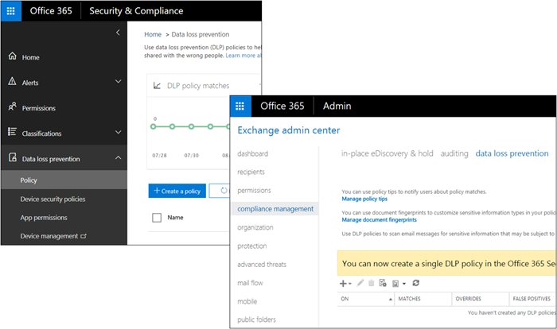

# How DLP works between the Microsoft 365 Compliance Center and Exchange admin center

In Microsoft 365, you can create a data loss prevention (DLP) policy in two different admin centers:
  
- In the **Microsoft 365 Compliance Center**, you can create a single DLP policy to help protect content in SharePoint, OneDrive, Exchange, Teams, and now Endpoint Devices. We recommend that you create a DLP policy here. For more information, see [Data Loss Prevention reference](data-loss-prevention-policies.md).
    
- In the **Exchange admin center**, you can create a DLP policy to help protect content only in Exchange. This policy can use Exchange mail flow rules (also known as transport rules), so it has more options specific to handling email. For more information, see [DLP in the Exchange admin center](/exchange/security-and-compliance/data-loss-prevention/data-loss-prevention).
    
DLP polices created in these admin centers work side by side - this topic explains how.
  

  
## How DLP in the Security & Compliance Center works with DLP and mail flow rules in the Exchange admin center

After you create a DLP policy in the Security & Compliance Center, the policy is deployed to all of the locations included in the policy. If the policy includes Exchange Online, the policy's synced there and enforced in exactly the same way as a DLP policy created in the Exchange admin center. 
  
If you've created DLP policies in the Exchange admin center, those policies will continue to work side by side with any policies for email that you create in the Security & Compliance Center. But note that rules created in the Exchange admin center take precedence. All Exchange mail flow rules are processed first, and then the DLP rules from the Security & Compliance Center are processed.
  
This means that:
  
- Messages that are blocked by Exchange mail flow rules won't get scanned by DLP rules created in the Security & Compliance Center.
    
- If an Exchange mail flow rule modifies a message in a way that causes it to match a DLP policy in the Security & Compliance Center - such as adding external users - then the DLP rules will detect this and enforce the policy as needed.
    
Also note that Exchange mail flow rules that use the "stop processing" action don't affect the processing of DLP rules in the Security & Compliance Center - they'll still be processed.
  
## Policy tips in the Security & Compliance Center vs. the Exchange admin center

Policy tips can work either with DLP policies and mail flow rules created in the Exchange admin center, or with DLP policies created in the Security & Compliance Center, but not both. This is because these policies are stored in different locations, but policy tips can draw only from a single location.
  
If you've configured policy tips in the Exchange admin center, any policy tips that you configure in the Security & Compliance Center won't appear to users in Outlook on the web and Outlook 2013 and later until you turn off the tips in the Exchange admin center. This ensures that your current Exchange mail flow rules will continue to work until you choose to switch over to the Security & Compliance Center.
  
Note that while policy tips can draw only from a single location, email notifications are always sent, even if you're using DLP policies in both the Security & Compliance Center and the Exchange admin center.
