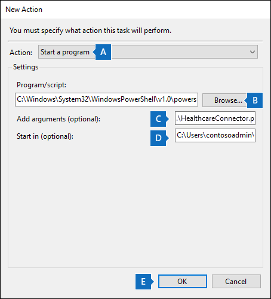
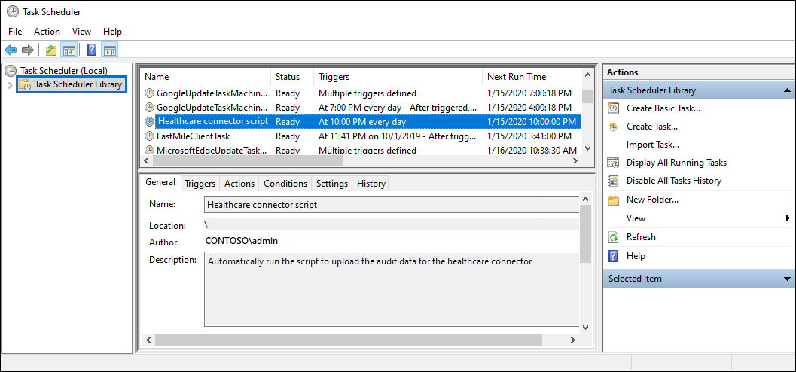

# Set up a connector to import healthcare EHR audit data (preview)

You can set up a data connector in the Microsoft Purview compliance portal to import auditing data for user activity in your organization's Electronic Healthcare Records (EHR) system. Auditing data from your healthcare EHR system include data for events related to accessing a patient's health records. Healthcare EHR auditing data can be used by the Microsoft Purview [Insider Risk Management solution](insider-risk-management.md) to help protect your organization from unauthorized access to patient information.

Setting up a Healthcare connector consists of the following tasks:

- Creating an app in Azure Active Directory (Azure AD) to access an API endpoint that accepts a tab-separated text file containing healthcare EHR auditing data.

- Creating a text file with all the required fields as defined in the connector schema.

- Creating a Healthcare connector instance in the compliance portal.

- Running a script to push healthcare EHR auditing data to the API endpoint.

- Optionally, scheduling the script to run automatically to import the auditing data.

If you’d like to participate in the preview, please reach out to the team at dcfeedback@microsoft.com.

## Before you set up the connector

- The user who creates the Healthcare connector in Step 3 must be assigned the Data Connector Admin role. This role is required to add connectors on the **Data connectors** page in the compliance portal. This role is added by default to multiple role groups. For a list of these role groups, see the "Roles in the security and compliance centers" section in [Permissions in the Security & Compliance Center](../security/office-365-security/permissions-in-the-security-and-compliance-center.md#roles-in-the-security--compliance-center). Alternatively, an admin in your organization can create a custom role group, assign the Data Connector Admin role, and then add the appropriate users as members. For instructions, see the "Create a custom role group" section in [Permissions in the Microsoft Purview compliance portal](microsoft-365-compliance-center-permissions.md#create-a-custom-role-group).

- You need to determine how to retrieve or export the data from your organization's healthcare EHR system (on a daily basis) and create a text file that's described in Step 2. The script that you run in Step 4 will push the data in the text file to the API endpoint.

- The sample script that you run in Step 4 pushes the healthcare EHR auditing data from text file to the connector API so that it can be used by the insider risk management solution. This sample script isn't supported under any Microsoft standard support program or service. The sample script is provided AS IS without warranty of any kind. Microsoft further disclaims all implied warranties including, without limitation, any implied warranties of merchantability or of fitness for a particular purpose. The entire risk arising out of the use or performance of the sample script and documentation remains with you. In no event shall Microsoft, its authors, or anyone else involved in the creation, production, or delivery of the scripts be liable for any damages whatsoever (including, without limitation, damages for loss of business profits, business interruption, loss of business information, or other pecuniary loss) arising out of the use of or inability to use the sample scripts or documentation, even if Microsoft has been advised of the possibility of such damages.

## Step 1: Create an app in Azure Active Directory

The first step is to create and register a new app in Azure Active Directory (Azure AD). The app will correspond to the Healthcare connector that you create in Step 3. Creating this app allows Azure AD to authenticate the push request for text file containing healthcare EHR auditing data. During the creation of this Azure AD app, be sure to save the following information. These values will be used in later steps.

- Azure AD application ID (also called the *app Id* or *client Id*)

- Azure AD application secret (also called the *client secret*)

- Tenant Id (also called the *directory Id*)

For step-by-step instructions for creating an app in Azure AD, see [Register an application with the Microsoft identity platform](\azure\active-directory\develop\quickstart-register-app).

## Step 2: Prepare a text file with healthcare EHR auditing data

The next step is to create a text file that contains information about employees' access to patient health records in your organization's healthcare EHR system. As previously explained, you need to determine how to generate this text file from your healthcare EHR system. The Healthcare connector workflow requires a text file with tab-separated values to map that data in the text file with required connector schema. The file format supported is a comma (.csv), pipe (.psv), or tab (.tsv) separated text file.

> [!NOTE]
> The maximum size of the text file that contains the auditing data is 3 GB. The maximum number of rows is 5 million. Also, be sure to only include the relevant auditing data from your healthcare EHR system.

The following table lists the fields that are required to enable insider risk management scenarios. A subset of these fields is mandatory. These fields are highlighted with an asterisk (*). If any of the mandatory fields are missing in the text file, the file won't be validated and data in the file won't be imported.

|Field|Category|
|:----|:----------|
| Creation Time*<br/>Event Name*<br/>Workstation Id<br/>Event Section<br/>Event Category |These fields are used to identify access activity events in your healthcare EHR system.|
| Patient Reg Id<br/>Patient First Name*<br/>Patient Middle Name <br/>Patient Last Name* <br/>Patient Address Line 1* <br/>Patient Address Line 2<br/>Patient City* <br/>Patient Zip Code*  <br/>Patient State <br/>Patient Country <br/>Patient Department              | These fields are used to identify patient profile information.|
| Restricted Access Reason*<br/> Restricted Access Comment | These fields are used to identify access to restricted records.|
| Email Address (UPN) or SamAccountName*<br/>Employee User Name <br/> Employee Id <br/> Employee Last Name <sup>1</sup> <br/> Employee First Name <sup>1</sup> | These fields are used to identify employee profile information for address and name matching required to determine access to Family/Neighbor/Employee records. |
|||

> [!NOTE] 
> <sup>1</sup>This field may not be available by default in your healthcare EHR system. You need to configure the export to ensure the text file contains this field.

## Step 3: Create the Healthcare connector

The next step is to create a Healthcare connector in the compliance portal. After you run the script in Step 4, the text file that you created in Step 2 will be processed and pushed to the API endpoint you set up in Step 1. In this step, be sure to copy the JobId that's generated when you create the connector. You'll use the JobId when you run the script.

1. Go to <https://compliance.microsoft.com> and then click **Data connectors** in the left nav.

2. On the **Overview** tab, click **Healthcare (preview)**.

3. On the **Healthcare (preview)** page, click **Add connector**.

4. Accept the terms of service.

5. On the **Authentication credentials** page, do the following and then click **Next**:

    1. Type or paste the Azure AD application ID for the Azure app that you created in Step 1.

    2. Type a name for the healthcare connector.

6. On the **File mapping method** page, select one of the following options and then click **Next**.

   - **Upload a sample file**. If you select this option, click **Upload sample file** to upload the file that you prepared in Step 2. This option allows you to quickly select column names in your text file from a drop-down list to map the columns to the required schema for the healthcare connector. 

    Or

   - **Manually provide the mapping details**. If you select this option, you have to type the name of the columns in your text file to map the columns to the required schema for the healthcare connector.

7. On the **File mapping details** page, do one of the following, depending on whether you uploaded a sample file or not in the previous step:

   - Use the dropdown lists to map the columns from the sample file to each required field for the healthcare connector.

    Or

   - For each field, type the column name from the file that you prepared in Step 2 that corresponds to the field for the healthcare connector.

8. On the **Review** page, review your settings and then click **Finish** to create the connector.

   A status page is displayed that confirms the connector was created. This page contains two important things that you need to complete the next step to run the sample script to upload your healthcare EHR auditing data.

    - **Job ID.** You'll need this job ID to run the script in the next step. You can copy it from this page or from the connector flyout page.

    - **Link to sample script.** Click the **here** link to go to the GitHub site to access the sample script (the link opens a new window). Keep this window open so that you can copy the script in Step 4. Alternatively, you can bookmark the destination or copy the URL so you can access it again when you run the script. This link is also available on the connector flyout page.

9. Click **Done**.

   The new connector is displayed in the list on the **Connectors** tab.

10. Click the Healthcare connector that you just created to display the flyout page, which contains properties and other information about the connector.

If you haven't already done so, you can copy the values for the **Azure App ID** and **Connector job ID**. You'll need these to run the script in the next step. You can also download the script from the flyout page (or download it using the link in the next step.)

You can also click **Edit** to change the Azure App ID or the column header names that you defined on the **File mapping** page.

## Step 4: Run the sample script to upload your healthcare EHR auditing data

The last step in setting up a Healthcare connector is to run a sample script that will upload the healthcare EHR auditing data in the text file (that you created in Step 1) to the Microsoft cloud. Specifically, the script uploads the data to the Healthcare connector. After you run the script, the Healthcare connector that you created in Step 3 imports the healthcare EHR auditing data to your Microsoft 365 organization where it can be accessed by other compliance tools, such as the Insider risk management solution. After you run the script, consider scheduling a task to run it automatically on a daily basis so the most current employee termination data is uploaded to the Microsoft cloud. See [(Optional) Step 6: Schedule the script to run automatically](#optional-step-6-schedule-the-script-to-run-automatically).

> [!NOTE]
> As previously stated, the maximum size of the text file that contains the auditing data is 3 GB. The maximum number of rows is 5 million. The script that you run in this step will take about 30 to 40 minutes to import the auditing data from large text files. Additionally, the script will divide large text files into smaller blocks of 100K rows, and then import those blocks sequentially.

1. Go to window that you left open from the previous step to access the GitHub site with the sample script. Alternatively, open the bookmarked site or use the URL that you copied. You can also access the script [here](https://github.com/microsoft/m365-compliance-connector-sample-scripts/blob/main/sample_script.ps1).

2. Click the **Raw** button to display the script in text view.

3. Copy all the lines in the sample script and then save them to a text file.

4. Modify the sample script for your organization, if necessary.

5. Save the text file as a Windows PowerShell script file by using a filename suffix of `.ps1`; for example, `HealthcareConnector.ps1`.

6. Open a Command Prompt on your local computer, and go to the directory where you saved the script.

7. Run the following command to upload the healthcare audit data in the text file to Microsoft cloud; for example:

   ```powershell
   .\HealthcareConnector.ps1 -tenantId <tenantId> -appId <appId>  -appSecret <appSecret>  -jobId <jobId>  -filePath '<filePath>'
   ```

The following table describes the parameters to use with this script and their required values. The information you obtained in the previous steps is used in the values for these parameters.

|Parameter  |Description|
|:----------|:----------|
|tenantId|This is the Id for your Microsoft 365 organization that you obtained in Step 1. You can also obtain the tenant Id for your organization on the **Overview** blade in the Azure AD admin center. This is used to identify your organization.|
|appId|This is the Azure AD application Id for the app that you created in Azure AD in Step 1. This is used by Azure AD for authentication when the script attempts to access your Microsoft 365 organization.|
|appSecret|This is the Azure AD application secret for the app that you created in Azure AD in Step 1. This also used for authentication.|
|jobId|This is the job ID for the Healthcare connector that you created in Step 3. This is used to associate the healthcare EHR auditing data that are uploaded to the Microsoft cloud with the Healthcare connector.|
|filePath|This is the file path for the text file (stored on the same system as the script) that you created in Step 2. Try to avoid spaces in the file path; otherwise use single quotation marks.|
|||

Here's an example of the syntax for the Healthcare connector script using actual values for each parameter:

```powershell
.\HealthcareConnector.ps1 -tenantId d5723623-11cf-4e2e-b5a5-01d1506273g9 -appId 29ee526e-f9a7-4e98-a682-67f41bfd643e -appSecret MNubVGbcQDkGCnn -jobId b8be4a7d-e338-43eb-a69e-c513cd458eba -filePath 'C:\Users\contosoadmin\Desktop\Data\healthcare_audit_records.csv'
```

If the upload is successful, the script displays the **Upload Successful** message.

> [!NOTE]
> If you have problems running the previous command because of execution policies, see [About Execution Policies](/powershell/module/microsoft.powershell.core/about/about_execution_policies) and [Set-ExecutionPolicy](/powershell/module/microsoft.powershell.security/set-executionpolicy) for guidance about setting execution policies.

## Step 5: Monitor the Healthcare connector

After you create the Healthcare connector and push your EHR auditing data, you can view the connector and upload status in the compliance portal. If you schedule the script to run automatically on a regular basis, you can also view the current status after the last time the script ran.

1. Go to <https://compliance.microsoft.com> and click **Data connectors** in the left nav.

2. Click the **Connectors** tab and then select the Healthcare connector to display the flyout page. This page contains the properties and information about the connector.

3. Under **Last import**, click the **Download log** link to open (or save) the status log for the connector. This log contains information about each time the script runs and uploads the data from the text file to the Microsoft cloud.

    The `RecordsSaved` field indicates the number of rows in the text file that uploaded. For example, if the text file contains four rows, then the value of the `RecordsSaved` fields is 4, if the script successfully uploaded all the rows in the text file.

If you've haven't run the script in Step 4, a link to download the script is displayed under **Last import**. You can download the script and then follow the steps to run the script.

## (Optional) Step 6: Schedule the script to run automatically

To make sure the latest auditing data from your healthcare EHR system are available to tools like the insider risk management solution, we recommend that you schedule the script to run automatically on a daily basis. This also requires that you update the EHR auditing data in the same text file on a similar (if not the same) schedule so that it contains the latest information about patient records access activities by your employees. The goal is to upload the most current auditing data so that the Healthcare connector can make it available to the insider risk management solution.

You can use the Task Scheduler app in Windows to automatically run the script every day.

1. On your local computer, click the Windows **Start** button and then type **Task Scheduler**.

2. Click the **Task Scheduler** app to open it.

3. In the **Actions** section, click **Create Task**.

4. On the **General** tab, type a descriptive name for the scheduled task; for example, **Healthcare connector script**. You can also add an optional description.

5. Under **Security options**, do the following things:

    1. Determine whether to run the script only when you're logged on to the computer or run it when you're logged on or not.

    2. Make sure that the **Run with the highest privileges** checkbox is selected.

6. Select the **Triggers** tab, click **New**, and then do the following things:

    1. Under **Settings**, select the **Daily** option, and then choose a date and time to run the script for the first time. The script will run every day at the same specified time.

    2. Under **Advanced settings**, make sure the **Enabled** checkbox is selected.

    3. Click **Ok**.

7. Select the **Actions** tab, click **New**, and then do the following things:

   

    1. In the **Action** dropdown list, make sure that **Start a program** is selected.

    2. In the **Program/script** box, click **Browse**, and go to the following location and select it so the path is displayed in the box: C:.0.exe.

    3. In the **Add arguments (optional)** box, paste the same script command that you ran in Step 4. For example, `.\HealthcareConnector.ps1 -tenantId "d5723623-11cf-4e2e-b5a5-01d1506273g9" -appId "c12823b7-b55a-4989-faba-02de41bb97c3" -appSecret "MNubVGbcQDkGCnn" -jobId "e081f4f4-3831-48d6-7bb3-fcfab1581458" -filePath "C:\Healthcare\audit\records.txt"`

    4. In the **Start in (optional)** box, paste the folder location of the script that you ran in Step 4. For example, C:\Healthcare\audit.

    5. Click **Ok** to save the settings for the new action.

8. In the **Create Task** window, click **Ok** to save the scheduled task. You might be prompted to enter your user account credentials.

   The new task is displayed in the Task Scheduler Library.

   

   The last time the script ran and the next time it's scheduled to run is displayed. You can double-click the task to edit it.

   You can also verify the last time the script ran on the flyout page of the corresponding Healthcare connector in the compliance center.
