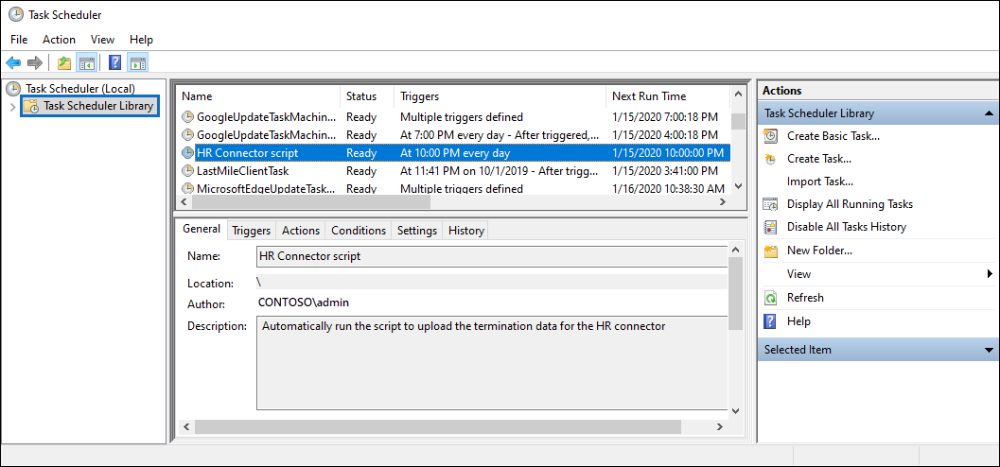

# Set up a connector to import HR data

You can set up a data connector in the Microsoft 365 compliance center to import human resources (HR) data, such as the date an employee submitted their resignation and date of the employee's last day. This HR data can then be used by Microsoft information protection solutions, such as the new [insider risk management solution](insider-risk-management.md), to help protect your organization from malicious activity or data theft inside your organization. Setting up an HR connector consists of creating an app in Azure Active Directory that's used for authentication by connector, creating a CSV mapping files that contains your HR data, creating a data connector in the compliance center, and then running a script (on a scheduled basis) that ingests the HR data in the CSV file to the Microsoft cloud. Then the data connector is used Microsoft compliance solutions (like insider risk management) to access the HR data that was imported to your Microsoft 365 organization.

## Before you begin

- Your organization must consent to allow the Office 365 Import service to access data in your organization. To consent to this request, go to [this page](https://login.microsoftonline.com/common/oauth2/authorize?client_id=570d0bec-d001-4c4e-985e-3ab17fdc3073&response_type=code&redirect_uri=https://portal.azure.com/&nonce=1234&prompt=admin_consent), sign in with the credentials of a Microsoft 365 global admin, and then accept the request. You have to complete this step before you can successfully create the HR connector in Step 3.

- The user who creates the HR connector in Step 3 must be assigned the Mailbox Import Export role in Exchange Online. By default, this role isn't assigned to any role group in Exchange Online. You can add the Mailbox Import Export role to the Organization Management role group in Exchange Online. Or you can create a new role group, assign the Mailbox Import Export role, and then add the appropriate users as members. For more information, see the [Create role groups](https://docs.microsoft.com/Exchange/permissions-exo/role-groups#create-role-groups) or [Modify role groups](https://docs.microsoft.com/Exchange/permissions-exo/role-groups#modify-role-groups) sections in the article "Manage role groups in Exchange Online".

- You'll need to determine how to retrieve or export the data from your organization's HR system (on a regular basis) and add the CSV file that's described in Step 2. The script that you run in Step 4 will upload the HR data in the CSV file to the Microsoft cloud.

## Step 1: Create an app in Azure Active Directory

The first step is to create and register a new app in Azure Active Directory (AAD). The app will correspond to the HR connector that you create in Step 3.  Creating this app will allow AAD to authenticate the HR connector when it runs and attempts to access your organization. This app will also be used to authenticate the script that you run in Step 4 to upload your HR data to the Microsoft cloud. During the creation of this AAD app, be sure to save the following information. These values will be used in later steps is this process.

- AAD application ID (also called the *app Id* or *client Id*)

- AAD application secret (also called the *client secret*)

- Tenant Id (also called the *directory Id*)

For step-by-step instructions for creating an app in AAD, see [Creating an AAD Application](https://docs.microsoft.com/azure/kusto/management/access-control/how-to-provision-aad-app)

## Step 2: Prepare a CSV file with your HR data

The next step is to create a CSV file that contains information about employees who have left your organization. As explained in the Before You Begin section, you'll need to determine how to generate this CSV file from your organization's HR system. The following example shows a completed CSV file (opened in NotePad) that contains the three required parameters (columns). It's much easier to edit the CSV file in Microsoft Excel.

```text
EmailAddress,TerminationDate,LastWorkingDate
sarad@contoso.com,2019-04-23T15:18:02.4675041+05:30,2019-04-29T15:18:02.4675041+05:30
pilarp@contoso.com,2019-04-24T09:15:49Z,2019-04-29T15:18:02.7117540
```

The first row, or header row, of the CSV file lists the required column names. The name used in each column header is up to you (the ones in the previous example are suggestions). However, the same column names you use in the CSV file *must* be specified when you create the HR connector in Step 3. Do not include spaces in the column names.

The following table describes each column in the CSV file:

|**Column name**|**Description**|
|:-----|:-----|
| **EmailAddress** <br/> |Specifies the email address of the terminated employee.|
| **TerminationDate** <br/> |Specifies the date the person's employment was officially terminated in your organization. For example, this may be the date when the employee gave their notice about leaving your organization. This date may be the different than the date of the person's last day of work. You must use the following date format: `yyyy-mm-ddThh:mm:ss.nnnnnn+|-hh:mm`, which is the [ISO 8601 date and time format](https://www.iso.org/iso-8601-date-and-time-format.html).|
|**LastWorkingDate**|Specifies the last day of work for the terminated employee. You must use the following date format: `yyyy-mm-ddThh:mm:ss.nnnnnn+|-hh:mm`, which is the [ISO 8601 date and time format](https://www.iso.org/iso-8601-date-and-time-format.html).|
|||

After you create the CSV file with the required HR data, store in on a local computer or network location that can be specified when you run the script in Step 4. You should also implement an update strategy so that the CSV file always contains the most current information so that whatever you run the script, the most current employee termination data will be uploaded to the Microsoft cloud.

## Step 3: Create the HR connector

The next step is to create an HR connector in the Microsoft 365 compliance center. After you run the script in Step 4, the HR connector that you create will ingest the HR data from the CSV file to your Microsoft 365 organization. In this step, be sure to copy the JobId that's generated when you create the connector. You'll use the JobId when you run the script.

1. Go to [https://compliance.microsoft.com](https://compliance.microsoft.com) and then click **Data connectors** in the left nav.

2. On the **Data connectors (preview)** page under **HR**, click **View**.

3. On the **HR** page, click **Add connector**.

4. On the **Authentication credentials** page, do the following and then click **Next**:

   a. Type or paste the AAD application ID for the Azure app that you created in Step 1.

   b. Type a name for the HR connector.

5. On the **File mapping** page, type the three column header names (also called *parameters* from the CSV file that you created in Step 2 in each of the appropriate boxes. The names are not case-sensitive. As previously explained, the names that you type in these boxes must match the parameter names in your CSV file. For example, the following screenshot shows the parameter names from the example in sample CSV file shown in Step 2.

   

6. On the **Review** page, review your settings and then click **Finish** to create the connector.

   A status page is displayed that confirms the connector was created. This page also contains the job ID. You'll need this job ID to run the script in the next step. You can copy it from this page or from the flyout page for the connector.

7. Click **Done**. 
   
   The new connector is displayed in the list on the **Connectors** tab. 

8. Click the HR connector that you just created to display the flyout page, which contains properties and other information about the connector. 

   

   If you haven't already done so, you can copy the values for the **Azure App ID** and **Connector job ID**. You'll need these to run the script in the next step. You can also download the script from the flyout page (or download it using the link in the next step.) 

   You can also click **Edit** to change the Azure App ID or the column header names that you defined on the **File mapping** page.

## Step 4: Run the script to upload your HR data

The last step in setting up an HR connector is to run a script that will upload the HR data in the CSV file (that you created in Step 2) to the Microsoft cloud. After you run the script, the HR connector that you created in Step 3 can access and import the data to your Microsoft 365 organization where it can accessed by other compliance tools, such as the Insider risk management solution. After you run the script, consider scheduling a task to run automatically on a daily basis so that the most current employee termination data is uploaded to the Microsoft cloud. See [Schedule the script to run automatically](#optional-step-6-schedule-the-script-to-run-automatically).

1. Go to [this GitHub site](https://github.com/microsoft/m365-hrconnector-sample-scripts/blob/master/upload_termination_records.ps1).

2. Click the **Raw** button to display the script in text view

3. Copy all the lines in the script and then save them to a Windows PowerShell script file by using a filename suffix of `.ps1`; for example, `HRConnector.ps1`.

4. Open a Command Prompt on your local computer.

5. Go to the directory where you saved the script.

6. Run the following command to upload the HR data in the CSV file to the Microsoft cloud; for example:

    ```powershell
    .\HRConnector.ps1 -tenantId <tenantId> -appId <appId>  -appSecret <appSecret>  -jobId <jobId>  -csvFilePath '<csvFilePath>'
    ```

   The following table describes the parameters to use with this script and their required values. The information you obtained in the previous steps is used in the values for these parameters.

   |**Parameter**|**Description**
   |:-----|:-----|:-----|
   |`tenantId`|This is the Id for your Microsoft 365 organization that you obtained in Step 1. You can also obtain the tenantId for your organization on the **Overview** blade in the Azure AD admin center. This is used to identify your organization.|
   |`appId` |This is the AAD application Id for the app that you created in Azure AD in Step 1. This is used by Azure AD for authentication when the script attempts to accesses your Microsoft 365 organization. | 
   |`appSecret`|This is the AAD application secret for the app that you created in Azure AD in Step 1. This also used for authentication.|
   |`jobId`|This is the Job Id for the HR connector that you created in Step 3. This is used to associate the HR data that is uploaded to the Microsoft cloud with the HR connector.|
   |`csvFilePath`|This is the file path on the local computer (the one you're using to run the script) for the CSV file that you created in Step 2. If the CSV file is located on a shared network location, you'll have to specify the complete file path for that location. Try to avoid spaces in the file path; otherwise use single quotation marks.|
   |||
   
   Here's an example of the syntax for the HR connector script using actual values for each parameter:

   ```powershell
    .\HRConnector.ps1 -tenantId d5723623-11cf-4e2e-b5a5-01d1506273g9 -appId 29ee526e-f9a7-4e98-a682-67f41bfd643e -appSecret MNubVGbcQDkGCnn -jobId b8be4a7d-e338-43eb-a69e-c513cd458eba -csvFilePath 'C:\Users\contosoadmin\Desktop\Data\employee_termination_data.csv'
    ```

   If the upload is successful, the script displays the **Upload Successful** message.

## Step 5: Monitor the HR connector

After you create the HR connector and run the script to upload your HR data, you can view the connector and upload status in the Microsoft 365 compliance center. If you schedule the script to run automatically on a regular basis, you can also view the current status after the last time the script ran.

1. Go to [https://compliance.microsoft.com](https://compliance.microsoft.com) and click **Data connectors** in the left nav.

2. Click the **Connectors** tab and then select the HR connector to display the flyout page, which contains the properties and information about the connector.

   

3. Under **Progress**, click the **Download log** link to open (or save) the status log for the connector. This log contains information about each time the script runs and uploads the data from the CSV file to the Microsoft cloud. 

   

   The **RecordsSaved** field indicates the number of rows in the CSV file that uploaded. For example, if the CSV file contains 4 rows, then the value of the **RecordsSaved** fields is 4, if the script successfully uploaded all the rows in the CSV file.

If you've haven't run the script in Step 4, a link to download the script is displayed under **Last import**. You can download the script and then follow the steps in Step 4 to run it.

## (Optional) Step 6: Schedule the script to run automatically

To make sure that the latest HR data from your organization is available to tools like the insider risk management solution, we recommend that you schedule the script to run automatically on a recurring basis, such as once a day. This also requires that you update the HR data in the CSV file on a similar (if not the same) schedule so that it contains the latest information about employees who leave your organization. The goal is to upload the most current HR data so that the HR connector can make it available to the insider risk management solution.

You can user the Task Scheduler app in Windows to automatically run the script every day.

1. On your local computer, click the Windows **Start** button and then type **Task Scheduler**.

2. Click the **Task Scheduler** app to open it.

3. In the **Actions** section, click **Create Task**.

4. On the **General** tab, type a descriptive name for the scheduled task; for example, **HR Connector Script**. You can also add an optional description. 

5. Under **Security options**, do the following:

   a. Determine whether to run the script only when you're logged on to the computer or run it when your logged on or not.
   
   b. Make sure that the **Run with the highest privileges** checkbox is selected.

6. Select the **Triggers** tab, click **New**, and then do the following things:

   a. Under **Settings**, select the **Daily** option, and then choose a date and time to run the script for the first time. The script will every day at the same specified time.
   
   b. Under **Advanced settings**, make sure the **Enabled** checkbox is selected.
   
   c. Click **Ok**.

7. Select the **Actions** tab, click **New**, and then do the following things:

   

   a. In the **Action** dropdown list, make sure that **Start a program** is selected.

   b. In the **Program/script** box, click **Browse**, and go to the following location and select it so the path is displayed in the box: `C:\Windows\System32\WindowsPowerShell\v1.0\powershell.exe`.

   c. In the **Add arguments (optional)** box, paste the same script command that you ran in Step 4. For example, `.\HRConnector.ps1 -tenantId "d5723623-11cf-4e2e-b5a5-01d1506273g9" -appId "c12823b7-b55a-4989-faba-02de41bb97c3" -appSecret "MNubVGbcQDkGCnn"  -jobId "e081f4f4-3831-48d6-7bb3-fcfab1581458" -csvFilePath "C:\Users\contosoadmin\Desktop\Data\employee_termination_data.csv"`

   d. In the **Start in (optional)** box, paste the folder location of the script that you ran in Step 4. For example, `C:\Users\contosoadmin\Desktop\Scripts`.

   e. Click **Ok** to save the settings for the new action.

8. In the **Create Task** window, click **Ok** to save the scheduled task. You might be prompted to enter your user account credentials.

   The new task is displayed in the Task Scheduler Library.

   

   The last time and the next time the script ran is scheduled to run is displayed. You can double-click the task to edit it.

   You can also verify the last time the script ran on the flyout page of the corresponding HR connector in the compliance center.