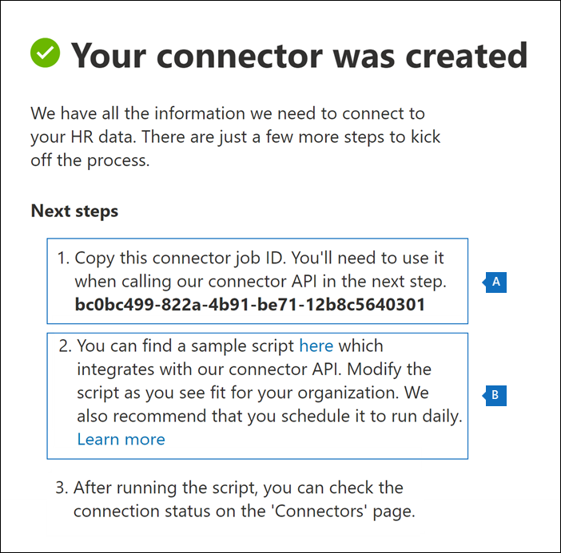
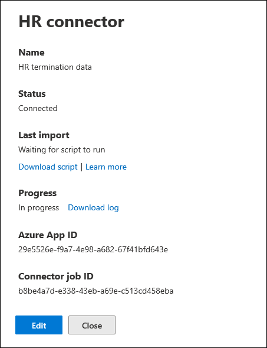
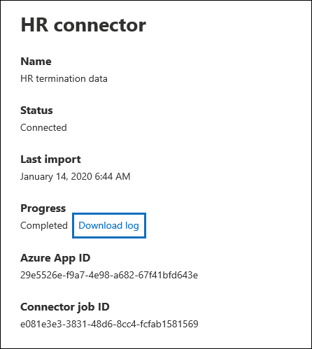

# Set up a connector to import HR data

You can set up a data connector in the Microsoft 365 compliance center to import human resources (HR) data related to events such as a user's resignation or a change in a user's job level. The HR data can then be used by the [insider risk management solution](insider-risk-management.md) to generate risk indicators that can help you identity possible malicious activity or data theft by users inside your organization.

Setting up a connector for HR data that insider risk management policies can use to generate risk indicators consists of creating a CSV file that contains that contains the HR data, creating an app in Azure Active Directory that's used for authentication, creating an HR data connector in the Microsoft 365 compliance center, and then running a script (on a scheduled basis) that ingests the HR data in CSV files to the Microsoft cloud so it's available to the insider risk management solution.

## Before you begin

- Determine which HR scenarios and data to import to Microsoft 365. This will help you determine how many CSV files and HR connectors you'll need to create, and how to generate and structure the CSV files. The HR data that you import is determined by the insider risk management policies that you want to implement. For more information, see Step 1.

- Determine how to retrieve or export the data from your organization's HR system (and on a regular basis) and add it to the CSV files that you create in Step 1. The script that you run in Step 4 will upload the HR data in the CSV files to the Microsoft cloud.

- The user who creates the HR connector in Step 3 must be assigned the Mailbox Import Export role in Exchange Online. By default, this role isn't assigned to any role group in Exchange Online. You can add the Mailbox Import Export role to the Organization Management role group in Exchange Online. Or you can create a new role group, assign the Mailbox Import Export role, and then add the appropriate users as members. For more information, see the [Create role groups](/Exchange/permissions-exo/role-groups#create-role-groups) or [Modify role groups](/Exchange/permissions-exo/role-groups#modify-role-groups) sections in the article "Manage role groups in Exchange Online".

- The sample script that you run in Step 4 will upload your HR data to the Microsoft cloud so that it can be used by the insider risk management solution. This sample script isn't supported under any Microsoft standard support program or service. The sample script is provided AS IS without warranty of any kind. Microsoft further disclaims all implied warranties including, without limitation, any implied warranties of merchantability or of fitness for a particular purpose. The entire risk arising out of the use or performance of the sample script and documentation remains with you. In no event shall Microsoft, its authors, or anyone else involved in the creation, production, or delivery of the scripts be liable for any damages whatsoever (including, without limitation, damages for loss of business profits, business interruption, loss of business information, or other pecuniary loss) arising out of the use of or inability to use the sample scripts or documentation, even if Microsoft has been advised of the possibility of such damages.

## Step 1: Prepare a CSV file with your HR data

The first step is to create a CSV file that contains the HR data that the connector will import to Microsoft 365. This data will be used by the insider risk solution to generate potential risk indicators. Data for the following HR scenarios can be imported to Microsoft 365:

- Employee resignation. Information about users who have left your organization.

- Job level changes. Information about job level changes for users, such as promotions and demotions.

- Performance reviews. Information about user performance.

- Performance improvement plans. Information about performance improvement plans for users.

The type of HR data to import depends on the insider risk management policy and corresponding policy template that you want to implement. The following table shows which HR data type is required for each policy template:

|  Policy template |  HR data type |
|:-----------------------------------------------|:---------------------------------------------------------------------|
| Data theft by departing users                   | Employee resignations                                                 |
| General data leaks                              | Not applicable                                                        |
| Data leaks by priority users                    | Not applicable                                                        |
| Data leaks by disgruntled users                 | Job level changes, Performance reviews, Performance improvement plans |
| General security policy violations              | Not applicable                                                        |
| Security policy violations by departing users   | Employee resignations                                                 |
| Security policy violations by priority users    | Not applicable                                                        |
| Security policy violations by disgruntled users | Job level changes, Performance reviews, Performance improvement plans |
| Offensive language in email                     | Not applicable                                                        |

For more information about policy templates for insider risk management, see [Insider risk management policies](insider-risk-management-policies.md#policy-templates).

For each HR scenario, you'll need to provide the corresponding HR data in one or more CSV files. The number of CSV files to use for your insider risk management implementation is discussed later in this section.

After you create the CSV file with the required HR data, store it on the local computer that you run the script on in Step 4. You should also implement an update strategy to make sure the CSV file always contains the most current information so that whatever you run the script, the most current HR data will be uploaded to the Microsoft cloud and accessible to the insider risk management solution.

> [!IMPORTANT]
> The column names described in the following sections are not required parameters, but only examples. You can use any column name in your CSV files. However, the column names you use in a CSV file *must* be mapped to the data type when you create the HR connector in Step 3. Also note that the sample CSV files in the following sections are show in NotePad view. It's much easier to view and edit CSV files in Microsoft Excel.

The follow sections describe the required CSV data for each HR scenario.

### CSV file for employee resignation data

Here's an example of a CSV file for employee resignation data.

```text
EmailAddress,ResignationDate,LastWorkingDate
sarad@contoso.com,2019-04-23T15:18:02.4675041+05:30,2019-04-29T15:18:02.4675041+05:30
pilarp@contoso.com,2019-04-24T09:15:49Z,2019-04-29T15:18:02.7117540
```

The following table describes each column in the CSV file for employee resignation data.

|  Column   |   Description |
|:------------|:----------------|
|**EmailAddress**| Specifies the email address (UPN) of the terminated user.|
| **ResignationDate** | Specifies the date the user's employment was officially terminated in your organization. For example, this may be the date when the user gave their notice about leaving your organization. This date may be the different than the date of the person's last day of work. Use the following date format: `yyyy-mm-ddThh:mm:ss.nnnnnn+|-hh:mm`, which is the [ISO 8601 date and time format](https://www.iso.org/iso-8601-date-and-time-format.html).|
| **LastWorkingDate** | Specifies the last day of work for the terminated user. Use the following date format: `yyyy-mm-ddThh:mm:ss.nnnnnn+|-hh:mm`, which is the [ISO 8601 date and time format](https://www.iso.org/iso-8601-date-and-time-format.html).|
|||

### CSV file for job level changes data

Here's an example of a CSV file for job level changes data.

```text
EmailAddress,EffectiveDate,OldLevel,NewLevel
sarad@contoso.com,2019-04-23T15:18:02.4675041+05:30,Level 61 – Sr. Manager,Level 60- Manager
pillar@contoso.com,2019-04-23T15:18:02.4675041+05:30,Level 62 – Director,Level 60- Sr. Manager
```

The following table describes each column in the CSV file for job level changes data.

|  Column | Description |
|:--------- |:------------- |
| **EmailAddress**  | Specifies the user's email address (UPN).|
| **EffectiveDate** | Specifies the date that the user's job level was officially changed. Use the following date format: `yyyy-mm-ddThh:mm:ss.nnnnnn+|-hh:mm`, which is the [ISO 8601 date and time format](https://www.iso.org/iso-8601-date-and-time-format.html).|
| **Remarks**| Specifies the remarks that evaluator has provided about the change of job level. You can enter a limit of 200 characters. This parameter is optional. You don't have to include it in the CSV file.|
| **OldLevel**| Specifies the user's job level before it was changed. This is a free-text parameter and can contain hierarchical taxonomy for your organization. This parameter is optional. You don't have to include it in the CSV file.|
| **NewLevel**| Specifies the user's job level after it was changed. This is a free-text parameter and can contain hierarchical taxonomy for your organization. This parameter is optional. You don't have to include it in the CSV file.|
|||

### CSV file for performance review data

Here's an example of a CSV file for performance data.

```text
EmailAddress,EffectiveDate,Remarks,Rating
sarad@contoso.com,2019-04-23T15:18:02.4675041+05:30,Met expectations but bad attitude,2-Below expectation
pillar@contoso.com,2019-04-23T15:18:02.4675041+05:30, Multiple conflicts with the team
```

The following table describes each column in the CSV file for performance review data.

|  Column | Description |
|:----------|:--------------|
| **EmailAddress**  | Specifies the user's email address (UPN).|
| **EffectiveDate** | Specifies the date that the user was officially informed about the result of their performance review. This can be the date when the performance review cycle ended. Use the following date format: `yyyy-mm-ddThh:mm:ss.nnnnnn+|-hh:mm`, which is the [ISO 8601 date and time format](https://www.iso.org/iso-8601-date-and-time-format.html).|
| **Remarks**| Specifies any remarks that evaluator has provided to the user for the performance review. This is a text parameter with a limit of 200 characters. This parameter is optional. You don't have to include it in the CSV file.|
| **Rating**| Specifies the rating provided for the performance review. This is a text parameter and can contain any free-form text that your organization uses to recognize the evaluation. For example, "3 Met expectations" or "2 Below average". This is a text parameter with a limit of 25 characters. This parameter is optional. You don't have to include it in the CSV file.|
|||

### CSV file for performance improvement plan data

Here's an example of a CSV file for the data for the performance improvement plan data.

```text
EmailAddress,EffectiveDate,ImprovementRemarks,PerformanceRating
sarad@contoso.com,2019-04-23T15:18:02.4675041+05:30,Met expectation but bad attitude,2-Below expectation
pillar@contoso.com,2019-04-23T15:18:02.4675041+05:30, Multiple conflicts with the team
```

The following table describes each column in the CSV file for performance review data.

|  Column |  Description |
|:----------|:---------------|
| **EmailAddress**  | Specifies the user's email address (UPN).|
| **EffectiveDate** | Specifies the date when the user was officially informed about their performance improvement plan. You must use the following date format: `yyyy-mm-ddThh:mm:ss.nnnnnn+|-hh:mm`, which is the [ISO 8601 date and time format](https://www.iso.org/iso-8601-date-and-time-format.html).|
| **Remarks**| Specifies any remarks that evaluator has provided about the performance improvement plan. This is a text parameter with a limit of 200 characters. This is an optional parameter. You don't have to include it in the CSV file. |
| **Rating**| Specifies any rating or other information related to the performance review. performance improvement plan. This is a text parameter and can contain any free form text that your organization uses to recognize the evaluation. For example, "3 Met expectations" or "2 Below average". This is a text parameter with limit of 25 characters. This is an optional parameter. You don't have to include it in the CSV file.|
|||

### Determining how many CSV files to use for HR data

In Step 3, you can choose to create separate connectors for each HR data type or you can choose to create single connector for all data types. You can use separate CSV files that contain data for one HR scenario (like the examples of the CSV files described in the previous sections). Alternatively, you can use a single CSV file that contains data for two or more HR scenarios. Here are some guidelines to help you determine how many CSV files to use for HR data.

- If the insider risk management policy that you want to implement requires multiple HR data types, consider using a single CSV file that contains all the required data types.

- The method for generating or collecting the HR data may determine the number of CSV files. For example, if the different types of HR data used to configure an HR connector are located in a single HR system in your organization, then you may be able to export the data to a single CSV file. But if data is distributed across different HR systems, then it might be easier to export data to different CSV files. For example, Employee resignation data may be located in a different HR system than Job level or Performance review data. In this case, it may be easier to have separate CSV files rather than having to manually combine the data into a single CSV file. So, how you retrieve or export data from your HR systems may determine how the number of CSV files you'll need.

- As a general rule, the number of HR connectors that you'll need to create is determined by the data types in a CSV file. For example, if a CSV file contains all the data types required to support your insider risk management implementation, then you only need one HR connector. But if you have two separate CSV files that each contain a single data type, then you'll have to create two HR connectors. An exception to this is that if you add an **HRScenario** column to a CSV file (see the next section), you can configure a single HR connector that can process different CSV files.

### Configuring a single CSV file for multiple HR data types

You can add multiple HR data types to a single CSV file. This is useful if the insider risk management solution you're implementing requires multiple HR data types or if the data types are located in a single HR system in your organization. Having fewer CSV files always allows you to have fewer HR connectors to create and manage.

Here are requirements for configuring a CSV file with multiple data types:

- You have to add the required columns (and optional if you use them) for each data type and the corresponding column name in the header row. If a data type doesn't correspond to a column, you can leave the value blank.

- To use a CSV file with multiple types of HR data, the HR connector needs to know which rows in the CSV file contain which type HR data. This is accomplished by adding an additional **HRScenario** column to the CSV file. The values in this column identify the type of HR data in each row. For example, values that correspond to the four HR scenarios could be \`Resignation\`, \`Job level change\`, \`Performance review\`, and \`Performance improvement plan\`.

- If you have multiple CSV files that contain an HRScenario** column, be sure that each file uses the same column name and the same values that identify the specific HR scenarios.

The following example shows a CSV file that contains the **HRScenario** column. The values in the HRScenario column identify the type of data in the corresponding row.

```text
HRScenario,EmailAddress,ResignationDate,LastWorkingDate,EffectiveDate,Remarks,Rating,OldLevel,NewLevel
Resignation,sarad@contoso.com,2019-04-23T15:18:02.4675041+05:30,2019-04-29T15:18:02.4675041+05:30,,,,
Resignation,pilarp@contoso.com,2019-04-24T09:15:49Z,2019-04-29T15:18:02.7117540,,,,
Job level change,sarad@contoso.com,2019-04-23T15:18:02.4675041+05:30,,,,,Level 61 Sr. Manager, Level 60 Manager
Job level change,pillarp@contoso.com,2019-04-23T15:18:02.4675041+05:30,,,,,Level 62 Director,Level 60 Sr Manager
Performance review,sarad@contoso.com,,,2019-04-23T15:18:02.4675041+05:30,Met expectation but bad attitude,2 Below expectations,,
Performance review,pillarp@contoso.com,,,2019-04-23T15:18:02.4675041+05:30, Multiple conflicts with the team,,
Performance improvement plan,sarad@contoso.com,,,2019-04-23T15:18:02.4675041+05:30,Met expectations but bad attitude,2 Below expectations,,
Performance improvement plan,pillarp@contoso.com,,,2019-04-23T15:18:02.4675041+05:30,Multiple conflicts with the team,,
```

> [!NOTE]
> You can use any name for the column that identifies HR data type because you will map the name of the column in your CSV file as the column that identifies the HR data type when you set up the connector in Step 3. You will also map the values used for the data type column when you set up the connector.

### Adding the HRScenario column to a CSV file that contains a single data type

Based on your organization's HR systems and how you will export HR data to CSV file, you might have to create multiple CSV files that contain a single HR data type. In this case, you can still create a single HR connector to import data from different CSV files. To do this, you'll just have to add an HRScenario column to the CSV file and specify the HR data type. Then you can run the script for each CSV file, but use the same job ID for the connector. See [Step 4](#step-4-run-the-sample-script-to-upload-your-hr-data).

## Step 2: Create an app in Azure Active Directory

The next step is to create and register a new app in Azure Active Directory (Azure AD). The app will correspond to the HR connector that you create in Step 3. Creating this app will allow Azure AD to authenticate the HR connector when it runs and attempts to access your organization. This app will also be used to authenticate the script that you run in Step 4 to upload your HR data to the Microsoft cloud. During the creation of this Azure AD app, be sure to save the following information. These values will be used in Step 3 and Step 4.

- Azure AD application ID (also called the *app Id* or *client Id*)

- Azure AD application secret (also called the *client secret*)

- Tenant Id (also called the *directory Id*)

For step-by-step instructions for creating an app in Azure AD, see [Register an application with the Microsoft identity platform](/azure/active-directory/develop/quickstart-register-app).

## Step 3: Create the HR connector

The next step is to create an HR connector in the Microsoft 365 compliance center. After you run the script in Step 4, the HR connector that you create will ingest the HR data from the CSV file to your Microsoft 365 organization. Before you create a connector, be sure that you have a list of the HR scenarios and the corresponding CSV column names for each one. You have to map the data required for each scenario to the actual column names in your CSV file when configuring the connector. Alternatively, you can upload a sample CSV file when configuring the connector and the wizard will help you map the name of the columns to the required data types.

After you complete this step, be sure to copy the job ID that's generated when you create the connector. You'll use the job ID when you run the script.

1. Go to [https://compliance.microsoft.com](https://compliance.microsoft.com/) and then click **Data connectors** in the left nav.

2. On the **Data connectors** page under **HR**, click **View**.

3. On the **HR Custom** page, click **Add connector**.

4. On the **Setup the connection** page, do the following and then click **Next**:

   1. Type or paste the Azure AD application ID for the Azure app that you created in Step 2.

   1. Type a name for the HR connector.

5. On the HR scenarios page, select one or more HR scenarios that you want to import data for, and then click **Next**.

6. On the file mapping method page, select one of the following options and then click **Next**.

   - **Upload a sample file**. If you select this option, click **Upload sample file** to upload the CSV file that you prepared in Step 1. This option allows you to quickly select column names in your CSV file from a drop-down list to map them to the data types for the HR scenarios that you previously selected.

   OR

   - **Manually provide the mapping details**. If you select this option, you have to type the name of the columns in your CSV file to map them to the data types for the HR scenarios that you previously selected.

7. On the File mapping details page, do one of the following, depending on whether you uploaded a sample CSV file and whether you're configuring the connector for a single HR scenario or for multiple scenarios. If you uploaded a sample file, you don't have to type the column names. You pick them from a dropdown list.

    - If you selected a single HR scenario in the previous step, then type the column header names (also called *parameters*) from the CSV file that you created in Step 1 in each of the appropriate boxes. The column names that you type are not case-sensitive, but be sure to include spaces if the column names in your CSV file include spaces. As previously explained, the names you type in these boxes must match the parameter names in your CSV file. For example, the following screenshot shows the parameter names from the sample CSV file for the employee resignation HR scenario shown in Step 1.

    - If you selected multiple data types in step above, then you need to enter identifier column name that will identify the HR data type in your CSV file. After entering the identifier column name, type the value that identifies this HR data type, and type the column header names for selected data types from the CSV file(s) that you created in Step 1 in each of the appropriate boxes for each selected data type. As previously explained, the names that you type in these boxes must match the column names in your CSV file.

8. On the **Review** page, review your settings and then click **Finish** to create the connector.

   A status page is displayed that confirms the connector was created. This page contains two important things that you need to complete the next step to run the sample script to upload your HR data.

   

   1. **Job ID.** You'll need this job ID to run the script in the next step. You can copy it from this page or from the connector flyout page.

   1. **Link to sample script.** Click the **here** link to go to the GitHub site to access the sample script (the link opens a new window). Keep this window open so that you can copy the script in Step 4. Alternatively, you can bookmark the destination or copy the URL so you can access it again when you run the script. This link is also available on the connector flyout page.

9. Click **Done**.

   The new connector is displayed in the list on the **Connectors** tab.

10. Click the HR connector that you just created to display the flyout page, which contains properties and other information about the connector.

   

If you haven't already done so, you can copy the values for the **Azure App ID** and **Connector job ID**. You'll need these to run the script in the next step. You can also download the script from the flyout page (or download it using the link in the next step.)

You can also click **Edit** to change the Azure App ID or the column header names that you defined on the **File mapping** page.

## Step 4: Run the sample script to upload your HR data

The last step in setting up an HR connector is to run a sample script that will upload the HR data in the CSV file (that you created in Step 1) to the Microsoft cloud. Specifically, the script uploads the data to the HR connector. After you run the script, the HR connector that you created in Step 3 imports the HR data to your Microsoft 365 organization where it can accessed by other compliance tools, such as the Insider risk management solution. After you run the script, consider scheduling a task to run it automatically on a daily basis so the most current employee termination data is uploaded to the Microsoft cloud. See [Schedule the script to run automatically](#optional-step-6-schedule-the-script-to-run-automatically).

1. Go to window that you left open from the previous step to access the GitHub site with the sample script. Alternatively, open the bookmarked site or use the URL that you copied.

2. Click the **Raw** button to display the script in text view.

3. Copy all the lines in the sample script and then save them to a text file.

4. Modify the sample script for your organization, if necessary.

5. Save the text file as a Windows PowerShell script file by using a filename suffix of `.ps1`; for example, `HRConnector.ps1`.

6. Open a Command Prompt on your local computer, and go to the directory where you saved the script.

7. Run the following command to upload the HR data in the CSV file to the Microsoft cloud; for example:

    ```powershell
    .\HRConnector.ps1 -tenantId <tenantId> -appId <appId>  -appSecret <appSecret>  -jobId <jobId>  -csvFilePath '<csvFilePath>'
    ```

   The following table describes the parameters to use with this script and their required values. The information you obtained in the previous steps is used in the values for these parameters.

   | Parameter | Description |
   |:-----|:-----|:-----|
   |`tenantId`|This is the Id for your Microsoft 365 organization that you obtained in Step 2. You can also obtain the tenant Id for your organization on the **Overview** blade in the Azure AD admin center. This is used to identify your organization.|
   |`appId` |This is the Azure AD application Id for the app that you created in Azure AD in Step 2. This is used by Azure AD for authentication when the script attempts to accesses your Microsoft 365 organization. | 
   |`appSecret`|This is the Azure AD application secret for the app that you created in Azure AD in Step 2. This also used for authentication.|
   |`jobId`|This is the job ID for the HR connector that you created in Step 3. This is used to associate the HR data that is uploaded to the Microsoft cloud with the HR connector.|
   |`csvFilePath`|This is the file path for the CSV file (stored on the same system as the script) that you created in Step 1. Try to avoid spaces in the file path; otherwise use single quotation marks.|
   |||

   Here's an example of the syntax for the HR connector script using actual values for each parameter:

   ```powershell
    .\HRConnector.ps1 -tenantId d5723623-11cf-4e2e-b5a5-01d1506273g9 -appId 29ee526e-f9a7-4e98-a682-67f41bfd643e -appSecret MNubVGbcQDkGCnn -jobId b8be4a7d-e338-43eb-a69e-c513cd458eba -csvFilePath 'C:\Users\contosoadmin\Desktop\Data\employee_termination_data.csv'
    ```

   If the upload is successful, the script displays the **Upload Successful** message.

   > [!NOTE]
   > If you have problems running the previous command because of execution policies, see [About Execution Policies](/powershell/module/microsoft.powershell.core/about/about_execution_policies) and [Set-ExecutionPolicy](/powershell/module/microsoft.powershell.security/set-executionpolicy) for guidance about setting execution policies.

## Step 5: Monitor the HR connector

After you create the HR connector and run the script to upload your HR data, you can view the connector and upload status in the Microsoft 365 compliance center. If you schedule the script to run automatically on a regular basis, you can also view the current status after the last time the script ran.

1. Go to [https://compliance.microsoft.com](https://compliance.microsoft.com) and click **Data connectors** in the left nav.

2. Click the **Connectors** tab and then select the HR connector to display the flyout page. This page contains the properties and information about the connector.

   

3. Under **Progress**, click the **Download log** link to open (or save) the status log for the connector. This log contains information about each time the script runs and uploads the data from the CSV file to the Microsoft cloud. 

   

   The `RecordsSaved` field indicates the number of rows in the CSV file that uploaded. For example, if the CSV file contains four rows, then the value of the `RecordsSaved` fields is 4, if the script successfully uploaded all the rows in the CSV file.

If you've haven't run the script in Step 4, a link to download the script is displayed under **Last import**. You can download the script and then follow the steps to run the script.

## (Optional) Step 6: Schedule the script to run automatically

To make sure the latest HR data from your organization is available to tools like the insider risk management solution, we recommend that you schedule the script to run automatically on a recurring basis, such as once a day. This also requires that you update the HR data in the CSV file on a similar (if not the same) schedule so that it contains the latest information about employees who leave your organization. The goal is to upload the most current HR data so that the HR connector can make it available to the insider risk management solution.

You can user the Task Scheduler app in Windows to automatically run the script every day.

1. On your local computer, click the Windows **Start** button and then type **Task Scheduler**.

2. Click the **Task Scheduler** app to open it.

3. In the **Actions** section, click **Create Task**.

4. On the **General** tab, type a descriptive name for the scheduled task; for example, **HR Connector Script**. You can also add an optional description.

5. Under **Security options**, do the following:

   1. Determine whether to run the script only when you're logged on to the computer or run it when you're logged on or not.

   1. Make sure that the **Run with the highest privileges** checkbox is selected.

6. Select the **Triggers** tab, click **New**, and then do the following things:

   1. Under **Settings**, select the **Daily** option, and then choose a date and time to run the script for the first time. The script will every day at the same specified time.

   1. Under **Advanced settings**, make sure the **Enabled** checkbox is selected.

   1. Click **Ok**.

7. Select the **Actions** tab, click **New**, and then do the following things:

   

   1. In the **Action** dropdown list, make sure that **Start a program** is selected.

   1. In the **Program/script** box, click **Browse**, and go to the following location and select it so the path is displayed in the box: `C:\Windows\System32\WindowsPowerShell\v1.0\powershell.exe`.

   1. In the **Add arguments (optional)** box, paste the same script command that you ran in Step 4. For example, `.\HRConnector.ps1 -tenantId "d5723623-11cf-4e2e-b5a5-01d1506273g9" -appId "c12823b7-b55a-4989-faba-02de41bb97c3" -appSecret "MNubVGbcQDkGCnn"  -jobId "e081f4f4-3831-48d6-7bb3-fcfab1581458" -csvFilePath "C:\Users\contosoadmin\Desktop\Data\employee_termination_data.csv"`

   1. In the **Start in (optional)** box, paste the folder location of the script that you ran in Step 4. For example, `C:\Users\contosoadmin\Desktop\Scripts`.

   1. Click **Ok** to save the settings for the new action.

8. In the **Create Task** window, click **Ok** to save the scheduled task. You might be prompted to enter your user account credentials.

   The new task is displayed in the Task Scheduler Library.

   

   The last time the script ran and the next time it's scheduled to run is displayed. You can double-click the task to edit it.

   You can also verify the last time the script ran on the flyout page of the corresponding HR connector in the compliance center.

## Existing HR connectors

On July 20, 2020, we released additional scenarios that are supported by HR connectors. These are the HR scenarios that were previously described in this article. Any HR connector created before this date only supports the Employee resignation scenario. If you created an HR connector before July 20, 2020, we have migrated it so that it continues to migrate your HR data to the Microsoft cloud. You don't have to do anything to maintain this functionality. You can keep using the connector without any disruption.

If you want to implement additional HR scenarios, please create a new HR connector and configure it for the additional HR scenarios that were released. You'll also need to create one or more new CSV files that contain the data to support the additional HR scenarios. After you create a new HR connector, run the script using the job ID of the new connector and CSV file(s) with the data for your additional HR scenarios.