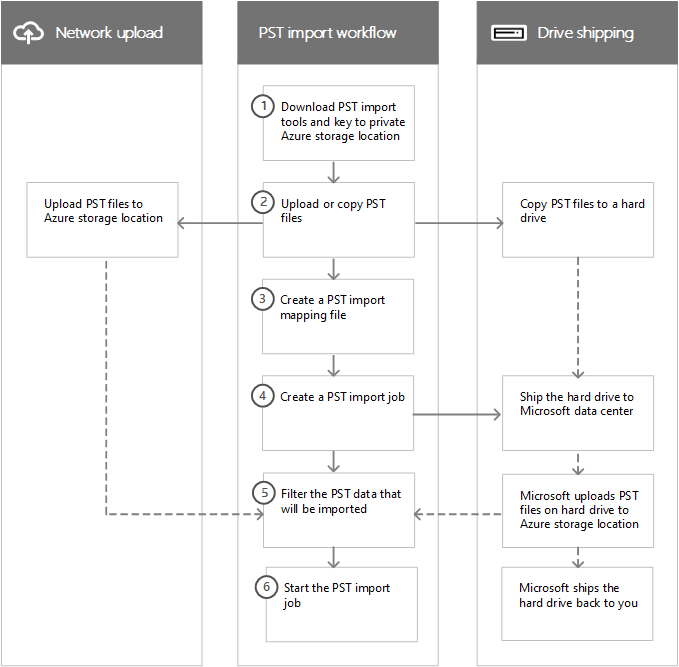

# Overview of importing your organization's PST files

> [!NOTE]
> This article is for administrators. Are you trying to import PST files to your own mailbox? See [Import email, contacts, and calendar from an Outlook .pst file](https://go.microsoft.com/fwlink/p/?LinkID=785075).

You can use the Import service in the Security & Compliance Center to quickly bulk-import PST files to Exchange Online mailboxes in your organization. There are two ways you can import PST files to Office 365:

- **Network upload**  - Upload the PST files over the network to a temporary Azure Storage location in the Microsoft cloud. Then you use the Office 365 Import service to import the PST data to mailboxes in your organization. 

- **Drive shipping**  - Copy the PST files to a BitLocker-encrypted hard drive and then physically ship the drive to Microsoft. When Microsoft receives the hard drive, data center personnel upload the data to a temporary Azure Storage location in the Microsoft cloud. Then you use the Office 365 Import service to import the data to mailboxes in your organization.

## Step-by-step instructions
  
See one of the following topics for detailed, step-by-step instructions for bulk-importing your organization's PST files to Office 365. 

- [Use network upload to import PST files to Office 365](use-network-upload-to-import-pst-files.md)

- [Use drive shipping to import PST files](use-drive-shipping-to-import-pst-files-to-office-365.md)

## How importing PST files works

Here's an illustration and description of the complete PST import process. The illustration shows the primary workflow and highlights the differences between the network upload and drive shipping methods.
  

  
1. **Download the PST import tools and key to private Azure Storage location** - The first step is to download the tool and access key used to upload the PST files or copy them to a hard drive. You obtain these from the **Import** page in the Security & Compliance Center. The key provides you (or Microsoft data center personnel in the case of drive shipping) with the necessary permissions to upload PST files to a private and secure Azure Storage location. This access key is unique to your organization and helps prevent unauthorized access to your PST files after they're uploaded to the Microsoft cloud. Importing PST files to Microsoft 365 doesn't require your organization to have a separate Azure subscription. 
    
2. **Upload or copy the PST files** - The next step depends on whether you're using network upload or drive shipping to import PST files. In both cases, you'll use the tool and secure storage key that you obtained in the previous step.
    
    - **Network upload:** The AzCopy.exe tool (downloaded in step 1) is used to upload and store your PST files in an Azure Storage location in the Microsoft cloud. The Azure Storage location that you upload your PST files to is located in the same regional Microsoft datacenter as your organization.
    
      To upload them, the PST files that you want to import have to be located in a file share or file server in your organization.
    
    - **Drive shipping:** The WAImportExport.exe tool (downloaded in step 1) is used to copy your PST files to the hard drive. This tool encrypts the hard drive with BitLocker and then copies the PSTs to the hard drive. Like network upload, the PST files that you want to copy to the hard drive have to be located in a file share or file server in your organization.
    
3. **Create a PST import mapping file** - After the PST files have been uploaded to the Azure Storage location or copied to a hard drive, the next step is to create a comma-separated value (CSV) file that specifies which user mailboxes the PST files will be imported to (and a PST file can be imported to a user's primary mailbox or their archive mailbox). The Office 365 Import service will use the information to import the PST files. 
    
4. **Create a PST import job** - The next step is to create a PST import job on the **Import PST files** page in the Security & Compliance Center and submit the PST import mapping file created in the previous step. For network upload (because the PST files have been uploaded to Azure) Microsoft 365 analyzes the data in the PST files and then gives you an opportunity to set filters that control what data actually gets imported to the mailboxes specified in the PST import mapping file. 
    
    For drive shipping, a few other things happen at this point in the process.
    
    - You physically ship the hard drive to a Microsoft data center (the shipping address for the Microsoft data center is displayed when the import job is created).
    
    - When Microsoft receives the hard drive, data center personnel will upload the PST files on the hard drive to the Azure Storage location for your organization. As previously explained, your PST files are uploaded to an Azure Storage location that resides in the same regional Microsoft datacenter where your organization is located.
    
      > [!NOTE]
      > The PST files on the hard drive are uploaded to Azure within 7 to 10 business days after Microsoft receives the hard drive.

      Like the network upload process, Microsoft 365 then analyzes the data in the PST files and gives you an opportunity to set filters that control what data actually gets imported to the mailboxes specified in the PST import mapping file.
    
    - Microsoft ships the hard drive back to you.
    
5. **Filter the PST data that will be imported to mailboxes** - After the import job is created (and after the PST files from a drive shipping job are uploaded to the Azure Storage location) Microsoft 365 analyzes the data in the PST files (safely and securely) by identifying the age of the items and the different message types included in the PST files. When the analysis is completed and the data is ready to import, you have the option to import all the data contained in the PST files or you can trim the data that's imported by setting filters that control what data gets imported. 
    
6. **Start the PST import job** - After the import job is started, Microsoft 365 uses the information in the PST import mapping file to import the PSTs files from the he Azure Storage location to user mailboxes. Status information about the import job (including information about each PST file being imported) is displayed on the **Import PST files** page in the Security & Compliance Center. When the import job is finished, the status for the job is set to **Complete**.
  
## Why import email data to Microsoft 365?

- It's a good way to import your organization's archival messaging data to Microsoft 365.
    
- You can use the [Intelligent Import](filter-data-when-importing-pst-files.md) feature to filter the items in PST files that actually get imported to the target mailboxes. This lets you trim the data that's imported by setting filters that control what data gets imported. 
    
- Importing email data to Microsoft 365 helps address compliance needs of your organization by letting you:
    
  - Enable [archive mailboxes](enable-archive-mailboxes.md) and [unlimited archiving](unlimited-archiving.md) to give users additional mailbox storage space. 
    
  - Place mailboxes on [Litigation Hold](./create-a-litigation-hold.md) to retain content. 
    
  - Use the [Content Search tool](content-search.md) to search for mailbox content. 
    
  - Use [eDiscovery cases](./get-started-core-ediscovery.md) to manage your organization's legal investigations 
    
  - Use [retention policies](retention.md) in the Security & Compliance Center to control how long mailbox content is retained, and then delete content after the retention period expires. 

  - Use [Communication compliance policies](communication-compliance.md) to examine messages to make sure they are compliant with message standards and add a classification type.
    
- Importing data to Microsoft 365 helps protect against data loss. Email data that's imported to Microsoft 365 inherits the high availability features of Exchange Online.
    
- Email data is available to users from all devices because it's stored in the cloud.
    
## Importing SharePoint data to Microsoft 365

You can also import files and documents to SharePoint sites and OneDrive accounts in your organization. For more information, see the following articles:

- [Migrate to SharePoint Online](/sharepointmigration/migrate-to-sharepoint-online)

- [Introducing the SharePoint Migration Tool](/sharepointmigration/introducing-the-sharepoint-migration-tool)

- [Migrate to SharePoint Online using PowerShell](/sharepointmigration/overview-spmt-ps-cmdlets)

- [Migrate your file share content to SharePoint Online using the Azure Data Box](/sharepointmigration/how-to-migrate-file-share-content-to-spo-using-azuredatabox)

## Frequently asked questions about importing PST files
  
Here are some frequently asked questions about using the Office 365 Import service to bulk-import PST files to Microsoft 365 mailboxes. 
  
- [Using network upload to import PST files](#using-network-upload-to-import-pst-files)
  
- [Using drive shipping to import PST files](#using-drive-shipping-to-import-pst-files)
  
### Using network upload to import PST files

 **What permissions are required to create import jobs in the Office 365 Import Service?**
  
You have to be assigned the Mailbox Import Export role in Exchange Online to import PST files to Microsoft 365 mailboxes. By default, this role isn't assigned to any role group in Exchange Online. You can add the Mailbox Import Export role to the Organization Management role group. Or you can create a new role group, assign the Mailbox Import Export role, and then add yourself or other users as a member. For more information, see the "Add a role to a role group" or the "Create a role group" sections in [Manage role groups in Exchange Online](/Exchange/permissions-exo/role-groups).
  
Additionally, to create import jobs in the Security & Compliance Center, one of the following must be true:
  
- You have to be assigned the Mail Recipients role in Exchange Online. By default, this role is assigned to the Organization Management and Recipient Management roles groups.

    Or
    
- You have to be a global administrator in your organization.

> [!TIP]
> Consider creating a new role group in Exchange Online that's specifically intended for importing PST files to Office 365. For the minimum level of privileges required to import PST files, assign the Mailbox Import Export and Mail Recipients roles to the new role group, and then add members. 
  
 **Where is network upload available?**
  
Network upload is currently available in these regions: United States, Canada, Brazil, the United Kingdom, France, Germany, Switzerland, Norway, Europe, India, East Asia, Southeast Asia, Japan, Republic of Korea, Australia, and United Arab Emirates (UAE). Network upload will be available in more regions soon.
  
 **What is the pricing for importing PST files by using network upload?**
  
Using network upload to import PST files is free.
  
This also means that after PST files are deleted from the Azure Storage area, they're no longer displayed in the list of files for a completed import job in the Microsoft 365 admin center. Although an import job might still be listed on the **Import data to Office 365** page, the list of PST files might be empty when you view the details of older import jobs.
  
 **What version of the PST file format is supported for importing to Office 365?**
  
There are two versions of the PST file format: ANSI and Unicode. We recommend importing files that use the Unicode PST file format. However, files that use the ANSI PST file format, such as those for languages that use a double-byte character set (DBCS), can also be imported to Office 365. For more information about importing ANSI PST files, see Step 4 in [Use network upload to import PST files to Office 365](./use-network-upload-to-import-pst-files.md).
  
Additionally, PST files from Outlook 2007 and later versions can be imported to Office 365.
  
 **After I upload my PST files to the Azure Storage area, how long are they kept in Azure before they're deleted?**
  
When you use the network upload method to import PST files, you upload them to an Azure blob container named `ingestiondata`. If there are no import jobs in progress on the **Import PST files** page in the Security & Compliance Center), then all PST files in the `ingestiondata` container in Azure are deleted 30 days after the most recent import job was created in the Security & Compliance Center. That also means you have to create a new import job in the Security & Compliance Center (described in Step 5 in the network upload instructions) within 30 days of uploading PST files to Azure.
  
This also means that after PST files are deleted from the Azure Storage area, they're no longer displayed in the list of files for a completed import job in the Security & Compliance Center. Although an import job might still be listed on the **Import PST files** page in the Security & Compliance Center, the list of PST files might be empty when you view the details of older import jobs.
  
 **How long does it take to import a PST file to a mailbox?**
  
It depends on the capacity of your network, but it typically takes several hours for each terabyte (TB) of data to be uploaded to the Azure Storage area for your organization. After the PST files are copied to the Azure Storage area, a PST file is imported to a Microsoft 365 mailbox at a rate of at least 24 GB per day. If this rate doesn't meet your needs, you might consider other methods to get email data into Office 365. For more information, see [Ways to migrate multiple email accounts to Office 365](/Exchange/mailbox-migration/mailbox-migration).
  
If different PST files are imported to different target mailboxes, the import process occurs in parallel; in other words, each PST/mailbox pair is imported simultaneously. Likewise, if multiple PST files are imported to the same mailbox, they will be simultaneously imported.
  
 **How does the PST import process handle duplicate email items?**

The PST import process checks for duplicate items and doesn't copy the items from a PST file to the mailbox or archive if a matching item exists in the target folder in the target mailbox or target archive. If you reimport the same PST file and specify a different target folder (using the TargetRootFolder property in the PST import mapping file) than the one you specified in a previous import job, all items in the PST file will be reimported.
 
 **Is there a message size limit when importing PST files?**
  
Yes. If a PST file contains a mailbox item that is larger than 150 MB, the item will be skipped and not imported during the import process. Items larger than 150 MB aren't imported because 150 MB is the message size limit in Exchange Online. For more information, see [Message limits in Exchange Online](/office365/servicedescriptions/exchange-online-service-description/exchange-online-limits#message-limits).
  
 **Are message properties, such as when the message was sent or received, the list of recipients and other properties, preserved when PST files are imported to a Microsoft 365 mailbox?**
  
Yes. The original message metadata isn't changed during the import process.
  
 **Is there a limit to the number of levels in a folder hierarchy for a PST file that I want to import to a mailbox?**
  
Yes. You can't import a PST file that has 300 or more levels of nested folders.
  
 **Can I use network upload to import PST files to an inactive mailbox in Office 365?**
  
Yes, this capability is now available.
  
 **Can I use network upload to import PST files to an online archive mailbox in an Exchange hybrid deployment?**
  
Yes, this capability is now available.
  
 **Can I use network upload to import PST files to public folders in Exchange Online?**
  
No, you can't import PST files to public folders.
  
### Using drive shipping to import PST files

 **What permissions are required to create import jobs in the Office 365 Import Service?**
  
You have to be assigned the Mailbox Import Export role to import PST files to Microsoft 365 mailboxes. By default, this role isn't assigned to any role group in Exchange Online. You can add the Mailbox Import Export role to the Organization Management role group. Or you can create a new role group, assign the Mailbox Import Export role, and then add yourself or other users as a member. For more information, see the "Add a role to a role group" or the "Create a role group" sections in [Manage role groups in Exchange Online](/Exchange/permissions-exo/role-groups).
  
Additionally, to create import jobs in the Security & Compliance Center, one of the following must be true:
  
- You have to be assigned the Mail Recipients role in Exchange Online. By default, this role is assigned to the Organization Management and Recipient Management roles groups.
    
    Or
    
- You have to be a global administrator in your organization.
    
> [!TIP]
> Consider creating a new role group in Exchange Online that's specifically intended for importing PST files to Office 365. For the minimum level of privileges required to import PST files, assign the Mailbox Import Export and Mail Recipients roles to the new role group, and then add members. 
  
 **Where is drive shipping available?**
  
Drive shipping is currently available in the United States, Canada, Brazil, the United Kingdom, Europe, India, East Asia, Southeast Asia, Japan, Republic of Korea, and Australia. Drive shipping will be available in more regions soon.

> [!NOTE]
> At this time, drive shipping to import PST files is not available in Germany and Switzerland. This FAQ will be updated when drive shipping is available in these countries.
  
 **What commercial licensing agreements support drive shipping?**
  
Drive shipping to import PST files to Microsoft 365 is available through a Microsoft Enterprise Agreement (EA). Drive shipping isn't available through a Microsoft Products and Services Agreement (MPSA).
  
 **What is the pricing for using drive shipping to import PST files to Microsoft 365?**
  
The cost to use drive shipping to import PST files to Microsoft 365 mailboxes is $2 USD per GB of data. For example, if you ship a hard drive that contains 1,000 GB (1 TB) of PST files, the cost is $2,000 USD. You can work with a partner to pay the import fee. For information about finding a partner, see [Find your Microsoft partner or reseller](../admin/manage/find-your-partner-or-reseller.md).
  
 **What kind of hard drives are supported for drive shipping?**
  
Only 2.5-inch solid-state drives (SSDs) or 2.5 inch or 3.5 inch SATA II/III internal hard drives are supported for use with the Office 365 Import service. You can use hard drives up to 10 TB. For import jobs, only the first data volume on the hard drive will be processed. The data volume must be formatted with NTFS. When copying data to a hard drive, you can attach it directly using a 2.5 inch SSD or 2.5 inch or 3.5 inch SATA II/III connector or you can attach it externally using an external 2.5 inch SSD or 2.5 inch or 3.5 inch SATA II/III USB adaptor.
  
> [!IMPORTANT]
> External hard drives that come with an built-in USB adaptor aren't supported by the Office 365 Import service. Additionally, the disk inside the casing of an external hard drive can't be used. Please don't ship external hard drives. 
  
 **How many hard drives can I ship for a single import job?**
  
You can ship a maximum of 10 hard drives for a single import job.
  
 **After I ship my hard drive, how long does it take to get to the Microsoft datacenter?**
  
That depends on a few things, such as your proximity to the Microsoft data center and what kind of shipping option you used to ship your hard drive (such as, next-day delivery, two-day delivery, or ground-delivery). With most shippers, you can use the tracking number to track the status of your delivery.
  
 **After my hard drive arrives at the Microsoft datacenter, how long does it take to upload my PST files to Azure?**
  
After your hard drive is received at the Microsoft data center, it will take between 7 to 10 business days to upload the PST files to the Azure Storage location for your organization. The PST files will be uploaded to an Azure blob container named `ingestiondata`. 
  
 **How long does it take to import a PST file to a mailbox?**
  
After the PST files are uploaded to the Azure Storage area, Microsoft 365 analyzes the data in the PST files (in a safe and secure manner) to identify the age of the items and the different message types included in the PST files. When this analysis is complete, you'll have the option to import all the data in the PST files or set filters to that control what data gets imported. After you start the import job, a PST file is imported to a Microsoft 365 mailbox at a rate of at least 24 GB per day. If this rate doesn't meet your needs, you might consider other methods to get email data into Microsoft 365. For more information, see [Ways to migrate multiple email accounts to Microsoft 365](/Exchange/mailbox-migration/mailbox-migration).
  
If different PST files are imported to different target mailboxes, the import process occurs in parallel; in other words, each PST/mailbox pair is imported simultaneously. Likewise, if multiple PST files are imported to the same mailbox, they will be simultaneously imported.
  
 **After Microsoft uploads my PST files to Azure, how long are they kept in Azure before they're deleted?**
  
All PST files in the Azure Storage location for your organization (in blob container named `ingestiondata`), are deleted 30 days after the most recent import job was created on the **Import PST files** page in the Security & Compliance Center. 
  
This also means that after PST files are deleted from the Azure Storage area, they're no longer displayed in the list of files for a completed import job in the Security & Compliance Center. Although an import job might still be listed on the **Import PST files** page in the Security & Compliance Center, the list of PST files might be empty when you view the details of older import jobs. 
  
 **What version of the PST file format is supported for importing to Microsoft 365?**
  
There are two versions of the PST file format: ANSI and Unicode. We recommend importing files that use the Unicode PST file format. However, files that use the ANSI PST file format, such as those for languages that use a double-byte character set (DBCS), can also be imported to Microsoft 365. For more information about importing ANSI PST files, see Step 3 in [Use drive shipping to import your organization PST files to Microsoft 365](use-drive-shipping-to-import-pst-files-to-office-365.md#step-3-create-the-pst-import-mapping-file).
  
Additionally, PST files from Outlook 2007 and later versions can be imported to Microsoft 365.
  
 **Is there a message size limit when importing PST files?**
  
Yes. If a PST file contains a mailbox item that is larger than 150 MB, the item will be skipped and not imported during the import process. Items larger than 150 MB aren't imported because 150 MB is the message size limit in Exchange Online. For more information, see [Message limits in Exchange Online](/office365/servicedescriptions/exchange-online-service-description/exchange-online-limits#message-limits).
  
  **How does the PST import process handle duplicate email items?**

The PST import process checks for duplicate items and doesn't copy the items from a PST file to the mailbox or archive if a matching item exists in the target folder in the target mailbox or target archive. If you reimport the same PST file and specify a different target folder (using the TargetRootFolder property in the PST import mapping file) than the one you specified in a previous import job, all items in the PST file will be reimported.
 
 **Are message properties, such as when the message was sent or received, the list of recipients and other properties, preserved when PST files are imported to a Microsoft 365 mailbox?**
  
Yes. The original message metadata isn't changed during the import process
  
 **Is there a limit to the number of levels in a folder hierarchy for a PST file that I want to import to a mailbox?**
  
Yes. You can't import a PST file that has 300 or more levels of nested folders.
  
 **Can I use drive shipping to import PST files to an inactive mailbox in Microsoft 365?**
  
Yes, this capability is now available.
  
 **Can I use drive shipping to import PST files to an online archive mailbox in an Exchange hybrid deployment?**
  
Yes, this capability is now available.
  
 **Can I use drive shipping to import PST files to public folders in Exchange Online?**
  
No, you can't import PST files to public folders.
  
 **Can Microsoft wipe my hard drive before they ship it back to me?**
  
No, Microsoft can't wipe hard drives before shipping them back to customers. Hard drives are returned to you in the same state they were in when they were received by Microsoft.
  
 **Can Microsoft shred my hard drive instead of shipping it back to me?**
  
No, Microsoft can't destroy your hard drive. Hard drives are returned to you in the same state they were in when they were received by Microsoft.
  
 **What courier services are supported for return shipping?**
  
If you're a customer in the United States or Europe, Microsoft uses FedEx to return your hard drive. For all other regions, Microsoft uses DHL.
  
 **What are the return shipping costs?**
  
Return shipping costs vary, depending on your proximity to the Microsoft data center that you shipped your hard drive to. Microsoft will bill your FedEx or DHL account to return your hard drive. The cost of return shipping is your responsibility.
  
 **Can I use a custom courier shipping service, such as FedEx Custom Shipping, to ship my hard drive to Microsoft?**
  
Yes.
  
 **If I have to ship my hard drive to another country, is there anything I need to do?**
  
The hard drive that you ship to Microsoft might have to cross international borders. If so, you're responsible for ensuring that the hard drive and the data it contains are imported and/or exported in accordance with the applicable laws. Before shipping a hard drive, check with your advisors to verify that your drive and data can legally be shipped to the specified Microsoft data center. This will help to ensure that it reaches Microsoft in a timely manner.