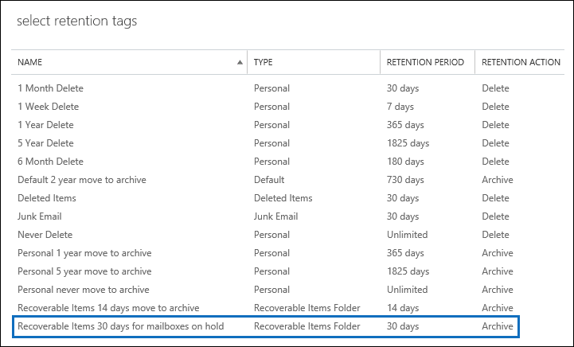

# Increase the Recoverable Items quota for mailboxes on hold

The default Exchange retention policy—named *Default MRM Policy*—that is automatically applied to new mailboxes in Exchange Online contains a retention tag named Recoverable Items 14 days move to archive. This retention tag moves items from the Recoverable Items folder in the user's primary mailbox to the Recoverable Items folder in the user's archive mailbox after the 14-day retention period expires for an item. For this to happen, the user's archive mailbox must be enabled. If the archive mailbox isn't enabled, no action is taken, which means that items in the Recoverable Items folder for a mailbox on hold aren't moved to the archive mailbox after the 14-day retention period expires. Because nothing is deleted from a mailbox on hold, it's possible that the storage quota for the Recoverable Items folder might be exceeded, especially if the user's archive mailbox isn't enabled. 
  
To help reduce the chance of exceeding this limit, the storage quota for the Recoverable Items folder is automatically increased from 30 GB to 100 GB when a hold is placed on a mailbox in Exchange Online. If the archive mailbox is enabled, the storage quota for the Recoverable Items folder in the archive mailbox is also increased from 30 GB to 100 GB. If the auto-expanding archiving feature in Exchange Online is enabled, the storage quota for the Recoverable Items folder in the user's archive will be unlimited.
  
 The following table summarizes the storage quota for the Recoverable Items folder. 
  
|**Location of Recoverable Items folder**|**Mailboxes not on hold**|**Mailboxes on hold**|
|:-----|:-----|:-----|
|Primary mailbox  <br/> |30 GB  <br/> |100 GB  <br/> |
|Archive mailbox<sup>\*</sup> <br/> |Unlimited  <br/> |Unlimited  <br/> |
|**Total storage quota for the Recoverable Items folder** <br/> |Unlimited  <br/> |Unlimited  <br/> |
   
> [!NOTE]
> <sup>\*</sup> The initial storage quota for the archive mailbox is 100 GB for users with an Exchange Online (Plan 2) license. However, when auto-expanding archiving is turned on for mailboxes on hold, the storage quota for both the archive mailbox and the Recoverable Items folder is increased to 110 GB. Additional archive storage space will be provisioned when necessary which results in an unlimited amount of archive storage. For more information about auto-expanding archiving, see [Overview of unlimited archiving in Office 365](unlimited-archiving.md). 
  
When the storage quota for the Recoverable Items folder in the primary mailbox of a mailbox on hold is close to reaching its limit, you can do the following things:
  
- **Enable the archive mailbox and turn on auto-expanding archiving.** You can enable an unlimited storage capacity for the Recoverable Items folder simply by enabling the archive mailbox and then turning on the auto-expanding archiving feature in Exchange Online. This results in 110 GB for the Recoverable Items folder in the primary mailbox and an unlimited amount of storage capacity for the Recoverable Items folder in the user's archive. See how: [Enable archive mailboxes in the Security & Compliance Center](enable-archive-mailboxes.md) and [Enable unlimited archiving in Office 365](enable-unlimited-archiving.md).
    
    > [!NOTE]
    > After you enable the archive for a mailbox that's close to exceeding the storage quota for the Recoverable Items folder, you might want to run the Managed Folder Assistant to manually trigger the assistant to process the mailbox so that expired items are moved to the Recoverable Items folder in the archive mailbox. See [Step 4](#optional-step-4-run-the-managed-folder-assistant-to-apply-the-new-retention-settings) for instructions. Note that other items in the user's mailbox might be moved to the new archive mailbox. Consider telling the user that this may happen after you enable the archive mailbox. 
  
- **Create a custom Exchange retention policy for mailboxes on hold.** In addition to enabling the archive mailbox and auto-expanding archiving for mailboxes on Litigation Hold or In-Place Hold, you might also want to create a custom Exchange retention policy for mailboxes on hold. This lets you apply a retention policy to mailboxes on hold that's different from the Default MRM Policy that's applied to mailboxes that aren't on hold, and lets you apply retention tags that are designed for mailboxes on hold. This includes creating a new retention tag for the Recoverable Items folder. 
    
The remainder of this topic describes the step-by-step procedures to create a custom Exchange retention policy for mailboxes on hold.
  
[Step 1: Create a custom retention tag for the Recoverable Items folder](#step-1-create-a-custom-retention-tag-for-the-recoverable-items-folder)

[Step 2: Create a new Exchange retention policy for mailboxes on hold](#step-2-create-a-new-exchange-retention-policy-for-mailboxes-on-hold)

[Step 3: Apply the new Exchange retention policy to mailboxes on hold](#step-3-apply-the-new-exchange-retention-policy-to-mailboxes-on-hold)

[(Optional) Step 4: Run the Managed Folder Assistant to apply the new retention settings](#optional-step-4-run-the-managed-folder-assistant-to-apply-the-new-retention-settings)
  
## Step 1: Create a custom retention tag for the Recoverable Items folder

The first step is to create a custom retention tag (called a retention policy tag or RPT) for the Recoverable Items folder. As previously explained, this RPT moves items from the Recoverable Items folder in the user's primary mailbox to the Recoverable Items folder in the user's archive mailbox. You have to use PowerShell to create an RPT for the Recoverable Items folder. You can't use the Exchange admin center (EAC). 
  
1. [Connect to Exchange Online using remote PowerShell](/powershell/exchange/connect-to-exchange-online-powershell)
    
2. Run the following command to create a new RPT for the Recoverable Items folder: 
    
    ```powershell
    New-RetentionPolicyTag -Name <Name of RPT> -Type RecoverableItems -AgeLimitForRetention <Number of days> -RetentionAction MoveToArchive
    ```

    For example, the following command creates an RPT for the Recoverable Items folder named "Recoverable Items 30 days for mailboxes on hold", with a retention period of 30 days. This means that after an item has been in the Recoverable Items folder for 30 days, it will be moved to the Recoverable Items folder in the user's archive mailbox.
    
    ```powershell
    New-RetentionPolicyTag -Name "Recoverable Items 30 days for mailboxes on hold" -Type RecoverableItems -AgeLimitForRetention 30 -RetentionAction MoveToArchive
    ```

    > [!TIP]
    > We recommend that the retention period (defined by the  _AgeLimitForRetention_ parameter) for the Recoverable Items RPT is the same as the deleted item retention period for the mailboxes that the RPT will be applied to. This allows a user the entire deleted item retention period to recover deleted items before they are moved to the archive mailbox. In the previous example, the retention period was set to 30 days based on the assumption that the deleted item retention period for mailboxes is also 30 days. An Exchange Online mailbox is configured to retain deleted items for 14 days, by default. But you can change this setting to a maximum of 30 days. For more information, see [Change the deleted item retention period for a mailbox in Exchange Online](https://www.microsoft.com/?ref=go). 
  
## Step 2: Create a new Exchange retention policy for mailboxes on hold

The next step is to create a new retention policy and add retention tags to it, including the Recoverable Items RPT that you created in Step 1. This new policy will be applied to mailboxes on hold in the next step. 
  
Before you create the new retention policy, determine the additional retention tags that you want to add. For a list of the retention tags that are added to the Default MRM Policy and for information about creating new retention tags, see the following:
  
- [Default Retention Policy in Exchange Online ](/exchange/security-and-compliance/messaging-records-management/default-retention-policy)
    
- [Default folders that support Retention Policy Tags](/exchange/security-and-compliance/messaging-records-management/default-folders)
    
- The "Create a retention tag" section in the [Create a Retention Policy](/exchange/security-and-compliance/messaging-records-management/create-a-retention-policy) topic.
    
You can use the EAC or Exchange Online PowerShell to create a retention policy.
  
### Use the EAC to create a retention policy
  
1. In the EAC, go to **Compliance management** \> **Retention policies**, and then click **Add** .
    
2. On the **New retention policy** page, under **Name**, type a name that describes the purpose of the retention policy; for example, **MRM Policy for Mailboxes on Hold**. 
    
3. Under **Retention tags**, click **Add** .
    
4. In the list of retention tags, select the Recoverable Items RPT that you created in Step 1, and then click **Add**.
    
    
  
5. Select additional retention tags to add to the retention policy. For example, you might want to add the same tags that are included in the Default MRM Policy.
    
6. When you're finished adding retention tags, click **OK**.
    
7. Click **Save** to create the new retention policy. 
    
    Notice that the retention tags linked to the retention policy are displayed in the details pane.
    
    
  
### Use Exchange Online PowerShell to create a retention policy
  
Run the following command to create new retention policy for mailboxes on hold. 
  
```powershell
New-RetentionPolicy <Name of retention policy>  -RetentionPolicyTagLinks <list of retention tags>

```

For example, the following command creates the retention policy and linked retention tags that are displayed in the previous illustration.
  
```powershell
New-RetentionPolicy "MRM Policy for Mailboxes on Hold"  -RetentionPolicyTagLinks "Recoverable Items 30 days for mailboxes on hold","1 Month Delete","1 Week Delete","1 Year Delete","5 Year Delete","6 Month Delete","Default 2 year move to archive","Junk Email","Never Delete","Personal 1 year move to archive","Personal 5 year move to archive"
```

## Step 3: Apply the new Exchange retention policy to mailboxes on hold

The last step is to apply the new retention policy that you created in Step 2 to mailboxes on hold in your organization. You can use the EAC or Exchange Online PowerShell to apply the retention policy to a single mailbox or to multiple mailboxes. 
  
### Use the EAC to apply the new retention policy
  
1. Go to **Recipients** > **Mailboxes**.
    
2. In the list view, select the mailbox you want to apply the retention policy to, and then click **Edit** .
    
3. On the **User Mailbox** page, click **Mailbox features**.
    
4. Under **Retention policy**, select the retention policy that you created in Step 2, and then click **Save**.
    
You can also use the EAC to apply the retention policy to multiple mailboxes.
  
1. Go to **Recipients** > **Mailboxes**.
    
2. In the list view, use the Shift or Ctrl keys to select multiple mailboxes.
    
3. In the details pane, click **More options**.
    
4. Under **Retention Policy**, click **Update**.
    
5. On the **Bulk assign retention policy** page, select the retention policy that you created in Step 2, and then click **Save**. 
    
### Use Exchange Online PowerShell to apply the new retention policy
  
You can use Exchange Online PowerShell to apply a new retention policy to a single mailbox. But the real power of PowerShell is that you can use it to quickly identify all the mailboxes in your organization that are on either Litigation Hold or In-Place Hold, and then apply the new retention policy to all mailboxes on hold in a single command. Here are some examples of using Exchange PowerShell to apply a retention policy to one or more mailboxes. All of the examples apply the retention policy that was created in Step 2.
  
This example applies the new retention policy to Pilar Pinilla's mailbox.
  
```powershell
Set-Mailbox "Pilar Pinilla" -RetentionPolicy "MRM Policy for Mailboxes on Hold"
```

This example applies the new retention policy to all mailboxes in the organization that are on Litigation Hold.
  
```powershell
$LitigationHolds = Get-Mailbox -ResultSize unlimited | Where-Object {$_.LitigationHoldEnabled -eq 'True'}
```

```powershell
$LitigationHolds.DistinguishedName | Set-Mailbox -RetentionPolicy "MRM Policy for Mailboxes on Hold"
```

This example applies the new retention policy to all mailboxes in the organization that are on In-Place Hold.
  
```powershell
$InPlaceHolds = Get-Mailbox -ResultSize unlimited | Where-Object {$_.InPlaceHolds -ne $null}
```

```powershell
$InPlaceHolds.DistinguishedName | Set-Mailbox -RetentionPolicy "MRM Policy for Mailboxes on Hold"
```

You can use the **Get-Mailbox** cmdlet to verify that the new retention policy was applied. 
  
Here are some examples to verify that the commands in the previous examples applied the "MRM Policy for Mailboxes on Hold" retention policy to mailboxes on Litigation Hold and mailboxes on In-Place Hold.
  
```powershell
Get-Mailbox "Pilar Pinilla" | Select RetentionPolicy
```

```powershell
Get-Mailbox -ResultSize unlimited | Where-Object {$_.LitigationHoldEnabled -eq 'True'} | FT DisplayName,RetentionPolicy -Auto
```

```powershell
Get-Mailbox -ResultSize unlimited | Where-Object {$_.InPlaceHolds -ne $null} | FT DisplayName,RetentionPolicy -Auto
```

## (Optional) Step 4: Run the Managed Folder Assistant to apply the new retention settings

After you apply the new Exchange retention policy to mailboxes on hold, it can take up to 7 days in Exchange Online for the Managed Folder Assistant to process these mailboxes using the settings in the new retention policy. Instead of waiting for the Managed Folder Assistant to run, you can use the **Start-ManagedFolderAssistant** cmdlet to manually trigger the assistant to process the mailboxes that you applied the new retention policy to. 
  
Run the following command to start the Managed Folder Assistant for Pilar Pinilla's mailbox.
  
```powershell
Start-ManagedFolderAssistant "Pilar Pinilla"
```

Run the following commands to start the Managed Folder Assistant for all mailboxes on hold.
  
```powershell
$MailboxesOnHold = Get-Mailbox -ResultSize unlimited | Where-Object {($_.InPlaceHolds -ne $null) -or ($_.LitigationHoldEnabled -eq "True")}
```

```powershell
$MailboxesOnHold.DistinguishedName | Start-ManagedFolderAssistant
```

## More information

- After you enable a user's archive mailbox, consider telling the user that other items in their mailbox (not just items in the Recoverable Items folder) might be moved to the archive mailbox. This is because the Default MRM Policy that's assigned to Exchange Online mailboxes contains a retention tag (named Default 2 years move to archive) that moves items to the archive mailbox two years after the date the item was delivered to the mailbox or created by the user. For more information, see [Default Retention Policy in Exchange Online ](/exchange/security-and-compliance/messaging-records-management/default-retention-policy)
    
- After you enable a user's archive mailbox, you might also tell the user that they can recover deleted items in the Recoverable Items folder in their archive mailbox. They can do this in Outlook by selecting the **Deleted Items** folder in the archive mailbox, and then clicking **Recover Deleted Items from Server** on the **Home** tab. For more information about recovering deleted items, see [Recover deleted items in Outlook for Windows](https://go.microsoft.com/fwlink/p/?LinkId=624829).