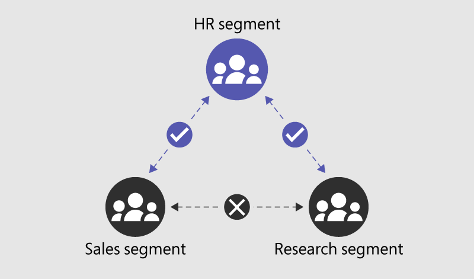

# Use information barriers with OneDrive

[Microsoft Purview Information Barriers](information-barriers.md) are policies in Microsoft 365 that a compliance admin can configure to prevent users from communicating and collaborating with each other. This solution is useful if, for example, one division is handling information that shouldn't be shared with specific other divisions, or a division needs to be prevented, or isolated, from collaborating with all users outside of the division. Information barriers are often used in highly regulated industries and those organizations with compliance requirements, such as finance, legal, and government.

For OneDrive, information barriers can determine and prevent the following kinds of unauthorized collaborations:

- User access to OneDrive or stored content
- Sharing OneDrive or stored content with other users

## Information barriers modes and OneDrive

When information barriers are enabled on SharePoint and OneDrive, the OneDrive of segmented users are automatically protected with IB policies. [Information barriers modes](information-barriers-policies.md#step-6-information-barriers-modes-optional) help strengthen access, sharing, and membership of a OneDrive site based on its IB mode and segments associated with the OneDrive.

When using information barriers with OneDrive, the following IB modes are supported:

| **Mode** | **Description** |
|:-------  |:----------------|
| **Open** | When a non-segmented user provisions their OneDrive, the site's IB mode is set as Open, by default. There are no segments associated with the site. |
| **Owner Moderated** | When a OneDrive is used for collaboration with incompatible users in the presence of the site owner/moderator, the OneDrive's IB mode can be set as Owner Moderated. See [this section](#manage-the-ib-mode-of-a-users-onedrive-preview) for details on Owner Moderated site. |
| **Explicit** | When a segmented user provisions their OneDrive within 24 hours of enablement, the site's IB mode is set as *Explicit* by default. The user's segment and other segments that are compatible with the user's segment and with each other get associated with the user's OneDrive. |
| **Mixed** | When a segmented user's OneDrive is allowed to be shared with unsegmented users, the site's IB mode can be set as *Mixed*. This is an opt-in mode that the SharePoint admin can set on OneDrive of a segmented user. |

>[!NOTE]
>Starting July 12, 2022, *Inferred* mode has changed to *Mixed* mode. The functionality for the mode remains the same.

## Sharing files from OneDrive

### Open

When a OneDrive has no segments and IB mode as *Open*:

- The user can share files and folders based on the information barrier policy applied to the user and the sharing setting for the OneDrive.

### Owner Moderated

When a site has information barriers mode is set to *Owner Moderated*:

- The option to share with *Anyone with the link* is disabled.
- The option to share with *Company-wide link* is disabled.
- The site and its content can be shared with existing members.
- The site and its content can be shared only by the OneDrive owner per their IB policy.

### Explicit

When a OneDrive has information barriers segments and the mode is set to *Explicit*:

- The option to share with *Anyone with the link* is disabled.
- The option to share with *Company-wide link* is disabled.
- Files and folders can be shared only with users whose segment matches that of the OneDrive.

### Mixed

When a OneDrive has information barriers segments and the mode is set to *Mixed*:

- The option to share with Anyone with the link is disabled.
- The option to share with Company-wide link is disabled.
- Files and folders can be shared with users whose segment matches that of the OneDrive and unsegmented users in the tenant.

## Accessing shared files from OneDrive

### Open mode

For a user to access content in a OneDrive that has no segments associated and IB mode as *Open*:

- The files must be shared with the user.

### Owner Moderated mode

For a user to access a SharePoint site with site's information barriers mode is set to *Owner Moderated*:

- The user has site access permissions.

### Explicit mode

For a user to access content in a OneDrive that has segments and the IB mode set to *Explicit*:

1. The user's segment must match a segment that is associated with the OneDrive.

    AND

2. The files must be shared with the user.

>[!NOTE]
>By default, non-segment users can access shared OneDrive files only from other non-segment users with IB modes as *Open*. They can't access shared files from OneDrive that have segment(s) applied and the IB mode is *Explicit*.

### Mixed mode

For a segmented user to access content in a OneDrive that has segments and the IB mode set as *Mixed*:

1. The user's segment must match a segment that is associated with the OneDrive.

    AND

2. The files must be shared with the user.

For an unsegmented user to access content in a OneDrive that has segments and the IB mode set as *Mixed*:

- The user must have site access permissions.

## Example scenario

The following example illustrates three segments in an organization: HR, Sales, and Research. An information barrier policy has been defined that blocks communication and collaboration between the Sales and Research segments.



With information barriers in OneDrive, when a segment is applied to a user, within 24 hours that segment is automatically associated with the user's OneDrive. Other segments that are compatible with the user's segment and with each other will also get associated with the OneDrive. A OneDrive can have up to 100 segments associated with it. A global or SharePoint admin can manage these segments using PowerShell, as described later in the section [Associate or remove additional segments on a user's OneDrive](#manage-segments-on-a-users-onedrive).

The following table shoes the effects of this example configuration:

| Components | HR users | Sales users | Research users | Non-segment users |
|:-----------|:---------|:------------|:---------------|:------------------|
| Segments associated with OneDrive | HR | Sales, HR | Research, HR | None |
| IB mode on OneDrive | Explicit | Explicit | Explicit | Open |
| OneDrive content can be shared with | HR only | Sales and HR | Research and HR | Anyone based on the sharing settings selected |
| OneDrive content can be accessed by | HR only | Sales and HR | Research and HR | Anyone with whom the content has been shared |

## Enable SharePoint and OneDrive information barriers in your organization

Enabling information barriers for SharePoint and OneDrive are configured in a single action. Information barriers for the services can't be enabled separately. To enable information barriers for OneDrive, see [Enable SharePoint and OneDrive information barriers in your organization](information-barriers-sharepoint.md#enable-sharepoint-and-onedrive-information-barriers-in-your-organization). After you've enabled information barriers for SharePoint and OneDrive, continue with the OneDrive guidance in this article.  

## Prerequisites

1. Make sure you meet the [licensing requirements for information barriers](/office365/servicedescriptions/microsoft-365-service-descriptions/microsoft-365-tenantlevel-services-licensing-guidance/microsoft-365-security-compliance-licensing-guidance#information-barriers).
2. [Create information barrier policies](information-barriers-policies.md) that allow or block communication between the segments and activate the policies. Create segments and define the users in each.
3. After you've configured and activated your information barrier policies, wait 24 hours for the changes to propagate through your organization.
4. Enable information barriers for OneDrive. Enabling information barriers for SharePoint and OneDrive are configured in a single action and these services can't be enabled separately. To enable information barriers for OneDrive, see the guidance and steps in the [Use information barriers with SharePoint](information-barriers-sharepoint.md) article.
5. Complete the steps in the following sections to customize and manage information barriers for OneDrive in your organization.

## Use PowerShell to view the segments associated with a OneDrive

A global or SharePoint admin can view and change the segments associated with a user's OneDrive. Your organization can have up to 5,000 segments and users can be assigned to multiple segments.

> [!IMPORTANT]
> Support for 5,000 segments and assigning users to multiple segments is only available when your organization isn't in *Legacy* mode. Assigning users to multiple segments requires additional actions to change the information barriers mode for your organization. For more information, see [Use multi-segment support in information barriers)](information-barriers-multi-segment.md) for details. <br><br> For organizations in *Legacy* mode, the maximum number of segments supported is 250 and users are restricted to being assigned to only one segment. Organizations in *Legacy* mode will be eligible to upgrade to the newest version of information barriers in the future. For more information, see the [information barriers roadmap](https://www.microsoft.com/microsoft-365/roadmap?filters=&searchterms=information%2Cbarriers).

1. Connect to the [Security & Compliance Center PowerShell](/powershell/exchange/office-365-scc/connect-to-scc-powershell/connect-to-scc-powershell) as a global admin.

2. Run the following command to get the list of segments and their GUIDs.

    ```PowerShell
    Get-OrganizationSegment | ft Name, EXOSegmentID
    ```

3. Save the list of segments.

    |**Name**|**EXOSegmentId**|
    |:-------|:---------------|
    | Sales | a9592060-c856-4301-b60f-bf9a04990d4d |
    | Research | 27d20a85-1c1b-4af2-bf45-a41093b5d111 |
    | HR | a17efb47-e3c9-4d85-a188-1cd59c83de32 |

4. If not previously completed, [download](https://go.microsoft.com/fwlink/p/?LinkId=255251) and install the latest SharePoint Online Management Shell. If you installed a previous version of the SharePoint Online Management Shell, follow the instructions in the [Enable SharePoint and OneDrive information barriers in your organization](information-barriers-sharepoint.md#enable-sharepoint-and-onedrive-information-barriers-in-your-organization) article.

5. Connect to SharePoint as a [global admin or SharePoint admin](/sharepoint/sharepoint-admin-role) in Microsoft 365. To learn how, see [Getting started with SharePoint Online Management Shell](/powershell/sharepoint/sharepoint-online/connect-sharepoint-online).

6. Run the following command:

    ```PowerShell
    Get-SPOSite -Identity <site URL> | Select InformationSegment 
    ```

    For example:

    ```powershell
    Get-SPOSite -Identity https://contoso-my.sharepoint.com/personal/John_contoso_onmicrosoft_com | Select InformationSegment
    ```

## Manage segments on a user's OneDrive

> [!WARNING]
> If the segments associated with a user's OneDrive don't match the segment applied to the user, the user won't be able to access their OneDrive. Be careful not to associate any segments with the OneDrive of a non-segment user.

> [!NOTE]
> Any changes you make will be overwritten if the user's segment changes.

To associate a segment with a OneDrive, run the following command in the SharePoint Online Management Shell.

> [!IMPORTANT]
> Support for 5,000 segments and assigning users to multiple segments is only available when your organization isn't in *Legacy* mode. Assigning users to multiple segments requires additional actions to change the information barriers mode for your organization. For more information, see [Use multi-segment support in information barriers)](information-barriers-multi-segment.md) for details. <br><br> For organizations in *Legacy* mode, the maximum number of segments supported is 250 and users are restricted to being assigned to only one segment. Organizations in *Legacy* mode will be eligible to upgrade to the newest version of information barriers in the future. For more information, see the [information barriers roadmap](https://www.microsoft.com/microsoft-365/roadmap?filters=&searchterms=information%2Cbarriers).

```PowerShell
Set-SPOSite -Identity <site URL> -AddInformationSegment <segment GUID> 
 ```

For example:

```powershell
Set-SPOSite -Identity https://contoso-my.sharepoint.com/personal/John_contoso_onmicrosoft_com -AddInformationSegment 27d20a85-1c1b-4af2-bf45-a41093b5d111
```

When you add segments to a OneDrive, the site's IB mode is automatically updated to *Explicit*. An error will appear if you attempt to associate a segment that isn't compatible with the existing segments on the OneDrive.

> [!IMPORTANT]
> Support for assigning users to multiple segments is only available when your organization isn't in *Legacy* mode. To determine if your organization is in *Legacy* mode, see [Check the IB mode for your organization)](information-barriers-multi-segment.md#check-the-ib-mode-for-your-organization). <br><br> Users are restricted to being assigned to only one segment for organizations in *Legacy* mode. Organizations in *Legacy* mode will be eligible to upgrade to the newest version of information barriers in the future. For more information, see the [information barriers roadmap](https://www.microsoft.com/microsoft-365/roadmap?filters=&searchterms=information%2Cbarriers).

To remove segment from a OneDrive, run the following command.  

```PowerShell
Set-SPOSite -Identity <site URL> -RemoveInformationSegment <segment GUID>
 ```

For example:

```powershell
Set-SPOSite -Identity https://contoso-my.sharepoint.com/personal/John_contoso_onmicrosoft_com -RemoveInformationSegment 27d20a85-1c1b-4af2-bf45-a41093b5d111
```

If all the segments of a OneDrive site are removed, the IB mode of the OneDrive is automatically updated to *Open*. 

## Manage the IB mode of a user's OneDrive (preview)

To view the IB mode of a OneDrive site, run the following command in the SharePoint Online Management Shell as a SharePoint admin or global administrator:

```powershell
Get-SPOSite -Identity <site URL> | Select InformationBarriersMode
```
  
For example:

```powershell
Get-SPOSite -Identity https://contoso-my.sharepoint.com/personal/John_contoso_onmicrosoft_com | Select InformationBarriersMode
```

A SharePoint admin or global administrator also has the ability to manage the IB mode of a OneDrive site to meet the needs of your organization with new IB modes:

### Owner Moderated mode example

Allow an incompatible segment user access to a OneDrive. For example, you want to allow HR user's OneDrive to be accessed by both Sales and Research segment users in your tenant.

*Owner Moderated* is a mode applicable to OneDrive site that allows incompatible segment users access to OneDrive in the presence of a moderator/owner. Only the site owner has the capability to invite incompatible segment users on the same site.

To update a OneDrive site IB mode to *Owner Moderated*, run the following PowerShell command:

```powershell
Set-SPOSite -Identity <siteurl> -InformationBarriersMode OwnerModerated
```

Owner Moderated IB mode can’t be set on a site with segments. Remove the segments before setting the IB mode as Owner Moderated. Access to an Owner Moderated site is allowed for users who have site access permissions. Sharing of an Owner Moderated OneDrive and its contents is only allowed by the site owner per their IB policy.

### Mixed mode example

Allow unsegmented users to access OneDrive associated with segments. For example, you want to allow HR user's OneDrive to be accessed by HR segment and unsegmented users in your tenant. Mixed mode applicable to OneDrive site that allows segmented and unsegmented users access to OneDrive.

To update a OneDrive site IB Mode to Mixed, run the following PowerShell command:

```powershell
Set-SPOSite -Identity <siteurl> -InformationBarriersMode Mixed
```

Mixed IB mode can't be set on a site without segments. Add segments before setting the IB mode as Mixed.

## Effects of changes to user segments

If a user's segment changes, the OneDrive's segment and IB mode will be automatically updated within 24 hours as described in the section above OneDrive information barriers

Example 1: User's segment updated from Research to Sales, the user's OneDrive will be as follows within 24 hours:

- Segment: Sales, HR
- IB mode: *Explicit*

Example 2: User's segment updated from HR to None, the user's OneDrive will be as follows within 24 hours:

- Segment: None
- IB mode: *Open*

## Effects of changes to information barrier policies

If a compliance administrator changes an existing policy, the change may impact the compatibility of the segments associated with the OneDrive.

For example, segments that were once compatible may no longer be compatible. A SharePoint admin must change the segments associated with an affected site accordingly. Learn how to create an [information barriers policy compliance report in PowerShell](information-barriers-sharepoint-report.md).

If a policy changes after files are shared, the sharing links will work only if the user attempting to access the shared files has a segment applied that matches a segment associated with the OneDrive.

## Auditing

Audit events are available in the Microsoft Purview compliance portal to help you monitor information barrier activities. Audit events are logged for the following activities:

- Enabled information barriers for SharePoint and OneDrive
- Applied segment to site
- Changed segment of site
- Removed segment of site
- Applied information barriers mode to site
- Changed information barriers mode of site
- Disabled information barriers for SharePoint and OneDrive

For more information about OneDrive segment auditing in Office 365, see [Search the audit log in the compliance center](audit-log-search.md).

## Resources

- [Information barriers in Microsoft Teams](information-barriers-teams.md)
- [Information barriers in SharePoint](information-barriers-sharepoint.md)

