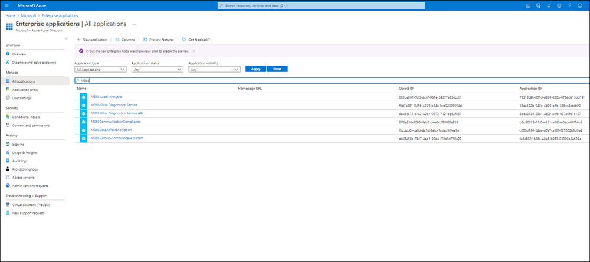
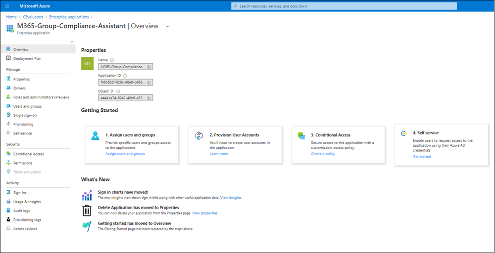
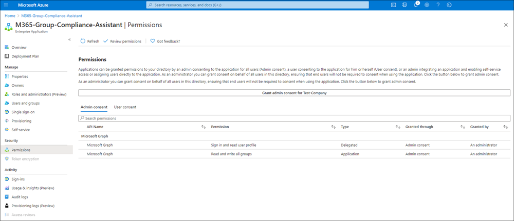

# Information barriers compliance assistant (preview)

This article explains how you can enable the information barrier compliance assistant for group-connected SharePoint sites. These are sites that don't have an associated team in Microsoft Teams. When the information barrier compliance assistant is enabled, users who don't match the segments specified on this site are automatically removed to ensure group membership honors configured information barrier policies. This configuration may help ensure your organization remains compliant with standards, policies, and compliance regulations.

## Prerequisites

1. Make sure you [define policies for information barriers](/microsoft-365/compliance/information-barriers-policies).
2. [Configure information barrier segments on a SharePoint Site.](/microsoft-365/compliance/information-barriers-sharepoint)
3. [Install the Azure PowerShell module](/powershell/azure/install-az-ps)
4. PowerShell account must have directory administrator access for the tenant.

## Enable the background compliance assistant

These steps create a new application in your organization's enterprise applications. For the compliance assistant to function properly, you must have explicitly added segments to a SharePoint site. Complete the following steps to enable the compliance assistant:

1. Run the following PowerShell cmdlets.

    ```PowerShell
    Connect-MgGraph
    Connect-AzAccount
    $appId="f46c682f-628c-48e6-b963-03309e34639e"
    $sp=Get-AzADServicePrincipal -ServicePrincipalName $appId
    if ($sp -eq $null) {New-AzADServicePrincipal -ApplicationId $appId}
    Start-Process "https://login.microsoftonline.com/common/adminconsent?client_id=$appId"
    ```

2. When prompted, sign in using your Office 365 work or school account.
3. In the **Permissions requested** dialog box, review the information, and select **Accept**. This action configures admin consent for the compliance assistant.

## Verify a new application was created

To verify that a new application was properly created in your organization's enterprise applications, complete the following steps:

1. Log into portal.azure.com with directory administrator's credentials.
2. Select **Manage Azure Active Directory.**
3. Select **Enterprise Applications** in left navigation listing.
4. Search for the compliance assistant using 'M365' as the search term.

    

5. Select **M365-Group-Compliance-Assistant** from the list of search results.
6. On the **M365-Group-Compliance-Assistant overview** page, you can review application properties.

    

7. Select **Permissions** in the left-navigation pane to review the permissions that the application is authorized for.

    

8. In this example, the **M365-Group-Compliance-Assistant** is authorized to add/remove non-compliant information barrier users from your Microsoft 365 groups.

You can use [audit log search](audit-log-search.md) in the Microsoft Purview compliance portal to search, review, and track audit log events for the M365-Group-Compliance-Assistant application. The audit activities associated with the compliance assistant are:

- **IB assistant removed group member**: The IB non-compliant group member was removed from the group by the compliance assistant.
- **IB assistant removed group owner**: The IB non-compliant owner was removed from the group by the compliance assistant.
- **Identified as IB non-compliant group**: The segments on the group are non-IB compliant with each other.

To search the audit log for Microsoft 365 Groups activities, see [Search the audit log](audit-log-search.md#search-the-audit-log).

>[!Note]
>The compliance assistant runs periodically (every 24 hours). The assistant runs on group-connected SharePoint sites that do not have an associated team in Microsoft Teams. To enable the compliance assistant for SharePoint sites connected to Microsoft Teams, follow the instructions in the [Define information barrier policies](information-barriers-policies.md) article.

