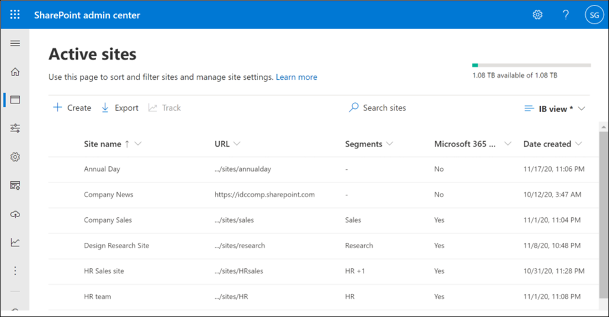
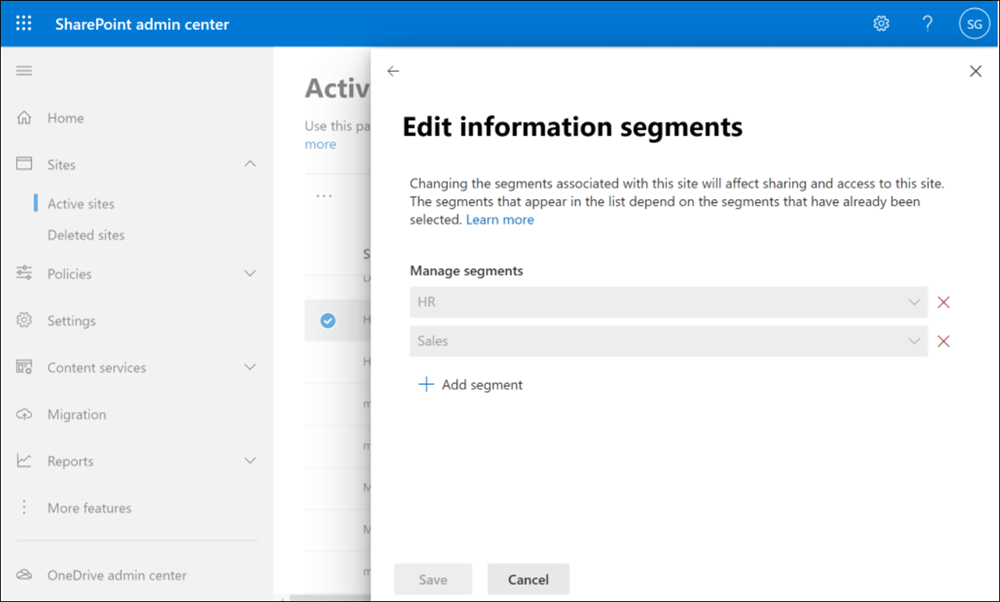

# Use information barriers with SharePoint

[Microsoft Purview Information Barriers](information-barriers.md) are policies in Microsoft 365 that a compliance admin can configure to prevent users from communicating and collaborating with each other. This solution is useful if, for example, one division is handling information that shouldn't be shared with specific other divisions, or a division needs to be prevented, or isolated, from collaborating with all users outside of the division. Information barriers are often used in highly regulated industries and those organizations with compliance requirements, such as finance, legal, and government.

For SharePoint, information barriers can determine and prevent the following kinds of unauthorized collaborations:

- Adding a user to a site
- User access to a site or site content 
- Sharing a site or site content with other users

## Information barriers modes and SharePoint sites

[Information barriers modes](information-barriers-policies.md#step-6-information-barriers-modes-optional) help strengthen access, sharing, and membership of a site based on its IB mode and segments associated with the site.

When using information barriers with SharePoint, the following IB modes are supported:

| **Mode** | **Description** | **Examples** |
|:-------  |:----------------|:-------------|
| **Open** | When a SharePoint site doesn't have segments, the site's IB mode is automatically set as *Open*. See [this section](#view-and-manage-segments-as-an-administrator) for details on managing segments with the *Open* mode configuration. | A Team site created for picnic event for your organization.  |
| **Owner Moderated** | When a SharePoint site is created for collaboration between incompatible segments moderated by the site owner, the site's IB mode should be set as *Owner Moderated*. See [this section](#owner-moderated-mode-scenario) for details on managing *Owner Moderated* site. | A site is created for collaboration between VP of Sales and Research in the presence of VP of HR (site owner).  |
| **Implicit** | When a site is provisioned by Microsoft Teams, the site's IB mode is set as *Implicit* by default. A SharePoint Administrator or Global Administrator can't manage segments with the *Implicit* mode configuration. | A Team is created for all Sales segment users to collaborate with each other. |
| **Explicit** | When segment is added to a SharePoint site either via end-user site creation experience or by a SharePoint Administrator adding segment to a site, the site's IB mode is set as *Explicit*. See [this section](#view-and-manage-segments-as-an-administrator) for details on managing segments with the *Explicit* mode configuration. | A research site is created for Research segment users. |

## Sharing sites for IB modes

Sharing of sites with users is based on the IB mode of the site. 

### Open

When a site has no segments and site's information barriers mode is set to *Open*:

- The site and its contents can be shared based on the information barrier policy applied to the user. For example, if a user in HR is allowed to communicate with users in Research, the user will be able to share the site with those users.

>[!TIP]
>If you want to allow sharing of *Open* mode sites with mail-enabled security groups, see the [Allow sharing of Open mode sites with mail-enabled security groups](#allow-sharing-of-open-mode-sites-with-mail-enabled-security-groups) section in this article.

### Owner Moderated

When a site has information barriers mode is set to *Owner Moderated*:

- The option to share with *Anyone with the link* is disabled.
- The option to share with *Company-wide link* is disabled.
- (For group connected sites) The site and its content can be shared with existing members.
- (For non-group connected sites) The site and its content can be shared only by the site owner per their IB policy.

### Implicit

When a site's information barriers mode is set to *Implicit*:

- The option to share with *Anyone with the link* is disabled.
- The option to share with *Company-wide link* is disabled.
- The site and its content can be shared with existing members via a sharing link.
- New users can't be added to the site directly. The Team owner should add users to the Team's group using Microsoft Teams.

>[!NOTE]
>If you've enabled information barriers for SharePoint in your organization before March 15, 2022, see the **Enable SharePoint and OneDrive information barriers** section in this article.

### Explicit

When a site is associated with segment(s) and site's information barriers mode is set to *Explicit*:

- The option to share with *Anyone with the link* is disabled.
- The option to share with *Company-wide link* is disabled.
- The site and its content can be shared only with users whose segment matches that of the site. For example, if a site is associated with the HR segment, the site can be shared with just HR users (even though HR is compatible with both Sales and Research segments).
- New users can be added as site members only if their segment matches the segment of the site.

## Access control for IB modes

IB policy is enforced when opening the SharePoint site or content in the SharePoint site. This is based on the IB mode of the site.

### Open mode

For a user to access a SharePoint site that has no segment and site's information barriers  mode is set to *Open*:

- The user has site access permissions.

### Owner Moderated mode

For a user to access a SharePoint site with site's information barriers mode is set to *Owner Moderated*:

- (For non-group connected sites) The user has site access permissions.
- (For group connected sites) The user must be a member of the Microsoft 365 group connected to the site.

### Implicit mode

For a user to access SharePoint sites that have information barriers mode set to *Implicit*:

- The user must be a member of the Microsoft 365 group connected to the site
- User who isn't a member of the Microsoft 365 group connected to the site won't have access to the site
- The information barriers compliance assistant ensures the group membership is IB compliant.

>[!NOTE]
>If you've enabled information barriers for SharePoint in your organization before March 15, 2022, see the **Enable SharePoint and OneDrive information barriers** section in this article.

### Explicit mode

For a user to access SharePoint sites that have segments and site's information barriers mode is *Explicit*:

- The user's segment must match a segment that is associated with the site.

    AND

- The user must have access permission to the site.  

Non-segment users can't access a site associated with segments. They'll see an error message.

## Example scenario

The following example illustrates three segments in an organization: HR, Sales, and Research. An information barrier policy has been defined that blocks communication and collaboration between the Sales and Research segments. These segments are incompatible.


With SharePoint information barriers, a SharePoint Administrator or Global Administrator can associate segments to a site to prevent the site from being shared with or accessed by users outside the segments. Up to 100 compatible segments can be associated with a site. The segments are associated at the site level (previously called site collection level). The Microsoft 365 group connected to the site is also associated with the site's segment.

In the above example, the HR segment is compatible with both Sales and Research. However, because the Sales and Research segments are incompatible, they can't be associated with the same site.

## Prerequisites

1. Make sure you meet the [licensing requirements for information barriers](/office365/servicedescriptions/microsoft-365-service-descriptions/microsoft-365-tenantlevel-services-licensing-guidance/microsoft-365-security-compliance-licensing-guidance#information-barriers).
2. [Create information barrier policies](information-barriers-policies.md) that allow or block communication between the segments, and then set them to active. Create segments and define the users in each.
3. After you've configured and activated your information barrier policies, wait 24 hours for the changes to propagate through your organization.
4. Complete the steps in the following sections to enable and manage SharePoint and OneDrive information barriers in your organization.

## Enable SharePoint and OneDrive information barriers in your organization

SharePoint Administrators or Global Administrators can enable information barriers in SharePoint and OneDrive in your organization. Complete the following steps to enable information barriers for your organization:

1. [Download](https://go.microsoft.com/fwlink/p/?LinkId=255251) and install the latest version of SharePoint Online Management Shell.
2. Connect to SharePoint Online as a Global Administrator or [SharePoint Administrator](/sharepoint/sharepoint-admin-role) in Microsoft 365. To learn how, see [Getting started with SharePoint Online Management Shell](/powershell/sharepoint/sharepoint-online/connect-sharepoint-online).
3. To enable information barriers in SharePoint and OneDrive, run the following command:

    ```PowerShell
    Set-SPOTenant -InformationBarriersSuspension $false 
    ```

4. After you've enabled information barriers for SharePoint and OneDrive in your organization, wait for approximately 1 hour for the changes to take effect.

>[!NOTE]
>If you have enabled information barriers for SharePoint in your organization  before March 15, 2022, the default access and sharing control for Implicit mode for Microsoft Teams-connected sites are based on the segments associated with the site.

To enable Microsoft 365 group-membership based access and sharing control for all Implicit mode Teams-connected sites in your tenant, run the following command:

```powershell
Set-SPOTenant -IBImplicitGroupBased $true
```

If you installed a previous version of the SharePoint Online Management Shell, complete the following steps:

1. Go to **Add or remove programs** and uninstall *SharePoint Online Management Shell*.
2. Navigate to the Microsoft Download Center for the [SharePoint Online Management Shell](https://go.microsoft.com/fwlink/p/?LinkId=255251)), select your language, and then select **Download**.
3. You may be asked to choose between downloading a x64 and x86 .msi file. Download the x64 file if you're running the 64-bit version of Windows or the x86 file if you're running the 32-bit version of Windows. If you don't know which version you're running on your computer, see [Which version of Windows operating system am I running?](https://support.microsoft.com/help/13443/windows-which-operating-system).
4. After the download is complete, run the installer file and follow the configuration steps in the setup wizard.
5. Connect to SharePoint Online as a Global Administrator or [SharePoint Administrator](/sharepoint/sharepoint-admin-role) in Microsoft 365. To learn how, see [Getting started with SharePoint Online Management Shell](/powershell/sharepoint/sharepoint-online/connect-sharepoint-online).
6. To enable information barriers in SharePoint and OneDrive, run the following command:

    ```PowerShell
    Set-SPOTenant -InformationBarriersSuspension $false 
    ```

7. After you've configured information barriers in SharePoint and OneDrive in your organization, wait for approximately 1 hour for the changes to take effect.

>[!NOTE]
>If you have enabled information barriers for SharePoint in your organization before  March 15, 2022, the default access and sharing control for Implicit mode for Microsoft Teams-connected sites are based on the segments associated with the site.

To enable Microsoft 365 group-membership based access and sharing control for all Implicit mode sites in your organization, run the following command:

```powershell
Set-SPOTenant -IBImplicitGroupBased $true
```

>[!NOTE]
>If you have Microsoft 365 Multi-Geo, you must run this command for each of your geo-locations.

## View and manage segments as an administrator

SharePoint Administrators or Global Administrators can view and manage segments on a SharePoint site. Your organization can have up to 5,000 segments and users can be assigned to multiple segments.

> [!IMPORTANT]
> Support for 5,000 segments and assigning users to multiple segments is only available when your organization isn't in *Legacy* mode. Assigning users to multiple segments requires additional actions to change the information barriers mode for your organization. For more information, see [Use multi-segment support in information barriers)](information-barriers-multi-segment.md) for details. <br><br> For organizations in *Legacy* mode, the maximum number of segments supported is 250 and users are restricted to being assigned to only one segment. Organizations in *Legacy* mode will be eligible to upgrade to the newest version of information barriers in the future. For more information, see the [information barriers roadmap](https://www.microsoft.com/microsoft-365/roadmap?filters=&searchterms=information%2Cbarriers).  

View and manage information barriers segments as follows:

### 1. Use the SharePoint admin center to view and manage information segments

To view, edit, or remove information segments for a site, use <a href="https://go.microsoft.com/fwlink/?linkid=2185220" target="_blank">**Active sites** in the SharePoint admin center</a>.  

The Segments column lists the first segment associated with the site and shows whether the site has other segments associated. [Learn how to show or move this column](/sharepoint/customize-admin-center-site-list#customize-columns)



To view the complete list of segments associated with a site, select the site name to open the details panel, and then select the **Settings** tab.

To edit the segments associated with the site, select **Edit**, add or remove segments, and then select **Save**.



### 2. Use SharePoint PowerShell to view and manage information segments on a site

1. Connect to the [Security & Compliance Center PowerShell](/powershell/exchange/office-365-scc/connect-to-scc-powershell/connect-to-scc-powershell) as a Global Administrator.

2. Run the following command to get the list of segments and their GUIDs.

    ```PowerShell
    Get-OrganizationSegment | ft Name, EXOSegmentID
    ```

3. Save the list of segments.

    |**Name**|**EXOSegmentId**|
    |:-------|:---------------|
    | Sales | a9592060-c856-4301-b60f-bf9a04990d4d |
    | Research | 27d20a85-1c1b-4af2-bf45-a41093b5d111 |
    | HR | a17efb47-e3c9-4d85-a188-1cd59c83de32 |

4. If not previously completed, [download](https://go.microsoft.com/fwlink/p/?LinkId=255251) and install the latest SharePoint Online Management Shell. If you installed a previous version of the SharePoint Online Management Shell, follow the instructions in the **Enable SharePoint and OneDrive information barriers in your organization** section in this article.

5. Connect to SharePoint Online as a [Global Administrator or SharePoint Administrator](/sharepoint/sharepoint-admin-role) in Microsoft 365. To learn how, see [Getting started with SharePoint Online Management Shell](/powershell/sharepoint/sharepoint-online/connect-sharepoint-online).

6. Run the following command:

      ```PowerShell
      Set-SPOSite -Identity <site URL> -AddInformationSegment <segment GUID>
      ```

    For example:

    ```powershell
    Set-SPOSite -Identity https://contoso.sharepoint.com/sites/ResearchTeamSite -AddInformationSegment 27d20a85-1c1b-4af2-bf45-a41093b5d111
    ```

You'll see an error message if you attempt to associate a segment that isn't compatible with the site's existing segments.

>[!NOTE]
>When you add a segment to a site, the site's IB mode is automatically updated as *Explicit*.

To remove segment from a site, run the following command:  

```PowerShell
Set-SPOSite -Identity <site URL> -RemoveInformationSegment <segment GUID>
 ```

For example:

```powershell
Set-SPOSite -Identity https://contoso.sharepoint.com/sites/ResearchTeamSite -RemoveInformationSegment 27d20a85-1c1b-4af2-bf45-a41093b5d111
```

>[!NOTE]
>When all segments are removed from a site, the site's IB mode is automatically updated to *Open*.

To view the segments of a site, run the following command to return the GUIDs of any segments associated with the site.

```PowerShell
Get-SPOSite -Identity <site URL> | Select InformationSegment
```

### 3. Use the SharePoint REST API to view and manage information segments on a site

SharePoint includes a Representational State Transfer (REST) service that you can use to manage segments on a site. To access SharePoint resources and manage site segments using REST, you'll construct a RESTful HTTP request by using the OData standard, which corresponds to the desired client object model application programming interface (API).

For more information about the SharePoint REST service, see [Get to know the SharePoint REST service](/sharepoint/dev/sp-add-ins/get-to-know-the-sharepoint-rest-service).

## View and manage IB modes as an administrator with SharePoint PowerShell

To view the IB mode of a site, run the following command:

```powershell
Get-SPOSite -Identity <site URL> | Select InformationBarriersMode
```

### Owner Moderated mode scenario

You want to allow a Sales and Research user to collaborate on a SharePoint site in the presence of HR user.

*Owner Moderated* is a mode applicable to site (Teams-connected site, non-group connected sites) which allows incompatible segment users access to site. Only the site owner has the capability to invite incompatible segment users on this same site.

To update a site's mode to *Owner Moderated*, run the following PowerShell command:

```powershell
Set-SPOSite -Identity <siteurl> -InformationBarriersMode OwnerModerated
```

Owner Moderated IB mode can't be set on a site with segments. Remove the segments first before setting IB mode as Owner Moderated. Access to an Owner Moderated site is allowed to users who have site access permissions. Sharing of an Owner Moderated site and its contents is only allowed by the site owner per their IB policy.

## Auditing

Audit events are available in the Microsoft Purview compliance portal to help you monitor information barrier activities. Audit events are logged for the following activities:

- Enabled information barriers for SharePoint and OneDrive
- Applied segment to site
- Changed segment of site
- Removed segment of site
- Applied information barriers mode to site
- Changed information barriers mode of site
- Disabled information barriers for SharePoint and OneDrive

For more information about SharePoint segment auditing in Office 365, see [Search the audit log in the compliance portal](audit-solutions-overview.md#microsoft-365-services-that-support-auditing).

## Site creation and management by site owners

When a segmented user creates a SharePoint site, the site is associated with the user's segment and site's information barriers mode is automatically set to *Explicit*.

In addition, the site owners have the capability to add more segments to a SharePoint site that already has segments with site's mode set as *Explicit*. Site owners can't remove added segments from sites. SharePoint Administrators will have to remove added segments in your organization if needed.

When a non-segmented user creates a SharePoint site, the site isn't associated with any segment and site's information barriers mode is automatically set to *Open*.

When a SharePoint Administrator creates a SharePoint site from the <a href="https://go.microsoft.com/fwlink/?linkid=2185219" target="_blank">SharePoint admin center</a>, the site isn't associated with any segment and the site's IB mode is set to *Open*.

To help site owners add a segment to a site, share the [Associate information segments with SharePoint sites](https://support.microsoft.com/office/associate-information-segments-with-sharepoint-sites-2b03db07-6d3f-4297-a388-b943317a26a7) article with your SharePoint site owners.

## Microsoft Teams sites

When a team is created in Microsoft Teams, a SharePoint site is automatically created for the team's files. To protect the Microsoft Team sites with information barriers control, you can enable information barriers in SharePoint for your tenant.

Within 24 hours, the site's information barriers mode is automatically set as *Implicit* and segments associated with the team's members are associated with the site.

Microsoft Teams sites with the information barrier mode as *Implicit* have site access and sharing based on Microsoft 365 group membership.

For example, users have access to the Microsoft Teams site if they're members of the Microsoft 365 group connected to the site. The Microsoft 365 group connected to the Team is IB compliant.

>[!NOTE]
>If you have enabled information barriers for SharePoint in your organization before March 15, 2022, the Teams-connected site's access and sharing is based on the segments of the site. For example:

- The site and its content can be shared with user whose segment matches that of the site.
- The site and its content can be accessed by a user if they have same segment as that of the site and have site access permissions.

To enable Microsoft 365 group membership-based access and sharing control for all *Implicit* mode sites in your organization, run the following command as a SharePoint Administrator:

```powershell
Set-SPOTenant -IBImplicitGroupBased $true
```

## Private channel and information barriers

When SharePoint Information barriers are enabled in your organization, any new private channel site automatically inherits its parent Microsoft Team's IB mode within 24 hours. The mode for a private channel is assigned as follows:

| **Parent Team's IB mode** | **Private channel site's IB mode** |
|:--------------------------|:-----------------------------------|
| Open | Open |
| Implicit or Owner Moderated | Implicit |

Private channel site access and sharing is governed by its IB mode:

- Private channel site with *Open* information barriers mode
    - Access is allowed to anyone who has site access permissions
    - Sharing links are allowed per the site's existing sharing policy
    - People picker allows discoverability of user per the sharer's IB policy

- Private channel site with *Implicit* information barriers mode
    - Access is allowed to user who is currently a member of the private channel
    - Sharing is allowed using **People with existing access link**

Private channel sites already configured in your organization will have their information barriers mode set as *Open*. To configure existing private channel sites to *Implicit* mode, run the following cmdlet in SharePoint PowerShell module:

```powershell
Set-Sposite -Identity <site URL> -InformationBarriersMode Implicit
```

Learn more about managing [Microsoft Teams connected teams sites](/sharepoint/teams-connected-sites).

## Search

Users will see search results from:

- **Segment associated sites**: When the site's segment matches the user's segment and the user has site access permission. For example, a site with *Explicit* mode.
- **Non-segmented sites**: When the user has existing access to the content or site. For example, sites with *Open*, *Owner Moderated* or *Implicit* mode. When the user selects the search result to open the content in the site, the user is denied access if they don't match the site's IB policy.

## Effects of changes to user segments

If a SharePoint site owner or site member's segment changes, they'll continue to have access to the site or content per the site's IB mode:

- **Open mode**: User can access the site if they have existing site access permissions.
- **Owner Moderated**: User can access the site if they have existing site access permissions.
- **Implicit Mode**: If the user is a member of the Microsoft 365 group, they'll continue to have access to the site.
- **Explicit Mode**: If the user's new segment matches the site's segment and user has site access permissions, they'll continue to have access to the site.

## Effects of changes to existing information barrier policies

If a compliance administrator changes an existing IB policy, the change may impact the compatibility of the segments associated with a site (in *Explicit* or *Implicit* mode).
For example, segments that were once compatible may no longer be compatible.

With Information barriers policy compliance report, the SharePoint Administrator will have the capability to view the list of sites where segments are no longer compatible. For more information, see [Learn how to create an information barriers policy compliance report in PowerShell](information-barriers-sharepoint-report.md).

To manage out of compliance sites:

- In *Explicit* mode, a SharePoint Administrator must change the associated segments to bring them in to IB compliance.
- In *Implicit* mode, a SharePoint Administrator can't manage segments directly. We recommend the Teams admin to manage the Team's membership to bring the Teams membership roster and segments in to IB compliance.

## How to suspend SharePoint and OneDrive information barriers in your organization

If your organization would like to temporarily suspend information barriers on SharePoint, you must use SharePoint Online Management Shell and the [Set-Spotenant](/powershell/module/sharepoint-online/set-spotenant) cmdlet.

To suspend information barriers, run the following command:

```PowerShell
Set-SPOTenant -InformationBarriersSuspension $true 
```

>[!NOTE]
>If you have Microsoft 365 Multi-Geo, you must run this command for each of your geo-locations.

## Allow sharing of Open mode sites with mail-enabled security groups

IB supports an opt-in capability available in the [SharePoint PowerShell module](/powershell/sharepoint/sharepoint-online/connect-sharepoint-online) for sites in *Open* mode to be shared with [mail-enabled security groups](/microsoft-365/admin/email/create-edit-or-delete-a-security-group) for site permissions, sharing, and audience targeting. This is only supported in *Open* mode sites. SharePoint admins can enable this support in your organization and we recommend you ensure the security group membership is IB compliant.

Before enabling group support, verify that you've met the following prerequisites:

- Your organization has only IB [*Block* policies](information-barriers-policies.md#configuration-concepts)
- Your organization is enabled for SharePoint IB (see [this section](#enable-sharepoint-and-onedrive-information-barriers-in-your-organization) in this article).

To configure mail-enabled security group support in *Open* mode sites, run the following command:

```powershell
Set-SPOTenant -ShowPeoplePickerGroupSuggestionsForIB $true
```

## Resources

- [Information barriers in Microsoft Teams](information-barriers-teams.md)
- [Information barriers in OneDrive](information-barriers-onedrive.md)

