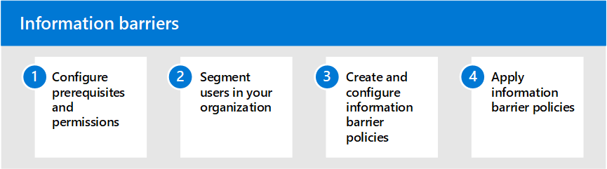

# Information barriers in Microsoft 365

Microsoft 365 enables communication and collaboration across groups and organizations and supports ways to restrict communication and collaboration among specific groups of users when necessary. This may include situations or scenarios where you want to restrict communication and collaboration between two groups to avoid a conflict of interest from occurring in your organization. This may also include situations when you need to restrict communication and collaboration between certain people inside your organization to safeguard internal information.

Information barriers are supported in Microsoft Teams, SharePoint Online, and OneDrive for Business. A compliance administrator or information barriers administrator can define policies to allow or prevent communications between groups of users in Microsoft Teams. Information barrier policies can be used for situations like these:

- User in the day trader group should not communicate or share files with the marketing team
- Finance personnel working on confidential company information should not communicate or share files with certain groups within their organization
- An internal team with trade secret material should not call or chat online with people in certain groups within their organization
- A research team should only call or chat online with a product development team

## Configure information barriers for Microsoft 365

Use the following steps to configure information barriers for your organization:

1. Learn about [information barriers](information-barriers.md) in Microsoft 365
2. Configure [prerequisites and permissions](information-barriers-policies.md#prerequisites)
3. Segment [users in your organization](information-barriers-policies.md#part-1-segment-users)
4. Create and configure [information barrier policies](information-barriers-policies.md#part-2-define-information-barrier-policies)
5. Apply [information barrier policies](information-barriers-policies.md#part-3-apply-information-barrier-policies)

## More information about information barriers

- [Attributes for information barrier policies](information-barriers-attributes.md)
- [Edit or remove information barrier policies](information-barriers-edit-segments-policies.md)