# Information barriers in Microsoft Teams

[Microsoft Purview Information Barriers](information-barriers.md) (IBs) are policies that an admin can configure to prevent individuals or groups from communicating with each other. IBs are useful if, for example, one department is handling information that shouldn't be shared with other departments. IBs are also useful when a group needs to be isolated or prevented from communicating with anyone outside of that group. Shared channels in Microsoft Teams is supported by information barriers. Depending on the type of sharing, information barriers policies may restrict sharing in certain ways. For more information about shared channels and information barriers behavior, see [Information barriers and shared channels](information-barriers-teams-shared-channels.md).

For Microsoft Teams, information barriers can determine and prevent the following kinds of unauthorized collaborations:

- Adding a user to a team or channel
- User access to team or channel content
- User access to 1:1 and group chats
- User access to meetings
- Prevents lookups and discovery, users won't be visible in the people picker.

>[!NOTE]
>- Information barrier groups cannot be created across tenants.
>- Using bots, Azure Active Directory (Azure AD) apps, APIs to send activity feed notifications, and some APIs to add users is not supported in version 1.
>- Private channels are compliant to information barriers policies that you configure.
>- For information about support for barriers for SharePoint sites that are connected to Teams, see [Segments associated with Microsoft Teams sites](information-barriers-sharepoint.md#view-and-manage-segments-as-an-administrator).

## Background

The primary driver for IBs comes from the financial services industry. The Financial Industry Regulatory Authority ([FINRA]( https://www.finra.org)) reviews IBs and conflicts of interest within member firms and provides guidance about managing such conflicts (FINRA 2241, [Debt Research Regulatory Notice 15-31](https://www.finra.org/sites/default/files/Regulatory-Notice-15-31_0.pdf).

However, since introducing IBs, many other areas have found them to be useful. Other common scenarios include:

- **Education**: Students in one school aren't able to look up contact details for students of other schools.
- **Legal**: Maintaining the confidentiality of data that is obtained by the lawyer of one client and preventing it from being accessed by a lawyer for the same firm who represents a different client.
- **Government**: Information access and control are limited across departments and groups.
- **Professional services**: A group of people in a company is only able to chat with a client or a specific customer via guest access during a customer engagement.

For example, Enrico belongs to the Banking segment and Pradeep belongs to the Financial advisor segment. Enrico and Pradeep can't communicate with each other because the organization's IB policy blocks communication and collaboration between these two segments. However, Enrico and Pradeep can communicate with Lee in HR.

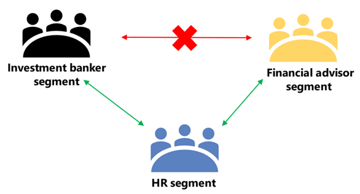

## When to use information barriers

You might want to use IBs in situations like these:

- A team must be prevented from communicating or sharing data with a specific other team.
- A team must not communicate or share data with anyone outside of the team.

The Information Barrier Policy Evaluation Service determines whether a communication complies with IB policies.

## Managing information barriers segments

IB segments are managed in the Microsoft Purview compliance portal or by using PowerShell cmdlets. For more information, see [Step 2: Segment users in your organization](information-barriers-policies.md#step-2-segment-users-in-your-organization).

> [!IMPORTANT]
> Support for assigning users to multiple segments is only available when your organization isn't in *Legacy* mode. To determine if your organization is in *Legacy* mode, see [Check the IB mode for your organization)](information-barriers-multi-segment.md#check-the-ib-mode-for-your-organization). <br><br> Users are restricted to being assigned to only one segment for organizations in *Legacy* mode. Organizations in *Legacy* mode will be eligible to upgrade to the newest version of information barriers in the future. For more information, see the [information barriers roadmap](https://www.microsoft.com/microsoft-365/roadmap?filters=&searchterms=information%2Cbarriers).

## Managing information barriers policies

IB policies are managed in the Microsoft Purview compliance portal or by using PowerShell cmdlets. For more information, see [Step 3: Create IB policies](information-barriers-policies.md#step-3-create-ib-policies).

>[!IMPORTANT]
>Before you set up or define policies, you must enable scoped directory search in Microsoft Teams. Wait at least a few hours after enabling scoped directory search before you set up or define policies for information barriers. For more information, see [Define information barrier policies](information-barriers-policies.md#required-subscriptions-and-permissions).

## Information barriers administrator role

The IB Compliance Management role is responsible for managing IB policies. For more information about this role, see [Permissions in the Microsoft Purview compliance portal](microsoft-365-compliance-center-permissions.md).

## Information barrier triggers

IB policies are activated when the following Teams events take place:

- **Members are added to a team**: Whenever you add a user to a team, the user's policy must be evaluated against the IB policies of other team members. After the user is successfully added, the user can perform all functions in the team without further checks. If the user's policy blocks them from being added to the team, the user won't show up in search.

    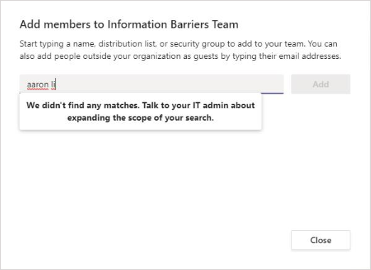

- **A new chat is requested**: Each time that a user requests a new chat with one or more other users, the chat is evaluated to make sure that it isn't violating any IB policies. If the conversation violates an IB policy, then the conversation isn't started.

    Here's an example of a 1:1 chat.

    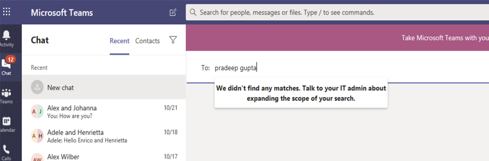

    Here's an example of a group chat.

    

- **A user is invited to join a meeting**: When a user is invited to join a meeting, the IB policy that applies to the user is evaluated against the IB policies that apply to the other team members. If there's a violation, the user won't be allowed to join the meeting.

    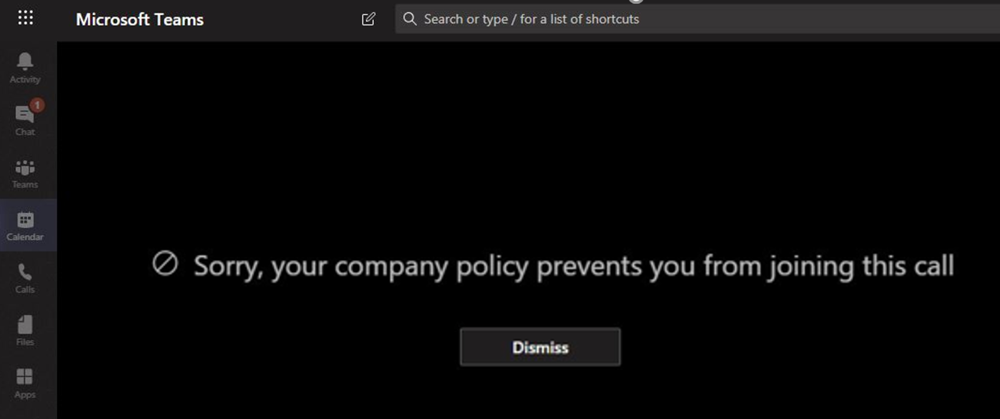

- **A screen is shared between two or more users**: When a user shares a screen with other users, the sharing must be evaluated to make sure that it doesn't violate the IB policies of other users. If an IB policy is violated, the screen share won't be allowed.

    Here's an example of screen share before the policy is applied.

    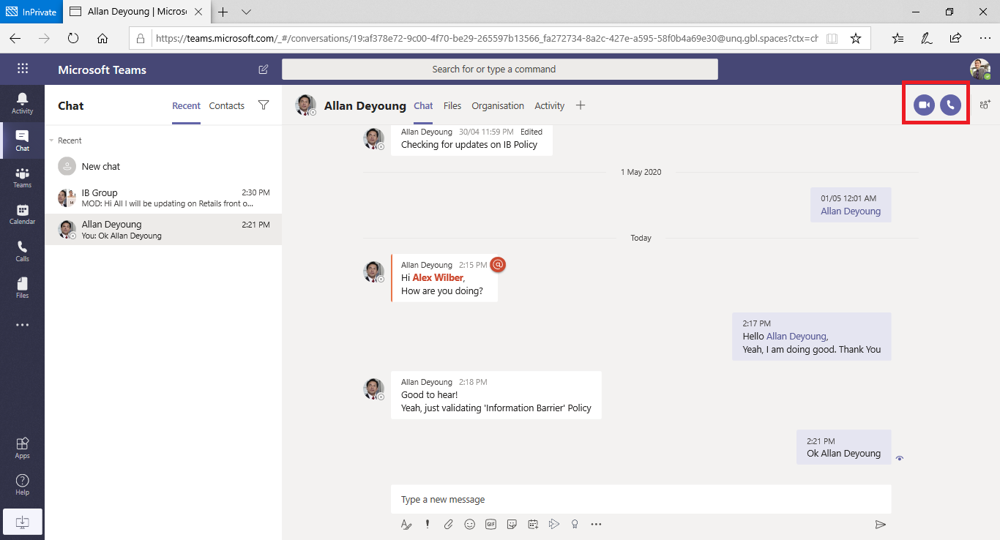

    Here's an example of screen share after the policy is applied. The screen share and call icons aren't visible.

    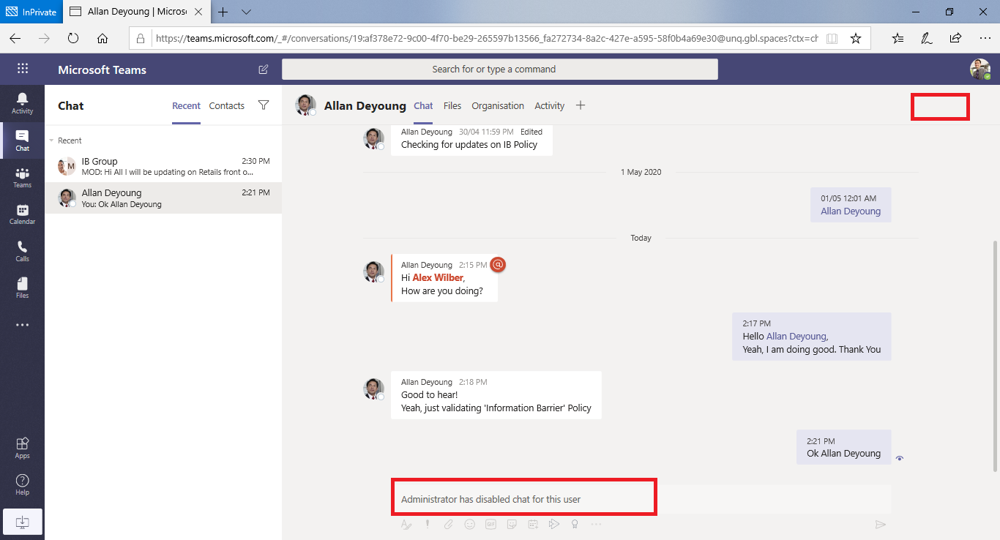

- **A user places a phone call in Teams**: Whenever a user initiates a voice call (via VOIP) to another user or group of users, the call is evaluated to make sure that it doesn't violate the IB policies of other team members. If there's any violation, the voice call is blocked.

- **Guests in Teams**: IB policies apply to guests in Teams, too. If guests need to be discoverable in your organization's global address list, see [Manage guest access in Microsoft 365 Groups](/microsoft-365/admin/create-groups/manage-guest-access-in-groups). Once guests are discoverable, you can [define IB policies](information-barriers-policies.md).

## How policy changes impact existing chats

When the IB policy administrator makes changes to a policy, or when a policy change is activated because of a change to a user's profile (such as for a job change), the Information Barrier Policy Evaluation Service automatically searches the members to ensure that their membership in the team doesn't violate any policies.

If there's an existing chat or other communication between users, and a new policy is set or an existing policy is changed, the service evaluates existing communications to make sure that the communications are still allowed to occur. 

- **1:1 chat**: If communication between two users is no longer allowed (because of application to one or both users of a policy that blocks communication), further communication is blocked. Their existing chat conversations become read-only.

    Here's an example that shows the chat is visible.

    

    Here's an example that shows the chat is disabled.

    

- **Group chat**: If communication from one user to a group is no longer allowed (for example, because a user changed jobs), the user—along with the other users whose participation violates the policy—may be removed from group chat, and further communication with the group won't be allowed. The user can still see old conversations, but won't be able to see or participate in any new conversations with the group. If the new or changed policy that prevents communication is applied to more than one user, the users who are affected by the policy may be removed from group chat. They can still see old conversations.

  In this example, Enrico moved to a different department within the organization and is removed from the group chat.

  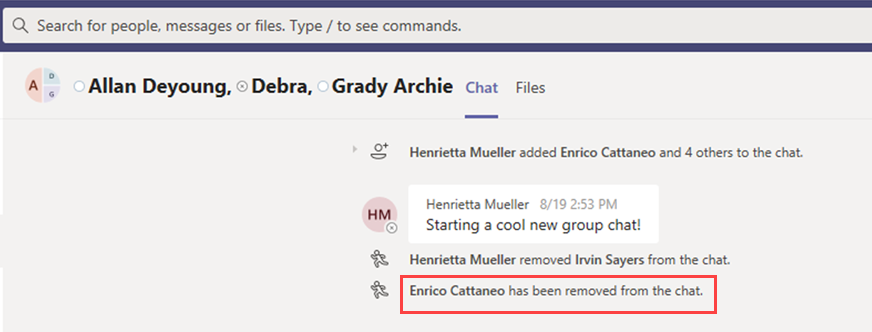

  Enrico can no longer send messages to the group chat.

  

- **Team**: Any users who have been removed from the group are removed from the team and won't be able to see or participate in existing or new conversations.

## Scenario: A user in an existing chat becomes blocked

Currently, users experience the following scenarios if an IB policy blocks another user:

- **People tab**: A user can't see blocked users on the **People** tab.
- **People Picker**: Blocked users won't be visible in the people picker.

    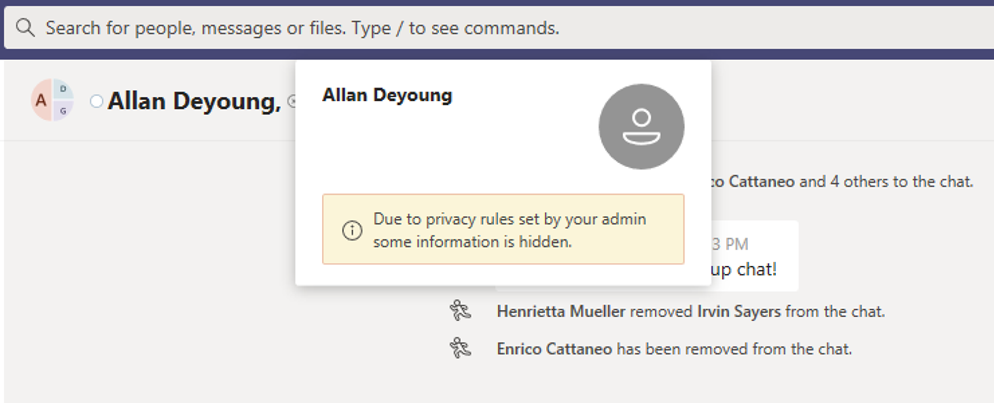

- **Activity tab**: If a user visits the **Activity** tab of a blocked user, no posts will appear. (The **Activity** tab displays channel posts only, and there would be no common channels between the two users.)

    Here's an example of the activity tab view that is blocked.

    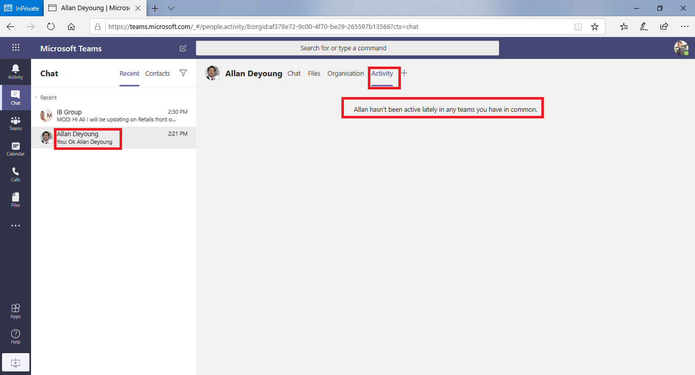

- **Org charts**: If a user accesses an org chart on which a blocked user appears, the blocked user won't appear on the org chart. Instead, an error message will appear.
- **People card**: If a user participates in a conversation and the user is later blocked, other users will see an error message instead of the people card when they hover over the blocked user's name. Actions listed on the card (such as calling and chat) will be unavailable.
- **Suggested contacts**: Blocked users don't appear on the suggested contacts list (the initial contact list that appears for new users).
- **Chat contacts**: A user can see blocked users on the chats contact list, but the blocked users will be identified. The only action that the user can perform on the blocked users is to delete them. The user can also select them to view their past conversation.
- **Calls contacts**: A user can see blocked users on the calls contact list, but the blocked users will be identified. The only action that the user can perform on the blocked users is to delete them.

    Here's an example of a blocked user in the calls contact list.
    
    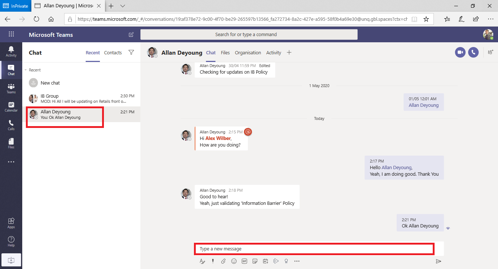

    Here's an example of the chat being disabled for a user on the calls content list.

    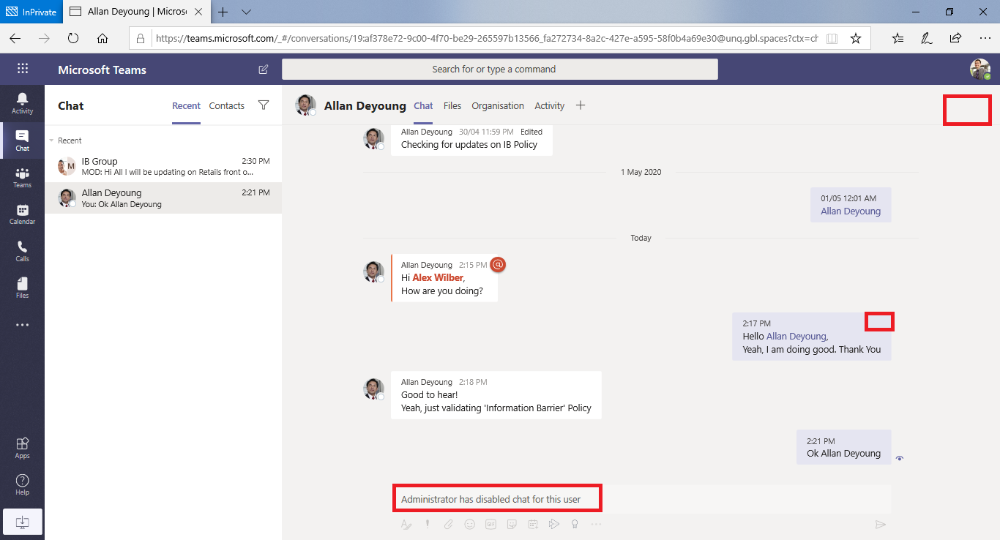

- **Skype to Teams migration**: During a migration from Skype for Business to Teams, all users—even those users who are blocked by IB policies—will be migrated to Teams. Those users are then handled as described above.

## Teams policies and SharePoint sites

When a team is created, a SharePoint site is provisioned and associated with Microsoft Teams for the files experience. Information barrier policies aren't honored on this SharePoint site and files by default. To enable information barriers in SharePoint and OneDrive, follow the guidance and steps in the [Use information barriers with SharePoint](information-barriers-sharepoint.md#enable-sharepoint-and-onedrive-information-barriers-in-your-organization) article.

## Information  barrier modes and Teams

Information barriers modes help strengthen who can be added to or removed from a Team. When using information barriers with Teams, the following IB modes are supported:

- **Open**: This configuration is the default IB mode for all existing groups that were provisioned before information barriers were enabled. In this mode, there are no IB policies applicable.
- **Implicit**: This configuration is the default IB mode when a Team is provisioned after enabling information barriers. Implicit mode allows you to add all compatible users in the group.
- **Owner Moderated**: This mode is set on a team when you want to allow collaboration between incompatible segment users that are moderated by the owner. The team owner can add new members per their IB policy.

Teams created before activating an information barrier policy in your tenant are automatically set to *Open* mode by default. Once you activate IB policies on your tenant, you're required to update mode of your existing teams to *Implicit* to ensure that existing teams are IB-compliant. For more information about updating modes, see [Change information barriers modes with a PowerShell script](information-barriers-teams-powershell-script.md).

Use the [Set-UnifiedGroup](/powershell/module/exchange/set-unifiedgroup) cmdlet with the *InformationBarrierMode* parameter that corresponds to the mode you want to use for your segments. Allowed list of values for the *InformationBarrierMode* parameter are *Open*, *Implicit*, and *Owner Moderated*.

For example, to configure the *Implicit* mode for a Microsoft 365 Group, you'll use the following PowerShell command:

```powershell
Set-UnifiedGroup -InformationBarrierMode Implicit
```

To update the mode from *Open* to *Implicit* for all existing teams, use this [PowerShell script](information-barriers-teams-powershell-script.md).

If you change the *Open* mode configuration on existing Teams-connected groups to meet compliance requirements for your organization, you'll need to [update the IB modes]/microsoft-365/compliance/information-barriers-sharepoint#view-and-manage-ib-modes-as-an-administrator-with-sharepoint-powershell) for associated SharePoint sites connected to the Teams team.

## IB policy application in Teams

IB policy application is a background IB processor for Teams that gets a notification when there are changes to either users (policy or segment changes) or groups (mode changes). The following steps outline the processing flow:

- The policy application receives a group change notification when mode is updated and retrieves the message thread and Group IDs applicable to the update.
- If the message thread exists, processing is scheduled and all members are fetched from the team, and underlying group and are sent to downstream Teams components for IB evaluation.
- The mode on the group and the IB policies per user are evaluated and the results are sent to the policy application.
- Policy application removes the non-compliant users from the group and team.

## Required licenses and permissions

For more information on licenses and permissions, plans, and pricing, see [Microsoft 365 licensing guidance for security & compliance](/office365/servicedescriptions/microsoft-365-service-descriptions/microsoft-365-tenantlevel-services-licensing-guidance/microsoft-365-security-compliance-licensing-guidance).

## Usage notes

- **Users can't join ad-hoc meetings**: If IB policies are enabled, users aren't allowed to join meetings if the size of the meeting roster is greater than the [meeting attendance limits](/microsoftteams/limits-specifications-teams). The root cause is that IB checks rely on whether users can be added to a meeting chat roster, and only when they can be added to the roster are they allowed to join the meeting. A user joining a meeting once adds that user to the roster; hence for recurring meetings, the roster can fill up fast. Once the chat roster reaches the [meeting attendance limits](/microsoftteams/limits-specifications-teams), additional users can't be added to the meeting. If IB is enabled for the organization and the chat roster is full for a meeting, new users (those users who aren't already on the roster) aren't allowed to join the meeting. But if IB isn't enabled for the organization and the meeting chat roster is full, new users (those users who aren't already on the roster) are allowed to join the meeting, though they won't see the chat option in the meeting. A short-term solution is to remove inactive members from the meeting chat roster to make space for new users. We will, however, be increasing the size of meeting chat rosters at a later date.
- **Users can't join channel meetings**: If IB policies are enabled, users aren't allowed to join channel meetings if they're not a member of the team. The root cause is that IB checks rely on whether users can be added to a meeting chat roster, and only when they can be added to the roster are they allowed to join the meeting. The chat thread in a channel meeting is available to Team/Channel members only, and non-members can't see or access the chat thread. If IB is enabled for the organization and a non-team member attempts to join a channel meeting, that user isn't allowed to join the meeting. However, if IB isn't* enabled for the organization and a non-team member attempts to join a channel meeting, the user is allowed to join the meeting—but they won't see the chat option in the meeting.
- **IB policies don't work for federated users**: If you allow federation with external organizations, the users of those organizations won't be restricted by IB policies. If users of your organization join a chat or meeting organized by external federated users, then IB policies also won't restrict communication between users of your organization.

## More information

- To learn more about IBs, see [Information barriers](/microsoft-365/compliance/information-barriers).
- To set up IB policies, see [Get started with information barriers](/microsoft-365/compliance/information-barriers-policies).
- To edit or remove IB policies, see [Manage information barrier policies](information-barriers-edit-segments-policies.md).
- [Information barriers and shared channels](information-barriers-teams-shared-channels.md)

## Availability

Information barriers in Teams is available in our public, GCC, GCC - High, and DOD clouds.
