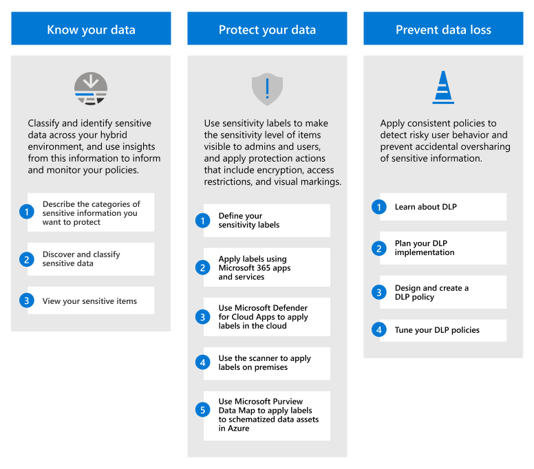
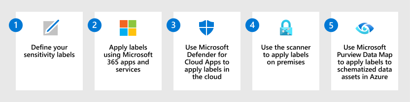

# Deploy an information protection solution with Microsoft Purview

>*[Licensing for Microsoft 365 Security & Compliance](/office365/servicedescriptions/microsoft-365-service-descriptions/microsoft-365-tenantlevel-services-licensing-guidance/microsoft-365-security-compliance-licensing-guidance)*

Your information protection strategy is driven by your business needs. Many organizations must comply with regulations, laws, and business practices. Additionally, organizations need to protect proprietary information, such as data for specific projects.

Microsoft Purview Information Protection (formerly Microsoft Information Protection) provides a framework, process, and capabilities you can use to accomplish your specific business objectives. 

[!INCLUDE [purview-preview](../includes/purview-preview.md)]

## Microsoft Purview Information Protection framework

Use Microsoft Purview Information Protection to help you discover, classify, protect, and govern sensitive information wherever it lives or travels.

Watch the following Ignite session to see how these capabilities support and build on each other: [Know your data, protect your data, and prevent data loss with Microsoft Information Protection](https://myignite.microsoft.com/archives/IG20-OD273).

For data governance, see [Deploy a data governance solution with Microsoft Purview](data-governance-solution.md).

## Licensing

Microsoft Purview Information Protection capabilities are included with Microsoft Purview. The licensing requirements can vary even within capabilities, depending on configuration options. To identify licensing requirements and options, see the [Microsoft 365 guidance for security & compliance](/office365/servicedescriptions/microsoft-365-service-descriptions/microsoft-365-tenantlevel-services-licensing-guidance/microsoft-365-security-compliance-licensing-guidance).

## Know your data

Knowing where your sensitive data resides is often the biggest challenge for many organizations. Microsoft Purview Information Protection data classification helps you to discover and accurately classify ever-increasing amounts of data that your organization creates. Graphical representations help you gain insights into this data so you can set up and monitor policies to protect and govern it.

|Step|Description|More information|
|:---|:----------|:---------------|
|1| Describe the categories of sensitive information you want to protect.    You already have an idea of what types of information are most valuable to your org and what types aren't. Work with stakeholders to describe these categories that are your starting point. | [Learn about sensitive information types](sensitive-information-type-learn-about.md) 
 [Learn about trainable classifiers](classifier-learn-about.md)|
|2| Discover and classify sensitive data.    Sensitive data in items can be found by using many different methods that include default DLP policies, manual labeling by users, and automated pattern recognition using sensitive information types or machine learning. | [Learn about data classification](data-classification-overview.md) 
 [Video: Data classification in the compliance center](https://www.microsoft.com/videoplayer/embed/RE4vx8x)|
|3| View your sensitive items.     Use content explorer and activity explorer for a deeper analysis of sensitive items and the actions that users are taking on these items.| [Get started with content explorer](data-classification-content-explorer.md) 
 [Get started with activity explorer](data-classification-activity-explorer.md)|

## Protect your data

Use the information from knowing where your sensitive data resides to help you more efficiently protect it. But there's no need to wait—you can start to protect your data immediately with a combination of manual, default, and automatic labeling. Then use [content explorer](data-classification-content-explorer.md) and [activity explorer](data-classification-activity-explorer.md) from the previous section to confirm what items are labeled and how your labels are being used.

|Step|Description|More information|
|:---|-----------|:---------------|
| 1|Define your [sensitivity labels](sensitivity-labels.md) and policies that will protect your organization's data.   In addition to identifying the sensitivity of content, these labels can apply protection actions, such as headers, footers, watermarks, and encryption. | [Get started with sensitivity labels](get-started-with-sensitivity-labels.md)    [Create and configure sensitivity labels and their policies](create-sensitivity-labels.md)    [Restrict access to content by using sensitivity labels to apply encryption](encryption-sensitivity-labels.md) |
| 2|Label and protect items for Microsoft 365 apps and services.   Sensitivity labels are supported for Microsoft 365 Word, Excel, PowerPoint, Outlook, and containers that include SharePoint and OneDrive sites, and Microsoft 365 groups. Use a combination of labeling methods such as manual labeling, automatic labeling, a default label, and mandatory labeling.| [Manage sensitivity labels in Office apps](sensitivity-labels-office-apps.md)    [Enable sensitivity labels for Office files in SharePoint and OneDrive](sensitivity-labels-sharepoint-onedrive-files.md)    [Enable co-authoring for files encrypted with sensitivity labels](sensitivity-labels-coauthoring.md)    [Configure a default sensitivity label for a SharePoint document library](sensitivity-labels-sharepoint-default-label.md)    [Apply a sensitivity label to content automatically](apply-sensitivity-label-automatically.md)    [Use sensitivity labels with Microsoft Teams, Microsoft 365 groups, and SharePoint sites](sensitivity-labels-teams-groups-sites.md)    [Use sensitivity labels to set the default sharing link for sites and documents in SharePoint and OneDrive](sensitivity-labels-default-sharing-link.md)    [Apply a sensitivity label to a model in Microsoft SharePoint Syntex](/microsoft-365/contentunderstanding/apply-a-sensitivity-label-to-a-model)    [Sensitivity labels in Power BI](/power-bi/admin/service-security-sensitivity-label-overview) |
|3|Discover, label, and protect sensitive items that reside in data stores in the cloud by using [Microsoft Defender for Cloud Apps](/cloud-app-security/what-is-cloud-app-security) with your sensitivity labels.| [Discover, classify, label, and protect regulated and sensitive data stored in the cloud](/cloud-app-security/best-practices#discover-classify-label-and-protect-regulated-and-sensitive-data-stored-in-the-cloud)|
|4|Discover, label, and protect sensitive items that reside in data stores on premises by deploying the [information protection scanner](deploy-scanner.md) with your sensitivity labels.| [Configuring and installing the information protection scanner](deploy-scanner-configure-install.md)|
|5|Extend your sensitivity labels to Azure by using [Microsoft Purview Data Map](/azure/purview/overview), to discover and label items for Azure Blob Storage, Azure files, Azure Data Lake Storage Gen1, and Azure Data Lake Storage Gen12. | [Labeling in Microsoft Purview Data Map](/azure/purview/create-sensitivity-label)|

If you're a developer who wants to extend sensitivity labels to line-of-business apps or third-party SaaS apps, see [Microsoft Information Protection (MIP) SDK setup and configuration](/information-protection/develop/setup-configure-mip). 

### Additional protection capabilities

Microsoft Purview includes additional capabilities to help protect data. Not every customer needs these capabilities, and some might be superseded by more recent releases.

Use the [Protect your data with Microsoft Purview](information-protection.md) page for the full list of protection capabilities.

## Prevent data loss

Deploy Microsoft Purview Data Loss Prevention (DLP) policies to govern and prevent the inappropriate sharing, transfer, or use of sensitive data across apps and services. These policies help users make the right decisions and take the right actions when they're using sensitive data.

|Step|Description|More information|
|:---|:----------|:---------------|
|1|Learn about DLP.    Organizations have sensitive information under their control, such as financial data, proprietary data, credit card numbers, health records, or social security numbers. To help protect this sensitive data and reduce risk, they need a way to prevent their users from inappropriately sharing it with people who shouldn't have it. This practice is called data loss prevention (DLP).| [Learn about data loss prevention](dlp-learn-about-dlp.md)|
|2|Plan your DLP implementation.    Every organization will plan for and implement data loss prevention (DLP) differently, because every organization's business needs, goals, resources, and situation are unique to them. However, there are elements that are common to all successful DLP implementations. | [Plan for data loss prevention](dlp-overview-plan-for-dlp.md)|
|3|Design and create a DLP policy.    Creating a data loss prevention (DLP) policy is quick and easy, but getting a policy to yield the intended results can be time consuming if you have to do a lot of tuning. Taking the time to design a policy before you implement it will get you to the desired results faster, and with fewer unintended issues, than tuning by trial and error alone.| [Design a DLP policy](dlp-policy-design.md) 
 [DLP policy reference](dlp-policy-reference.md) 
[Create, test, and tune a DLP policy](create-test-tune-dlp-policy.md)|
|4|Tune your DLP policies.    After you deploy a DLP policy, you'll see how well it meets the intended purpose. Use that information to adjust your policy settings for better performance. | [Create, test, and tune a DLP policy](create-test-tune-dlp-policy.md)|

## Training resources

Learning modules for consultants and admins:

- [Introduction to information protection and data lifecycle management in Microsoft Purview](/training/modules/m365-compliance-information-governance)
- [Classify data for protection and governance](/training/modules/m365-compliance-information-classify-data)
- [Protect information in Microsoft Purview](/training/modules/m365-compliance-information-protect-information)
- [Prevent data loss in Microsoft Purview](/training/modules/m365-compliance-information-prevent-data-loss)

To help train your users to apply and use the sensitivity labels that you configure for them, see [End-user documentation for sensitivity labels](get-started-with-sensitivity-labels.md#end-user-documentation-for-sensitivity-labels).

When you deploy data loss prevention policies for Teams, you might find useful the following end-user guidance as an introduction to this technology with some potential messages that they might see: [Teams messages about data loss prevention (DLP) and communication compliance policies](https://support.microsoft.com/office/teams-messages-about-data-loss-prevention-dlp-and-communication-compliance-policies-c5631c3f-f61b-4306-a6ac-6603d9fc5ff0).
