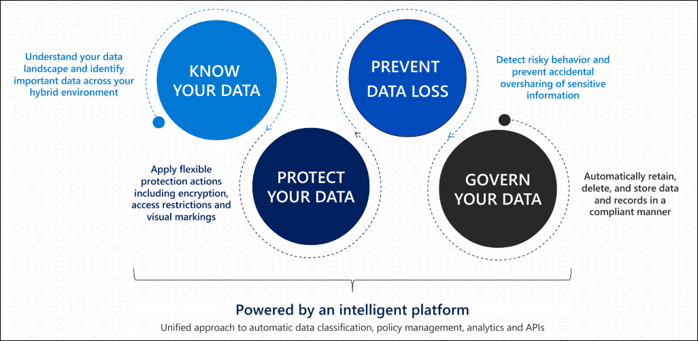

# Microsoft Information Protection in Microsoft 365

>*[Licensing for Microsoft 365 Security & Compliance](/office365/servicedescriptions/microsoft-365-service-descriptions/microsoft-365-tenantlevel-services-licensing-guidance/microsoft-365-security-compliance-licensing-guidance)*

Implement Microsoft Information Protection (MIP) to help you discover, classify, and protect sensitive information wherever it lives or travels.

MIP capabilities are included with Microsoft 365 Compliance and give you the tools to [know your data](#know-your-data), [protect your data](#protect-your-data), and [prevent data loss](#prevent-data-loss).

For information about governing your data, see [Microsoft Information Governance in Microsoft 365](manage-Information-governance.md).

## Know your data

> [!NOTE]
> For information about classifying and labeling data in Azure Purview, currently in preview, see [Automatically label your content in Azure Purview](/azure/purview/create-sensitivity-label).
> 
> For release announcements for Azure Purview, see the following blog posts: [Microsoft Information Protection and Microsoft Azure Purview: Better Together](https://techcommunity.microsoft.com/t5/microsoft-security-and/microsoft-information-protection-and-microsoft-azure-purview/ba-p/1957481) and [Azure Purview at Spring Ignite 2021](https://techcommunity.microsoft.com/t5/azure-purview/azure-purview-at-spring-ignite-2021/ba-p/2175919).

To understand your data landscape and identify important data across your hybrid environment, use the following capabilities:
 
|Capability|What problems does it solve?|Get started|
|:------|:------------|:--------------------|
|[Sensitive information types](sensitive-information-type-learn-about.md)| Identifies sensitive data by using built-in or custom regular expressions or a function. Corroborative evidence includes keywords, confidence levels, and proximity.| [Customize a built-in sensitive information type](customize-a-built-in-sensitive-information-type.md)|
|[Trainable classifiers](classifier-learn-about.md)| Identifies sensitive data by using examples of the data you're interested in rather than identifying elements in the item (pattern matching). You can use built-in classifiers or train a classifier with your own content.| [Get started with trainable classifiers](classifier-get-started-with.md) |
|[Data classification](data-classification-overview.md) | A graphical identification of items in your organization that have a sensitivity label, a retention label, or have been classified. You can also use this information to gain insights into the actions that your users are taking on these items. | [Get started with content explorer](data-classification-content-explorer.md)   [Get started with activity explorer](data-classification-activity-explorer.md) |

## Protect your data

To apply flexible protection actions that include encryption, access restrictions, and visual markings, use the following capabilities:

|Capability|What problems does it solve?|Get started|
|:------|:------------|---------------------|
|[Sensitivity labels](sensitivity-labels.md)| A single solution across apps, services, and devices to label and protect your data as it travels inside and outside your organization.   Example scenarios:   [Manage sensitivity labels for Office apps](sensitivity-labels-office-apps.md)  [Encrypt documents and emails](encryption-sensitivity-labels.md )  [Apply and view labels in Power BI](/power-bi/admin/service-security-apply-data-sensitivity-labels)    For a comprehensive list of scenarios for sensitivity labels, see the Get started documentation.|[ Get started with sensitivity labels](get-started-with-sensitivity-labels.md) |
|[Azure Information Protection unified labeling client](/azure/information-protection/rms-client/aip-clientv2)| For Windows computers, extends sensitivity labels for additional features and functionality that includes labeling and protecting all file types from File Explorer and PowerShell   Example additional features: [Custom configurations for the Azure Information Protection unified labeling client](/azure/information-protection/rms-client/clientv2-admin-guide-customizations)| [Azure Information Protection unified labeling client administrator guide](/azure/information-protection/rms-client/clientv2-admin-guide)|
|[Double Key Encryption](double-key-encryption.md)| Under all circumstances, only your organization can ever decrypt protected content or for regulatory requirements, you must hold encryption keys within a geographical boundary. | [Deploy Double Key Encryption](double-key-encryption.md#deploy-dke)|
|[Office 365 Message Encryption (OME)](ome.md)| Encrypts email messages and attached documents that are sent to any user on any device, so only authorized recipients can read emailed information.    Example scenario: [Revoke email encrypted by Advanced Message Encryption](revoke-ome-encrypted-mail.md) | [Set up new Message Encryption capabilities](set-up-new-message-encryption-capabilities.md)|
|[Service encryption with Customer Key](customer-key-overview.md) | Protects against viewing of data by unauthorized systems or personnel, and complements BitLocker disk encryption in Microsoft datacenters. | [Set up Customer Key for Office 365](customer-key-set-up.md)|
|[SharePoint Information Rights Management (IRM)](set-up-irm-in-sp-admin-center.md#irm-enable-sharepoint-document-libraries-and-lists)|Protects SharePoint lists and libraries so that when a user checks out a document, the downloaded file is protected so that only authorized people can view and use the file according to policies that you specify. | [Set up Information Rights Management (IRM) in SharePoint admin center](set-up-irm-in-sp-admin-center.md)|
[Rights Management connector](/azure/information-protection/deploy-rms-connector) |Protection-only for existing on-premises deployments that use Exchange or SharePoint Server, or file servers that run Windows Server and File Classification Infrastructure (FCI). | [Steps to deploy the RMS connector](/azure/information-protection/deploy-rms-connector#steps-to-deploy-the-rms-connector)
|[Azure Information Protection unified labeling scanner](/azure/information-protection/deploy-aip-scanner)| Discovers, labels, and protects sensitive information that resides in data stores that are on premises. | [Configuring and installing the Azure Information Protection unified labeling scanner](/azure/information-protection/deploy-aip-scanner-configure-install)|
|[Microsoft Cloud App Security](/cloud-app-security/what-is-cloud-app-security)| Discovers, labels, and protects sensitive information that resides in data stores that are in the cloud. | [Discover, classify, label, and protect regulated and sensitive data stored in the cloud](/cloud-app-security/best-practices#discover-classify-label-and-protect-regulated-and-sensitive-data-stored-in-the-cloud)|
|[Microsoft Information Protection SDK](/information-protection/develop/overview#microsoft-information-protection-sdk)|Extends sensitivity labels to third-party apps and services.     Example scenario: [Set and get a sensitivity label (C++)](/information-protection/develop/quick-file-set-get-label-cpp) |[Microsoft Information Protection (MIP) SDK setup and configuration](/information-protection/develop/setup-configure-mip)|

## Prevent data loss

To help prevent accidental oversharing of sensitive information, use the following capabilities:

|Capability|What problems does it solve?|Get started|
|:------|:------------|:---------------------|
|[Data loss prevention](dlp-learn-about-dlp.md)| Helps prevent unintentional sharing of sensitive items. | [Get started with the default DLP policy](get-started-with-the-default-dlp-policy.md)|
|[Endpoint data loss prevention](endpoint-dlp-learn-about.md)| Extends DLP capabilities to items that are used and shared on Windows 10 computers. | [Get started with Endpoint data loss prevention](endpoint-dlp-getting-started.md)|
|[Microsoft Compliance Extension (preview)](dlp-chrome-learn-about.md) | Extends DLP capabilities to the Chrome browser | [Get started with the Microsoft Compliance Extension (preview)](dlp-chrome-get-started.md)|
|[Microsoft 365 data loss prevention on-premises scanner (preview)](dlp-on-premises-scanner-learn.md)|Extends DLP monitoring of file activities and protective actions for those files to on-premises file shares and SharePoint folders and document libraries.|[Get started with Microsoft 365 data loss prevention on-premises scanner (preview)](dlp-on-premises-scanner-get-started.md)|
|[Protect sensitive information in Microsoft Teams chat and channel messages](dlp-microsoft-teams.md) | Extends some DLP functionality to Teams chat and channel messages | [Learn about the default data loss prevention policy in Microsoft Teams (preview)](dlp-teams-default-policy.md)|
