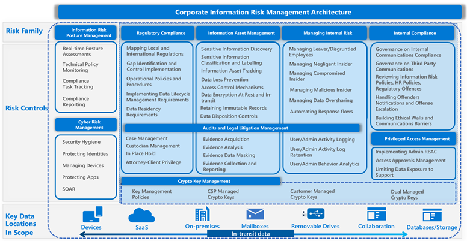

# Modern Information Risk Management Reference Architecture 

## Introduction

Corporate information risk management is more important today than ever in establishing a strategy for a compliant and secure modern enterprise, involving enhancements across several strategic areas. Organizations often lose focus on the bigger picture of their information risk posture and its relation to compliance. To improve the resiliency to evolving digital information risks, this high-level information risk management architecture helps organizations achieve the following benefits:

    1. Assess and identify gaps related to their current efforts, solutions, processes, and controls from an outside-to-inside lense.
    2. Focus the efforts on the most areas that need immediate attention.
    3. Build a remediation roadmap and refine the continuous improvement cycle.
    4. Have a better understanding of your data risk posture across your entire digital estate. 

## The Architecture

This architecture represents how every organization should look at thier digital estate from a risk angle. It highlights the different risk familes and its corrsponding mitigation or elimination controls. It also shows how this modern architecture considers different data locations whether at rest or in transit.

Best practices for controlling, mitigating, and eliminating risks accross these risk families:

## Information Risk Posture Management and Regulatory Compliance

- Organization should perform continous information risk posture assessment, preferrably in real-time, so that they can measure how the control implementation reflects on their posture.   
- Oganization should be able to asess technical controls without the need to go through lengthy technical assessment excercises
- Organization should be able to report their risk posture at any time to the board, legal and supervisory authorities.

While adopting organization wide approach, [Compliance Manager](compliance-manager.md) helps simplify compliance and reduce risk by providing:

-	Pre-built assessments for common industry and regional standards and regulations, including the availability to adopt local regulatory assessments.
-	Workflow capabilities to help you efficiently complete your risk assessments through a single tool.
-	Detailed step-by-step guidance on suggested improvement actions to help you comply with the standards and regulations that are most relevant for your organization. 
- A real-time risk-based compliance score to help you understand your compliance posture by measuring your progress in completing improvement actions.

## Information Asset Management

- [Microsoft Information Protection Scanner](https://github.com/MicrosoftDocs/Azure-RMSDocs/blob/master/Azure-RMSDocs/deploy-aip-scanner.md) is a program designed to detect, classify, and optionally protecting documents stored on File Shares and On-Premises SharePoint servers, as well as auto classification capabilities within Office365 apps enables your organization to classify and protect unstructured files and emails in order to allow a secure information between devices, mailboxes and apps even beyond the organization perimeter as remote work requires. You can be sure that the data are encrypted and protected from leakage.

- [Content explorer](data-classification-content-explorer.md) shows a current snapshot of the items that have a sensitivity label, a retention label or have been classified as a sensitive information type in your organization's Office365 resources.

- [Microsoft Cloud App Security](https://github.com/MicrosoftDocs/CloudAppSecurityDocs/blob/master/CloudAppSecurityDocs/what-is-cloud-app-security.md) helps you extends your visibility and control accross other SaaS apps by providing a wide array of capabilities that protect your environment across the following pillars:

1.	**Visibility:** detect all cloud services; assign each a risk ranking; identify all users and third-party apps able to log in
2.	**Data security:** identify and control sensitive information (DLP) shared on Office365 or other cloud storages; respond to classification labels on content.
3.	**Threat protection:** offer adaptive access control (AAC); provide user and entity behavior analysis (UEBA); mitigate malware related to the use of cloud apps.

- [Sensitivity-labels](sensitivity-labels.md) should be created after identifying the senstive information, where it is stored, and the proper label taxonomy. Labels can be applied via manual or automatic means. This will determine how the data will be treated for the rest of its lifecycle.

- You can use [Microsoft 365 data loss prevention (DLP)](data-loss-prevention-policies) to monitor the actions that are being taken on items you've determined to be sensitive and to help prevent the unintentional sharing of those items on the user’s devices. Endpoint data loss prevention [(Endpoint DLP)](dlp-configure-endpoints.md) extends the activity monitoring and protection capabilities of DLP to sensitive items that are on Windows 10 devices. Once devices are onboarded into the Microsoft 365 compliance solutions, the information about what users are doing with sensitive items is made visible in activity explorer and you can enforce protective actions on those items via DLP policies.

- DLP capabilities extends to natively include Microsoft Teams chat and channel messages, including private channel messages. [Teams DLP](dlp-microsoft-teams.md) applies to both text and documents shared. It acts upon a central predefined DLP policy, with the help of user tips to guide the user for smooth and educatory experience.

- [Advanced information governance](get-started-with-retention.md) allows you to retain important information and delete unimportant information by classifying information based on a retention or deletion policy or both. It includes intelligent/automated actions such as recommending policies, automatically applying labels to data, applying labels based on sensitive data types or queries, disposition review, and use of smart import filter.

- Organizations of all types require a [records-management](get-started-with-records-management.md) solution to manage regulatory, legal, and business-critical records across their corporate data. Records management in Microsoft 365 helps an organization manage their legal obligations, provides the ability to demonstrate compliance with regulations, and increases efficiency with regular disposition of items that are no longer required to be retained, no longer of value, or no longer required for business purposes.
When content reaches the end of its retention period, there are several reasons why you might want to review that content to decide whether it can be safely deleted ("disposed"). It enables you to:

  -	Suspend the deletion of relevant content in the event of litigation or an audit.
  -	Remove content from the disposition list to store in an archive, if that content has research or historical value.
  -	Assign a different retention period to the content, perhaps because the original retention settings were a temporary or provisional solution.
  -	Return the content to clients or transfer it to another organization.

A disposition review can include content in Exchange mailboxes, SharePoint sites, OneDrive accounts, and Microsoft 365 groups. Content awaiting a disposition review in those locations is deleted only after a reviewer chooses to permanently delete the content.

- [Azure Purview](https://github.com/MicrosoftDocs/azure-docs/blob/master/articles/purview/overview.md) is a unified data governance service that helps you manage and govern your on-premises, multicloud, and software-as-a-service (SaaS) data and databases. Easily create a holistic, up-to-date map of your data landscape with automated data discovery, sensitive data classification, and end-to-end data lineage. Empowering data consumers to find valuable, trustworthy data.

## Internal Risk Management

Managing internal risks has been a topic that is keeping CISOs up at night. There are various types of internal risks such as negligent insiders, malicious insiders, and compromised insiders. Moreover, organizations today have to face the risks associated with leavers, disgruntled employees, or even employees who were subject to stress or events such as bad performance reviews or demotion. 

Microsoft 365 risk prevention features are designed and built in to our insider risk products and solutions. These solutions work together and use advanced service and third-party indicators to help you quickly identify, triage, and act on risk activity. Most solutions offer a comprehensive detection, alert, and remediation workflow for your data analysts and investigators to use to quickly act on and minimize these risks.

[Insider risk management](insider-risk-solution-overview.md#insider-risk-management) helps minimize internal risks by enabling you to detect, investigate, and act on malicious and inadvertent activities in your organization. Using built-in machine learning templates, tuned to provide rich insights on various types of risks, out of the box—or customize for your organizational requirements. Prevent oversharing of information, IP theft and intentional data leakage and exfiltration.

## Internal Compliance Management

Leverage machine learning to detect policy violations across Microsoft Teams, Microsoft Exchange, and third-party content. Some of these risks are violations to corporate or HR policies, code of conduct, …etc.

- [Communication compliance](communication-compliance-solution-overview.md) in Microsoft 365 helps minimize these risks by helping you quickly detect, capture, and take remediation actions for email and Microsoft Teams communications. These include inappropriate communications containing profanity, threats, and harassment and communications that share sensitive information inside and outside of your organization.

- [Information barriers (IB)](information-barriers-solution-overview.md) are policies that an admin can configure to prevent individuals or groups from communicating with each other. IBs are useful if, for example, one department is handling information that shouldn't be shared with other departments. IBs are also useful when a group needs to be isolated or prevented from communicating with anyone outside of that group.

## Access Management

Based on principle of Zero Standing Access, which means users who need privileged access for Office365 operations, must request permissions for access, and once received it is just-in-time and just-enough access to perform the job at hand.

- [Customer Lockbox](customer-lockbox-requests.md) ensures that Microsoft cannot access your content to perform a service operation without your explicit approval. Customer Lockbox brings you into the approval workflow for requests to access your content.

- [Privileged access management](privileged-access-management-overview.md) allows granular access control over privileged admin tasks in Office 365. It can help protect your organization from breaches that use existing privileged admin accounts with standing access to sensitive data or access to critical configuration settings. Privileged access management requires users to request just-in-time access to complete elevated and privileged tasks through a highly scoped and time-bounded approval workflow. This configuration gives users just enough access to perform the task at hand, without risking exposure of sensitive data or critical configuration settings. Enabling privileged access management in Microsoft 365 allows your organization to operate with zero standing privileges and provide a layer of defense against standing administrative access vulnerabilities.

## Audits and legal litigation management

The [unified auditing](advanced-audit.md) functionality in Microsoft 365 provides organizations with visibility into many types of audited activities across many different services in Microsoft 365. Advanced Audit helps organizations to conduct forensic and compliance investigations by increasing audit log retention required to conduct an investigation, providing access to crucial events that help determine the scope of the compromise, and faster access to Office 365 Management Activity API.
[Advanced eDiscovery](get-started-with-advanced-ediscovery.md) solution in Microsoft 365 builds on the existing Microsoft eDiscovery and analytics capabilities. Advanced eDiscovery provides an end-to-end workflow to preserve, collect, analyze, review, analyze, and export content that's responsive to your organization's internal and external investigations. It also lets legal teams manage the entire legal hold notification workflow to communicate with custodians involved in a case.

## Crypto Key Management Management

For extremely regulated environment and subset of data that is highly sensitive, [Double Key Encryption (DKE)](double-key-encryption.md) offers the use of two keys together to access protected content. Microsoft stores one key in Microsoft Azure, and you hold the other key. You maintain full control of one of your keys using the Double Key Encryption service. You apply protection using The Azure Information Protection unified labeling client to your highly sensitive content.

Organizations with an MIP subscription can choose to configure their tenant with their own key, instead of a default key generated by Microsoft. This configuration is often referred to as [Bring Your Own Key (BYOK)](customer-key-overview.md). BYOK and usage logging work seamlessly with applications that integrate with the Azure Rights Management service used by MIP, protecting the top few percent of your most sensitive information in a manner that is opaque to anyone but you. It is linked to your organization’s requirement of maintaining full control over the encryption keys and over the authorization process for the ‘top-secret’ data. However, it does come at the price of limiting any service that can reason over data or protect your data flow outside of the organization perimeter.

## Cyber risk management

[Microsoft 365 Defender](https://github.com/MicrosoftDocs/microsoft-365-docs/blob/public/microsoft-365/security/defender/overview-security-center.md) brings together functionality from existing Microsoft security portals, like Microsoft Defender Security Center and the Office 365 Security & Compliance center. The security center emphasizes quick access to information, simpler layouts, and bringing related information together for easier use. This center includes:

- Defender for Endpoint uses the following combination of technology built into Windows 10 and Microsoft's robust cloud service:

  -	Endpoint behavioral sensors: Embedded in Windows 10, these sensors collect and process behavioral signals from the operating system and send this sensor data to your private, isolated, cloud instance of Microsoft Defender for Endpoint.

  -	Cloud security analytics: Leveraging big-data, device-learning, and unique Microsoft optics across the Windows ecosystem, enterprise cloud products (such as Office 365), and online assets, behavioral signals are translated into insights, detections, and recommended responses to advanced threats.

  - Threat intelligence: Generated by Microsoft hunters, security teams, and augmented by threat intelligence provided by partners, threat intelligence enables Defender for Endpoint to identify attacker tools, techniques, and procedures, and generate alerts when they are observed in collected sensor data.

  - Theat & Vulnerability Management
This built-in capability uses a game-changing risk-based approach to the discovery, prioritization, and remediation of endpoint vulnerabilities and misconfigurations.

  - Attack surface reduction
The attack surface reduction set of capabilities provides the first line of defense in the stack. By ensuring configuration settings are properly set and exploit mitigation techniques are applied, the capabilities resist attacks and exploitation. This set of capabilities also includes network protection and web protection, which regulate access to malicious IP addresses, domains, and URLs.

  - Endpoint detection and response capabilities are put in place to detect, investigate, and respond to advanced threats that may have made it past other security defenses.

  - Advanced hunting provides a query-based threat-hunting tool that lets you proactively find breaches and create custom detections.

  - Automated investigation and remediation
In conjunction with being able to quickly respond to advanced attacks, Microsoft Defender for Endpoint offers automatic investigation and remediation capabilities that help reduce the volume of alerts in minutes at scale, and help you respond remotely. 

- Defender for Identity enables SecOps analysts and security professionals struggling to detect advanced identity attacks in hybrid environments to:

  -	Monitor users, entity behavior, and activities with learning-based analytics.
  -	Protect user identities and credentials stored in Active Directory, or remote working.
  -	Identify and investigate suspicious user activities and advanced attacks throughout the kill chain.
  - Provide clear incident information on a simple timeline for fast triage

- Microsoft Defender for Office 365 safeguards your organization against malicious threats posed by email messages, links (URLs), and collaboration tools such as Microsoft teams’ content, OneDrive and SharePoint, even for 3rd party collaborators sharing malicious content to your employees on Microsoft teams.

- [Microsoft Cloud App Security](https://github.com/MicrosoftDocs/CloudAppSecurityDocs/blob/master/CloudAppSecurityDocs/what-is-cloud-app-security.md) provides unique threat protection capabilities to protect access to SaaS apps such as Office365 and third-party SaaS apps. It offers adaptive access control (AAC) and provide user and entity behavior analysis (UEBA).

- [Identity Protection](https://github.com/MicrosoftDocs/azure-docs/blob/master/articles/active-directory/identity-protection/overview-identity-protection.md) uses the learnings Microsoft has acquired from their position in organizations with Azure AD, the consumer space with Microsoft Accounts, and in gaming with Xbox to protect your users. Microsoft analyses 6.5 trillion signals per day to identify and protect customers from threats. The signals generated by and fed to Identity Protection, can be further fed into tools like Conditional Access to make access decisions, or fed back to a security information and event management (SIEM) tool for further investigation based on your organization's enforced policies.
