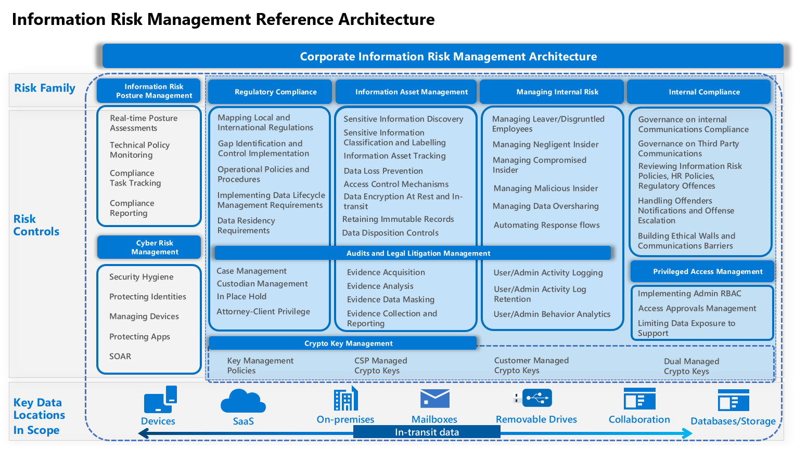

# Introduction

Corporate information risk management is more important today than ever in establishing a strategy for a compliant and secure modern enterprise, involving enhancements across several strategic areas. Organizations often lose focus on the bigger picture of their information risk posture and it's relation to compliance. To improve the resiliency to evolving digital infomration risks, this high level information risk management architecture helps organizations achieve the following benefits:

1. Assess and identify gaps related to their current efforts, solutions, processes and controls from an outside-to-inside lense.
2. Focus the efforts on the most areas that needs immediate attention.
3. Build a remediation roadmap and refine the continous improvement cycle.
4. Have a better understanding on your data risk posture accross your entire digital estate. 

## The Architecture

This architecture represents how every organization should look at thier digital estate from a risk angle. It highlights the different risk familes and its corrsponding mitigation or elimination controls. It also shows how this modern architecture considers different data locations whether at rest or in transit.

Best practices for controlling, mitigating, and eliminating risks accross these risk families:

## Information Risk Posture Management and Regulatory Compliance

- Organization should have perform continous information risk posture assessment, preferrably in real-time, so that they can measure how the control implementation reflects on their posture.   
- Oganization should be able to asess technical controls without the need to go through lengthy technical assessment excercises
- Organization should be able to report their risk posture at any time to the board, legal and supervisory authorities.

While adopting organization wide approach, [Compliance Manager](compliance-manager.md) helps simplify compliance and reduce risk by providing:

-	Pre-built assessments for common industry and regional standards and regulations, including the availability to adopt local regulatory assessments.
-	Workflow capabilities to help you efficiently complete your risk assessments through a single tool.
-	Detailed step-by-step guidance on suggested improvement actions to help you comply with the standards and regulations that are most relevant for your organization. 
- A real-time risk-based compliance score to help you understand your compliance posture by measuring your progress in completing improvement actions.

## Information Asset Management

## Internal Risk Management

## Internal Compliance Management

## Access Management

## Audits and Legal Litigation Management

## Crypto Key Management Management

## Cyber Risk Management

- [Data loss prevention policies](data-loss-prevention-policies.md) 
- - **Use EDM**

