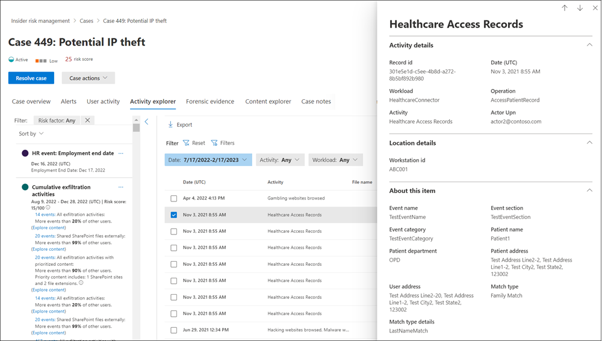

# Investigate insider risk management activities

Investigating risky user activities is an important first step in minimizing insider risks for your organization. These risks may be activities that generate alerts from insider risk management policies, or risks from activities that are detected by policies but do not immediately create an insider risk management alert for users. You can investigate these types of activities by using the **User activity reports (preview)** or with the **Alert dashboard**.

## User activity reports (preview)

User activity reports allow you to examine activities for specific users for a defined time period without having to assign them temporarily or explicitly to an insider risk management policy. In most insider risk management scenarios, users are explicitly defined in policies, and they may have policy alerts (depending on triggering events) and risk scores associated with the activities. But in some scenarios, you may want to examine the activities for users that aren't explicitly defined in a policy. These activities may be for users that you've received a tip about the user and potentially risky activities, or users that typically don't need to be assigned to an insider risk management policy.

After you've configured indicators on the insider risk management **Settings** page, user activity is detected for risky activity associated with the selected indicators. You do not have to configure a policy for user activity reports to detect and report risky activities by users in your organization. Activities included in user activity reports do not require triggering events for the activities to be displayed. This configuration means that all detected activity for the user is available for review, regardless if it has a triggering event or if it creates an alert. Reports are created on a per-user basis and can include all activities for a custom 90-day period. Multiple reports for the same user aren't supported.

After examining activities for a user, investigators can dismiss individual activities as benign, share or email a link to the report with other investigators, or choose to assign the user temporarily or explicitly to an insider risk management policy. Users must be assigned to the *Insider Risk Management Investigators* role group to view the **User activity reports** page.  

You can get started by selecting **Manage reports** in the **Investigate user activity** section on the insider risk management **Overview** page. To view activities for a user, first select **Create user activity report** and complete the following fields in the **New user activity report** pane:

- **User**: Search for a user by name or email address
- **Start date**: Use the calendar control to select the start date for user activities.
- **End date**: Use the calendar control to select the end date for user activities. The end date selected must be greater than two days after the selected start date and no greater than 90 days from the selected start date.
New reports typically take up to 10 hours before they are ready for review. When the report is ready, you'll see *Report ready* in the **Status** column on the User activity report page. Select the user to view the detailed report:

The **User activity report** for the selected user contains the **User activity** and **Activity explorer** tabs:

- **User activity**: Use this chart view to investigate activities and view potential activities that occur in sequences. This tab is structured to enable quick review of a case, including a historical timeline of all activities, activity details, the current risk score for the user in the case, the sequence of risk events, and filtering controls to help with investigative efforts.
- **Activity explorer**: The **Activity explorer** tab provides risk investigators with a comprehensive analytic tool that provides detailed information about activities. With the Activity explorer, reviewers can quickly review a timeline of detected risky activity and identify and filter all risk activities associated with alerts. To learn more about using the Activity explorer, see the *Activity explorer* section later in this article.

## Alert dashboard

Insider risk management alerts are automatically generated by risk indicators defined in insider risk management policies. These alerts give compliance analysts and investigators an all-up view of the current risk status and allow your organization to triage and take actions for discovered risks. By default, policies generate a certain amount of low, medium, and high severity alerts, but you can [increase or decrease the alert volume](insider-risk-management-settings.md#alert-volume) to suit your needs. Additionally, you can configure the [alert threshold for policy indicators](insider-risk-management-settings.md#indicator-level-settings-preview) when creating a new policy with the policy wizard.

Check out the [Insider Risk Management Alerts Triage Experience video](https://www.youtube.com/watch?v=KgmpxBLJLPI) for an overview of how alerts provide details, context, and related content for risky activity and how to make your investigation process more effective.

The insider risk **Alert dashboard** allows you to view and act on alerts generated by insider risk policies. Each report widget displays information for last 30 days.

- **Total alerts that need review**: The total number of alerts needing review and triage are listed, including a breakdown by alert severity.
- **Open alerts over past 30 days**: The total number of alerts created by policy matches over the last 30 days, sorted by high, medium, and low alert severity levels.
- **Average time to resolve alerts**: A summary of useful alert statistics:
  - Average time to resolve high severity alerts, listed in hours, days, or months.
  - Average time to resolve medium severity alerts, listed in hours, days, or months.
  - Average time to resolve low severity alerts, listed in hours, days, or months.

> [!NOTE]
> Insider risk management uses built-in alert throttling to help protect and optimize your risk investigation and review experience. This throttling guards against issues that might result in an overload of policy alerts, such as misconfigured data connectors or DLP policies. As a result, there might be a delay in displaying new alerts for a user.

## Alert status and severity

You can triage alerts into one of the following statuses:

- **Confirmed**: An alert confirmed and assigned to a new or existing case.
- **Dismissed**: An alert dismissed as benign in the triage process.
- **Needs review**: A new alert where triage actions have not yet been taken.
- **Resolved**: An alert that is part of a closed and resolved case.

Alert risk scores are automatically calculated from several risk activity indicators. These indicators include the type of risk activity, the number and frequency of the activity occurrence, the history of user risk activity, and the addition of activity risks that may boost the seriousness of the activity. The alert risk score drives the programmatic assignment of a risk severity level for each alert and cannot be customized. If alerts remain untriaged and risk activities continue to accrue to the alert, the risk severity level can increase. Risk analysts and investigators can use the alert risk severity to help triage alerts in accordance with your organization's risk policies and standards.

Alert risk severity levels are:

- **High severity**: The activities and indicators for the alert pose significant risk. The associated risk activities are serious, repetitive, and corelate strongly to other significant risk factors.
- **Medium severity**: The activities and indicators for the alert pose a moderate risk. The associated risk activities are moderate, frequent, and have some correlation to other risk factors.
- **Low severity**: The activities and indicators for the alert pose a minor risk. The associated risk activities are minor, more infrequent, and do not corelate to other significant risk factors.

## Filter alerts on the Alert dashboard

Depending on the number and type of active insider risk management policies in your organization, reviewing a large queue of alerts can be challenging. Using alert filters can help analysts and investigators sort alerts by several attributes. To filter alerts on the **Alerts dashboard**, select the **Filter** control. You can filter alerts by one or more attributes:

- **Status**: Select one or more status values to filter the alert list. The options are *Confirmed*, *Dismissed*, *Needs review*, and *Resolved*.
- **Severity**: Select one or more alert risk severity levels to filter the alert list. The options are *High*, *Medium*, and *Low*.
- **Time detected**: Select the start and end dates for when the alert was created. This filter searches for alerts between UTC 00:00 on the start date and UTC 00:00 on the end date. To filter alerts for a specific day, enter the date for the day in the **Start date** field and the date of the following day in the **End date** field.
- **Policy**: Select one or more policies to filter the alerts generated by the selected policies.

## Search alerts on the Alert dashboard

To search the alert name for a specific word, select the **Search** control and type the word to search. The search results display any policy alert containing the word defined in the search.

## Dismiss multiple alerts (preview)

It may help save triage time for analysts and investigators to immediately dismiss multiple alerts at once. The **Dismiss alerts** command bar option allows you to select one or more alerts with a *Needs review* status on the dashboard and quickly dismiss these alerts as benign as appropriate in your triage process. You can select up to 400 alerts to dismiss at one time.

To dismiss an insider risk alert, complete the following steps:

1. In the [Microsoft 365 compliance center](https://compliance.microsoft.com), go to **Insider risk management** and select the **Alerts** tab.
2. On the **Alerts dashboard**, select the alert (or alerts) with a *Needs review* status that you want to dismiss.
3. On the Alerts command bar, select **Dismiss alerts**.
4. On the **Dismiss alerts** detail pane, you can review the user and policy details associated with the selected alerts.
5. Select **Dismiss alerts** to resolve the alerts as benign or select **Cancel** to close the details pane without dismissing the alerts.

## Triage alerts

To triage an insider risk alert, complete the following steps:

1. In the [Microsoft 365 compliance center](https://compliance.microsoft.com), go to **Insider risk management** and select the **Alerts** tab.
2. On the **Alerts dashboard**, select the alert you want to triage.
3. On the **Alert detail** page, you can review information about the alert and you can confirm the alert and create a new case, confirm the alert and add to an existing case, or to dismiss the alert. This page also includes the current status for the alert and the alert risk severity level, listed as High, Medium, or Low. The severity level may increase or decrease over time if the alert is not triaged.

    The tabs on the **Alert detail** page provide more information for the alert:
    - **Summary**: This tab contains general information about the alert.
        - **What was the triggering event?**: Displays the most recent triggering event that prompted the policy to start assigning risk scores to the user's activity.
        - **Activity that generated this alert**: Displays the top risk activity and policy match during the activity evaluation period that led to the alert being generated.
        - **Risk insights for activity in this alert**: Displays the number of any risk insights for the alert. Some examples are if the alert contains sequence activities, cumulative exfiltration activity risk, activity that includes events with unallowed domains, activity that includes events with priority content, or activities that are unusual for the user.
        - **User details**: Displays general information about the user assigned to the alert. If anonymization is enabled, the username, email address, alias, and organization fields are anonymized.
        - **Alert details**: Includes the length of time since the alert was generated, the policies that generated the alert are listed, and the case generated from the alert is listed. For new alerts, the **Case** field displays None.
        - **Content detected**: Includes content associated with the risk activities for the alert and summarizes activity events by key areas. Selecting an activity link opens the Activity explorer and displays additional details about the activity.
    - **Activity explorer**: This tab opens the **Activity explorer**. See the next section in this article for more information.

## Activity explorer

> [!NOTE]
> Activity explorer is available in the alert management area for users with triggering events after this feature is available in your organization.

The Activity explorer provides risk investigators and analysts with a comprehensive analytic tool that provides detailed information about alerts. With the Activity explorer, reviewers can quickly review a timeline of detected risky activity and identify and filter all risk activities associated with alerts. 

To filter alerts on the Activity explorer for column information, select the Filter control. You can filter alerts by one or more attributes listed in the details pane for the alert. Activity explorer also supports customizable columns to help investigators and analysts focus the dashboard on the information most important to them.

Use the Activity scope and Risk insight filters to display and sort activities and insights for the following areas.

- **Activity scope filters**: Filters all scored activities for the user.
    - All scored activity for this user
    - Only scored activity in this alert

- **Risk insight filters**: Filters for activity applicable for all policies assigning risk scores.
    - Cumulative exfiltration activities
    - Includes event with priority content
    - Includes event with unallowed domain
    - Sequence activities
    - Unusual activity

To use the **Activity explorer**, complete the following steps:

1. In the Microsoft 365 compliance center, go to **Insider risk management** and select the **Alerts** tab.
2. On the **Alerts dashboard**, select the alert you want to triage.
3. On the **Alerts detail pane**, select **Open expanded view**.
4. On the page for the selected alert, select the **Activity explorer** tab.

When reviewing activities in the Activity explorer, investigators and analysts can select a specific activity and open the activity details pane. The pane displays detailed information about the activity that investigators and analysts can use during the alert triage process. The detailed information may provide context for the alert and assist with identifying the full scope of the risk activity that triggered the alert.

When selecting an activity's events from the activity timeline, the number of activities displayed in the explorer might not match the number of activity events listed in the timeline. Examples of why this may occur:

- **Cumulative exfiltration detection**: Cumulative exfiltration detection analyzes event logs, but applies a model that includes de-duplicating similar activities to compute cumulative exfiltration risk.
- **Emails to external recipients**: Activity for emails sent to external recipients is assigned a risk score based on the number of emails sent, which may not match the activity event logs.

## Create a case for an alert

As alert is reviewed and triaged, you can create a new case to further investigate the risk activity. To create a case for an alert, follow these steps:

1. In the [Microsoft 365 compliance center](https://compliance.microsoft.com), go to **Insider risk management** and select the **Alerts** tab.
2. On the **Alerts dashboard**, select the alert you want to confirm and create a new case for.
3. On the **Alerts details pane**, select **Actions** > **Confirm alerts & create case**.
4. On the **Confirm alert and create insider risk case** dialog, enter a name for the case, select users to add as contributors, and add comments as applicable. Comments are automatically added to the case as a case note.
5. Select **Create case** to create a new case or select **Cancel** to close the dialog without creating a case.

After the case is created, investigators and analysts can manage and act on the case. For more information, see the [Insider risk management case](insider-risk-management-cases.md) article.

## Get help managing your insider risk alert queue

Reviewing, investigating, and acting on insider risk alerts are important parts of minimizing insider risks in your organization. Quickly taking action to minimize the impact of these risks can potentially save time, money, and regulatory or legal ramifications for your organization. In this remediation process, the first step of reviewing alerts can seem like the most difficult task for many analysts and investigators. Depending on your circumstances, you may be facing some minor obstacles when acting on insider risk alerts. Review the following recommendations and learn how to optimize the alert review process.

### Too many alerts to review

Becoming overwhelmed with the number of alerts produced by your insider risk management policies could be frustrating. This can be quickly addressed with simple steps, depending on the types of alert volume you're receiving. You may be receiving too many valid alerts or have too many stale low-risk alerts. Consider taking the following actions:

- **Adjust your insider risk policies**: Selecting and configuring the correct insider risk policy is the most basic method to address the type and volume of alerts. Starting with the appropriate [policy template](insider-risk-management-policies.md#policy-templates) helps focus the types of risk activities and alerts you'll see. Other factors that may impact alert volume are the size of the in-scope user and groups and the content and [channels that are prioritized](insider-risk-management-policies.md#prioritize-content-in-policies). Consider adjusting policies to refine these areas to what is most important for your organization.
- **Modify your insider risk settings**: Insider risk settings include a wide variety of configuration options that can impact the volume and types of alerts you'll receive. These include settings for [policy indicators](insider-risk-management-settings.md#indicators), [indicator thresholds](insider-risk-management-settings.md#indicator-level-settings-preview), and [policy timeframes](insider-risk-management-settings.md#policy-timeframes). Consider configuring [intelligent detections](insider-risk-management-settings.md#intelligent-detections) options to exclude specific file types, define minimum thresholds before activity alerts are reported by your policies, and changing the alert volume configuration to a lower setting.
- **Bulk deletion of alerts where applicable**: It may help save triage time for your analysts and investigators to immediately [dismiss multiple alerts](insider-risk-management-activities.md#dismiss-multiple-alerts-preview) at once. You can select up to 400 alerts to dismiss at one time.

### Not familiar with the alert triage process

Investigating and acting on alerts in insider risk management is straightforward:

1. **Review the [Alert dashboard](insider-risk-management-activities.md#alert-dashboard) for alerts with a status of Needs review**. [Filter](insider-risk-management-activities.md#filter-alerts-on-the-alert-dashboard) by alert *Status* if needed to help locate these types of alerts.
2. **Start with the alerts with the highest severity**. [Filter](insider-risk-management-activities.md#filter-alerts-on-the-alert-dashboard) by alert *Severity* if needed to help locate these types of alerts.
3. **Select an alert to discover more information and to review the alert details**. If needed, use the [Activity explorer](insider-risk-management-activities.md#activity-explorer) to review a timeline of the associated risky behavior and to identify all risk activities for the alert.
4. **Act on the alert**. You can either confirm and [create a case](insider-risk-management-activities.md#create-a-case-for-an-alert) for the alert or dismiss and resolve the alert.

### Resource constraints in my organization

Modern workplace users often have a wide variety of responsibilities and demands on their time. There are several actions you can take to help address resource constraints:

- **Focus analyst and investigator efforts on the highest risk alerts first**. Depending on your policies, you may be capturing activities and generating alerts with varying degrees of potential impact to your risk mitigation efforts. [Filter alerts](insider-risk-management-activities.md#filter-alerts-on-the-alert-dashboard) by severity and prioritize *High severity* alerts.
- **Assign users as analysts and investigators**. Having the right user assigned to the proper roles is an important part of the insider risk alert review process. Make sure you’ve assigned the appropriate users to the *Insider Risk Management Analysts* and *Insider Risk Management Investigators* role groups.  
- **Use automated insider risk features to help discover the highest risk activities**. Insider risk management [sequence detection](insider-risk-management-policies.md#sequence-detection-preview) and [cumulative exfiltration detection](insider-risk-management-policies.md#cumulative-exfiltration-detection-preview) features can help you quickly discover harder to find risks in your organization. Consider fine-tuning your [risk score boosters](insider-risk-management-settings.md#indicators), [file type exclusions](insider-risk-management-settings.md#file-type-exclusions), [domains](insider-risk-management-settings.md#domains-preview), and the minimum [indicator threshold settings](insider-risk-management-settings.md#indicator-level-settings-preview) for your policies.
