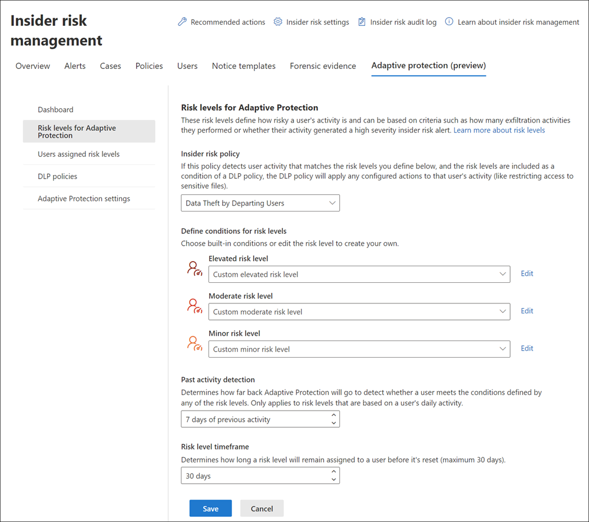
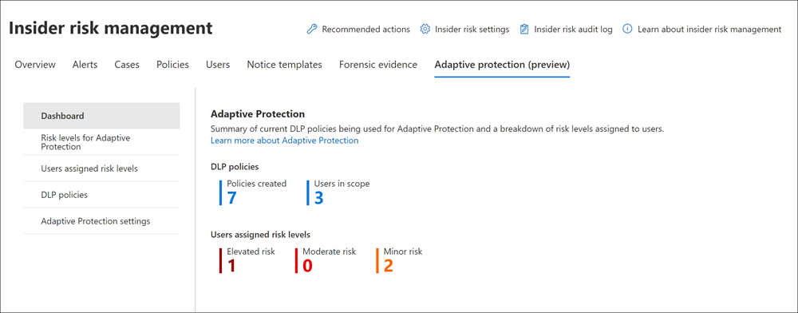
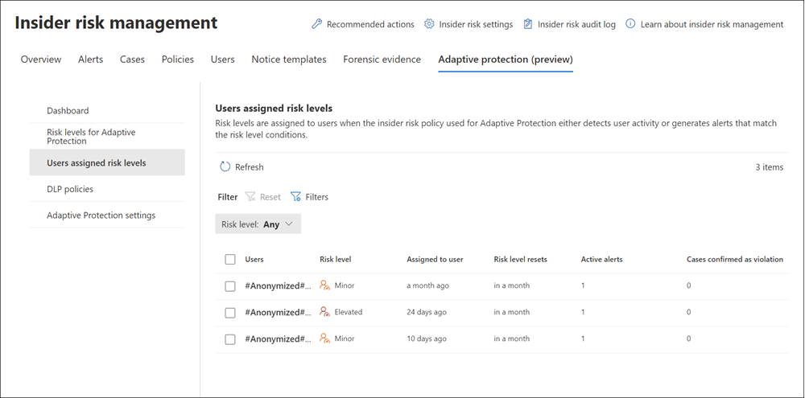
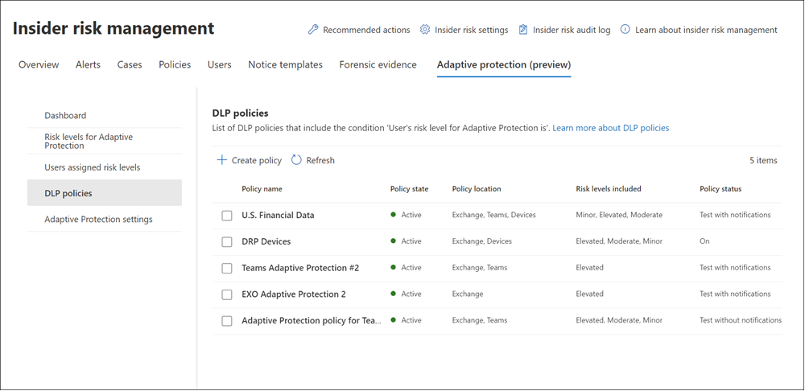

# Help dynamically mitigate risks with Adaptive Protection (preview)

>[!IMPORTANT]
>Microsoft Purview Insider Risk Management correlates various signals to identify potential malicious or inadvertent insider risks, such as IP theft, data leakage and security violations. Insider risk management enables customers to create policies to manage security and compliance. Built with privacy by design, users are pseudonymized by default, and role-based access controls and audit logs are in place to help ensure user-level privacy.

Adaptive Protection in Microsoft Purview uses machine learning to identify and mitigate the most critical risks with the most effective [data loss prevention (DLP)](/microsoft-365/compliance/dlp-learn-about-dlp) protection controls dynamically, saving security teams valuable time while ensuring better data security. Adaptive Protection helps increase risk mitigation by extending and managing preventative options associated with detected risky action to the capabilities provided by DLP policies.

Adaptive Protection helps mitigate these potential risks by using:

- **Context-aware detection**. Helps identify the most critical risks with ML-driven analysis of both content and user activities.
- **Dynamic controls**. Helps enforce effective controls on high-risk users while others maintain productivity.
- **Automated mitigation**. Helps to minimize the impact of potential data security incidents and reduce admin overhead.

Adaptive Protection dynamically assigns appropriate DLP policies to users based on the risk levels defined and analyzed by the machine learning models in insider risk management. With this new capability, static DLP policies become adaptive based on user context, ensuring that the most effective policy, such as blocking data sharing, is applied only to high-risk users while low-risk users can maintain productivity. The policy controls constantly adjust, so when a user's risk level changes, an appropriate policy is dynamically applied to match the new risk level.

> [!IMPORTANT]
> Insider risk management is currently available in tenants hosted in geographical regions and countries supported by Azure service dependencies. To verify that the insider risk management solution is supported for your organization, see [Azure dependency availability by country/region](/troubleshoot/azure/general/dependency-availability-by-country).

Watch the following video for a summary of how Adaptive Protection can help identify and mitigate the most critical risks in your organization:
 
 

>[!VIDEO https://www.microsoft.com/en-us/videoplayer/embed/RE5fZuO]

[!INCLUDE [purview-preview](../includes/purview-preview.md)]

## Risk levels and preventive controls

With Adaptive Protection, your administrators can configure the risk factors or activities for customizable risk levels based on your organization's needs. The risk levels for Adaptive Protection update continuously and automatically based on the users' risk factors and insights, so when users' data security risks increase or decrease, their risk levels are adjusted accordingly. Based on the risk levels, DLP policies automatically apply the right level of preventative controls as configured by admins (such as *block*, *block with override*, or *warning*).

Depending on the insider risk management policy assigned in Adaptive Protection, different criteria (users, groups, indicators, thresholds, etc.) are used to determine applicable risk levels. Risk levels are based on user insights, not on solely on the number instances of specific user activities. Insights are a calculation of the aggregate number of activities and the severity level of these activities. 

For example, risk levels for User A wouldn't be determined by User A performing a potentially risky activity more than three times, the risk levels for User A would be determined by an insight of the aggregate number of activities and risk scores would be assigned to the activity based on the thresholds configured in the selected policy.

### Risk levels

Risk levels in Adaptive Protection define how risky a user's activity is and can be based on criteria such as how many exfiltration activities they performed or whether their activity generated a high severity insider risk alert. These risk levels have built-in risk level definitions, but these definitions can be customized as needed:

- **Elevated risk level**: The highest risk level, includes built-in definitions for users with high severity alerts, users with at least three sequence insights, each with a high severity alert for specific risk activities, or one or more confirmed high severity alerts.
- **Moderate risk level**: The medium risk level, includes built-in definitions for users with medium severity alerts or users with at least two data exfiltration activities with high severity scores.
- **Minor risk level**: The lowest risk level, includes built-in definitions for users with low severity alerts or users with at least one data exfiltration activity with a high severity score.

For a risk level to be assigned to a user, the number of insights and the severity assigned to the activity need to match the definition for the risk level. The number of activities for an insight may be a single activity or multiple activities accruing to the single insight. The number of insights are evaluated for the risk level definition, not the number of activities contained in an insight.

For example, suppose the conditions in the insider risk management policy assigned to Adaptive Protection is scoped for identifying downloads from SharePoint sites in your organization. If the policy detects that a user downloaded 10 files from a SharePoint site in a single day that are determined to be high severity, this would count as a single insight that consists of 10 activity events. In order for this activity to qualify for assigning an *Elevated risk level* to the user, two additional insights (with high severity) would be required for the user. The additional insights may or may not contain 1 or more activities.

### Customizing risk levels

Custom risk levels allow you to create risk levels based on your organization's needs. You can customize criteria that the risk level will be based on and then define conditions to control when the risk level is assigned to users.

For example, Adaptive Protection settings and DLP policies can allow users in the minor or medium risk level to receive policy tips and education on best practices of handling sensitive data, influencing positive behavior changes over time to reduce organizational data risks. For users in the elevated risk level, administrators can use the strictest protection controls, such as blocking users from saving or sharing sensitive data, to minimize the impact of potential data incidents.

#### Risk level criteria and conditions

Risk level criteria and conditions customization can be based on the following areas:

- **Alerts generated or confirmed for a user**: This option allows you to choose conditions based on the [severity level for alerts](/microsoft-365/compliance/insider-risk-management-activities#alert-status-and-severity) that are generated or confirmed for a user for the selected insider risk management policy. Conditions for alerts aren't additive and the risk level is assigned to a user if one of the conditions is met.
- **Specific user activity**: This option allows you to choose conditions for activity to detect, its severity, and the number of daily occurrences during the [past activity detection](#past-activity-detection) window (optional). Conditions for user activity are additive and the risk level is assigned to a user only if all the conditions are met.

#### Past activity detection

This risk level setting determines how many days back Adaptive Protection examines to detect whether a user meets the conditions defined by any of the risk levels. The default setting is 7 days, but you can choose between 5 and 30 days of previous activity to apply risk level conditions. This setting only applies to risk levels that are based on a user's daily activity and excludes risks levels based on alerts.

For following example illustrates how past activity detection settings and risk levels interact to determine if a user's past activity is in-scope:

- **Elevated risk level** setting: User performs at least 3 sequences, each with a high severity risk score (67 to 100)
- **Past activity detection** setting: 3 days

|**User activity**|**Activity in-scope for risk level**|
|:----------------|:-----------------------------------|
| User has 1 high severity sequence each day on Day T-3, T-2, T-1 | Yes |
| User has 3 high severity sequences on Day T-3 | Yes |
| User has 1 high severity sequence on Day T-4 and 2 high severity sequences on Day T-3 | No |

#### Risk level timeframe

This risk level setting determines how long a risk level remains assigned to a user before it's automatically reset. The default setting is 7 days, but you can choose between 5 and 30 days before resetting the risk level for a user.

Risk levels also reset for a user when:

- The associated alert for the user is dismissed
- The associated case for the user is resolved
- The risk level end date is manually expired

> [!NOTE]
> If a user is currently assigned a risk level and that user meets the criteria again for that risk level, then the risk level timeframe is extended for the defined number of days for the user.

## Permissions for Adaptive Protection

Depending on how you're using insider risk management built-in role groups and role groups for DLP, you may need to update [permissions](/microsoft-365/compliance/insider-risk-management-configure#step-1-required-enable-permissions-for-insider-risk-management) for administrators, analysts, and investigators in your organization.

To configure Adaptive Protection and update settings, users will need to be assigned to the *Insider Risk Management* or *Insider Risk Management Admins* role group. Members of the *Insider Risk Management*, *Insider Risk Management Analysts*, and *Insider Risk Management Investigators* role groups can view user details in Adaptive Protection.

To create and manage DLP policies with the Adaptive Protection condition, users will need one of the following [roles](/microsoft-365/security/office-365-security/scc-permissions) assigned:

- Compliance Administrator
- Compliance Data Administrator
- DLP Compliance Management
- Global Administrator

## Configure Adaptive Protection

Depending on the needs of your organization or where you're currently configured with insider risk management and DLP, you have two options to get started with Adaptive Protection.

### Quick setup

The quick setup option is the fastest way to get started with Adaptive Protection. With this option, you don't need any pre-existing insider risk management or DLP policies, settings, features configured. If your organization doesn't have a current subscription or license that supports insider risk management or DLP, you'll need to sign up for a [Microsoft Purview risk and compliance solutions trial](/microsoft-365/compliance/compliance-easy-trials) before starting the quick setup process.

Available on Adaptive Protection cards on the compliance portal home page and DLP overview pages, you can get started by selecting **Turn on Adaptive Protection**. You can also get started with the quick setup process by navigating to **Insider risk management** > **Adaptive Protection** > **Dashboard** and selecting **Quick setup**.

> [!NOTE]
> If you're already a [scoped admin](microsoft-365-compliance-center-permissions.md#administrative-units-preview) for Microsoft Purview, you can't turn on quick setup. 

Here's what is configured when you use the quick setup process for Adaptive Protection:

|**Area**|**Configuration**|
|:-------|:----------------|
| Insider risk settings (if not already configured) | - Privacy: Show anonymized versions of user names   - Policy timeframes: Defaults   - Policy indicators: A subset of Office indicators (you can view in insider risk management settings)   - Risk score boosters: All   - Intelligent Detections: Alert Volume = Default volume   - Analytics: On   - Admin notifications: Send notification email when first alert is generated to all |
| Insider risk settings (if already configured) | - Policy indicators: Office indicators not already configured (you can view in insider risk management settings).   - All other settings previously configured aren't updated or changed.   - Analytics: On (thresholds for triggering events in policies are the default settings determined by [Analytics recommendations](/microsoft-365/compliance/insider-risk-management-settings#analytics).) |
| A new insider risk policy | - Policy template: [Data leaks](/microsoft-365/compliance/insider-risk-management-policy-templates#data-leaks)   - Policy name: Adaptive Protection policy for Insider Risk Management   - Policy scope for users and groups: All users and groups   - Priority content: None   - Triggering events: Selected exfiltration events (you can view in insider risk management settings)   - Policy indicators: A subset of Office indicators (you can view in insider risk management settings)   - Risk score boosters: Activity is above user's usual activity for that day |
| Adaptive Protection risk levels | - Elevated risk level: Users must have at least three high severity exfiltration sequences   - Moderate risk level: Users must have at least two high severity activities (excluding some types of downloads)   - Minor risk level: Users must have at least one high severity activity (excluding some types of downloads) |
| Two new DLP policies | [Adaptive Protection policy for Endpoint DLP](/microsoft-365/compliance/dlp-adaptive-protection-learn#policy-values-for-devices-dlp-policy)    - Elevated risk level rule: Blocked   - Moderate/Minor risk level rule: Audit   - Policy starts in test mode (audit only)    [Adaptive Protection policy for Teams and Exchange DLP](/microsoft-365/compliance/dlp-adaptive-protection-learn#policy-values-for-teams-and-exchange-online-dlp-policy)    - Elevated risk level rule: Blocked   - Moderate/Minor risk level rules: Audit   - Policy starts in test mode (audit only) |
|||

Once the quick setup process is started, it may take up to 72 hours before analytics are completed, the associated insider risk management and DLP policies are created, and you can expect to see Adaptive Protection risk levels and DLP actions applied to applicable user activities. Administrators will receive a notification email once the quick setup process is completed.

### Custom setup

The custom setup option allows you customize the insider risk management policy, the risk levels, and the DLP policies configured for Adaptive Protection. This option also allows you to configure these items before actually enabling the Adaptive Protection connections between insider risk management and DLP. In most cases, this option should be used by organizations that already have insider risk management and/or DLP policies in place.

Complete the following steps to configure Adaptive Protection using the custom setup:

#### Step 1: Create insider risk management policy

Risk levels are assigned to users when a policy assigned in Adaptive Protection either detects user activity or generates alerts that match the risk level conditions you define in the next step. If you don't want to use an existing insider risk management policy (selected in Step 2), you must create a new insider risk management policy. Your insider risk management policy for Adaptive Protection should include:

- **Users whose activity you want to detect**. This can be all users and groups in your organization or just a subset for specific risk mitigation scenarios or testing purposes.
- **Activities you consider risky and custom thresholds that influence an activity's risk score**. Risky activities might include emailing people outside your organization or copying files to USB devices.

Select **Create insider risk policy** to launch the new policy wizard. The [Data leaks](/microsoft-365/compliance/insider-risk-management-policy-templates#data-leaks) policy template is automatically selected in the wizard, but you can select any policy template if needed.

>[!IMPORTANT]
>Depending on the policy template selected, you may need to configure [additional settings](/microsoft-365/compliance/insider-risk-management-configure#step-4-recommended-configure-prerequisites-for-policies) for the policy to properly detect potentially risky activities and to create applicable alerts

#### Step 2: Configure risk level settings

Select the **Risk levels for Adaptive Protection** tab. You'll start by selecting the insider risk management policy you want to use for Adaptive Protection. This can either be the new policy you created in Step 1 or an existing policy you've already configured.

Next, you'll accept the applicable built-in risk level conditions or create your own. Depending on the type of policy you've selected, the risk level conditions will reflect the applicable conditions associated with indicators and activities you've configured in the policy.

For example, if you've chosen a policy based on the [Data leaks](/microsoft-365/compliance/insider-risk-management-policy-templates#data-leaks) policy template, the built-in risk level condition choices will apply to indicators and activities available in that policy. If you've selected a policy based on the [Security policy violations](/microsoft-365/compliance/insider-risk-management-policy-templates#security-policy-violations-preview) policy template, the built-in risk level conditions are automatically scoped to indicators and activities available in that policy.

To customize a risk level for your policy, complete the following steps:

1. On the **Risk levels for Adaptive Protection** tab, select **Edit** for the risk level you'd like to customize (*Elevated*, *Moderate*, or *Minor*).
2. On the **Custom risk level** pane, select an option in the **Risk level based on** section:

    - **Alert generated or confirmed for a user**
    - **Specific user activity**

3. If you've selected the **Alert generated or confirmed for a user** option, you'll choose the severity levels for alerts that are generated or confirmed for a user that should use this risk level. You can keep the *Severity for generated alerts* and the *Severity for confirmed alerts* conditions or remove one of these conditions if you only want to use one. If you need to add one of these conditions back, select **Add condition** and select the condition. For each condition, choose the severity level that should be applied for the condition (*High*, *Medium*, or *Low*). If the **any** of the conditions are met, the risk level is assigned to a user.
4. If you've selected the **Specific user activity** option, you'll choose the activity to detect, its severity, and number of daily occurrences during the past activity detection window. You must configure the *Activities*, *Activity severity*, and *Activity occurrences during detection window* conditions for this risk level.

    For the *Activities* condition, the options you can choose from are automatically updated for the types of activities you've defined with the indicators configured in the associated policy. If needed, select the **Assign this risk level to any user who has a future alert confirmed, even if conditions above aren't met** checkbox. If the **all** of the conditions are met, the risk level is assigned to a user.

    For the *Activity severity* condition, you'll specify the severity level for the activities included in the daily activity insight. The options are *High*, *Medium*, and *Low*, and are based on risk score ranges.

    For the *Activity occurrences during detection window* condition, you'll specify number of times selected activities must be detected within the specified *Past activity detection* period. This number isn't related to the number of events that might occur for an activity. For example, if the policy detects that a user downloaded 20 files from SharePoint in one day that counts as one daily activity insight consisting of 20 events.

5. Select **Confirm** to apply the custom risk level conditions or **Cancel** to discard your changes.

#### Step 3: Create or edit a DLP policy

Next you'll create (or edit) an existing DLP policy to restrict actions for users who match your risk level conditions in Adaptive Protection. Use the following guidelines for your DLP policy configuration:

- You must include the *User's risk level for Adaptive Protection is* condition in your DLP policy. This DLP policy can include other conditions as needed.
- Although you can include other locations in the DLP policy, Adaptive Protection currently supports only Exchange, Microsoft Teams, and devices.

Select **Create DLP policy** to launch the DLP policy wizard to create a new DLP policy. If you have an existing DLP policy that you'd like to configure for Adaptive Protection, go to **Data loss prevention** > **Policies** in the compliance portal and select the DLP policy you'd like to update for Adaptive Protection. For guidance on how to configure a new DLP policy or update an existing DLP policy for Adaptive Protection, see [Learn about Adaptive Protection in data loss prevention: Manual configuration](/microsoft-365/compliance/dlp-adaptive-protection-learn#policy-values-for-devices-dlp-policy).

>[!TIP]
>We recommend testing the DLP policy (with policy tips) so you can review DLP alerts to verify that the policy is working as expected before enabling AP.

#### Step 4: Turn on adaptive protection

After you've completed all three of the previous steps, you're ready to enable Adaptive Protection. When you turn on Adaptive Protection:

- The insider risk management policy starts looking for user activity matching your risk level conditions. If detected, the risk levels are assigned to users.
- Users who are assigned risk levels will appear on the **Users in scope** tab in Adaptive Protection.
- The DLP policy applies protection actions for any user assigned to risk levels included in the DLP policy.
- The DLP policy is added to the **DLP policies** tab in **Adaptive Protection (preview)**. You can view details about the DLP policy and edit policy conditions from the dashboard.

To enable Adaptive Protection, select the **Adaptive Protection settings** tab and toggle **Enable Adaptive Protection** to *On*. It may take up to 36 hours before you can expect to see Adaptive Protection risk levels and DLP actions applied to applicable user activities.

Watch the following video on the Microsoft Mechanics channel to [see how Adaptive Protection can automatically adjust the strength of data protection based on calculated data security risk levels of users](https://youtu.be/9GLsxvtoLWE).

## Manage Adaptive Protection

Once you've enabled Adaptive Protection and your insider risk management and DLP policies are configured, you'll have access to information about policy metrics, current in-scope users, and risk levels currently in-scope.

### Dashboard

After you've completed either the [Quick](#quick-setup) or [Custom](#custom-setup) setup process, the **Dashboard** tab in **Adaptive Protection (preview)** displays widgets for summary information about DLP policies and user risk levels:

- **DLP policies**: Displays the number of DLP policies configured for Adaptive Protection and the number of users currently in-scope for the DLP policies.
- **Users assigned risk levels**: Displays the number of users for each risk level (*Elevated risk*, *Moderate risk*, and *Minor risk*).

### Users assigned risk levels

Users that have been assigned a risk level in Adaptive Protection will appear on the **Users assigned risk levels** tab. You can review the following information for each user:

- **Users**: Lists the user name, unless the [Show anonymized versions of usernames](/microsoft-365/compliance/insider-risk-management-settings#privacy) option is selected in insider risk management settings for your organization. if this option is selected, you'll see anonymized user names.

    >[!IMPORTANT]
    >To maintain referential integrity, anonymization of usernames (if turned on) isn't preserved for users from Adaptive Protection who have alerts or activity appear outside insider risk management. Actual usernames will appear in related DLP alerts and the activity explorer.

- **Risk level**: The current risk level assigned to the user.
- **Assigned to user**: The number of days or months that have passed since the user was assigned a risk level.
- **Risk level resets**: The number of days until the risk level is automatically reset for the user. 

    To manually reset the risk level for a user, select the user, and then select **Expire**. This user will no longer be assigned a risk level. Existing alerts or cases for this user won't be removed. If this user is included in the selected insider risk management policy, a risk level will be assigned again if a triggering event is detected.
- **Active alerts**: The number of current insider risk management alerts for the user.
- **Cases confirmed as violation**: The number of confirmed cases for the user.
- **Case**: The name of the case.

If needed, you can filter users by *Risk level*.

To view detailed insider risk and Adaptive Protection information for a specific user, select the user to open the user details pane. The details pane contains three tabs, **User profile**, **User activity**, and **Adaptive Protection summary**. For information about the **User profile** and **User activity** tabs, see [View user details](/microsoft-365/compliance/insider-risk-management-users#view-user-details).

The **Adaptive Protection summary** tab aggregates information in three sections:

- **Adaptive Protection**: This section displays information about the current *Risk level*, *Risk level assigned on*, and *Risk level reset on* for the user.
- **DLP policies in scope (dynamic)**: This section displays all the DLP policies currently in scope for the user and the start and end date for the policy. This is based on the risk level for the user and DLP policy configuration for risk levels. For example, if a user has activities that have been defined as *Elevated* risk levels for insider risk management policies, and two DLP policies are configured with the *Elevated* risk level condition, these two DLP policies will be displayed here for the user.
- **Insider risk policy for Adaptive Protection**: This section displays any insider risk management policy where the user is currently in-scope.

### DLP policies

The **DLP policies** page displays all DLP policies that are using the **User's risk level for adaptive protection is** condition. You can review the following information for each policy:

- **Policy name**: The name of the DLP policy.
- **Policy state**: The current state of the policy. Values are *Active* or *Inactive*.
- **Policy location**: The [locations](/microsoft-365/compliance/dlp-policy-reference#locations) included in the DLP policy. Currently, Adaptive Protection only supports Exchange, Teams, and Devices.
- **Risk levels included**: The risk levels included in the DLP policy using the **User's risk level for adaptive protection is** condition. The options are *Elevated*, *Moderate*, or *Minor* risk levels.
- **Policy status**: The current status of the DLP policy. The options are *On* or *Test with notifications*.
- **Created**: The date the DLP policy was created.
- **Last modified**: The date the DLP policy was last edited.

## Disable Adaptive Protection

There may be certain scenarios when you might need to disable Adaptive Protection temporarily. To disable Adaptive Protection, select the **Adaptive Protection settings** tab and toggle **Enable Adaptive Protection** to *Off*.

If Adaptive Protection is turned off after having been on and active, risk levels will stop being assigned to users and shared with DLP and all existing risk levels for users will be reset. After turning off, might take up to 6 hours to stop assigning risk levels to user activity and reset them all. The insider risk management and DLP policies aren't automatically deleted.

