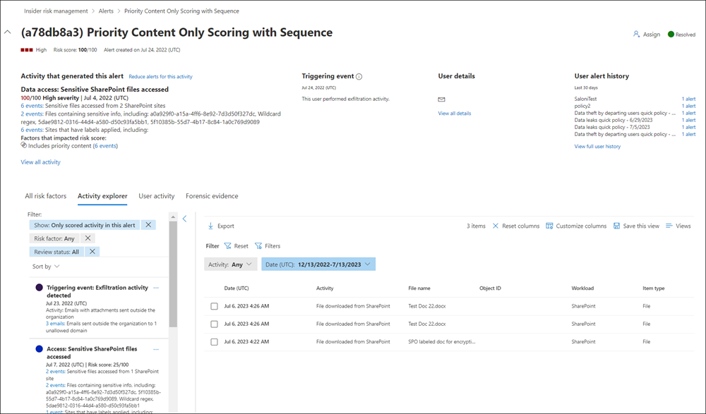

# Insider risk management alerts

Insider risk management alerts are automatically generated by risk indicators defined in insider risk management policies. These alerts give compliance analysts and investigators an all-up view of the current risk status and allow your organization to triage and take actions for discovered risks. By default, policies generate a certain amount of low, medium, and high severity alerts, but you can [increase or decrease the alert volume](insider-risk-management-settings.md#alert-volume) to suit your needs. Additionally, you can configure the [alert threshold for policy indicators](insider-risk-management-settings.md#indicator-level-settings-preview) when creating a new policy with the policy wizard.

Check out the [Insider Risk Management Alerts Triage Experience video](https://www.youtube.com/watch?v=KgmpxBLJLPI) for an overview of how alerts provide details, context, and related content for risky activity and how to make your investigation process more effective.

## Alert dashboard

The insider risk **Alert dashboard** allows you to view and act on alerts generated by insider risk policies. Each report widget displays information for last 30 days.

- **Total alerts that need review**: The total number of alerts needing review and triage are listed, including a breakdown by alert severity.
- **Open alerts over past 30 days**: The total number of alerts created by policy matches over the last 30 days, sorted by high, medium, and low alert severity levels.
- **Average time to resolve alerts**: A summary of useful alert statistics:
    - Average time to resolve high severity alerts, listed in hours, days, or months.
    - Average time to resolve medium severity alerts, listed in hours, days, or months.
    - Average time to resolve low severity alerts, listed in hours, days, or months.

>[!NOTE]
>Insider risk management uses built-in alert throttling to help protect and optimize your risk investigation and review experience. This throttling guards against issues that might result in an overload of policy alerts, such as misconfigured data connectors or DLP policies. As a result, there might be a delay in displaying new alerts for a user.

## Alert status and severity

You can triage alerts into one of the following statuses:

- **Confirmed**: An alert confirmed and assigned to a new or existing case.
- **Dismissed**: An alert dismissed as benign in the triage process.
- **Needs review**: A new alert where triage actions have not yet been taken.
- **Resolved**: An alert that is part of a closed and resolved case.

Alert risk scores are automatically calculated from several risk activity indicators. These indicators include the type of risk activity, the number and frequency of the activity occurrence, the history of user risk activity, and the addition of activity risks that may boost the seriousness of the activity. The alert risk score drives the programmatic assignment of a risk severity level for each alert and cannot be customized. If alerts remain untriaged and risk activities continue to accrue to the alert, the risk severity level can increase. Risk analysts and investigators can use the alert risk severity to help triage alerts in accordance with your organization's risk policies and standards.

Alert risk severity levels are:

- **High severity**: The activities and indicators for the alert pose significant risk. The associated risk activities are serious, repetitive, and corelate strongly to other significant risk factors.
- **Medium severity**: The activities and indicators for the alert pose a moderate risk. The associated risk activities are moderate, frequent, and have some correlation to other risk factors.
- **Low severity**: The activities and indicators for the alert pose a minor risk. The associated risk activities are minor, more infrequent, and do not corelate to other significant risk factors.

## Filter alerts on the Alert dashboard

Depending on the number and type of active insider risk management policies in your organization, reviewing a large queue of alerts can be challenging. Using alert filters can help analysts and investigators sort alerts by several attributes. To filter alerts on the **Alerts dashboard**, select the **Filter** control. You can filter alerts by one or more attributes:

- **Status**: Select one or more status values to filter the alert list. The options are *Confirmed*, *Dismissed*, *Needs review*, and *Resolved*.
- **Severity**: Select one or more alert risk severity levels to filter the alert list. The options are *High*, *Medium*, and *Low*.
- **Time detected**: Select the start and end dates for when the alert was created.
- **Policy**: Select one or more policies to filter the alerts generated by the selected policies.

## Search alerts on the Alert dashboard

To search the alert name for a specific word, select the **Search** control and type the word to search. The search results display any policy alert containing the word defined in the search.

## Triage alerts

To triage an insider risk alert, complete the following steps:

1. In the [Microsoft 365 compliance center](https://compliance.microsoft.com), go to **Insider risk management** and select the **Alerts** tab.
2. On the **Alerts dashboard**, select the alert you want to triage.
3. On the **Alerts detail pane**, you can review the following tabs and triage the alert:
    - **Summary**: This tab contains general information about the alert and allows you to confirm the alert and create a new case or allows you to dismiss the alert. It includes the current status for the alert and the alert risk severity level, listed as *High*, *Medium*, or *Low*. The severity level may increase or decrease over time if the alert is not triaged.
        - **What happened (preview)**: Displays the top three risk activities and policy matches during the activity evaluation period, including the type of violation associated with the activity and the number of occurrences.
        - **User details**: Displays general information about the user assigned to the alert. If anonymization is enabled, the username, email address, alias, and organization fields are anonymized.
        - **Alert details**: Includes the length of time since the alert was generated, the policies that generated the alert are listed, and the case generated from the alert is listed. For new alerts, the **Case** field displays None.
        - **Content detected (preview)**: Includes content associated with the risk activities for the alert and summarizes activity events by key areas. Selecting an activity link opens the Activity explorer and displays additional details about the activity.
    - **User activity**: This tab displays the activity history for the user associated with the alert. This history includes other alerts and activities related to risk indicators defined in the template assigned to the policy for this alert. This history allows risk analysts and investigators to factor in any past risky behavior for the employee as part of the triage process.
    - **Actions**: The following actions are available for each alert:
        - **Open expanded view**: Opens the **Activity explorer** dashboard.
        - **Confirm and create case**: Use this action to confirm and create a new case for all the alerts associated with a user. This action automatically changes the alert status to *Confirmed*.
        - **Dismiss alert**: Use this action to dismiss the alert. This action changes the alert status to *Resolved*.

## Activity explorer (preview)

>[!NOTE]
>Activity explorer is available in the alert management area for users with triggering events after this feature is available in your organization.

The Activity explorer provides risk investigators and analysts with a comprehensive analytic tool that provides detailed information about alerts. With the Activity explorer, reviewers can quickly review a timeline of detected risky activity and identify and filter all risk activities associated with alerts. To filter alerts on the Activity explorer, select the Filter control. You can filter alerts by one or more attributes listed in the details pane for the alert. Activity explorer also supports customizable columns to help investigators and analysts focus the dashboard on the information most important to them.

To use the **Activity explorer**, complete the following steps:

1. In the Microsoft 365 compliance center, go to **Insider risk management** and select the **Alerts** tab.
2. On the **Alerts dashboard**, select the alert you want to triage.
3. On the **Alerts detail pane**, select **Open expanded view**.
4. On the page for the selected alert, select the **Activity explorer** tab.

When reviewing activities in the Activity explorer, investigators and analysts can select a specific activity and open the activity details pane. The pane displays detailed information about the activity that investigators and analysts can use during the alert triage process. The detailed information may provide context for the alert and assist with identifying the full scope of the risk activity that triggered the alert.

## Create a case for an alert

As alert is reviewed and triaged, you can create a new case to further investigate the risk activity. To create a case for an alert, follow these steps:

1. In the [Microsoft 365 compliance center](https://compliance.microsoft.com), go to **Insider risk management** and select the **Alerts** tab.
2. On the **Alerts dashboard**, select the alert you want to confirm and create a new case for.
3. On the **Alerts details pane**, select **Actions** > **Confirm alerts & create case**.
4. On the **Confirm alert and create insider risk case** dialog, enter a name for the case, select users to add as contributors, and add comments as applicable. Comments are automatically added to the case as a case note.
5. Select **Create case** to create a new case or select **Cancel** to close the dialog without creating a case.

After the case is created, investigators and analysts can manage and act on the case. See the [Insider risk management case](insider-risk-management-cases.md) article for more details.
