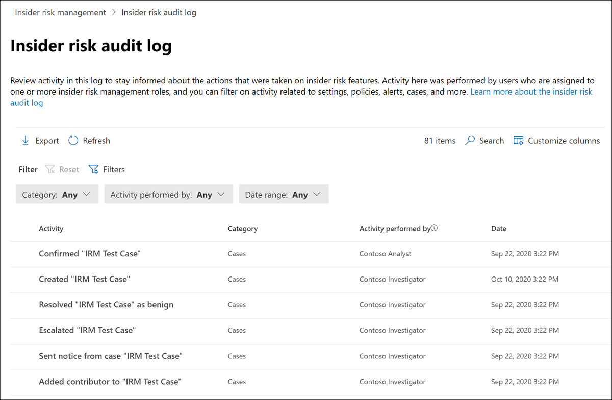

# Insider risk management audit log

The insider risk management audit log enables you to stay informed on the actions that were taken on insider risk management features. This log allows independent review of the actions taken by users assigned to one or more insider risk management role groups. The insider risk management audit log is automatically enabled in your organization and cannot be disabled.

The audit log is automatically and immediately updated whenever monitored activities occur and the log retains information about the activity for 180 days (about six months). After 180 days, the data for the activity is permanently deleted from the log.

Areas included in activity monitoring include:

- Policies
- Cases
- Alerts
- Settings
- Users
- Notice templates

To view and export data from the audit log, users must be assigned to the *Insider Risk Management* or *Insider Risk Management Auditors* role groups. To learn more about insider risk management role groups, see [Getting started with insider risk management Step 1: Enabling permissions](insider-risk-management-configure.md#step-1-enable-permissions-for-insider-risk-management).

>[!NOTE]
>The insider risk management audit log isn't associated with the Microsoft 365 audit log, they are independent auditing systems and capture information on separate activities. Disabling Microsoft 365 auditing doesn't impact activity auditing within insider risk management.

## View activity in the insider risk audit log

To view feature activity monitored for insider risk management, navigate to, and select the **Insider risk audit log** link in the top-right area of any insider risk management tab. By default, you'll see the following information displayed for insider risk management activities:

- **Activity:** A description of the activity taken within the insider risk management solution by a user.
- **Category:** The area or item where the activity was performed. For example, you'll see *Policies* as the category when policy change activities were performed.
- **Activity performed by:** The user name of the user that performed the activity.
- **Date:** The date and time the activity was performed. The date and time are the local date and time for your organization.

For more information about a logged activity, select the activity to display the activity details pane. This pane includes additional information about the activity.

## Columns and filtering

To make it easier for auditors to review logged activity, filtering is supported in the **Insider risk audit log**. For basic filtering, queue columns are available to add to the view to provide different pivots on the files and messages. You can filter activities by the **Category, Date range,** and **Activity performed by** fields.

To add or remove column headings for the activity queue, use the **Customize columns** control and select from the column options. These columns map to common conditions supported in the **Insider risk audit log** and are listed later in this article.

## Audit log export

Users assigned to the *Insider Risk Management* or *Insider Risk Management Auditors* role groups can export all activity in the audit log to a .csv (comma-separated values) file by selecting **Export** on the **Insider risk audit log** page. Depending on the activity, some fields for an activity may not be applicable to the activity and these fields will appear as blank in the exported file.

The file contains activity information for the following fields:

- **Activity performed by:** The user name of the user modifying an item value. Users listed here were assigned to one or more of the following role [insider risk management role groups](insider-risk-management-configure.md#step-1-enable-permissions-for-insider-risk-management): *Insider Risk Management*, *Insider Risk Management Admins*, *Insider Risk Management Analysts*, *Insider Risk Management Investigators*. Each role group has different permission levels for managing insider risk features.
- **Activity:** The activity taken on an item. Values are *Viewed, Deleted, Added, Edited policy, Case, User, Alert,* and *Settings.*
- **Added**: Objects that were added during the activity, such as users, file types, or domains.
- **Alert volume**: The level of alert volume defined in insider risk management settings.
- **Amount**: The currently selected custom indicator amounts for a policy.
- **Asset ID**: The asset ID of the priority physical asset the activity was performed on.
- **Category:** The category of the item modified. Values are *Policies, Cases, Users, Alerts, Settings,* and *Notice templates.*
- **Date:** Date and time, listed in your organization's local date and time.
- **Description**: The description input by the user for the object being acted on (such as a policy or a priority user group).
- **DLP policy**: The data loss prevention (DLP) policy selected to trigger inclusion in an insider risk management policy.
- **Indicator**: The indicator in the within insider risk settings that the activity was performed on (such as adding or removing an indicator).
- **Notice template**: The notice template the activity was performed on.
- **Number of days**: The policy activation window defined in insider risk settings.
- **Number of files**: The file volume limit defined in insider risk management settings.
- **Policy template**: The policy template that the indicators acted on belongs to.
- **Previous amount**: The previously selected custom indicator amounts for a policy.
- **Priority user group**: The priority user group the activity was performed on.
- **Removed**: Objects that were removed during the activity, such as users, file types, or domains.
- **Sender**: The sender field of the notice template the activity was performed on.
- **Target policy**: The policy the activity was performed on (such as adding a user to or removing a user from).
- **Template message body**: The message body of the notice template the activity was performed on.
- **Template subject**: The subject field of the notice template the activity was performed on.
- **User:** User the activity was performed on.
