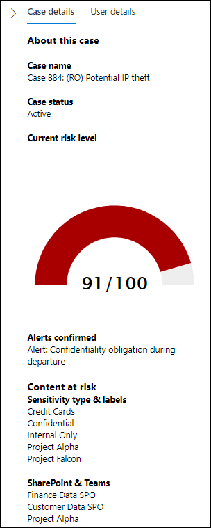
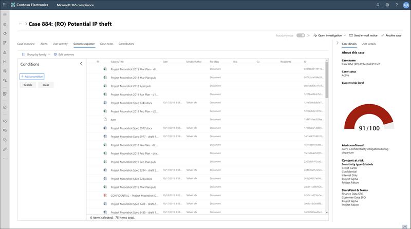

# Insider risk management cases (preview)

Cases are the heart of insider risk management and allow you to deeply investigate and take action on issues generated by risk signals defined in your policies. Cases are manually created from alerts in the situations where further action is needed to address a compliance-related issue for an employee. Each case is scoped to a single employee and multiple alerts for the employee can be added to an existing case or to a new case. After investigating the details of a case, you can take action by sending the employee a notice, resolving the case as benign, or escalating to a data or employee investigation.

## Case dashboard

The insider risk management case dashboard allows you to view and take action on cases. Each report widget on the dashboard displays information for last 30 days.

- **Active cases**: The total number of active cases under investigation.
- **Cases over time**: The total number of cases created, sorted by *Active* and *Closed* status.
- **Statistics**: A summary of useful case statistics:
    - Average time of active cases, listed in hours, days, or months.
    - OTHER CASE STATISTICS?

The case queue lists all active and closed cases for your organization, in addition to the current state of the following case attributes:

- **Case name**: The name of the case, defined when an alert is confirmed and the case is created.  
- **Status**: The status of the case, either *Active* or *Closed*.
- **User**: The employee for the case, either the employee name or a pseudonymized alias.
- **Time case opened**: The time that has passed since the case was opened.
- **Total policy violation alerts**: The number of policy matches included in the case. This number may increase if new alerts are added to the case.
- **Last updated**: The time that has passed since there has been an added case note or change in the case state.
- **Last updated by**: The name of the insider risk management analyst or investigator that last updated the case.

Use the search control to search case names for specific text and use the case filter to sort cases by the following attributes:

- Status
- Time case opened, start date, and end date
- Last updated, start date, and end date

## Investigate a case

Deeper investigation into insider risk management alerts is critical to taking proper corrective actions. Insider risk management cases are the central management tool to dive deeper into employee risk activity history and alert details, and to explore the content and messages exposed to risks. Risk analysts and investigators also use cases to centralize review feedback and notes and to process case resolution. Selecting a case opens the case management tools and allows analysts and investigators to dig into the details of cases.

### Case overview

The **Case overview** tab summarizes the alert activity and risk level history for the case. The **Alerts** widget shows the policy matches for the case, including the status of the alert, the alert risk severity, and when the alert was detected. The **Risk level history** chart displays the user risk level over the last 30 days. The line chart allows analysts and investigators to quickly see the trend in overall user risk over time. The **Risk activity content** widget summarizes the types of data and content contained in alerts added to the case. This widget gives an all-up view of the entire data and content set at risk in the case.

The **Case details** pane is available on all case management tabs and summarizes the case details for risk analysts and investigators. It includes the following areas:

- **Case name**: The name of the case, prefixed with an autogenerated case sequence number and the name of the risk associated with the policy template that the first confirmed alert matches. 
- **Case status**: The current status of the case, either *Active* or *Closed*.
- **Current user risk level**: The current calculated risk level of the user for the case. This score is calculated every 24 hours and uses the alert risk scores from all active alerts associated to the user.
- **Alerts confirmed**: List of alerts for the user confirmed for the case. 
- **Content at risk**: List of content, sorted by content sources and types. For example, for case alert content in SharePoint Online and Microsoft Teams, you may see channel, project, folder, or file names listed that are associated with the risk activity for alerts in the case.

### Alerts

The **Alerts** tab summarizes the current alerts included in the case. New alerts may be added to an existing case and they will be added to the **Policy match alert** queue as they are assigned. The following alert attributes are listed the queue:

- Status
- Alert risk severity
- Time detected

Select an alert from the queue to display the **Alert detail** page.

Use the search control to search alert names for specific text and use the alert filter to sort cases by the following attributes:

- Status
- Risk severity
- Time detected, start date, and end date

### User activity

The **User activity** tab is one of the most powerful tools for internal risk analysis and investigation for cases in the insider risk management solution. This tab is structured to enable quick review of a case, including a historical timeline of all alerts, all alerts details, the current risk score for the user in the case, and controls to take effective action to contain the risks in the case.

1. **Date and window time filters**: By default, the last six months of alerts confirmed in the case are displayed in the User activity chart. You can easily filter the chart view with either the slider controls at both ends of the chart window, or by defining specific start and end dates in the chart filter control.
2. **Risk alert activity and details**: Risk activities are visually displayed as colored bubbles in the User activity chart. Bubbles are created for different categories of risk and bubble size is proportional to the number of risk activities for the category. Select a bubble to display the details for each risk activity. Details include:
    - **Date** of the risk activity.
    - The **risk activity category**. For example, *Email(s) with attachments sent outside the organization* or *File(s) downloaded from SharePoint Online*.
    - **Risk score** for the alert. This score is the numerical score for the alert risk severity level.
    - Number of **files** or **emails** associated with the alert. Links to each file or email associated with the risk activity is also available.
3. **Risk activity legend**: Across the bottom of the user activity chart, a color-coded legend helps you quickly determine risk category for each alert.
4. **Risk activity chronology**: The full chronology of all risk alerts associated with the case are listed, including all the details available in the corresponding alert bubble.
5. **Case actions**: Options for resolving the case are on the case action toolbar. You can resolve a case, send an email notice to the employee, or escalate the case for a data or employee investigation.
6. **Case export**: You can export all alerts and alert details to a CSV for a case.

### Content explorer

The **Content explorer** tab allows risk analysts and investigators to review copies of all individual files and email messages associated with risk alerts. For example, if an alert is created when an employee downloads hundreds of files from SharePoint Online to a USB device and the activity triggers a policy alert, all the downloaded files for the alert are captured and copied to the insider risk management case from original storage sources.

The content explorer is a powerful tool with basic and advanced search and filtering features. To learn more about using the content explorer, see [Insider risk management content explorer](insider-risk-management-content-explorer.md).

### Case notes

The **Case notes** tab in the case is where risk analysts and investigators share comments, feedback, and insights about their work for the case. Notes are permanent additions to a case and cannot be edited or deleted after the note is saved. When a case is created from an alert, the comments entered in the **Confirm alert and create insider risk case** dialog are automatically added as a case note.

The case notes dashboard displays notes by the user that created the note and the time that has passed since the note was saved. To search the case note text field for a specific keyword, use the **Search** button on the case dashboard and enter a specific keyword.

To add a note to a case:

1. In the [Microsoft 365 compliance center](https://compliance.microsoft.com), go to **Insider risk management** and select the **Cases** tab.
2. Select a case, then select the **Case notes** tab.
3. Select **Add a case note**
4. On the **Add case note** dialog, type your note for the case. Select **Save** to add the note to the case or select **Cancel** close without saving the note to the case.

### Contributors

The **Contributors** tab in the case is where risk analysts and investigators can add other reviewers to the case. Be default, all users assigned the **Insider Risk Management Analysts** and **Insider Risk Management Investigators** roles are listed as contributors for each active and closed case.

All insider risk management cases must be managed with appropriate access controls in place to maintain confidentiality and integrity of the investigation. To help maintain access control of cases, users are assigned one of two types of access to cases:

- **Permanent access**: Permanent access is automatically granted to users with the **Insider Risk Management Analysts** and **Insider Risk Management Investigators** roles when the case is created from an alert. Permanent access grants full control of the case for the lifetime of the case and grants the ability to add other case contributors.
- **Temporary access**: Temporary access is only granted to users by contributors that have permanent access for the case. Typically, this access level is granted to user that needs to add notes to a case. Contributors with temporary access have all case management control except:
    - Permission to confirm or dismiss alerts
    - Permission to edit the contributors for cases
    - Permission to view files and messages in the Content Explorer

To add a contributor to a case:

1. In the [Microsoft 365 compliance center](https://compliance.microsoft.com), go to **Insider risk management** and select the **Cases** tab.
2. Select a case, then select the **Contributors** tab.
3. Select **Add contributor**.
4. On the **Add contributor** dialog, start typing the name of the user you want to add and then select the user from the suggested user list. This list is generated from the Azure Active Directory of your tenant subscription.
5. On the **Add contributor** dialog, select the access level for the contributor. You can select **Permanent** or **Temporary**.
6. Select **Add** to add the user as a contributor or select **Cancel** close the dialog without adding the user as a contributor.

## Case actions

Risk analysts and investigators can take action on a case in one of several methods, depending on the severity of the case, the history of risk of the employee, and the risk guidelines of your organization. In some situations, you may need to escalate a case to an employee or data investigation to collaborate with other areas of your organization and to dive deeper into risk activities. Insider risk management is tightly integrated with other Microsoft 365 compliance features to help you with end-to-end resolution management.

### Send a notice

In most cases, employee actions that create policy match alerts are inadvertent or accidental. Sending a reminder notice to the employee via email is an effective method for documenting case review and action, as well as a method to remind employees of corporate policies or point them to refresher training. Notices are generated from [notice templates that you create](insider-risk-management-notices.md) for your insider risk management infrastructure.

It's important to remember that sending a notice to an employee ***does not*** resolve the case as *Closed*. In some cases, you may want to leave a case open after sending a notice to monitor for additional risk activities by the same employee without opening a new case. If you want to resolve a case after sending a notice, you must select the **Resolve case** as a follow-on step after sending a notice.

To send a notice to the employee assigned to a case:

1. In the [Microsoft 365 compliance center](https://compliance.microsoft.com), go to **Insider risk management** and select the **Cases** tab.
2. Select a case, then select the **Send e-mail notice** button on the case action toolbar.
3. On the **Send e-mail notice** dialog, select the **Choose a notice template** dropdown control to select the notice template for the notice. This selection pre-fills the other fields on the notice.
4. Review the notice fields and update any field that needs changes.
5. Select **Send** to send the notice to the employee or select **Cancel** close the dialog without sending the notice to the employee. All sent notices are added to the case notes queue on the **Case notes** dashboard.

### Escalate for data investigation

Escalate the case for data investigation in situations where you need to address data spillage activities. Data investigations allow you to search for sensitive, malicious, or misplaced data across Microsoft 365 and to take appropriate action to remediate the data spillage. Creating a new data investigation from an insider risk management case automatically copies all alert activities in the data investigation case and allows reviewers to properly evaluate the extent and impact of any data spillage. To learn more about data investigation cases, see [Overview of data investigations in Microsoft 365](overview-data-investigations.md).

To escalate a case to a data investigation:

1. In the [Microsoft 365 compliance center](https://compliance.microsoft.com), go to **Insider risk management** and select the **Cases** tab.
2. Select a case, then select the **Open investigation** button on the case action toolbar.
3. Select **Escalate for data investigation**.
4. On the **Escalate for data investigation** dialog, enter a name for the new data investigation. If needed, enter notes about the case and select **Escalate**.
5. Select **Confirm** to create the data investigation case or select **Cancel** to close the dialog without creating a new data investigation case.

After the insider risk management case has been escalated to a new data investigation case, you can review the new case in the **Data investigations** area on the Microsoft 365 compliance center.

### Escalate for employee investigation

Escalate the case for employee investigation in situations where additional legal review is needed for the employee's risk activity. This escalation opens a new Advanced eDiscovery case in your Microsoft 365 organization. Advanced eDiscovery provides an end-to-end workflow to preserve, collect, review, analyze, and export content that's responsive to your organization's internal and external legal investigations. It also lets your legal team manage the entire legal hold notification workflow to communicate with custodians involved in a case. Assigning a reviewer as a custodian in an Advanced eDiscovery case created from an insider risk management case helps your legal team take appropriate action and manage content preservation. To learn more about Advanced eDiscovery cases, see [Overview of Advanced eDsicovery in Microsoft 365](overview-ediscovery-20.md).

To escalate a case to an employee investigation:

1. In the [Microsoft 365 compliance center](https://compliance.microsoft.com), go to **Insider risk management** and select the **Cases** tab.
2. Select a case, then select the **Open investigation** button on the case action toolbar.
3. Select **Escalate for employee investigation**.
4. On the **Escalate for employee investigation** dialog, enter a name for the new employee investigation. If needed, enter notes about the case and select **Escalate**.
5. Select **Confirm** to create the employee investigation case or select **Cancel** to close the dialog without creating a new employee investigation case.

After the insider risk management case has been escalated to a new employee investigation case, you can review the new case in the **eDiscovery > Advanced** area on the Microsoft 365 compliance center.

### Resolve the case

After risk analysts and investigators have completed their review and investigation, a case can be resolved to take action on all the alerts currently included in the case. Resolving a case adds a resolution classification, changes the case status to *Closed*, and the resolution action reasons are automatically added to the case notes queue on the **Case notes** dashboard. Cases are resolved as either:

- **Benign**: The classification for cases where policy match alerts are evaluated as low risk, non-serious, or false positive.
- **Confirmed policy violation**: The classification for cases where policy match alerts are evaluated as risky, serious, or the result of malicious intent.

To resolve a case:

1. In the [Microsoft 365 compliance center](https://compliance.microsoft.com), go to **Insider risk management** and select the **Cases** tab.
2. Select a case, then select the **Resolve case** button on the case action toolbar.
3. On the **Resolve case** dialog, select the **Resolve as** dropdown control to select the resolution classification for the case. The options are **Benign** or **Confirmed policy violation**.
4. On the **Resolve case** dialog, enter the reasons for the resolution classification in the **Action taken** text field.
5. Select **Resolve** to close the case or select **Cancel** close the dialog without resolving the case.
