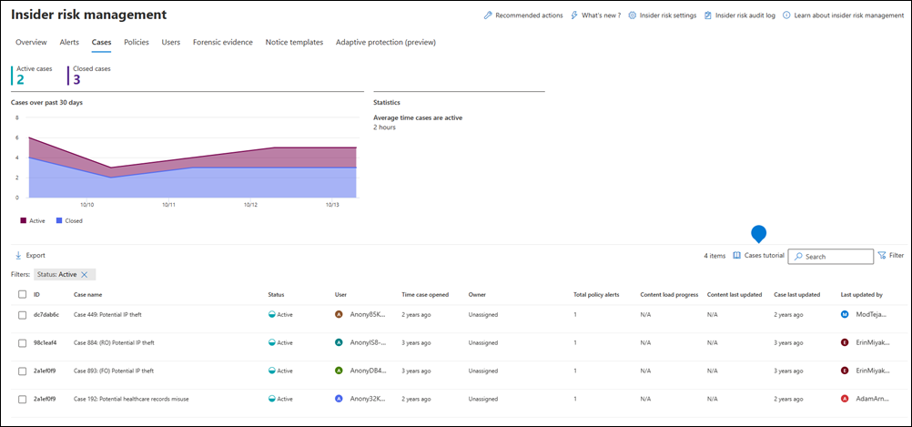
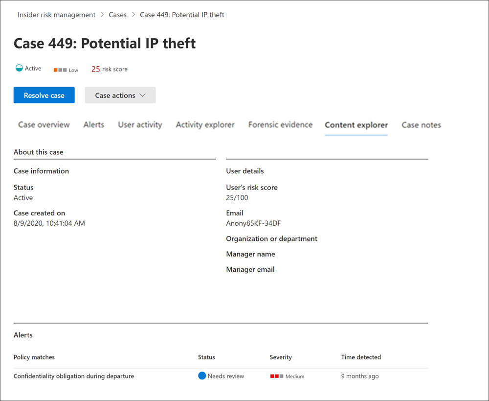

# Insider risk management cases

Cases are the heart of insider risk management and allow you to deeply investigate and act on issues generated by risk indicators defined in your policies. Cases are manually created from alerts in situations where further action is needed to address a compliance-related issue for a user. Each case is scoped to a single user and multiple alerts for the user can be added to an existing case or to a new case.

After investigating the details of a case, you can take action by:

- sending the user a notice
- resolving the case as benign
- sharing the case with your ServiceNow instance or with an email recipient
- escalating the case for an eDiscovery (Premium) investigation

Check out the [Insider Risk Management Investigation and Escalation video](https://www.youtube.com/watch?v=UONUSmkRC8s) for an overview of how cases are investigated and managed in insider risk management.

[!INCLUDE [purview-preview](../includes/purview-preview.md)]

## Cases dashboard

The insider risk management **Cases dashboard** allows you to view and act on cases. Each report widget on the dashboard displays information for last 30 days.

- **Active cases**: The total number of active cases under investigation.
- **Cases over past 30 days**: The total number of cases created, sorted by *Active* and *Closed* status.
- **Statistics**: Average time of active cases, listed in hours, days, or months.

The case queue lists all active and closed cases for your organization, in addition to the current status of the following case attributes:

- **Case name**: The name of the case, defined when an alert is confirmed and the case is created.  
- **Status**: The status of the case, either *Active* or *Closed*.
- **User**: The user for the case. If anonymization for usernames is enabled, anonymized information is displayed.
- **Time case opened**: The time that has passed since the case was opened.
- **Total policy alerts**: The number of policy matches included in the case. This number may increase if new alerts are added to the case.
- **Case last updated**: The time that has passed since there has been an added case note or change in the case state.
- **Last updated by**: The name of the insider risk management analyst or investigator that last updated the case.

Use the **Search** control to search case names for specific text and use the case filter to sort cases by the following attributes:

- Status
- Time case opened, start date, and end date
- Last updated, start date, and end date

## Filter cases

Depending on the number and type of active insider risk management policies in your organization, reviewing a large queue of cases can be challenging. Using case filters can help analysts and investigators sort cases by several attributes. To filter alerts on the **Cases dashboard**, select the **Filter** control. You can filter cases by one or more attributes:

- **Status**: Select one or more status values to filter the case list. The options are *Active* and *Closed*.
- **Time case opened**: Select the start and end dates for when the case was opened.
- **Last updated**: Select the start and end dates for when the case was updated.

## Investigate a case

Deeper investigation into insider risk management alerts is critical to taking proper corrective actions. Insider risk management cases are the central management tool to dive deeper into user risk activity history, alert details, the sequence of risk events, and to explore the content and messages exposed to risks. Risk analysts and investigators also use cases to centralize review feedback and notes and to process case resolution.

Selecting a case opens the case management tools and allows analysts and investigators to dig into the details of cases.

### Case overview

The **Case overview** tab summarizes the case details for risk analysts and investigators. It includes the following information in the **About this case** area

- **Status**: The current status of the case, either Active or Closed.
- **Case created on**: The date and time the case was created.
- **User's risk score**: The current calculated risk level of the user for the case. This score is calculated every 24 hours and uses alert risk scores from all active alerts associated to the user.
- **Email**: The email alias of the user for the case.
- **Organization or department**: The organization or department that the user is assigned to.
- **Manager name**: The name of the user's manager.
- **Manager email**: The email alias of the user's manager.

The **Case overview** tab also includes an **Alerts** section that includes the following information about policy match alerts associated with the case:

- **Policy matches**: The name of the insider risk management policy associated with the match alerts for user activity.
- **Status**: Status of the alert.
- **Severity**: Severity of the alert.
- **Time detected**: The time that has passed since the alert was generated.

### Alerts

The **Alerts** tab summarizes the current alerts included in the case. New alerts may be added to an existing case and they'll be added to the **Alert** queue as they're assigned. The following alert attributes are listed the queue:

- Status
- Severity
- Time detected

Select an alert from the queue to display the **Alert detail** page.

Use the search control to search alert names for specific text and use the alert filter to sort cases by the following attributes:

- Status
- Severity
- Time detected, start date, and end date

Use the filter control to filter alerts by several attributes, including:

- **Status**: Select one or more status values to filter the alert list. The options are *Confirmed*, *Dismissed*, *Needs review*, and *Resolved*.
- **Severity**: Select one or more alert risk severity levels to filter the alert list. The options are *High*, *Medium*, and *Low*.
- **Time detected**: Select the start and end dates for when the alert was created.
- **Policy**: Select one or more policies to filter the alerts generated by the selected policies.

### User activity

The **User activity** tab allows risk analysts and investigators to review activity details and use a visual representation of all the activities associated with risk alerts and cases. For example, as part of the alert triage process, analysts may need to review all the risk activities associated with the case for more details. In cases, risk investigators can review user activity details and the bubble chart to help understand the overall scope of the activities associated with the case. For more information about the User activity chart, see the [Insider risk management activities](insider-risk-management-activities.md#user-activity) article.

### Activity explorer (preview)

The **Activity explorer** tab allows risk analysts and investigators to review activity details associated with risk alerts. For example, as part of the case management actions, investigators and analysts may need to review all the risk activities associated with the case for more details. With the **Activity explorer**, reviewers can quickly review a timeline of detected risky activity and identify and filter all risk activities associated with alerts.

For more information about the Activity explorer, see the [Insider risk management activities](insider-risk-management-activities.md#activity-explorer) article.

### Forensic evidence (preview)

The **Forensic evidence (preview)** tab allows risk investigators to review visual captures associated with risk activities included in cases. For example, as part of the case management actions, investigators may need to help clarify the context of the user activity under review. Viewing the actual clips of the activity can help the investigator determine if the user activity is potentially risky and may lead to a security incident.

For more information about forensic evidence, see the [Learn about insider risk management forensic evidence](/microsoft-365/compliance/insider-risk-management-forensic-evidence) article.

### Content explorer

The **Content explorer** tab allows risk investigators to review copies of all individual files and email messages associated with risk alerts. For example, if an alert is created when a user downloads hundreds of files from SharePoint Online and the activity triggers a policy alert, all the downloaded files for the alert are captured and copied to the insider risk management case from original storage sources.

The Content explorer is a powerful tool with basic and advanced search and filtering features. To learn more about using the Content explorer, see [Insider risk management Content explorer](insider-risk-management-content-explorer.md).

### Case notes

The **Case notes** tab in the case is where risk analysts and investigators share comments, feedback, and insights about their work for the case. Notes are permanent additions to a case and can’t be edited or deleted after the note is saved. When a case is created from an alert, the comments entered in the **Confirm alert and create insider risk case** dialog are automatically added as a case note.

The case notes dashboard displays notes by the user that created the note and the time that has passed since the note was saved. To search the case note text field for a specific keyword, use the **Search** button on the case dashboard and enter a specific keyword.

To add a note to a case:

1. In the [Microsoft Purview compliance portal](https://compliance.microsoft.com), go to **Insider risk management** and select the **Cases** tab.
2. Select a case, then select the **Case notes** tab.
3. Select **Add case note**.
4. On the **Add case note** dialog, type your note for the case. Select **Save** to add the note to the case or select **Cancel** close without saving the note to the case.

### Contributors

The **Contributors** tab in the case is where risk analysts and investigators can add other reviewers to the case. By default, all users assigned the **Insider Risk Management Analysts** and the **Insider Risk Management Investigators** roles are listed as contributors for each active and closed case. Only users assigned the **Insider Risk Management Investigators** role have permission to view files and messages in the Content explorer.

Temporary access to a case can be granted by adding a user as a contributor. Contributors have all case management control on the specific case except:

- Permission to confirm or dismiss alerts
- Permission to edit the contributors for cases
- Permission to view files and messages in the Content explorer

To add a contributor to a case:

1. In the [Microsoft Purview compliance portal](https://compliance.microsoft.com), go to **Insider risk management** and select the **Cases** tab.
2. Select a case, then select the **Contributors** tab.
3. Select **Add contributor**.
4. On the **Add contributor** dialog, start typing the name of the user you want to add and then select the user from the suggested user list. This list is generated from the Azure Active Directory of your tenant subscription.
5. Select **Add** to add the user as a contributor or select **Cancel** close the dialog without adding the user as a contributor.

## Case actions

Risk investigators can take action on a case in one of several methods, depending on the severity of the case, the history of risk of the user, and the risk guidelines of your organization. In some situations, you may need to escalate a case to a user or data investigation to collaborate with other areas of your organization and to dive deeper into risk activities. Insider risk management is tightly integrated with other Microsoft Purview solutions to help you with end-to-end resolution management.

### Send email notice

In most cases, user actions that create insider risk alerts are inadvertent or accidental. Sending a reminder notice to the user via email is an effective method for documenting case review and action, and is a method to remind users of corporate policies or point them to refresher training. Notices are generated from [notice templates that you create](insider-risk-management-notices.md) for your insider risk management infrastructure.

It's important to remember that sending an email notice to a user ***does not*** resolve the case as *Closed*. In some cases, you may want to leave a case open after sending a notice to a user to look for more risk activities without opening a new case. If you want to resolve a case after sending a notice, you must select the **Resolve case** as a follow-on step after sending a notice.

To send a notice to the user assigned to a case:

1. In the [Microsoft Purview compliance portal](https://compliance.microsoft.com), go to **Insider risk management** and select the **Cases** tab.
2. Select a case, then select the **Send email notice** button on the case action toolbar.
3. On the **Send e-mail notice** dialog, select the **Choose a notice template** dropdown control to select the notice template for the notice. This selection pre-fills the other fields on the notice.
4. Review the notice fields and update as appropriate. The values entered here will override the values on the template.
5. Select **Send** to send the notice to the user or select **Cancel** close the dialog without sending the notice to the user. All sent notices are added to the case notes queue on the **Case notes** dashboard.

### Escalate for investigation

Escalate the case for user investigation in situations where additional legal review is needed for the user's risk activity. This escalation opens a new Microsoft Purview eDiscovery (Premium) case in your Microsoft 365 organization. eDiscovery (Premium) provides an end-to-end workflow to preserve, collect, review, analyze, and export content that's responsive to your organization's internal and external legal investigations. It also lets your legal team manage the entire legal hold notification workflow to communicate with custodians involved in a case. Escalating to an eDiscovery (Premium) case from an insider risk management case helps your legal team take appropriate action and manage content preservation. To learn more about eDiscovery (Premium) cases, see [Overview of Microsoft Purview eDiscovery (Premium)](overview-ediscovery-20.md).

To escalate a case to a user investigation:

1. In the [Microsoft Purview compliance portal](https://compliance.microsoft.com), go to **Insider risk management** and select the **Cases** tab.
2. Select a case, then select the **Escalate for investigation** button on the case action toolbar.
3. On the **Escalate for investigation** dialog, enter a name for the new user investigation. If needed, enter notes about the case and select **Escalate**.
4. Review the notice fields and update as appropriate. The values entered here will override the values on the template.
5. Select **Confirm** to create the user investigation case or select **Cancel** to close the dialog without creating a new user investigation case.

After the insider risk management case has been escalated to a new user investigation case, you can review the new case in the **eDiscovery** > **Advanced** area in the Microsoft Purview compliance portal.

### Run automated tasks with Power Automate flows for the case

Using recommended Power Automate flows, risk investigators and analysts can quickly take action to:

- Request information from HR or business about a user in an insider risk case
- Notify manager when a user has an insider risk alert
- Create a record for an insider risk management case in ServiceNow
- Notify users when they're added to an insider risk policy

To run, manage, or create Power Automate flows for an insider risk management case:

1. Select **Automate** on the case action toolbar. 
2. Choose the Power Automate flow to run, then select **Run flow**. 
3. After the flow has completed, select **Done**.

To learn more about Power Automate flows for insider risk management, see [Getting started with insider risk management settings](insider-risk-management-settings.md#power-automate-flows-preview).

### View or create a Microsoft Teams team for the case

When Microsoft Teams integration for insider risk management is enabled in settings, a Microsoft Teams team is automatically created every time an alert is confirmed and a case is created. Risk investigators and analysts can quickly open Microsoft Teams and navigate directly to the team for a case by selecting **View Microsoft Teams team** on the case action toolbar.

For cases opened before enabling Microsoft Team integration, risk investigators and analysts can create a new Microsoft Teams team for a case by selecting **Create Microsoft Teams team** on the case action toolbar.

When a case is resolved, the associated Microsoft Team will be automatically archive (hidden and turned to read-only).

To learn more about Microsoft Teams for insider risk management, see [Getting started with insider risk management settings](insider-risk-management-settings.md#microsoft-teams-preview).

### Resolve the case

After risk analysts and investigators have completed their review and investigation, a case can be resolved to act on all the alerts currently included in the case. Resolving a case adds a resolution classification, changes the case status to *Closed*, and the resolution action reasons are automatically added to the case notes queue on the **Case notes** dashboard. Cases are resolved as either:

- **Benign**: The classification for cases where policy match alerts are evaluated as low risk, non-serious, or false positive.
- **Confirmed policy violation**: The classification for cases where policy match alerts are evaluated as risky, serious, or the result of malicious intent.

To resolve a case:

1. In the [Microsoft Purview compliance portal](https://compliance.microsoft.com), go to **Insider risk management** and select the **Cases** tab.
2. Select a case, then select the **Resolve case** button on the case action toolbar.
3. On the **Resolve case** dialog, select the **Resolve as** dropdown control to select the resolution classification for the case. The options are **Benign** or **Confirmed policy violation**.
4. On the **Resolve case** dialog, enter the reasons for the resolution classification in the **Action taken** text field.
5. Select **Resolve** to close the case or select **Cancel** close the dialog without resolving the case.
