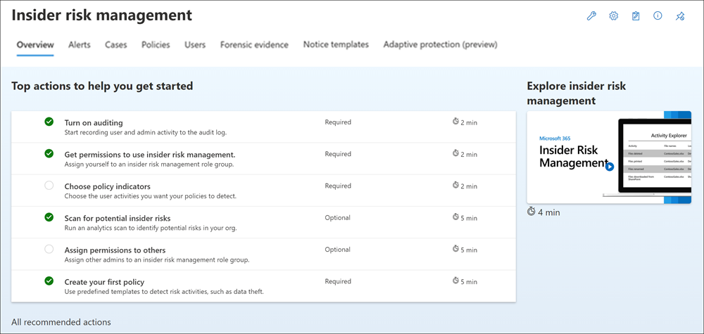

# Get started with insider risk management

>[!IMPORTANT]
>Microsoft Purview Insider Risk Management correlates various signals to identify potential malicious or inadvertent insider risks, such as IP theft, data leakage and security violations. Insider risk management enables customers to create policies to manage security and compliance. Built with privacy by design, users are pseudonymized by default, and role-based access controls and audit logs are in place to help ensure user-level privacy.

Use insider risk management policies to identify risky activities and management tools to act on risk alerts in your organization. Complete the following steps to set up prerequisites and configure an insider risk management policy.

> [!IMPORTANT]
> The insider risk management solution provides a tenant level option to help customers facilitate internal governance at the user level. Tenant level administrators can set up permissions to provide access to this solution for members of your organization and set up data connectors in the Microsoft Purview compliance portal to import relevant data to support user level identification of potentially risky activity. Customers acknowledge insights related to the individual user's behavior, character, or performance materially related to employment can be calculated by the administrator and made available to others in the organization. In addition, customers acknowledge that they must conduct their own full investigation related to the individual user's behavior, character, or performance materially related to employment, and not just rely on insights from the insider risk management service. Customers are solely responsible for using the insider risk management service, and any associated feature or service in compliance with all applicable laws, including laws relating to individual user identification and any remediation actions.

For more information about how insider risk policies can help you manage risk in your organization, see [Learn about insider risk management](insider-risk-management.md).

[!INCLUDE [purview-preview](../includes/purview-preview.md)]

## Subscriptions and licensing

Before you get started with insider risk management, you should confirm your [Microsoft 365 subscription](https://www.microsoft.com/microsoft-365/compare-all-microsoft-365-plans) and any add-ons. To access and use insider risk management, your organization must have one of the following subscriptions or add-ons:

- Microsoft 365 E5/A5/F5/G5 subscription (paid or trial version)
- Microsoft 365 E3/A3/F3/G3 subscription + the Microsoft 365 E5/A5/F5/G5 Compliance add-on
- Microsoft 365 E3/A3/F3/G3 subscription + the Microsoft 365 E5/A5/F5/G5 Insider Risk Management add-on
- Office 365 E3 subscription + Enterprise Mobility and Security E3 + the Microsoft 365 E5 Compliance add-on

Users included in insider risk management policies must be assigned one of the licenses above.

> [!IMPORTANT]
> Insider risk management is currently available in tenants hosted in geographical regions and countries supported by Azure service dependencies. To verify that insider risk management is supported for your organization, see [Azure dependency availability by country/region](/troubleshoot/azure/general/dependency-availability-by-country).

If you don't have an existing Microsoft 365 Enterprise E5 plan and want to try insider risk management, you can [add Microsoft 365](/office365/admin/try-or-buy-microsoft-365) to your existing subscription or [sign up for a trial](https://www.microsoft.com/microsoft-365/enterprise) of Microsoft 365 Enterprise E5.

## Recommended actions (preview)

Recommended actions can help your organization quickly get with insider risk management. Included on the **Overview** page, recommended actions help guide you through the steps to configure and deploy policies.

The following recommendations are available to help you get started with or maximize your insider risk management configuration:

- **Turn on auditing**: When turned on, user and admin activity in your organization is recorded to the Microsoft 365 audit log. Insider risk policies and analytics scans use this log to detect risk activities.
- **Get permissions to user risk management**: The level of access you have to insider risk management features depends on which role group you were assigned. To access and configure recommended actions, users must be assigned to the *Insider Risk Management* or *Insider Risk Management Admins* role groups.
- **Choose policy indicators**: Indicators are essentially the risk management activities you want to detect and investigate. You can choose indicators to track activity across several Microsoft 365 locations and services.
- **Scan for potential insider risks**: Run an analytics scan to discover potential insider risks occurring in your org. After evaluating results, review recommended policies to set up.
- **Assign permissions to others**: If there are additional team members who will be responsible for managing insider risk features, you'll need to assign them to the appropriate role groups.
- **Create your first policy**: To receive alerts on potentially risky activities, you must set up policies based on predefined templates that define the user activities you want to detect and investigate.

Each recommended action included in this experience has four attributes:

- **Action**: Name and description of the recommended action.
- **Status**: Status of the recommended action. Values are *Not started*, *In progress*, *Saved for later*, or *Completed*.
- **Required or optional**: Whether the recommended action is required or optional for insider risk management features to function as expected.
- **Estimated time to complete**: Estimated time to complete the recommended action in minutes.

Select a recommendation from the list to get started with configuring insider risk management. Each recommended action guides you through the required action for the recommendation, including any requirements, what to expect, and the impact of configuring the feature in your organization. Each recommended action is automatically marked as complete when configured or you'll need to manually select the action as complete when configured.

## Step 1 (required): Enable permissions for insider risk management

> [!IMPORTANT]
> After configuring your role groups, it may take up to 30 minutes for the role group permissions to apply to assigned users across your organization.

There are six role groups used to configure insider risk management features. To make **Insider risk management** available as a menu option in Microsoft Purview compliance portal and to continue with these configuration steps, you must be assigned to one of the following roles or role groups:

- Azure Active Directory [*Global Administrator*](/azure/active-directory/roles/permissions-reference#global-administrator) role
- Azure Active Directory [*Compliance Administrator*](/azure/active-directory/roles/permissions-reference#compliance-administrator) role
- Microsoft Purview compliance portal [*Organization Management*](/microsoft-365/security/office-365-security/permissions-in-the-security-and-compliance-center) role group
- Microsoft Purview compliance portal [*Compliance Administrator*](/microsoft-365/security/office-365-security/permissions-in-the-security-and-compliance-center) role group
- *Insider Risk Management* role group
- *Insider Risk Management Admin* role group

Depending on how you wish to manage insider risk management policies and alerts, you'll need to assign users to specific role groups to manage different sets of insider risk management features. You have the option to assign users with different compliance responsibilities to specific role groups to manage different areas of insider risk management features. Or you may decide to assign all user accounts for designated administrators, analysts, investigators, and viewers to the Insider Risk Management role group. Use a single role group or multiple role groups to best fit your compliance management requirements.

You'll choose from these role group options and solution actions when working with insider risk management:

|**Actions**|**Insider Risk Management**|**Insider Risk Management Admin**|**Insider Risk Management Analysts**|**Insider Risk Management Investigators**|**Insider Risk Management Auditors**|**Insider Risk Management Approvers**|
|---|---|---|---|---|---|---|
|Configure policies and settings|Yes|Yes|No|No|No|No|
|Access analytics insights|Yes|Yes|Yes|No|No|No|
|Access & investigate alerts|Yes|No|Yes|Yes|No|No|
|Access & investigate cases|Yes|No|Yes|Yes|No|No|
|Access & view the Content Explorer|Yes|No|No|Yes|No|No|
|Configure notice templates|Yes|No|Yes|Yes|No|No|
|View & export audit logs|Yes|No|No|No|Yes|No|
|Access & view forensic evidence captures|Yes|No|No|Yes|No|No|
|Create forensic evidence capturing request|Yes|Yes|No|No|No|No|
|Approve forensic evidence capturing requests|Yes|No|No|No|No|Yes|
|View device health report|Yes|Yes|No|No|No|No|

> [!IMPORTANT]
> Make sure you always have at least one user in the built-in *Insider Risk Management* or *Insider Risk Management Admin* role groups (depending on the option you choose) so that your insider risk management configuration doesn't get into a 'zero administrator' scenario if specific users leave your organization.

Members of the following roles can assign users to insider risk management role groups and have the same solution permissions included with the *Insider Risk Management Admin* role group:

- Azure Active Directory *Global Administrator*
- Azure Active Directory *Compliance Administrator*
- Microsoft Purview compliance portal *Organization Management*
- Microsoft Purview compliance portal *Compliance Administrator*

> [!NOTE]
> These role groups are currently not supported on Privileged Identity Management (PIM). To learn more about PIM, see [Assign Azure AD roles in Privileged Identity Management](/azure/active-directory/privileged-identity-management/pim-how-to-add-role-to-user).

### Add users to an insider risk management role group

Complete the following steps to add users to an insider risk management role group:

1. Sign into [Microsoft Purview compliance portal](https://compliance.microsoft.com) using credentials for an admin account in your Microsoft 365 organization.

2. In the Security &amp; Compliance Center, go to **Permissions**. Select the link to view and manage roles in Office 365.

3. Select the insider risk management role group you want to add users to, then select **Edit role group**.

4. Select **Choose members** from the left navigation pane, then select **Edit**.

5. Select **Add** and then select the checkbox for all users you want to add to the role group.

6. Select **Add**, then select **Done**.

7. Select **Save** to add the users to the role group. Select **Close** to complete the steps.

## Step 2 (required): Enable the Microsoft 365 audit log

Insider risk management uses Microsoft 365 audit logs for user insights and risk management activities identified in policies and analytics insights. The Microsoft 365 audit logs are a summary of all activities within your organization and insider risk management policies may use these activities for generating policy insights.

Auditing is enabled for Microsoft 365 organizations by default. Some organizations may have disabled auditing for specific reasons. If auditing is disabled for your organization, it might be because another administrator has turned it off. We recommend confirming that it's OK to turn auditing back on when completing this step.

For step-by-step instructions to turn on auditing, see [Turn audit log search on or off](turn-audit-log-search-on-or-off.md). After you turn on auditing, a message is displayed that says the audit log is being prepared and that you can run a search in a couple of hours after the preparation is complete. You only have to do this action once. For more information about the using the Microsoft 365 audit log, see [Search the audit log](search-the-audit-log-in-security-and-compliance.md).

## Step 3 (optional): Enable and view insider risk analytics insights

Insider risk management analytics enables you to conduct an evaluation of potential insider risks in your organization without configuring any insider risk policies. This evaluation can help your organization identify potential areas of higher user risk and help determine the type and scope of insider risk management policies you may consider configuring. This evaluation may also help you determine needs for additional licensing or future optimization of existing policies. Analytics scan results may take up to 48 hours before insights are available as reports for review. To learn more about analytics insights, see [Insider risk management settings: Analytics](insider-risk-management-settings.md#analytics) and check out the [Insider Risk Management Analytics video](https://www.youtube.com/watch?v=5c0P5MCXNXk) to help understand how analytics can help accelerate the identification of potential insider risks and help you to quickly take action.

To enable insider risk analytics, you must be a member of the *Insider Risk Management*, *Insider Risk Management Admin*, or Microsoft 365 *Global admin* role group.

Complete the following steps to enable insider risk analytics:

1. In the [Microsoft Purview compliance portal](https://compliance.microsoft.com), go to **Insider risk management**.
2. Select **Run scan** on the **Scan for insider risks in your organization** card on the insider risk management **Overview** tab. This action turns on analytics scanning for your organization. You can also turn on scanning in your organization by navigating to **Insider risk settings** > **Analytics** and enabling **Scan your tenant's user activity to identify potential insider risks**.
3. On the **Analytics details** pane, select **Run scan to start the scan for your organization**. Analytics scan results may take up to 48 hours before insights are available as reports for review.

After reviewing the analytics insights, choose the insider risk policies and configure the associated prerequisites that best meet your organization's insider risk mitigation strategy.

## Step 4 (recommended): Configure prerequisites for policies

Most insider risk management policies have prerequisites that must be configured for policy indicators to generate relevant activity alerts. Configure the appropriate prerequisites depending on the policies you plan to configure for your organization.

### Configure Microsoft 365 HR connector

Insider risk management supports importing user and log data imported from 3rd-party risk management and human resources platforms. The Microsoft 365 Human Resources (HR) data connector allows you to pull in human resources data from CSV files, including user termination dates, last employment dates, performance improvement plan notifications, performance review actions, and job level change status. This data helps drive alert indicators in insider risk management policies and is an important part of configuring full risk management coverage in your organization. If you configure more than one HR connector for your organization, insider risk management will automatically pull indicators from all HR connectors.

The Microsoft 365 HR connector is required when using the following policy templates:

- Data leaks by risky users
- Departing user data theft
- Patient data misuse
- Security policy violations by departing users
- Security policy violations by risky users

See the [Set up a connector to import HR data](import-hr-data.md) article for step-by-step guidance to configure the Microsoft 365 HR connector for your organization. After you've configured the HR connector, return to these configuration steps.

### Configure a healthcare-specific data connector

Insider risk management supports importing user and log data imported from 3rd-party on existing electronic medical record (EMR) systems. The Microsoft Healthcare and Epic data connectors allow you to pull in activity data from your EMR system with CSV files, including improper patient record access, suspicious volume activities, and editing and exporting activities. This data helps drive alert indicators in insider risk management policies and is an important part of configuring full risk management coverage in your organization.

If you configure more than one Healthcare or Epic connector for your organization, insider risk management automatically supports event and activities signals from all Healthcare and Epic connectors. The Microsoft 365 Healthcare or Epic connector is required when using the following policy templates:

- Patient data misuse

See the [Set up a connector to import healthcare data](import-healthcare-data.md) or [Set up a connector to import Epic EHR data](import-epic-data.md) article for step-by-step guidance to configure a healthcare-specific connector for your organization. After you've configured a connector, return to these configuration steps.

### Configure Data Loss Prevention (DLP) policies

Insider risk management supports using DLP policies to help identify the intentional or accidental exposure of sensitive information to unwanted parties for High severity level DLP alerts. When configuring an insider risk management policy with any of the **Data leaks** templates, you have the option to assign a specific DLP policy to the policy for these types of alerts.

Data loss policies help identify users to activate risk scoring in insider risk management for high severity DLP alerts for sensitive information and are an important part of configuring full risk management coverage in your organization. For more information about insider risk management and DLP policy integration and planning considerations, see [Insider risk management policies](insider-risk-management-policies.md#data-leaks).

> [!IMPORTANT]
> Make sure you've completed the following:
>
> - You understand and properly configure the in-scope users in both the DLP and insider risk management policies to produce the policy coverage you expect.
> - The **Incident reports** setting in the DLP policy for insider risk management used with these templates are configured for *High* severity level alerts. Insider risk management alerts won't be generated from DLP policies with the **Incident reports** field set at *Low* or *Medium*.

A DLP policy is optional when using the following policy templates:

- Data leaks
- Data leaks by priority users

See the [Create, test, and tune a DLP policy](create-test-tune-dlp-policy.md) article  for step-by-step guidance to configure DLP policies for your organization. After you've configured a DLP policy, return to these configuration steps.

### Configure priority user groups

Insider risk management includes support for assigning priority user groups to policies to help identity unique risk activities for user with critical positions, high levels of data and network access, or a past history of risk behavior. Creating a priority user group and assigning users to the group help scope policies to the unique circumstances presented by these users.

A priority user group is required when using the following policy templates:

- Security policy violations by priority users
- Data leaks by priority users

See the [Getting started with insider risk management settings](insider-risk-management-settings.md#priority-user-groups-preview) article for step-by-step guidance to create a priority user group. After you've configured a priority user group, return to these configuration steps.

### Configure Physical badging connector (optional)

Insider risk management supports importing user and log data from physical control and access platforms. The Physical badging connector allows you to pull in access data from JSON files, including user IDs, access point IDs, access time and dates, and access status. This data helps drive alert indicators in insider risk management policies and is an important part of configuring full risk management coverage in your organization. If you configure more than one Physical badging connector for your organization, insider risk management automatically pulls indicators from all Physical badging connectors. Information from the Physical badging connector supplements other insider risk signals when using all insider risk policy templates.

> [!IMPORTANT]
> For insider risk management policies to use and correlate signal data related to departing and terminated users with event data from your physical control and access platforms, you must also configure the Microsoft 365 HR connector. If you enable the Physical badging connector without enabling the Microsoft 365 HR connector, insider risk management policies will only process events for unauthorized physical access for users in your organization.

See the [Set up a connector to import physical badging data](import-physical-badging-data.md) article for step-by-step guidance to configure the Physical badging connector for your organization. After you've configured the connector, return to these configuration steps.

### Configure Microsoft Defender for Endpoint (optional)

[Microsoft Defender for Endpoint](/windows/security/threat-protection/microsoft-defender-atp/microsoft-defender-advanced-threat-protection) is an enterprise endpoint security platform designed to help enterprise networks prevent, detect, investigate, and respond to advanced threats. To have better visibility of security violations in your organization, you can import and filter Defender for Endpoint alerts for activities used in policies created from insider risk management security violation policy templates.

If you create security violation policies, you'll need to have Microsoft Defender for Endpoint configured in your organization and enable Defender for Endpoint for insider risk management integration in the Defender Security Center to import security violation alerts. For more information about requirements, see the [Minimum requirements for Microsoft Defender for Endpoint](/windows/security/threat-protection/microsoft-defender-atp/minimum-requirements) article.

See the [Configure advanced features in Defender for Endpoint](/windows/security/threat-protection/microsoft-defender-atp/advanced-features#share-endpoint-alerts-with-microsoft-compliance-center) article for step-by-step guidance to configure Defender for Endpoint for insider risk management integration. After you've configured the Microsoft Defender for Endpoint, return to these configuration steps.

### Configure forensic evidence (optional)

Having visual context is crucial for security teams during forensic investigations to get better insights into risky user activities that may lead to a security incident. With customizable event triggers and built-in user privacy protection controls, forensic evidence enables customizable capturing across devices to help your organization better mitigate, understand, and respond to potential data risks like unauthorized data exfiltration of sensitive data.

See the [Get started with insider risk management forensic evidence](/microsoft-365/compliance/insider-risk-management-forensic-evidence-configure) article for step-by-step guidance to configure forensic evidence for your organization.

## Step 5 (required): Configure insider risk settings

[Insider risk settings](insider-risk-management-settings.md) apply to all insider risk management policies, regardless of the template you chose when creating a policy. Settings are configured using the **Insider risk settings** control located at the top of all insider risk management tabs. These settings control privacy, indicators, intelligent detections, and more.

Before configuring a policy, define the following insider risk settings:
1. In the [Microsoft Purview compliance portal](https://compliance.microsoft.com), go to **Insider risk management** and select **Insider risk settings** from the top-right corner of any page.
2. On the **Privacy** page, select a privacy setting for displaying usernames for policy alerts.
3. On the **Indicators** page, select the alert indicators you want to apply to all insider risk policies.

    > [!IMPORTANT]
    > In order to receive alerts for potentially risky activities as defined in your policies, you must select one or more indicators. If indicators aren't configured in Settings, the indicators won't be selectable in insider risk policies.

4. On the **Policy timeframes** page, select the [policy timeframes](insider-risk-management-settings.md#policy-timeframes) to go into effect for a user when they trigger a match for an insider risk policy.
5. On the **Intelligent detections** page, configure the following settings for insider risk policies:
    - [File activity detection](insider-risk-management-settings.md#file-activity-detection)
    - [Alert volume](insider-risk-management-settings.md#alert-volume)
    - [Microsoft Defender for Endpoint alert statuses](insider-risk-management-settings.md#microsoft-defender-for-endpoint-alert-statuses)
    - [Domains](insider-risk-management-settings.md#domains)
    - [Sensitive info type exclusion](insider-risk-management-settings.md#sensitive-info-types-exclusion-preview)
    - [Trainable classifiers exclusion](insider-risk-management-settings.md#trainable- classifier-exclusion-preview)
    - [File path exclusions](insider-risk-management-settings.md#file-path-exclusions)
    - [Site exclusions](insider-risk-management-settings.md#site-exclusions)
    - [Keyword exclusion](insider-risk-management-settings.md#keyword-exclusion)
    
6. On the **Export alerts** page, enable export of insider risk alert information using the Office 365 Management APIs if needed.
7. On the **Priority user groups** page, create a priority user group and add users if not created in **Step 3**.
8. On the **Power Automate flows** page, configure a flow from insider risk flow templates or create a new flow. See the [Getting started with insider risk management settings](insider-risk-management-settings.md#power-automate-flows-preview) article for step-by-step guidance.
9. On the **Priority assets page**, configure priority assets to use data from your physical control and access platform imported by the Physical badging connector. See the [Getting started with insider risk management settings](insider-risk-management-settings.md#priority-physical-assets-preview) article for step-by-step guidance.
10. On the **Microsoft Teams** page, enable Microsoft Teams integration with insider risk management to automatically create a team for case or user collaboration. See the [Getting started with insider risk management settings](insider-risk-management-settings.md#microsoft-teams-preview) article for step-by-step guidance.
11. Select **Save** to enable these settings for your insider risk policies.

## Step 6 (required): Create an insider risk management policy

Insider risk management policies include assigned users and define which types of risk indicators are configured for alerts. Before potentially risky activities can trigger alerts, a policy must be configured. Use the policy wizard to create new insider risk management policies.

1. In the [Microsoft Purview compliance portal](https://compliance.microsoft.com), go to **Insider risk management** and select the **Policies** tab.
2. Select **Create policy** to open the policy wizard.
3. On the **Policy template** page, choose a policy category and then select the template for the new policy. These templates are made up of conditions and indicators that define the risk activities you want to detect and investigate. Review the template prerequisites, triggering events, and detected activities to confirm this policy template fits your needs.

    > [!IMPORTANT]
    > Some policy templates have prerequisites that must be configured for the policy to generate relevant alerts. If you haven't configured the applicable policy prerequisites, see **Step 4** above.

4. Select **Next** to continue.
5. On the **Name and description** page, complete the following fields:
    - **Name (required)**: Enter a friendly name for the policy. This name can't be changed after the policy is created.
    - **Description (optional)**: Enter a description for the policy.

6. Select **Next** to continue.
7. On the **Users and groups** page, select **Include all users and groups** or **Include specific users and groups** to define which users or groups are included in the policy, or if you've chosen a priority users-based template; select **Add or edit priority user groups**. Selecting **Include all users and groups** will look for triggering events for all users and groups in your organization to start assigning risk scores for the policy. Selecting **Include specific users and groups** allows you to define which users and groups to assign to the policy. Guest user accounts aren't supported.
8. Select **Next** to continue.
9. On the **Content to prioritize** page, you can assign (if needed) the sources to prioritize, which increases the chance of generating a high severity alert for these sources. Select one of the following choices:

    - **I want to prioritize content**. Selecting this option will enable you to prioritize *SharePoint sites*, *Sensitivity labels*, *Sensitive info types*, and *File extensions* content types. If you choose this option, you must select at least one priority content type.
    - **I don't want to specify priority content right now**. Selecting this option will skip the priority content detail pages in the wizard.

10. Select **Next** to continue.

11. If you've selected **I want to prioritize content** in the previous step, you'll see the detail pages for *SharePoint sites*, *sensitive info types*, *sensitivity labels*, *file extensions*, and *Scoring*. Use these detail pages to define the SharePoint, sensitive info types, sensitivity labels, trainable classifiers, and file extensions to prioritize in the policy. The *Scoring* detail page allows you to scope the policy to only assign risk scores and generate alerts for specified activities that include priority content.

    - **SharePoint sites**: Select **Add SharePoint site** and select the SharePoint sites you have access to and want to prioritize. For example, *"group1@contoso.sharepoint.com/sites/group1"*.    
    - **Sensitive info type**: Select **Add sensitive info type** and select the sensitivity types you want to prioritize. For example, *"U.S. Bank Account Number"* and *"Credit Card Number"*.
    - **Sensitivity labels**: Select **Add sensitivity label** and select the labels you want to prioritize. For example, *"Confidential"* and *"Secret"*.
    - **Trainable classifiers**: Select **Add trainable classifier** and select the trainable classifiers you want to prioritize. For example, *Source code*.
    - **File extensions**: Add up to 50 file extensions. You can include or omit the '.' with the file extension. For example, *.py* or *py* would prioritize Python files.
    - **Scoring**: Decide whether to assign risk scores to all risk management activities detected by this policy or only for activities that include priority content. Choose **Get alerts for all activity** or **Get alerts only for activity that includes priority content**.

    > [!NOTE]
    > Users configuring the policy and selecting priority SharePoint sites can select SharePoint sites that they have permission to access. If SharePoint sites aren't available for selection in the policy by the current user, another user with the required permissions can select the sites for the policy later or the current user should be given access to the required sites.

12. Select **Next** to continue.
13. If you've selected the *Data leaks* or *Data leaks by priority users* templates, you'll see options on the **Triggers for this policy** page for custom-triggering events and policy indicators. You have the choice to select a DLP policy or indicators for triggering events that bring users assigned to the policy in-scope for activity scoring. If you select the **User matches a data loss prevention (DLP) policy triggering event** option, you must select a DLP policy from the DLP policy dropdown list to enable triggering indicators for the DLP Policy for this insider risk management policy. If you select the **User performs an exfiltration activity triggering event** option, you must select one or more of the listed indicators for the policy triggering event.

    > [!IMPORTANT]
    > If you're unable to select a listed indicator or sequence, it's because they aren't currently enabled for your organization. To make them available to select and assign to the policy, select the **Turn on indicators** prompt.

    If you've selected other policy templates, custom triggering events aren't supported. The built-in policy triggering events apply and you'll continue to Step 23 without defining policy attributes.

14. If you've selected the *Data leaks by risky users* or *Security policy violations by risky users* templates, you'll see options on the **Triggers for this policy** page for integration with communication compliance and HR data connector events. You have the choice to assign risk scores when users send messages that contain potentially threatening, harassing, or discriminatory language or to bring users into the the policy scope after risky user events are reported in your HR system. If you select the **Risk triggers from communication compliance (preview)** option, you can accept the default communication compliance policy (automatically created), choose a previously created policy scope for this trigger, or create another scoped policy. If you select **HR data connector events**, you must configure a HR data connector for your organization.
15. Select **Next** to continue.
16. If you've selected the *Data leaks* or *Data leaks by priority users* templates and have selected the **User performs an exfiltration activity and associated indicators**, you can choose custom or default thresholds for the indicator triggering events that you've selected. Choose either the **Use default thresholds (Recommended)** or **Use custom thresholds for the triggering events**.
17. Select **Next** to continue.
18. If you've selected **Use custom thresholds for the triggering events**, for each triggering event indicator that you selected in Step 13, choose the appropriate level to generate the desired level of activity alerts. You can use the recommended thresholds, custom thresholds, or thresholds based on anomalous activities (for certain indicators) above the daily norm for users.
19. Select **Next** to continue.
20. On the **Policy indicators** page, you'll see the [indicators](insider-risk-management-settings.md#indicators) that you've defined as available on the **Insider risk settings** > **Indicators** page. Select the indicators you want to apply to the policy.

    > [!IMPORTANT]
    > If indicators on this page can't be selected, you'll need to select the indicators you want to enable for all policies. You can use the **Turn on indicators** button in the wizard or select indicators on the **Insider risk management** > **Settings** > **Policy indicators** page.

    If you've selected at least one *Office* or *Device* indicator, select the **Risk score boosters** as appropriate. Risk score boosters are only applicable for selected indicators.
    If you've selected a *Data theft* or *Data leaks* policy template, select one or more **Sequence detection** methods and a **Cumulative exfiltration detection** method to apply to the policy.
    If you've selected the *Risky browser usage* policy template, select one or more of the **Browsing indicators**.

21. Select **Next** to continue.
22. On the **Decide whether to use default or custom indicator thresholds** page, choose custom or default thresholds for the policy indicators that you've selected. Choose either the **Use default thresholds for all indicators** or **Specify custom thresholds** for the selected policy indicators. If you've selected Specify custom thresholds, choose the appropriate level to generate the desired level of activity alerts for each policy indicator.
23. Select **Next** to continue.
24. On the **Review** page, review the settings you've chosen for the policy and any suggestions or warnings for your selections. Select **Edit** to change any of the policy values or select **Submit** to create and activate the policy.

## Next steps

After you've completed these steps to create your first insider risk management policy, you'll start to receive alerts from activity indicators after about 24 hours. Configure additional policies as needed using the guidance in Step 4 of this article or the steps in [Create a new insider risk policy](insider-risk-management-policies.md#create-a-new-policy).

To learn more about investigating insider risk alerts and the **Alerts dashboard**, see [Insider risk management activities](insider-risk-management-activities.md#alert-dashboard).
