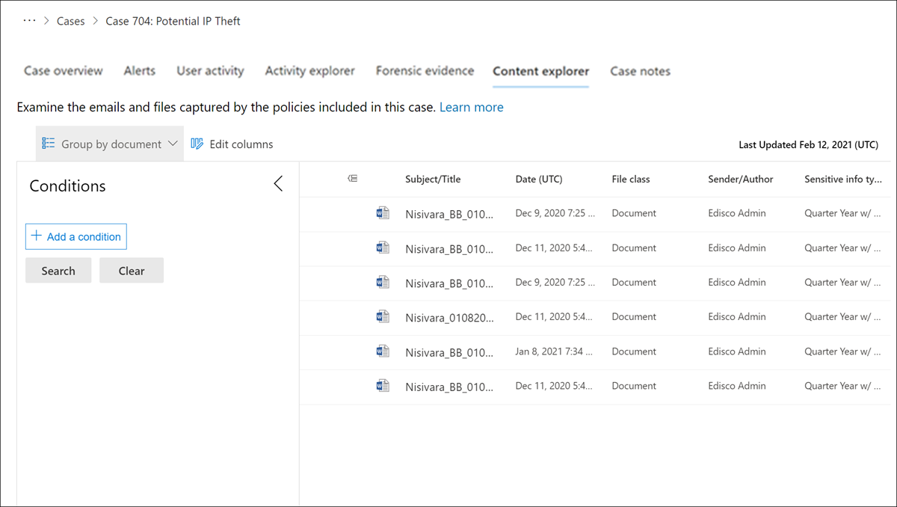

# Insider risk management Content Explorer

The insider risk management Content Explorer allows users assigned the *Insider Risk Management Investigators* role to examine the context and details of content associated with activity in alerts. For all alerts that are confirmed to a case, copies of data and message files are archived as a snapshot in time of the items, while maintaining the original files and messages in the storage sources. The copying of data and messages is transparent to the user associated with the alert and to the owner of the content. If the content includes Information Rights management permissions, these permissions are maintained for the copied content and users assigned the *Insider Risk Management Investigators* role will need these permissions and rights if they need to open and view the files. Each file and message are automatically assigned a unique file ID in the insider risk management case for management purposes. Documents associated with device indicator activities are not included in Content Explorer.

## Column options

To make it easier for risk analysts and investigators to review captured data and messages and review the context to the case, several filtering and sorting tools are included in the Content Explorer. For basic sorting, the **Date** and **File class** columns support sorting using the column titles in the content queue pane. Other queue columns are available to add to the view to provide different pivots on the files and messages.

To add or remove column headings for the content queue, use the **Edit columns** control and select from the following column options. These columns map to the common, email, and document property conditions supported in the Content Explorer and listed later in this article.

| **Column option** | **Description** |
|:------------------|:----------------|
| **Author** | The author field from Office documents, which persists if a document is copied. For example, if a user creates a document and the emails it to someone else who then uploads it to SharePoint, the document will still retain the original author. |
| **Bcc** | Available for email messages, the users in the Bcc message field. |
| **Cc** | Available for email messages, the users in the Cc message field. |
| **Compound path** | Human readable path that describes the source of the item. |
| **Conversation ID** | Conversation Id from the message. |
| **Conversation index** | Conversation index from the message. |
| **Created time** | The time the file or email message was created. |
| **Date** | For email, the date a message was received by a recipient or sent by the sender. For documents, the date a document was last modified. |
| **Dominant theme** | Dominant theme as calculated for analytics. |
| **Email set ID** | Group ID for all messages in the same email set. |
| **Family ID** | Family Id groups together all items; for email, this column includes the message and all attachments; for documents, this column includes the document and any embedded items. |
| **File class** | For content from SharePoint and OneDrive: **Document**; for content from Exchange: **Email or **Attachment**. |
| **File ID** | Document identifier unique within the case. |
| **File type icon** | The extension of a file; for example, docx, one, pptx, or xlsx. This field is the same property as the FileExtension site property. |
| **ID** | The GUID identifier for the file. |
| **Immutable ID** | Immutable Id as stored in Office 365. |
| **Inclusive type** | Inclusive type calculated for analytics: **0** - not inclusive; **1** - inclusive; **2** - inclusive minus; **3** - inclusive copy. |
| **Last modified** | The date that a document was last changed. |
| **Marked as representative** | One document from each set of exact duplicates is marked as representatives. |
| **Message kind** | The type of email message to search for. Possible values: contacts, docs, email, external data, faxes, im, journals, meetings, microsoft teams (returns items from chats, meetings, and calls in Microsoft Teams), notes, posts, rssfeeds, tasks, voicemail |
| **Participants** | List of all participants of a message; for example, Sender, To, Cc, Bcc. |
| **Pivot ID** | The ID of a pivot. |
| **Received** | The date that an email message was received by a recipient. This field is the same property as the Received email property. |
| **Recipients** | All recipient fields in an email message. These fields are To, Cc, and Bcc. |
| **Representative ID** | Numeric identifier of each set of exact duplicates. |
| **Sender** | The sender of an email message. |
| **Sender/Author** | For email, the person who sent a message. For documents, the person cited in the author field from Office documents. You can type more than one name, separated by commas. Two or more values are logically connected by the OR operator. |
| **Sent** | The date that an email message was sent by the sender. This field is the same property as the Sent email property. |
| **Size** | For both email and documents, the size of the item (in bytes). |
| **Subject** | The text in the subject line of an email message. |
| **Subject/Title** | For email, the text in the subject line of a message. For documents, the title of the document. As previously explained, the Title property is metadata specified in Microsoft Office documents. You can type the name of more than one subject/title, separated by commas. Two or more values are logically connected by the OR operator. |
| **Themes list** | Themes list as calculated for analytics. |
| **Title** | The title of the document. The Title property is metadata that's specified in Office documents. It's different than the file name of the document. |
| **To** | The recipient of an email message in the To field. |

## Advanced search conditions

You can add search conditions to narrow the scope of a search and return a more refined set of results. Each condition adds a clause to the search query that is created and run when you start the search. A condition is logically connected to the keyword query (specified in the keyword box) by a logical operator (which is represented as c:c) that is similar in functionality to the AND operator. That means that items have to satisfy both the keyword query and one or more conditions to be included in the search results. This functionality is how conditions help to narrow your results.

For advanced filter and search tools, expand the **Filter** pane on the left side of the content queue. Select the **Add a condition** button to open the condition list:

### Operators used with conditions

|**Operator**|**Query equivalent**|**Description**|
|:-----------|:-------------------|:--------------|
| **After** |`property>date`| Used with date conditions. Returns items that were sent, received, or modified after the specified date.|
| **Before** |`property<date`| Used with date conditions. Returns items that were sent, received, or modified before the specified date.|
| **Between** |`date..date`| Use with date and size conditions. When used with a date condition, returns items there were sent, received, or modified within the specified date range. When used with a size condition, returns items whose size is within the specified range.|
| **Contains all of** |`(property:value) OR (property:value)`| Used with conditions for properties that specify a string value. Returns items that contain all of one or more specified string values. |
| **Contains any of** |`(property:value) OR (property:value)`| Used with conditions for properties that specify a string value. Returns items that contain any part of one or more specified string values.|
| **Contains none of** |`-property:value`    `NOT property:value`| Used with conditions for properties that specify a string value. Returns items that don't contain any part of the specified string value.|
| **Doesn't equal any of** |`-property=value`    `NOT property=value`| Used with conditions for properties that specify a string value. Returns items that don't contain the specific string.|
| **Equals** |`size=value`| Returns items that are equal to the specified size.1|
| **Equals any of** |`(property=value) OR (property=value)`| Used with conditions for properties that specify a string value. Returns items that are an exact match of one or more specified string values.|
| **Equals none of** |`(property=value) OR (property=value)`| Used with conditions for properties that specify a string value. Returns items that do not match one or more specified string values. |
| **Greater than** |`size>value`| Returns items where the specified property is greater than the specified value.1|
| **Greater or equal** |`size>=value`| Returns items where the specified property is greater than or equal to the specified value.1|
| **Less than** |`size<value`| Returns items that are greater than or equal to the specific value.1|
| **Less or equal** |`size<=value`| Returns items that are greater than or equal to the specific value.1|
| **Not equal** |`size<>value`| Returns items that don't equal the specified size.1|

> [!NOTE]
> 1 This operator is available only for conditions that use the Size property.

### Common property conditions

| **Condition option** | **Description** |
|:---------------------|:----------------|
| **Date** | For email, the date a message was received by a recipient or sent by the sender. For documents, the date a document was last modified. |
| **Sender/Author** | For email, the person who sent a message. For documents, the person cited in the author field from Office documents. You can type more than one name, separated by commas. Two or more values are logically connected by the **OR** operator. |
| **Size** | For both email and documents, the size of the item (in bytes). |
| **Subject/Title** | For email, the text in the subject line of a message. For documents, the title of the document. The Title property in documents is metadata specified in Microsoft Office documents. You can type the name of more than one subject/title, separated by commas. Two or more values are logically connected by the OR operator. |

### Email property conditions

The following table lists email message property conditions available the Content Explorer.

| **Condition option** | **Description** |
|:---------------------|:----------------|
| **Bcc** | The Bcc field of an email message. |
| **Cc** | The Cc field of an email message. |
| **Email security** | Security setting of the message. |
| **Email sensitivity** | Sensitivity setting of the message. |
| **Email set ID** | Group ID for all messages in the same email set. |
| **From** | The sender of an email message. |
| **Has attachment** | Indicates whether a message has an attachment. Use the values **true** or **false**. |
| **Importance** | The importance of an email message, which a sender can specify when sending a message. By default, messages are sent with normal importance, unless the sender sets the importance as **high** or **low**. |
| **Meeting end date** | Meeting end date for meetings. |
| **Meeting start date** | Meeting start date for meetings. |
| **Message kind** | The type of email message to search for. Possible values: contacts, docs, email, external data, faxes, im, journals, meetings, microsoft teams (returns items from chats, meetings, and calls in Microsoft Teams), notes, posts, rssfeeds, tasks, voicemail |
| **Participant domain** | List of all domains of participants of a message. |
| **Participants** | All the people fields in an email message. These fields are From, To, Cc, and Bcc. |
| **Received** | The date that an email message was received by a recipient. |
| **Recipient domains** | List of all domains of recipients of a message. |
| **Sender** | Sender (From) field for message types.  Format is **DisplayName \<SmtpAddress>**. |
| **Sender domain** | Domain of the sender. |
| **Subject** | The text in the subject line of an email message.    **Note:** When you use the Subject property in a query, the search returns all messages in which the subject line contains the text you're searching for. In other words, the query doesn't return only those messages that have an exact match. For example, if you search for `subject:"Quarterly Financials"`, your results will include messages with the subject "Quarterly Financials 2018". |
| **To** | The To field of an email message. |
| **Unique in email set** | False if there's a duplicate of the attachment in its email set. |

## Document property conditions

The following table lists documents property conditions available the Content Explorer. Many of these property conditions are shared with review sets included in [Advanced eDiscovery cases](document-metadata-fields-in-Advanced-eDiscovery.md).

| **Condition option** | **Description** |
|:---------------------|:----------------|
| **Attorney-client privilege score** | Attorney-client privilege model content score. |
| **Author** | The author field from Office documents, which persists if a document is copied. For example, if a user creates a document and the emails it to someone else who then uploads it to SharePoint, the document will still retain the original author. |
| **Compliance labels** | Compliance labels applied in Office 365. |
| **Compound path** | Human readable path that describes the source of the item. |
| **Conversation ID** | Conversation Id from the message. |
| **Created time** | The time the file or email message was created. |
| **Custodian** | Name of the custodian the item was associated with. |
| **Dominant theme** | Dominant theme as calculated for analytics. |
| **Family ID** | Family Id groups together all items; for email, this field includes the message and all attachments; for documents, this field includes the document and any embedded items. |
| **File class** | For content from SharePoint and OneDrive: **Document**; for content from Exchange: **Email or **Attachment**. |
| **File types** | The extension of a file; for example, docx, one, pptx, or xlsx. |
| **Has attorney participant** | True when at least one of the participants is found in the attorney list; otherwise, the value is False. |
| **Immutable ID** | Immutable Id as stored in Office 365. |
| **Inclusive type** | Inclusive type calculated for analytics: **0** - not inclusive; **1** - inclusive; **2** - inclusive minus; **3** - inclusive copy. |
| **Item class** | Item class supplied by exchange server; for example, **IPM.Note** |
| **Last modified** | The date that a document was last changed. |
| **Load ID** | Load Id, in which the item was loaded into a review set. |
| **Location name** | String that identifies the source of the item.  For exchange, this field will be the SMTP address of the mailbox. For SharePoint and OneDrive, the URL to the site collection. |
| **Marked as representative** | One document from each set of exact duplicates is marked as representatives. |
| **Native file extension** | Native extension of the item. |
| **Native file name** | Native file name of the item. |
| **NdEtSortExclAttach** | Concatenation of email set and ND set for efficient sorting at review time; D is added as a prefix to ND sets and E is added to email sets. |
| **Pivot ID** | The ID of a pivot. |
| **Potentially privileged** | True if attorney-client privilege detection model considers the document potentially privileged. |
| **Processing status** | Processing status after the item was added to a review set. |
| **Read percentile** | Read percentile for the document based on Relevance. |
| **Relevance score** | Relevance score of a document based on Relevance. |
| **Relevance tag** | Relevance score of a document based on Relevance. |
| **Representative ID** | Numeric identifier of each set of exact duplicates. |
| **Tags** | Tags applied in a review set. |
| **Themes list** | Themes list as calculated for analytics. |
| **Title** | The title of the document. The Title property is metadata that's specified in Office documents. It's different than the file name of the document. |
| **Was remediated** | True if the item was remediated, otherwise False. |
| **Word count** | The number of words in a file. |
