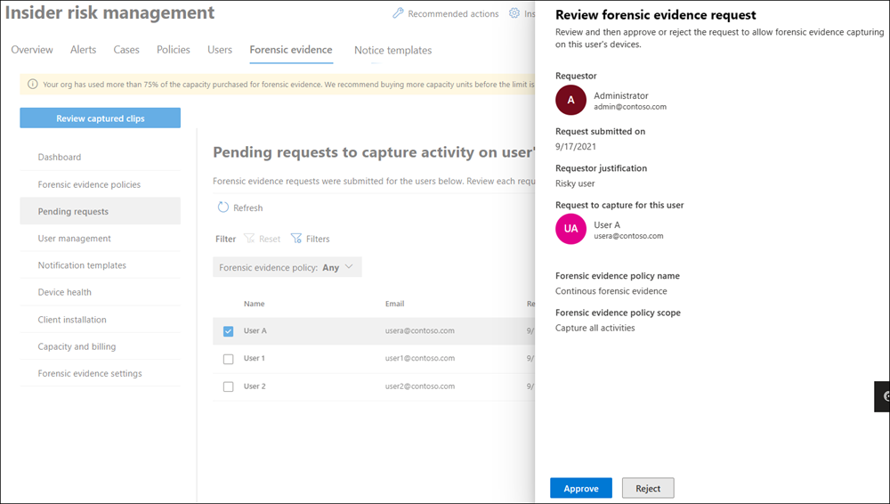
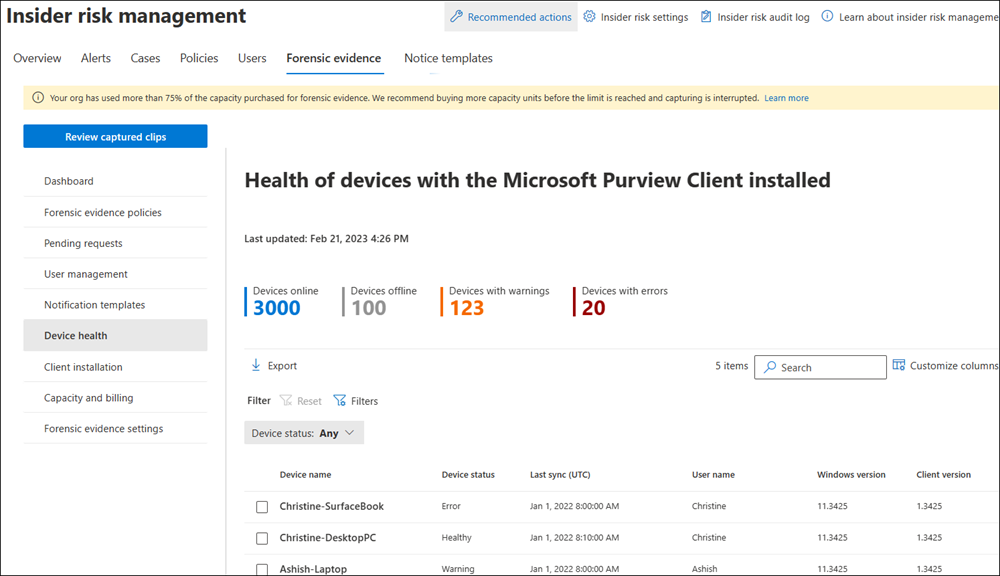

# Manage insider risk management forensic evidence

> [!IMPORTANT]
> Forensic evidence is an opt-in add-on feature in Insider Risk Management that gives security teams visual insights into potential insider data security incidents, with user privacy built in. Forensic evidence includes customizable event triggers and built-in user privacy protection controls, enabling security teams to better investigate, understand and respond to potential insider data risks like unauthorized data exfiltration of sensitive data.
>
> Organizations set the right policies for themselves, including what risky events are highest priority for capturing forensic evidence and what data is most sensitive.   Forensic evidence is off by default, policy creation requires dual authorization and usernames can be masked with pseudonymization (which is on by default for Insider Risk Management).  Setting up policies and reviewing security alerts within Insider Risk Management leverages strong role-based access controls (RBAC), ensuring that the designated individuals in the organization are taking the right actions with additional auditing capabilities.

>[!IMPORTANT]
>Microsoft Purview Insider Risk Management correlates various signals to identify potential malicious or inadvertent insider risks, such as IP theft, data leakage and security violations. Insider risk management enables customers to create policies to manage security and compliance. Built with privacy by design, users are pseudonymized by default, and role-based access controls and audit logs are in place to help ensure user-level privacy.

After you've completed the configuration steps and created your forensic evidence policy, you'll start to see alerts for potentially risky security-related user activities that meet the conditions for indicators that are defined in the policy.

[!INCLUDE [purview-preview](../includes/purview-preview.md)]

## Dashboard

The forensic evidence dashboard is the summary view of key areas of the forensic evidence configuration in your organization. For the preview, the dashboard includes only a **Forensic evidence device health** section. Select **View device health report** to open the **Device health** tab and report. Other sections will be included in future releases.

## Managing users

You must request and approve specific users before they're eligible for forensic evidence capturing. Simply adding users to a forensic evidence policy doesn't automatically make those users eligible for capturing. You can request and approve users before or after forensic evidence policies are created, but the clip captures associated with policy indicators will only be created and available for reviewing once the users are approved.

Users assigned to the *Insider Risk Management* or *Insider Risk Management Admins* role groups can submit approval requests to users assigned to the *Insider Risk Management Approvers* role group.

### Request capturing approvals

You must request that forensic evidence capturing be turned on for specific users. When a request is submitted, approvers in your organization are notified in email and can approve or reject the request. If approved, the user or will appear on the **Approved users** tab and will be eligible for capturing. If not addressed, the request will expire 6 months from the day it was submitted.

To configure approved users for forensic evidence capturing, complete the following steps:

1. In the [Microsoft Purview compliance portal](https://compliance.microsoft.com/), go to **Insider risk management** > **Forensic evidence** > **User management**.
2. Select the **Manage forensic evidence requests** tab.
3. Select **Create request**.
4. On the **Users** page, select **Add users**.
5. Use **Search** to locate a specific user or select one or more users from the list. Select **Add**, then select **Next**.
6. On the **Forensic evidence policy** page, select a forensic evidence policy for the added users. The policy you choose determines the scope of activity to capture for users.
7. Select **Next**.
8. On the **Justification** page, let the reviewer know why you're requesting that capturing be enabled for the users you added in the **Justification for turning on forensic evidence capturing** text box. This is a required field. When complete, select **Next**.
9. On the **Email notifications** page, you can use a notification template to send an email to users letting them know that forensic evidence capturing will be turned on for their device in accordance with your organization's policies. The email will be sent to users only if their request is approved.

    Select the **Send an email notification to approved users** check box. Choose an existing template or create a new one. To create a new template, select **Create a notification template** and complete the following required fields in the **New email notification template** pane.

10. Select **Next**.
11. On the **Finish** page, review your settings before submitting the request. Select **Edit users** or **Edit justification** to change any of the request values or select **Submit** to create and send the request to reviewers.

To view pending approval requests, navigate to **Insider risk management** > **Forensic evidence** > **Pending requests**. Here you'll see the users with pending requests, their email address, the request submission date, and who submitted the approval request. If no users are displayed, there aren't any pending approval requests for any users.

Users assigned to the *Insider Risk Management Approvers* role group can select a user on the **Forensic evidence request** tab and review the request. After reviewing the request, these users can approve or reject the forensic evidence capturing request. Approving or rejecting the capturing request removes the pending request for users from this view.

### Approve or reject capturing requests

After requests are complete, users assigned to the *Insider Risk Management Approvers* role group will receive an email notification for the approval request. To approve or reject requests, reviewers must complete the following steps:

1. In the [Microsoft Purview compliance portal](https://compliance.microsoft.com/), go to **Insider risk management** > **Forensic evidence** > **Pending requests**.
2. Select a user to review.
3. On the **Review forensic evidence request (preview)** pane, review the justification submitted by the requestor. Select **Approve** or **Reject** as applicable.
4. On the **Request approved** or **Request rejected** page, select **Close**.

### Revoke capturing approvals

If needed, you can revoke approval for specific users and exclude them from forensic evidence capturing. Revoking approval doesn't delete or remove any existing captures for these users, only future capturing of activity for these users is disabled.

To revoke approvals for users, users assigned to the *Insider Risk Management Approvers* role group must complete the following steps:

1. In the [Microsoft Purview compliance portal](https://compliance.microsoft.com/), go to **Insider risk management** > **Forensic evidence** > **User management**.
2. Select the **Approved users** tab.
3. Select a user, then select **Remove**.
4. On the removal confirmation page, select **Remove** to revoke capturing approval or select **Cancel** to close the confirmation page.

## Creating and managing notification templates

You can create and use a notification template to send an email to users letting them know that forensic evidence capturing will be turned on for their device in accordance with your organization's policies. The email is sent to users only if their request is approved.

To create a new notification template, complete the following steps:

1. In the [Microsoft Purview compliance portal](https://compliance.microsoft.com/), go to **Insider risk management** > **Forensic evidence** > **Notification templates**.
2. Select **Create notification template**.
3. On the **New email notification template** pane, complete the following required fields:
    - Template name
    - Send from
    - Subject
    - Message body
4. Select **Save**.

To delete an existing notification template, select a template and select **Delete**.

## Viewing captured clips

You can view and explore captured clips by selecting the **Forensics evidence** tab when you open Microsoft Purview Insider Risk Management. You can also select the **Forensics evidence** tab from other areas in the solution to view a list of captured clips in context:

- **Alerts dashboard.** Clips accessible from the **Alerts** dashboard correspond to the option to capture  **specific user activities** when the forensic evidence policy is created. The captured clips are defined by indicators selected in the forensic evidence policy. 
- **User activity reports.** Clips accessible from **User activity** reports correspond to the option to capture **any security-related activity** performed by users included in forensic evidence policies.
- **Cases dashboard.** Clips accessible from the **Cases** dashboard are alerts that have been escalated to cases. 

> [!NOTE]
> If you're a member of both the *Insider Risk Management Investigators* role group and the *Insider Risk Management Admins* role group, you'll see a **Review captured clips** button when you open Microsoft Purview Insider Risk Management. If you select the **Review captured clips** button, it changes to the **Open forensic evidence settings** button. The purpose of this button is to go back and forth between the list of captured clips and settings if you have both roles. [Learn more about role groups](insider-risk-management-configure.md#step-1-required-enable-permissions-for-insider-risk-management)

When you select the **Forensics evidence** tab, captured clips and associated information are displayed in a list. If you select a captured clip in the list, a video player appears in the center of the screen, and a transcript of activities and events from the clip are displayed to the right of the video player. 

Each captured clip includes the following information:

- **Date/time (UTC)**: The date, time (UTC), and duration of the capture. The duration of the capture is the total time spanned by the capture. The actual length of the capture may be shorter since insider risk management automatically eliminates identical frames.
- **Device**: The name of the device in Windows 10/11.
- **Activities**: The insider risk management activity type included in the capture. These activities are based on global and policy indicators assigned to the associated policy.
- **User**: The name of the user.
- **URL** (if applicable): The URL that the user was accessing when the activity took place.
- **Application** (if applicable): The application that the user was accessing when the activity took place.
- **Active window title**: The title of the window that the user was accessing when the activity took place.

To view a captured clip:

1. If needed, configure the filters at the top of the list. 
2. Select a clip from the list. 
3. Using the video player controls, select the *Play control* to review the entire clip from beginning to end.
4. To scope the review to a specific activity or event in the clip, select the activity or event in the transcript. You can also use the search box above the transcript to search for specific activities or events.

   > [!NOTE]
   > A red triangle in the transcript denotes an activity. 

#### Filtering the captured clips list

You can use the filters above the captured clips list to filter for specific activities and information. 

- Each filter supports up to 10 unique IDs so, for example, you can filter on up to 10 users at one time. 
- Use the **URL name** filter to match a domain name or to search for any keyword after matching a domain. For example, entering "SharePoint" as a keyword returns any URL that includes "SharePoint" anywhere in the URL.  
- With the **App name** filter, you can filter by **Contains any of** or **Contains all of**. For example, if you select **Contains any of** and enter "Contoso.com,Contoso2.com", you could have one clip that captures Contoso.com and another that captures Contoso2.com. If you select **Contains all of** and enter "Contoso.com,Contoso2.com", any captures would have to contain both domains. 
- The **Active window title** filter behaves the same way as the **App name** filter. 

#### Deleting clips 

Users assigned to the *Insider Risk Management Investigators* role group can delete individual clips from the captured clips list. To do this:

1. Select the check box next to the capture. 
2. Select the **Delete** (Trash can) button. 

Users assigned to the *Insider Risk Management Admins* role group can do bulk deletions through settings. To do this:

1. In the [Microsoft Purview compliance portal](https://compliance.microsoft.com/), go to **Insider risk management** > **Forensic evidence** > **Forensic evidence settings**.
2. Make sure that the **Allow deletion of forensic user data by an Administrator or Investigator** option is set to **On**. 
3. Under **Delete a user's** data, click **Select a user**, and then select the user that you want to delete clips for. 

> [!IMPORTANT]
> Forensic evidence clips are deleted 120 days after they're captured. You can export or transfer forensic evidence clips before they're deleted.

### Alerts dashboard

For alerts generated by policies, you can review forensic evidence captures on the **Forensic evidence** tab on the **Alerts** dashboard. If one or more captures are available for the alert, you'll also see a **View forensic evidence** notification link in the activity that generates an alert header section. You can select the notification link or the **Forensic evidence** tab to review a list of activity captures.

Reviewing an alert for potentially risky activity that may contain forensic evidence captures is essentially the same as reviewing an alert without forensic evidence captures. The significant difference is the inclusion of any applicable captures. The **Forensic evidence** tab provides access to all available captures associated with the alert. 

### Cases dashboard

If alerts are escalated to cases, all associated forensic evidence captures are included as part of the case. Reviewing forensic evidence captures for cases follows the same process as reviewing captures for alerts.

### User activity reports

User activity reports allow you to examine activities for specific users for a defined time period without having to assign them temporarily or explicitly to an insider risk management policy. If these user activities include activities supported by forensic evidence capturing, clips are included with the user activity.

If you've configured forensic evidence to capture all security-related user activity, regardless of whether they're included in a forensic evidence policy, to review these captures:

1. Select **Insider risk management** > **Overview**.
2. At the bottom of the **Overview** screen, under **Investigate user activity**, select **Manage reports**.
3. Select a specific user, and then select the **Forensic evidence** tab.
4. Refer to the instructions above. 

## Device health report (preview)

After devices are configured to support forensic evidence, you can review the Microsoft Purview Client health status for all devices in your organization by navigating to **Insider risk management** > **Forensic evidence** > **Device health**.

For a list of minimum device and configuration requirements, see [Learn about forensic evidence](insider-risk-management-forensic-evidence.md#device-and-configuration-requirements). To onboard supported devices, complete the steps outlined in the [Onboard Windows 10 and Windows 11 devices into Microsoft 365 overview](/microsoft-365/compliance/device-onboarding-overview) article. 

The Device health report allows you to view the status and health of all devices that have the forensic evidence agent installed. Each report widget on the report displays information for last 24 hours.

- **Devices online**: The total number of devices currently online.
- **Devices offline**: The total number of devices currently offline.
- **Devices with warnings**: The total number of devices with a warning.
- **Devices with errors**: The total number of devices with an error.

The device health queue lists all the devices in configured for forensic evidence in your organization. In addition, the report lists the status of the following device attributes:

- **Device name**: The name of the device, defined by the *ComputerName* attribute of the device.
- **Device status**: The status of the Microsoft Purview Client on the device. Status values are as follows:
    - ***Healthy***: The client on the device is working properly and forensic evidence capture features are fully supported.
    - ***Warning***: The client on the device has a warning and forensic evidence capture features may not be fully supported.
    - ***Error***: The client on the device has an error and forensic evidence capture features are disabled or not fully supported.
- **Status details**: More information about the device status.
- **Last sync (UTC)**: Date and time of the last status sync for the device.
- **User name**: The user name for the user logged into the device when the status sync was performed.
- **Windows version**: The version of Microsoft Windows installed on the device.
- **Client version**: The version of the Microsoft Purview Client installed on the device.

The device health status gives you insights into potential issues with your devices and the Microsoft Purview Client. The **Device status** column on the **Device health** page can alert you to device issues that may prevent user activity from being captured or why the volume of forensic evidence capturing is unusual. The device health status can also confirm that the devices included in forensic evidence capturing are healthy and don't need attention or configuration changes. The following table lists potential status detail messages and recommended actions you can take to address warnings and errors:

|**Status Details**|**Status**|**Suggested Action**|
|:----------|:-------|:-------------------|
| An internal server error occurred. As a result, capture data might be missing. | Error | Create a support ticket with Microsoft for further investigation |
| Upload bandwidth has reached 90% of the configured limit on this device. Captures might be overwritten soon.  | Warning | Increase the upload bandwidth limit on the [Forensic evidence settings](/microsoft-365/compliance/insider-risk-management-forensic-evidence-configure) page. |
| The configured upload bandwidth limit has been reached on this device. No more captures will be uploaded for the day. | Error | Increase the upload bandwidth limit on the [Forensic evidence settings](/microsoft-365/compliance/insider-risk-management-forensic-evidence-configure) page. |
| Offline storage has reached 90% of the configured limit on this device. Captures might be overwritten soon.  | Warning | Increase the offline capturing cache limit on the [Forensic evidence settings](/microsoft-365/compliance/insider-risk-management-forensic-evidence-configure) page. |
| The configured offline storage limit has been reached on this device. As a result, offline captures are being overwritten. | Error | Increase the offline capturing cache limit on the [Forensic evidence settings](/microsoft-365/compliance/insider-risk-management-forensic-evidence-configure) page. |
| CPU usage on the device has exceeded the maximum threshold. | Error | The capture process has been stopped and will restart in a few minutes. |
| Memory usage on the device has exceeded the maximum threshold. | Error | The capture process has been stopped and will restart in a few minutes. |
| GPU usage on the device has exceeded the maximum threshold. | Error | The capture process has been stopped and will restart in a few minutes. |
| The Microsoft Purview Client installed on the device in unable to sync with the forensic evidence policy. | Warning | Connect to network & reinstall client |
| The Microsoft Purview Client installed on the device hasn't synced with the forensic evidence policy in over 24 hours. | Error | Connect to network & reinstall client |
| The Microsoft Purview Client is unable to capture activity because no graphics card is detected on this device. | Error | Add a graphics card or replace the device with one that has a graphics card |
| The Microsoft Purview Client is unable to capture activity because no display monitors are detected on this device. | Error | Add display monitors for this device |
| The Microsoft Purview Client is unable to capture activity because display monitors on this device were turned off or disconnected. | Error | Connect/Turn on display monitors for the device |
| Device is unable to access the directory that stores forensic evidence captures. | Error | Reinstall the client on this device |
| Encoder initialization failed.  | Error | Reinstall the client on this device. |

Contact Microsoft Support if the recommended actions don't resolve issues with the client.

## Capacity and billing

When forensic evidence is configured, you can opt in to purchase the forensic evidence add-on for Insider Risk Management for your captured clips. The add-on is available for organizations with any of the following licenses: Microsoft 365 E5, Microsoft 365 E5 Compliance, or Microsoft 365 E5 Insider Risk Management. 

Organizations can purchase the add-on in units of 100 GB per month. Purchased capacity applies to the ingestion of forensic evidence beginning on the date of purchase and resets on the first of the month. Unused capacity does not carry over. We recommend you purchase the license at the beginning of the month to maximize the value of the license. 100 GB is roughly equal to around 1,100 hours of forensic evidence captures per tenant, at a video resolution of 1080p. You can [download the capacity calculator](https://aka.ms/ForensicEvidenceCapacityCalculator) to help estimate the number of GBs needed per month. 

Once the forensic evidence is ingested, it will be retained for 120 days. You can export forensic evidence if needed after the 120-day retention period. 

### Payment plans

There are two payment plans available when purchasing the add-on through the Microsoft 365 admin center:

- **Pay yearly (available in all channels).** The annual commitment option allows you to buy the number of licenses you specify each month for 12 months. It’s suitable for customers who want to ensure they have capacity available each month to ingest forensic evidence without interruption. This payment plan will automatically replenish the number of licenses purchased each month. Purchased capacity applies to the ingestion of forensic evidence beginning on the date of purchase and resets on the first of the month. Unused capacity does not carry over. Customers can choose to be billed one time or split the bill into 12 monthly payments. 
- **Pay monthly (only available in web direct).** If you don't want to make an annual commitment, you can buy the number of licenses needed each month. Purchased capacity applies to the ingestion of forensic evidence beginning on the date of purchase and resets on the first of the month. Unused capacity does not carry over.

### Can I try the forensic capability before purchasing it?

Each tenant that has a Microsoft 365 E5, Microsoft 365 E5 Compliance, or Microsoft 365 E5 Insider Risk Management license can sign up for a 20-GB trial license to try out the forensic evidence capability. 

> [!NOTE]
> The 20-GB trial license is only available for customers on the legacy commerce platform. 

The 20 GB of capacity available through the trial license doesn't have any time limit and is available until you use up the full 20 GB. If you don't use up the full 20 GB in one year, you can reactivate it. If you purchase a forensic evidence add-on license prior to using the trial capacity, you will be able to use the remaining trial capacity until it’s used up before the system starts metering the purchased capacity.    

If you use up the 20 GB of trial capacity and don't subsequently purchase the forensic add-on for Insider Risk Management, you'll be able to view any clips that you've already ingested but won't be able to ingest any new clips. 

#### Sign up for the 20-GB trial license

1. In the [Microsoft Purview compliance portal](https://compliance.microsoft.com/), go to **Insider risk management** > **Forensic evidence** > **Capacity and billing**.

   > [!NOTE]
   > You can also sign up for the trial license from the **Insider risk management** > **Forensic evidence** > **Dashboard** tab.

2. Select **Claim 20 GB of capacity**.
3. Follow the prompts in the Microsoft 365 admin center.

### Purchase the forensic add-on for Insider Risk Management

1. Go to **Microsoft 365 admin center** > **Marketplace** > **All products**.
2. Search for "forensic evidence". 

### Analyze your capacity

After purchasing capacity (or signing up for the 20-GB trial license), you can use the **Capacity** page to analyze how much capacity that you have used and the amount of capacity remaining. You can also analyze the amount of capacity you're using each month by selecting from the **Capacity usage in GB** list or by selecting **View all capacity usage**.

> [!NOTE]
> The commerce platform has [a legacy billing platform and a modern billing platform](https://partner.microsoft.com/partnership/new-commerce). Insider risk management billing is designed to work with the modern billing platform. Purchased capacity is enforced on the ingestion of forensic evidence on a monthly basis, starting on the date of purchase and resetting the first of every month. Any purchased capacity can be fully used in that month and will be reset on the first of the next month. You can continue to [use the capacity until the date the license expires](https://partner.microsoft.com/partnership/new-commerce).