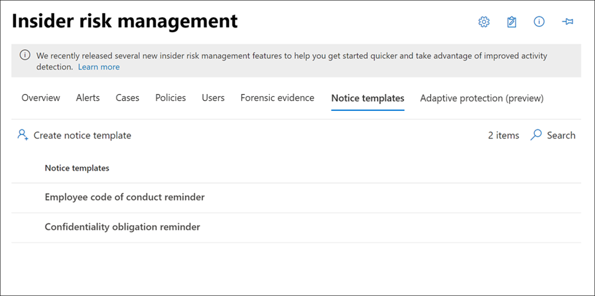

# Insider risk management notice templates

Insider risk management notice templates allow you to send email messages to users when their activities generate a policy match and alert. In most cases, user actions that generate alerts are the result of mistakes or inadvertent activities without ill intent. Notices serve as simple reminders to users to be more careful, to provide links to information for refresher training, or to corporate policy resources. Notices can be an important part of your internal compliance training program and can help create a documented audit trail for users with recurring risk activities.

Create notice templates if you want to send users an email reminder notice for policy matches as part of the issue resolution process. Notices can only be sent to the user email address associated with the specific alert being reviewed. When selecting a notice template to apply to a policy match, you can choose to accept the field values defined in the template or overwrite the fields as needed.

## Notice templates dashboard

The **Notices templates dashboard** displays a list of configured notice templates and allows you to create new notice templates. The notice templates are listed in reverse date order with the most recent notice template listed first.



## HTML for notices

If you'd like to create more than a simple text-based email message for notifications, you can create a more detailed message by using HTML in the message body field of a notice template. The following example provides the message body format for a basic HTML-based email notification template:

```HTML
<!DOCTYPE html>
<html>
<body>
<h2>Action Required: Contoso User Code of Conduct Policy Training</h2>
<p>A recent activity you've performed has generated a risk alert prohibited by the Contoso User <a href='https://www.contoso.com'>Code of Conduct Policy</a>.</p>
<p>You are required to attend the Contoso User Code of Conduct <a href='https://www.contoso.com'>training</a> within the next 14 days. Please contact <a href='mailto:hr@contoso.com'>Human Resources</a> with any questions about this training request.</p>
<p>Thank you,</p>
<p><em>Human Resources</em></p>
</body>
</html>
```

> [!NOTE]
> HTML href attribute implementation in the insider risk management notice templates currently support only single quotation marks instead of double quotation marks for URL references.

## Create a new notice template

To create a new insider risk management notice template, you'll use the notice wizard in **Insider risk management** solution in the Microsoft 365 compliance center.

Complete the following steps to create a new insider risk management notice template:

1. In the [Microsoft 365 compliance center](https://compliance.microsoft.com), go to **Insider risk management** and select the **Notice templates** tab.
2. Select **Create notice template** to open the notice wizard.
3. On the **Create a new notice template** page, complete the following fields:
    - **Template name**: Enter a friendly name for the notice. This name appears on the list of notices on the notice dashboard and in the notice selection list when sending notices from a case.
    - **Send from**: Enter the sender email address for the notice. This address will appear in the **From:** field in all notices sent to users unless changed when sending a notice from a case.
    - **Cc and Bcc** fields: Optional users or groups to be notified of the policy match, selected from the Active Directory for your subscription.
    - **Subject**: Information that appears in the subject line of the message, supports text characters.
    - **Message body**: Information that appears in the message body, supports text or HTML values.
4. Select **Create** to create and save the notice template or select **Cancel** to close without saving the notice template.

## Update a notice template

To update an existing insider risk management notice template, complete the following steps:

1. In the [Microsoft 365 compliance center](https://compliance.microsoft.com), go to **Insider risk management** and select the **Notice templates** tab.
2. On the notice dashboard, select the notice template you want to manage.
3. On the notice details page, select **Edit**
4. On the **Edit** page, you can edit the following fields:
    - **Template name**: Enter a new friendly name for the notice. This name appears on the list of notices on the notice dashboard and in the notice selection list when sending notices from a case.
    - **Send from**: Update the sender email address for the notice. This address will appear in the **From:** field in all notices sent to users unless changed when sending a notice from a case.
    - **Cc and Bcc** fields: Update optional users or groups to be notified of the policy match, selected from the Active Directory for your subscription.
    - **Subject**: Update information that appears in the subject line of the message, supports text characters.
    - **Message body**: Update information that appears in the message body, supports text or HTML values.
5. Select **Save** to update and save the notice or select **Cancel** to close without saving the notice template.

## Delete a notice template

To delete an existing insider risk management notice template, complete the following steps:

1. In the [Microsoft 365 compliance center](https://compliance.microsoft.com), go to **Insider risk management** and select the **Notice templates** tab.
2. On the notice dashboard, select the notice template you want to delete.
3. Select the **Delete** icon on the toolbar.
4. To delete the notice template, select **Yes** in the delete dialog. To cancel the deletion, select **Cancel**.
