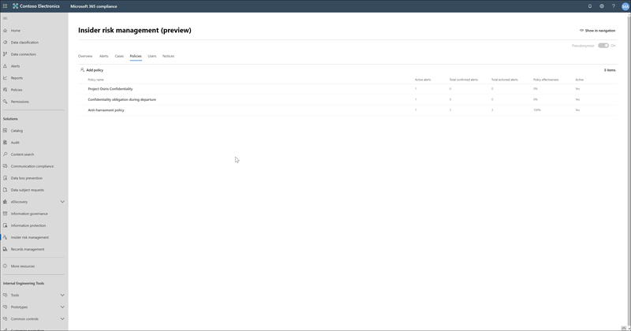

# Insider risk management policies (preview)

Insider risk management policies determine which employees are in-scope and which types of risk indicators are configured for alerts. You can quickly create a policy that applies to all users in your organization, or define individual users or groups for management in a policy. Policies support content priorities to focus policy conditions on multiple or specific Microsoft Teams, SharePoint sites, data sensitivity types, and data labels. You can also choose specific risk indicators and how much weight they are assigned within a policy, effectively determining the weight of each alert trigger in the policy. Policies windows allow you to define the time frame to apply the policy to alert activities and are used to determine the duration of the policy once activated. The maximum policy limit is five active policies at the same time. However, you can configure additional policies and activate and deactivate policies as needed.

## Policy dashboard

The policy dashboard allows you to quickly see the policies in your organization and the current status of alerts associated with each policy.

- **Policy name**: The name assigned to the policy in the policy wizard.
- **Active alerts**: The number of active alerts for each policy.
- **Total alerts**: The total number of alerts created from the policy in the last 365 days.
- **Total actioned alerts**: The total number of alerts the resulted in cases from the policy in the last 365 days.
- **Policy effectiveness**: The percentage of cases divided by alerts for the policy for the last 365 days.
- **Active status**: The status of the case, either *Active* or *Inactive*.

## Policy templates

Insider risk management templates are pre-defined policy conditions that define the types of risk indicators monitored by a policy. Each policy must have a template assigned in the policy creation wizard before the policy is created. The following templates are available:

- **Departing employee data theft**: When employees leave your organization, there are specific risk indicators typically associated with data theft by departing employees. This policy template prioritizes these indicators and focuses detection and alerts to this risk area. Data theft for departing employees may include downloading files from SharePoint Online, copying files to portable devices such as USB drives, printing files, and copying data to personal cloud messaging and storage services near their employment resignation and end dates. This template prioritizes risk indicators relating to these activities and how they correlate with employee employment status.
- **Data leaks**: Protecting data and preventing data leaks is a constant challenge for most organizations, particularly with the rapid grow of new data created by employees, devices, and services. Employees are empowered to create, store, and share information across services and devices that make managing data leaks increasingly more complex and difficult. Data leaks can include accidental oversharing of information outside your organization or data theft with malicious intent. This template prioritizes real-time detection of suspicious SharePoint Online data downloads, file and folder sharing, copying files to portable devices such as USB drives, printing files, and copying data to personal cloud messaging and storage services.
- **Offensive language in communication**: Detecting and taking action to prevent offensive and abusive behavior is a critical component of preventing risk. Built-in offensive language classifiers in Microsoft 365 can scan sent email messages from Exchange Online mailboxes in your organization for different types of compliance issues. These classifiers use a combination of artificial intelligence and keywords to identify language in email likely to violate anti-harassment policies. Use this template to quickly create a policy that uses these classifiers to automatically detect email message content that may be considered abusive or offensive. Insider risk management uses classifiers that scan sent email messages for English language terms and sentiment for offensive language.

## Create a new policy

To create a new insider risk management policy, you'll use the policy wizard in **Insider risk management** solution in the Microsoft 365 compliance center.

Complete the following steps to create a new policy:

1. In the [Microsoft 365 compliance center](https://compliance.microsoft.com), go to **Insider risk management** and select the **Policies** tab.
2. Select **Add Policy** to open the policy wizard
3. On the **Assign policy name** page, complete the following fields, and then select **Next**:
    - **Name (required)**: Enter a friendly name for the policy
    - **Description (optional)**: Enter a description for the policy.
    - **Select template (required)**: Select one of the templates to define the types of risk indicators monitored by the policy.
4. On the **Users** page, select **Add user or group** to define which users or Azure Active Directory security and distribution groups are subject to the policy. Select **Next** to continue.
5. On the **Content priority** page, assign the sources for user activities in one or more of the content sources and then select **Next**:
    - Microsoft Teams: Select **Add Teams group** and select the Microsoft Teams organization you want to prioritize. For example, *"group1@teams.com"*.
    - SharePoint sites: Select **Add SharePoint site** and select the SharePoint organization you want to prioritize. For example, *"group1@contoso.sharepoint.com/sites/group1"*.
    - Sensitivity type: Select **Add sensitivity type** and select the sensitivity type you want to prioritize. For example, *"U.S. Bank Account Number"* and *"Credit Card Number"*.
    - Labels: Select **Add label** and select the label you want to prioritize. For example, *"Confidential"* and *"Secret"*.
6. On the **Choose alert indicators** page, select one or more alerts and define the policy weighting for each.
7. On the **Monitoring window** page, choose the time period for the policy. Select **Next** to continue.
8. On the **Review** page, review the settings you've chosen for the policy. Select **Edit** to change any of the policy values or select **Submit** to create and activate the policy.

## Update a policy

To update an existing insider risk management policy, you'll use the policy wizard in **Insider risk management** solution in the Microsoft 365 compliance center.

Complete the following steps to manage an existing policy:

1. In the [Microsoft 365 compliance center](https://compliance.microsoft.com), go to **Insider risk management** and select the **Policies** tab.
2. On the policy dashboard, select the policy you want to manage.
3. On the policy details page, select **Edit policy**
4. In the policy wizard, you can edit the following fields:
    - **Name (required)**: Enter a new friendly name for the policy
    - **Description (optional)**: Enter a new description for the policy.
    - **Select playbook (required)**: Select one of the playbooks to define the types of risk indicators monitored by the policy.
5. Select **Next** to continue.
6. On the **Users** page, select **Add user or group** to define which users are subject to the policy. Select **Next** to continue.
7. On the **Content priority** page, assign the sources for user activities:
    - Microsoft Teams
    - SharePoint sites
    - Sensitivity type
    - Labels
8. Select **Next** to continue.
9. On the **Choose alert indicators** page, select one or more alerts and define the policy weighting for each.
10. On the **Monitoring window** page, choose the time period for the policy. Select **Next** to continue.
11. On the **Review** page, review the settings you've chosen for the policy. Select **Edit** to change any of the policy values or select **Submit** to update and activate the policy.

## Deactivate a policy

1. In the [Microsoft 365 compliance center](https://compliance.microsoft.com), go to **Insider risk management** and select the **Policies** tab.
2. On the policy dashboard, select the policy you want to deactivate.
3. DETAILS NEEDED

## Delete a policy

> [!NOTE]
> Deleting a policy does not delete active or archived alerts generated from the policy.

To delete an existing insider risk management policy, complete the following steps:

1. In the [Microsoft 365 compliance center](https://compliance.microsoft.com), go to **Insider risk management** and select the **Policies** tab.
2. On the policy dashboard, select the policy you want to manage.
3. Select **Delete** on the dashboard toolbar.
4. On the **Delete** dialog, Select **Yes** to delete the policy, or select **Cancel** to close the dialog.