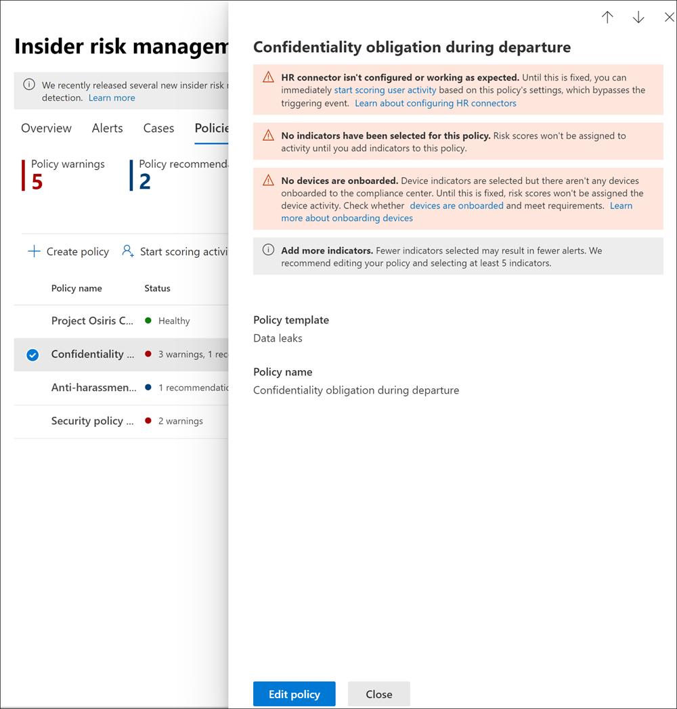

# Insider risk management policies

Insider risk management policies determine which users are in-scope and which types of risk indicators are configured for alerts. You can quickly create a policy that applies to all users in your organization or define individual users or groups for management in a policy. Policies support content priorities to focus policy conditions on multiple or specific Microsoft Teams, SharePoint sites, data sensitivity types, and data labels. Using templates, you can select specific risk indicators and customize event thresholds for policy indicators, effectively customizing risk scores, and level and frequency of alerts. Additionally, risk score boosters and anomaly detections help identify user activity that is of higher importance or more unusual. Policy windows allow you to define the time frame to apply the policy to alert activities and are used to determine the duration of the policy once activated.

Check out the [Insider Risk Management Policies Configuration video](https://www.youtube.com/watch?v=kudK5ajZTUo) for an overview of how policies created with built-in policy templates can help you to quickly take action on potential risks.

## Policy dashboard

The **Policy dashboard** allows you to quickly see the policies in your organization, the health of the policy, manually add users to policies, and the view the status of alerts associated with each policy.

- **Policy name**: The name assigned to the policy in the policy wizard.
- **Status**: The health status for each policy. Displays number of policy warnings and recommendations, or a status of *Healthy* for policies without issues.  You can click on the policy to see the health status details for any warnings or recommendations.
- **Active alerts**: The number of active alerts for each policy.
- **Confirmed alerts**: The total number of alerts the resulted in cases from the policy in the last 365 days.
- **Actions taken on alerts**: The total number of alerts that were confirmed or dismissed for the last 365 days.
- **Policy alert effectiveness**: The percentage determined by total confirmed alerts divided by total actions taken on alerts (which is the sum of alerts that were confirmed or dismissed over the past year).


## Policy recommendations from analytics (preview)

Insider risk analytics enables you to conduct an evaluation of potential insider risks in your organization without configuring any insider risk policies. This evaluation can help your organization identify potential areas of higher user risk and help determine the type and scope of insider risk management policies you may consider configuring.

To learn more about insider risk analytics and policy recommendations, see [Insider risk management settings: Analytics (preview)](insider-risk-management-settings.md#analytics-preview).

## Policy templates

Insider risk management templates are pre-defined policy conditions that define the types of risk indicators and risk scoring model used by the policy. Each policy must have a template assigned in the policy creation wizard before the policy is created. Insider risk management supports up to five policies for each policy template. When you create a new insider risk policy with the policy wizard, you'll choose from one of the following policy templates:

### Data theft by departing users

When users leave your organization, there are specific risk indicators typically associated with data theft by departing users. This policy template uses exfiltration indicators for risk scoring and focuses on detection and alerts in this risk area. Data theft for departing users may include downloading files from SharePoint Online, printing files, and copying data to personal cloud messaging and storage services near their employment resignation and end dates. By using either the Microsoft 365 HR connector or the option to automatically monitor for user account deletion in Azure Active Directory for your organization, this template starts scoring for risk indicators relating to these activities and how they correlate with user employment status.

>[!IMPORTANT]
>When using this template, you can configure a Microsoft 365 HR connector to periodically import resignation and termination date information for users in your organization. See the [Import data with the HR connector](import-hr-data.md) article for step-by-step guidance to configure the Microsoft 365 HR connector for your organization. If you choose not to use the HR connector, you must select the User account deleted from Azure AD option when configuring trigger events in the policy wizard.

### General data leaks

Protecting data and preventing data leaks is a constant challenge for most organizations, particularly with the rapid grow of new data created by users, devices, and services. Users are empowered to create, store, and share information across services and devices that make managing data leaks increasingly more complex and difficult. Data leaks can include accidental oversharing of information outside your organization or data theft with malicious intent. With an assigned Data Loss Prevention (DLP) policy or the built-in triggering event, this template starts scoring real-time detections of suspicious SharePoint Online data downloads, file and folder sharing, printing files, and copying data to personal cloud messaging and storage services.

When using a *Data leaks* template, you can assign a DLP policy to trigger indicators in the insider risk policy for high severity alerts in your organization. Whenever a high severity alert is generated by a DLP policy rule is added to the Office 365 audit log, insider risk policies created with this template automatically examine the high severity DLP alert. If the alert contains an in-scope user defined in the insider risk policy, the alert is processed by the insider risk policy as a new alert and assigned an insider risk severity and risk score. This policy allows you to evaluate this alert in context with other activities included in the case. If you don't choose a DLP policy, you must select the built-in triggering event.

#### Data leaks policy guidelines

When creating or modifying DLP policies for use with insider risk management policies, consider the following guidelines:

- Prioritize data exfiltration events and be selective when assigning **Incident reports** settings to *High* when configuring rules in your DLP policies. For example, emailing sensitive documents to a known competitor should be a *High* alert level exfiltration event. Over-assigning the *High* level in the **Incident reports** settings in other DLP policy rules can increase the noise in the insider risk management alert workflow and make it more difficult for your data investigators and analysts to properly evaluate these alerts. For example, assigning *High* alert levels to access denial activities in DLP policies makes it more challenging to evaluate truly risky user behavior and activities.
- Make sure you understand and properly configure the in-scope users in both the DLP and insider risk management policies. Only users defined as in-scope for insider risk management policies using the **Data leaks** template will have high severity DLP policy alerts processed. Additionally, only users defined as in-scope in a rule for a high severity DLP alert will be examined by the insider risk management policy for consideration. It is important that you don't unknowingly configure in-scope users in both your DLP and insider risk policies in a conflicting manner.

     For example, if your DLP policy rules are scoped to only users on the Sales Team and the insider risk policy created from the **Data leaks** template has defined all users as in-scope, the insider risk policy will only actually process high severity DLP alerts for the users on the Sales Team. The insider risk policy won't receive any high priority DLP alerts for users to process that aren't defined in the DLP rules in this example. Conversely, if your insider risk management policy created from **Data leaks** templates is scoped to only users on the Sales Team and the assigned DLP policy is scoped to all users, the insider risk policy will only process high severity DLP alerts for members of the Sales Team. The insider risk management policy will ignore high severity DLP alerts for all users not on the Sales Team.

- Make sure the **Incident reports** rule setting in the DLP policy used for this insider risk management template is configured for *High* severity level alerts. The *High* severity level is the triggering events and insider risk management alerts won't be generated from rules in DLP policies with the **Incident reports** field set at *Low* or *Medium*.

    

     >[!NOTE]
     >When creating a new DLP policy using the built-in templates, you'll need to select the **Create or customize advanced DLP rules** option to configure the **Incident reports** setting for the *High* severity level.

Each insider risk management policy created from the **Data leaks** template can only have one DLP policy assigned. Consider creating a dedicated DLP policy that combines the different activities you want to detect and act as triggering events for  insider risk policies that use the **Data leaks** template.

See the [Create, test, and tune a DLP policy](create-test-tune-dlp-policy.md) article for step-by-step guidance to configure DLP policies for your organization.

### Data leaks by priority users (preview)

Protecting data and preventing data leaks for users in your organization may depend on their position, level of access to sensitive information, or risk history. Data leaks can include accidental oversharing of highly sensitive information outside your organization or data theft with malicious intent. With an assigned Data Loss Prevention (DLP) policy, this template starts scoring real-time detections of suspicious activity and result in an increased likelihood of insider risk alerts and alerts with higher severity levels. Priority users are defined in [priority user groups](insider-risk-management-settings.md#priority-user-groups-preview) configured in the insider risk management settings area.

As with the **General data leaks template**, you must assign a DLP policy to trigger indicators in the insider risk policy for high severity alerts in your organization. Follow the Data leaks policy guidelines above when creating a policy using this template. Additionally, you will need to assign priority user groups created in **Insider risk management** > **Settings** > **Priority user groups** to the policy.

### Data leaks by disgruntled users (preview)

When users experience employment stressors, they may become disgruntled, which may increase the chances of insider risk activity. This template starts scoring user activity when an indicator associated with disgruntlement is identified. Examples include performance improvement notifications, poor performance reviews, or changes to job level status. Data leaks for disgruntled users may include downloading files from SharePoint Online and copying data to personal cloud messaging and storage services near employment stressor events.

When using this template, you must also configure a Microsoft 365 HR connector to periodically import performance improvement notifications, poor performance review status, or job level change information for users in your organization. See the [Import data with the HR connector](import-hr-data.md) article for step-by-step guidance to configure the Microsoft 365 HR connector for your organization.

### General security policy violations (preview)

In many organizations, users have permission to install software on their devices or to modify device settings to help with their tasks. Either inadvertently or with malicious intent, users may install malware or disable important security features that help protect information on their device or on your network resources. This policy template uses security alerts from Microsoft Defender for Endpoint to start scoring these activities and focus detection and alerts to this risk area. Use this template to provide insights for security policy violations in scenarios when users may have a history of security policy violations that may be an indicator of insider risk.

You'll need to have Microsoft Defender for Endpoint configured in your organization and enable Defender for Endpoint for insider risk management integration in the Defender Security Center to import security violation alerts. For more information on configuring Defender for Endpoint for insider risk management integration, see [Configure advanced features in Defender for Endpoint](/windows/security/threat-protection/microsoft-defender-atp/advanced-features#share-endpoint-alerts-with-microsoft-compliance-center).

### Security policy violations by departing users (preview)

Departing users, whether leaving on positive or negative terms, may be higher risks for security policy violations. To help protect against inadvertent or malicious security violations for departing users, this policy template uses Defender for Endpoint alerts to provide insights into security-related activities. These activities include the user installing malware or other potentially harmful applications and disabling security features on their devices. By using either the [Microsoft 365 HR connector](import-hr-data.md) or the option to automatically monitor for user account deletion in Azure Active Directory for your organization, this template starts scoring for risk indicators relating to these security activities and how they correlate with user employment status.

You'll need to have Microsoft Defender for Endpoint configured in your organization and enable Defender for Endpoint for insider risk management integration in the Defender Security Center to import security violation alerts. For more information on configuring Defender for Endpoint for insider risk management integration, see [Configure advanced features in Defender for Endpoint](/windows/security/threat-protection/microsoft-defender-atp/advanced-features#share-endpoint-alerts-with-microsoft-compliance-center).

### Security policy violations by priority users (preview)

Protecting against security violations for users in your organization may depend on their position, level of access to sensitive information, or risk history. Because security violations by priority users may have a significant impact on your organization's critical areas, this policy template starts scoring on these indicators and uses Microsoft Defender for Endpoint alerts to provide insights into security-related activities for these users. These activities may include the priority users installing malware or other potentially harmful applications and disabling security features on their devices. Priority users are defined in priority user groups configured in the insider risk management settings area.

You'll need to have Microsoft Defender for Endpoint configured in your organization and enable Defender for Endpoint for insider risk management integration in the Defender Security Center to import security violation alerts. For more information on configuring Defender for Endpoint for insider risk management integration, see [Configure advanced features in Defender for Endpoint](/windows/security/threat-protection/microsoft-defender-atp/advanced-features#share-endpoint-alerts-with-microsoft-compliance-center). Additionally, you will need to assign priority user groups created in **Insider risk management** > **Settings** > **Priority user groups** to the policy.

### Security policy violations by disgruntled users (preview)

Users that experience employment stressors may be at a higher risk for inadvertent or malicious security policy violations. These stressors may include the user being placed on a performance improvement plan, poor performance review status, or being demoted from their current position. This policy template starts risk scoring based on these indicators and activities associated with these events for these users.

When using this template, you must also configure a Microsoft 365 HR connector to periodically import performance improvement notifications, poor performance review status, or job level change information for users in your organization. See the [Import data with the HR connector](import-hr-data.md) article for step-by-step guidance to configure the Microsoft 365 HR connector for your organization.

You'll also need to have Microsoft Defender for Endpoint configured in your organization and enable Defender for Endpoint for insider risk management integration in the Defender Security Center to import security violation alerts. For more information on configuring Defender for Endpoint for insider risk management integration, see [Configure advanced features in Defender for Endpoint](/windows/security/threat-protection/microsoft-defender-atp/advanced-features#share-endpoint-alerts-with-microsoft-compliance-center).

### Policy template prerequisites and triggering events

Depending on the template you choose for an insider risk management policy, the triggering events and policy prerequisites vary. Triggering events are prerequisites that determine if a user is active for an insider risk management policy. If a user is added to an insider risk management policy but does not have a triggering event, the user activity is not evaluated by the policy unless they are manually added in the Users dashboard. Policy prerequisites are required items so that the policy receives the signals or activities necessary to evaluate risk.

The following table lists the triggering events and prerequisites for policies created from each insider risk management policy template:

| **Policy template** | **Triggering events for policies** | **Prerequisites** |
| :------------------ | :--------------------------------- | :---------------- |
| Data theft by departing users | Resignation or termination date indicator from HR connector | (optional) Microsoft 365 HR connector configured for termination and resignation date indicators or Azure Active Directory integration enabled |
| General data leaks | Data leak policy activity that creates a High severity alert | (optional) DLP policy configured for High severity alerts or built-in data exfiltration triggering event |
| Data leaks by priority users | Data leak policy activity that creates a *High severity* alert or built-in exfiltration event triggers | (optional) DLP policy configured for High severity alerts <br><br> Priority user groups configured in insider risk settings |
| Data leaks by disgruntled users | Performance improvement, poor performance, or job level change indicators from HR connector | Microsoft 365 HR connector configured for disgruntlement indicators |
| General security policy violations | Defensive evasion of security controls or unwanted software detected by Microsoft Defender for Endpoint | Active Microsoft Defender for Endpoint subscription <br><br> Microsoft Defender for Endpoint integration with Microsoft 365 compliance center configured |
| Security policy violations by departing users | Resignation or termination date indicators from HR connector or Azure Active Directory account deletion | (optional) Microsoft 365 HR connector configured for termination and resignation date indicators <br><br> Active Microsoft Defender for Endpoint subscription <br><br> Microsoft Defender for Endpoint integration with Microsoft 365 compliance center configured |
| Security policy violations by priority users | Defensive evasion of security controls or unwanted software detected by Microsoft Defender for Endpoint | Active Microsoft Defender for Endpoint subscription <br><br> Microsoft Defender for Endpoint integration with Microsoft 365 compliance center configured <br><br> Priority user groups configured in insider risk settings |
| Security policy violations by disgruntled user | Performance improvement, poor performance, or job level change indicators from HR connector | Microsoft 365 HR connector configured for disgruntlement indicators <br><br> Active Microsoft Defender for Endpoint subscription <br><br> Microsoft Defender for Endpoint integration with Microsoft 365 compliance center configured |

## Prioritize content in policies

Insider risk management policies support specifying a higher priority for content depending on where it is stored or how it is classified. Specifying content as a priority increases the risk score for any associated activity, which in turn increases the chance of generating a high severity alert. However, some activities won't generate an alert at all unless the related content contains built-in or custom sensitive info types or was specified as a priority in the policy.

For example, your organization has a dedicated SharePoint site for a highly confidential project. Data leaks for information in this SharePoint site could compromise the project and would have a significant impact on its success. By prioritizing this SharePoint site in a Data leaks policy, risk scores for qualifying activities are automatically increased. This prioritization increases the likelihood that these activities generate an insider risk alert and raises the severity level for the alert.

When you create an insider risk management policy in the policy wizard, you can choose from the following priorities:

- **SharePoint sites**: Any activity associated with all file types in defined SharePoint sites is assigned a higher risk score. 
- **Sensitive information types**: Any activity associated with content that contains [sensitive information types](sensitive-information-type-entity-definitions.md) are assigned a higher risk score.
- **Sensitivity labels**: Any activity associated with content that has specific [sensitivity labels](sensitivity-labels.md) applied are assigned a higher risk score.

## Sequence detection (preview)

Risky activities may not occur as isolated events. These risks are frequently part of a larger sequence of events. A sequence is a group of two or more user activities performed one after the other that might suggest an elevated risk. Identifying these related activities is an important part of evaluating overall risk. When sequence detection is enabled for data theft or data leaks policies, insights from sequence information activities are displayed on the **User activity** tab within an insider risk management case. The following policy templates support sequence detection:

- Data theft by departing users
- General data leaks
- Data leaks by priority users
- Data leaks by disgruntled users

These insider risk management policies can use specific indicators and the order that they occur to detect each step in a sequence of risk. File names are used when mapping activities across a sequence. These risks are organized into four main categories of activity:

- **Collection**: These category signals focus on download activities by in-scope policy users. An example activity in this category would be downloading files from SharePoint sites.
- **Exfiltration**: These category signals focus on sharing or extraction activities to internal and external sources by in-scope policy users. An example activity in this category would be sending emails with attachments from your organization to external recipients.
- **Obfuscation**: These category signals focus on the masking of risky activities by in-scope policy users. An example activity in this category would be renaming files on a device.
- **Clean-up**: These category signals focus on deletion activities by in-scope policy users. An example activity in this category would be deleting files from a device.

>[!NOTE]
>Sequence detection uses indicators that are enabled in the global settings for insider risk management and indicators that are selected in a policy. If appropriate indicators are not selected, sequence detection will not work.

You can customize individual threshold settings for each sequence detection type when configured in the policy. These threshold settings adjust alerts based on the volume of files associated with the sequence.

To learn more about sequence detection management in the **User activity** view, see [Insider risk management cases: User activity](insider-risk-management-cases.md#user-activity).

## Cumulative exfiltration detection (preview)

Insider risk indicators help identify unusual levels of risk activities when evaluated daily for users that are in-scope for insider risk policies. Cumulative exfiltration detection uses machine learning models to help you identify when user exfiltration activities exceed the organizational averages when measured over time and over multiple exfiltration activity types. Insider risk management analysts and investigators may use cumulative exfiltration detection insights to help identify exfiltration activities that may not typically generate alerts but are above what is typical for their organization. Some examples may be departing users slowly exfiltrate data across a range of days, or when users repeatedly share data across multiple channels more than usual for data sharing for your organization.

Cumulative exfiltration detection is enabled by default when using the following policy templates:

- Data theft by departing users
- General data leaks
- Data leaks by priority users
- Data leaks by disgruntled users

>[!NOTE]
>Cumulative exfiltration detection uses exfiltration indicators that are enabled in the global settings for insider risk management and exfiltration indicators that are selected in a policy. As such, cumulative exfiltration detection is only evaluated for the necessary exfiltration indicators selected.

When cumulative exfiltration detection is enabled for data theft or data leak policies, insights from cumulative exfiltration activities are displayed on the **User activity** tab within an insider risk management case.

To learn more about the User activity management, see [Insider risk management cases: User activities](insider-risk-management-cases.md#user-activity).

## Policy health (preview)

The policy health status gives you insights into potential issues with your insider risk management policies. The Status column on the Policies tab can alert you to policies issues that may prevent user activity from being reported or why the number of activity alerts is unusual. The policy health status can also confirm that the policy is healthy and doesn't need attention or configuration changes.

If there are issues with a policy, the policy health status displays notification warnings and recommendations to help you take action to resolve policy issues. These notifications can help you resolve the following issues:

- Policies with incomplete configuration. These issues may include missing users or groups in the policy or other incomplete policy configuration steps.
- Policies with indicator configuration issues. Indicators are an important part of each policy. If indicators aren't configured, or if too few indicators are selected, the policy may not evaluate risky activities as expected.
- Policy triggers aren't working, or policy trigger requirements aren't properly configured. Policy functionality may depend on other services or configuration requirements to effectively detect triggering events to activate risk score assignment to users in the policy. These dependencies may include issues with connector configuration, Microsoft Defender for Endpoint alert sharing, or data loss prevention policy configuration settings.
- Volume limits are nearing or over limits. Insider risk management policies use numerous Microsoft 365 services and endpoints to aggregate risk activity signals. Depending on the number of users in your policies, volume limits may delay identification and reporting of risk activities. Learn more about these limits in the Policy template limits section of this article.

To quickly view the health status for a policy, navigate the Policy tab and the Status column. Here you will see the following policy health status options for each policy:

- Healthy: No issues have been identified with the policy.
- Recommendations: There are some issues with the policy that may prevent the policy from operating as expected.
- Warnings: There are issues with the policy that will prevent it from identifying risky activities.

For more details about any recommendations or warnings, select a policy on the **Policy** tab to open the policy details card. More information about the recommendations and warnings, including guidance on how to address these issues, will be displayed in the Notifications section of the details card.



Use the following table to learn more about recommendations and warning notifications and actions to take to resolve potential issues.

|**Notification messages**|**Policy templates**|**Causes / Try this action to fix**|
|:------------------------|:-------------------|:---------------------------|
| Policy isn't assigning risk scores to activity | All policy templates | You may want to review your policy scope and triggering event configuration so that the policy can assign risk scores to activity <br><br> 1. Review the users that are selected for the policy. If you have few users selected, you may want to select additional users. <br> 2. If you're using an HR connector, check that your HR connector is sending the correct data. <br> 3. If you're using a DLP policy as your triggering event, check your DLP policy configuration to ensure it is configured to be used in this policy. <br> 4. For security violation policies, review the Microsoft Defender for Endpoint alert triage status selected in Insider risk settings > Intelligent detections. Confirm that the alert filter isn't too narrow. |
| Policy hasn't generated any alerts | All policy templates | You may want to review your policy configuration so that you are analyzing the scoring the activity that you care about. <br><br> 1. Confirm that you've selected indicators that you want to score. The more indicators selected, the more activities are assigned risk scores. <br> 2. Review threshold customization for policy. If the thresholds selected do not align with your organization's risk tolerance, adjust the selections so that alerts are created based on your preferred thresholds. <br> 3. Review the users and groups selected for the policy. Confirm you've selected all of the applicable users and groups. <br> 4. For security violation policies, confirm you've selected the alert triage status that you want to score for Microsoft Defender for Endpoint alerts in Intelligent Detections in settings.|
| No users or groups are included in this policy | All policy templates | Users or groups aren't assigned to the policy. <br><br> Edit your policy and select users or groups for the policy. |
| No indicators have been selected for this policy | All policy templates | Indicators haven't been selected for the policy <br><br> Edit your policy and select appropriate policy indicators for the policy. |
| No priority user groups are included in this policy | - Data leaks by priority users <br> - Security policy violations by priority users | Priority user groups aren't assigned to the policy. <br><br> Configure priority user groups in Insider risk management settings and assign priority user groups to the policy. |
| No triggering event has been selected for this policy | All policy templates | A triggering event isn't configured for the policy <br><br> Risk scores won't be assigned to user activities until you edit the policy and select a triggering event. |
| HR connector isn't configured or working as expected | - Data theft by departing user <br> - Security policy violations by departing user <br> - Data leaks by disgruntled users <br> - Security policy violations by disgruntled users | There is an issue with the HR connector. <br><br> 1. If you're using an HR connector, check that your HR connector is sending correct data <br><br> OR <br><br> 2. Select the Azure AD account deleted triggering event. |
| No devices are onboarded | - Data theft by departing users <br> - General data leaks <br> - Data leaks by disgruntled users <br> - Data Leaks by priority users | Device indicators are selected but there aren't any devices onboarded to the Microsoft 365 <br><br> Check whether devices are onboarded and meet requirements. |
| HR connector hasn't uploaded data recently | - Data theft by departing user <br> - Security policy violations by departing user <br> - Data leaks by disgruntled users <br> - Security policy violations by disgruntled users | HR connector has not imported data in more than 7 days. <br><br> Check that your HR connector is configured correctly and sending data. |
| We are unable to check the status of your HR connector right now, please check again later | - Data theft by departing user <br> - Security policy violations by departing user <br> - Data leaks by disgruntled users <br> - Security policy violations by disgruntled users | The insider risk management solution is unable to check the status of your HR connector. <br><br> Check that your HR connector is configured correctly and sending data, or come back and check the policy status.  |
| DLP policy isn't selected as the triggering event | - General Data leaks <br> - Data leaks by priority users | A DLP policy has not been selected as a triggering event or the selected DLP policy has been deleted. <br><br> Edit the policy and either select an active DLP policy or 'User performs an exfiltration activity' as the triggering event in the policy configuration. |
| DLP policy used in this policy is turned off | - General Data leaks <br> - Data leaks by priority users | DLP policy used in this policy is turned off. <br><br> 1. Turn the DLP policy assigned to this policy on. <br><br> OR <br><br> 2. Edit this policy and either select a new DLP policy or 'User performs an exfiltration activity' as the triggering event in the policy configuration. |
| DLP policy doesn't meet requirements | - General Data leaks <br> - Data leaks by priority users | DLP policies used as triggering events must be configured to generate high severity alerts. <br><br>  1. Edit your DLP policy to assign applicable alerts as *High severity*. <br><br> OR <br><br> 2. Edit this policy and select *User performs an exfiltration activity* as the triggering event. |
| Your organization doesn't have a Microsoft Defender for Endpoint subscription | - General security policy violations <br> - Security policy violations by departing users <br> - Security policy violations by disgruntled users <br> - Security policy violations by priority users | An active Microsoft Defender for Endpoint subscription wasn't detected for your organization. <br><br> Until a Microsoft Defender for Endpoint subscription is added, these policies won't assign risk scores to user activity. |
| Microsoft Defenders for Endpoint alerts aren't being shared with the compliance center | - General security policy violations <br> - Security policy violations by departing users <br> - Security policy violations by disgruntled users <br> - Security policy violations by priority users | Microsoft Defender for Endpoint alerts aren't being shared with the compliance center. <br><br> Configure sharing of Microsoft Defender for Endpoint alerts. |
| You are approaching the maximum limit of users being actively scored for this policy template. | All policy templates | Each policy template has a maximum number of in-scope users. See the template limit section details. <br><br> Review the users in the Users tab and remove any users who do not need to be scored anymore. |

## Policy template limits

Insider risk management policy templates use limits to manage the volume and rate of processing for in-scope user risk activities and how this process is integrated with supporting Microsoft 365 services. Each policy template has a maximum number of users that can be actively assigned risk scores for the policy that it can support and effectively process and report risk activities. In-scope users are users with triggering events for the policy.

The limit for each policy is calculated based on the total number of unique users receiving risk scores per policy template type. If the number of users for a policy template type is near or exceeds the user limit, the policy performance will be reduced. To view the current number of users for a policy, navigate to the Policy tab and the Users in scope column. You may have up to five policies for any policy template. These maximum limits apply to users across all policies using a given policy template.

Use the following table to determine the maximum number of in-scope users supported for each policy template:

|**Policy template**|**Current in-scope user maximum**|
|:------------------|:--------------------------------|
| General data leak | 15,000 |
| Data leak by disgruntled users | 7,500 |
| Data leak by priority users | 1,000 |
| Data theft by departing users | 20,000 |
| General security policy violations | 1,000 |
| Security policy violation by priority users | 1,000 |
| Security policy violations by departing users | 15,000 |
| Security policy violations by disgruntled users | 7,500 |

## Create a new policy

To create a new insider risk management policy, you'll use the policy wizard in **Insider risk management** solution in the Microsoft 365 compliance center.

Complete the following steps to create a new policy:

1. In the [Microsoft 365 compliance center](https://compliance.microsoft.com), go to **Insider risk management** and select the **Policies** tab.
2. Select **Create policy** to open the policy wizard.
3. On the **Policy template** page, choose a policy category and then select the template for the new policy. These templates are made up of conditions and indicators that define the risk activities you want to detect and investigate. Review the template prerequisites, triggering events, and detected activities to confirm this policy template fits your needs.

    >[!IMPORTANT]
    >Some policy templates have prerequisites that must be configured for the policy to generate relevant alerts. If you haven't configured the applicable policy prerequisites, see **Step 4** above.

4. Select **Next** to continue.
5. On the **Name and description** page, complete the following fields:
    - **Name (required)**: Enter a friendly name for the policy. This name cannot be changed after the policy is created.
    - **Description (optional)**: Enter a description for the policy.

6. Select **Next** to continue.
7. On the **Users and groups** page, select **Include all users and groups** or **Include specific users and groups** to define which users or groups are included in the policy, or if you've chosen a priority users-based template; select **Add or edit priority user groups**. Selecting **Include all users and groups** will look for triggering events for all users and groups in your organization to start assigning risk scores for the policy. Selecting **Include specific users and groups** allows you to define which users and groups to assign to the policy.
8. Select **Next** to continue.
9. On the **Content to prioritize** page, you can assign (if needed) the sources to prioritize, which increases the chance of generating a high severity alert for these sources. Select one of the following choices:

    - **I want to specify SharePoint sites, sensitivity labels, and/or sensitive information types as priority content**. Selecting this option will enable detail pages in the wizard to configure these channels.
    - **I don't want to specify priority content right now (you'll be able to do this after the policy is created)**. Selecting this option will skip the channel detail pages in the wizard.

10. Select **Next** to continue.

11. If you selected **I want to specify SharePoint sites, sensitivity labels, and/or sensitive information types as priority content** in the previous step, you'll see the detail pages for *SharePoint sites*, *Sensitive info types*, and *Sensitivity labels*. Use these detail pages to define the SharePoint, sensitive info types, and sensitivity labels to prioritize in the policy.

    - **SharePoint sites**: Select **Add SharePoint site** and select the SharePoint sites you have access to and want to prioritize. For example, *"group1@contoso.sharepoint.com/sites/group1"*.
    - **Sensitive info type**: Select **Add sensitive info type** and select the sensitivity types you want to prioritize. For example, *"U.S. Bank Account Number"* and *"Credit Card Number"*.
    - **Sensitivity labels**: Select **Add sensitivity label** and select the labels you want to prioritize. For example, *"Confidential"* and *"Secret"*.

12. Select **Next** to continue.
13. On the **Indicators and triggering events** page, you'll see the [indicators](insider-risk-management-settings.md#indicators) that you've defined as available on the **Insider risk settings** > **Indicators** page. If you selected a *Data leaks* template at the beginning of the wizard, you must select a DLP policy from the **DLP policy** dropdown list to enable triggering indicators for the policy or select the built-in triggering event.

    >[!IMPORTANT]
    >If indicators on this page can't be selected, you'll need to select the indicators you want to enable for all policies. You can use the **Turn on indicators** button in the wizard or select indicators on the **Insider risk management** > **Settings** > **Policy indicators** page.

    Select the indicators you want to apply to the policy. If you prefer not to use the default policy threshold settings for these indicators, disable the **Use default thresholds recommended by Microsoft** and enter the threshold values for each selected indicator.

    - If you've selected at least one *Office* or *Device* indicator, select the **Risk score boosters** as appropriate. Risk score boosters are only applicable for selected indicators.
    - If you've selected a *Data theft* or *Data leaks* policy template, select one or more **Sequence detection** methods and a **Cumulative exfiltration detection** method to apply to the policy.

14. Select **Next** to continue.
15. On the **Indicator thresholds** page, select the option to use default indicator thresholds or to specify custom thresholds for individual indicators. For each indicator, choose the appropriate level to generate the desired level of activity alerts.
16. Select **Next** to continue.
17. On the **Review** page, review the settings you've chosen for the policy and any suggestions or warnings for your selections. Select **Edit** to change any of the policy values or select **Submit** to create and activate the policy.

## Update a policy

To update an existing insider risk management policy, you'll use the policy wizard in **Insider risk management** solution in the Microsoft 365 compliance center.

Complete the following steps to manage an existing policy:

1. In the [Microsoft 365 compliance center](https://compliance.microsoft.com), go to **Insider risk management** and select the **Policies** tab.
2. On the policy dashboard, select the policy you want to manage.
3. On the policy details page, select **Edit policy**
4. In the policy wizard, you cannot edit the following:
    - **Policy template**: The template used to define the types of risk indicators monitored by the policy.
    - **Name**: The friendly name for the policy
5. On the **Name and description** page, update the description for the policy in the **Description** field.
6. Select **Next** to continue.
7. On the **Users and groups** page, select **Include all users and groups** or **Include specific users and groups** to define which users or groups are included in the policy, or if you've chosen a priority users-based template; select **Add or edit priority user groups**. Selecting **Include all users and groups** will look for triggering events for all users and groups in your organization to start assigning risk scores for the policy. Selecting **Include specific users and groups** allows you to define which users and groups to assign to the policy.
8. Select **Next** to continue.
9. On the **Content to prioritize** page, you can assign (if needed) the sources to prioritize, which increases the chance of generating a high severity alert for these sources. Select one of the following choices:

    - **I want to specify SharePoint sites, sensitivity labels, and/or sensitive information types as priority content**. Selecting this option will enable detail pages in the wizard to configure these channels.
    - **I don't want to specify priority content right now (you'll be able to do this after the policy is created)**. Selecting this option will skip the channel detail pages in the wizard.

10. Select **Next** to continue.

11. If you selected **I want to specify SharePoint sites, sensitivity labels, and/or sensitive information types as priority content** in the previous step, you'll see the detail pages for *SharePoint sites*, *Sensitive info types*, and *Sensitivity labels*. Use these detail pages to define the SharePoint, sensitive info types, and sensitivity labels to prioritize in the policy.

    - **SharePoint sites**: Select **Add SharePoint site** and select the SharePoint sites you have access to and want to prioritize. For example, *"group1@contoso.sharepoint.com/sites/group1"*.
    - **Sensitive info type**: Select **Add sensitive info type** and select the sensitivity types you want to prioritize. For example, *"U.S. Bank Account Number"* and *"Credit Card Number"*.
    - **Sensitivity labels**: Select **Add sensitivity label** and select the labels you want to prioritize. For example, *"Confidential"* and *"Secret"*.

12. Select **Next** to continue.
13. On the **Indicators and triggering events** page, you'll see the [indicators](insider-risk-management-settings.md#indicators) that you've defined as available on the **Insider risk settings** > **Indicators** page. If you selected a *Data leaks* template at the beginning of the wizard, you must select a DLP policy from the **DLP policy** dropdown list to enable triggering indicators for the policy or select the built-in triggering event.

    >[!IMPORTANT]
    >If indicators on this page can't be selected, you'll need to select the indicators you want to enable for all policies. You can use the **Turn on indicators** button in the wizard or select indicators on the **Insider risk management** > **Settings** > **Policy indicators** page.

    Select the indicators you want to apply to the policy. If you prefer not to use the default policy threshold settings for these indicators, disable the **Use default thresholds recommended by Microsoft** and enter the threshold values for each selected indicator.

    - If you've selected at least one *Office* or *Device* indicator, select the **Risk score boosters** as appropriate. Risk score boosters are only applicable for selected indicators.
    - If you've selected a *Data theft* or *Data leaks* policy template, select one or more **Sequence detection** methods and a **Cumulative exfiltration detection** method to apply to the policy.

14. Select **Next** to continue.
15. On the **Indicator thresholds** page, select the option to use default indicator thresholds or to specify custom thresholds for individual indicators. For each indicator, choose the appropriate level to generate the desired level of activity alerts.
16. Select **Next** to continue.
17. On the **Review** page, review the settings you've chosen for the policy and any suggestions or warnings for your selections. Select **Edit** to change any of the policy values or select **Submit** to create and activate the policy.

## Copy a policy

You may need to create a new policy that is similar to an existing policy but needs just a few configuration changes. Instead of creating a new policy from scratch, you can copy an existing policy and then modify the areas that need to be updated in the new policy.

Complete the following steps to copy an existing policy:

1. In the Microsoft 365 compliance center, go to Insider risk management and select the Policies tab.
2. On the policy dashboard, select the policy you want to copy.
3. On the policy details page, select Copy.
4. In the policy wizard, name the new policy and update the policy configuration as needed.

## Immediately start scoring user activity

There may be scenarios where you need to immediately start assigning risk scores to users with insider risk policies outside of the insider risk management triggering event workflow. Use **Start scoring activity for users** on the **Policies** tab to manually add a user (or users) to one or more insider risk policies for a specific amount of time, to immediately start assigning risk scores to their activity, and to bypass the requirement for a user to have a triggering indicator (like a DLP policy match). You can also add a reason for adding the user to the policy, which will appear on the users' activity timeline. Users manually added to policies are displayed in the **Users** dashboard and alerts are created if activity meets the policy alert thresholds.

Some scenarios where you may want to immediately start scoring user activities:

- When users are identified with risk concerns and you want to immediately start assigning risk scores to their activity for one or more of your policies
- When there is an incident that may require you to immediately start assigning risk scores to involved users' activity for one or more of your policies
- When you have not configured your HR connector yet, but you want to start assigning risk scores to user activities for HR events by uploading a .csv file for the users

>[!NOTE]
>It may take several hours for new manually-added users to appear in the **Users** dashboard. Activities for the previous 90 days for these users may take up to 24 hours to display. To view activities for manually added users, navigate to the **Users** tab and select the user on the **Users** dashboard and open the **User activity** tab on the details pane.

To manually start scoring activity for users in one or more insider risk management policies, complete the following steps:

1. In the [Microsoft 365 compliance center](https://compliance.microsoft.com), go to **Insider risk management** and select the **Policies** tab.
2. On the policy dashboard, select the policy or policies you want to add users to.
3. Select **Start scoring activity for users**.
4. In the **Reason field** in the **Add users to multiple policies** pane, add a reason for adding the users.
5. In the **This should last for (choose between 5 and 30 days)** field, define the number of days to score the user's activity for the policy they are added to
6. To search your Active Directory for users, use the **Search user to add to policies** field. Type the name of the user you want to add to the policies. Select the user name and repeat to assign additional users to the policies. The list of users you've selected appear in the users section of the Add users to multiple policies pane.
7. To import a list of users to add to the policies, select **Import** to import a .csv (comma-separated values) file. The file must be in the following format and you must list the user principal names in the file:

    ```csv
    user principal name
    user1@domain.com
    user2@domain.com
    ```

8. Select the Add users to policies to accept the changes and add users to the policies or select Cancel to discard the changes and close the dialog.

## Stop scoring users in a policy

To stop scoring users in a policy, see the [Insider risk management users: Remove users from in-scope assignment to policies](insider-risk-management-users.md#remove-users-from-in-scope-assignment-to-policies) article.

## Delete a policy

>[!NOTE]
>Deleting a policy does not delete active or archived alerts generated from the policy.

To delete an existing insider risk management policy, complete the following steps:

1. In the [Microsoft 365 compliance center](https://compliance.microsoft.com), go to **Insider risk management** and select the **Policies** tab.
2. On the policy dashboard, select the policy you want to delete.
3. Select **Delete** on the dashboard toolbar.
4. On the **Delete** dialog, Select **Yes** to delete the policy, or select **Cancel** to close the dialog.
