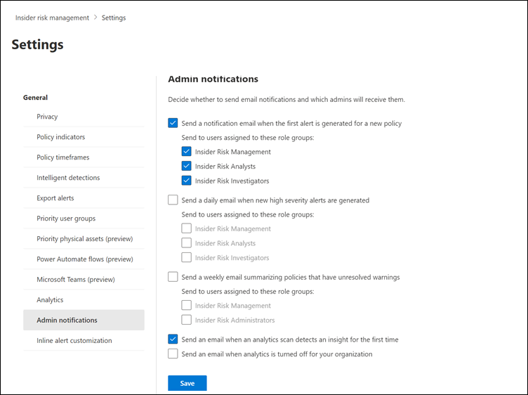

# Enable admin notifications in insider risk management

> [!IMPORTANT]
> Microsoft Purview Insider Risk Management correlates various signals to identify potential malicious or inadvertent insider risks, such as IP theft, data leakage, and security violations. Insider risk management enables customers to create policies to manage security and compliance. Built with privacy by design, users are pseudonymized by default, and role-based access controls and audit logs are in place to help ensure user-level privacy.

When you turn on the **Admin notifications** setting in Microsoft Purview Insider Risk Management, email notifications are automatically sent to selected role groups. You can send email notifications for the following scenarios:

- Send a notification email when the first alert is generated for a new policy. Policies are checked every 24 hours for first-time alerts and notifications aren't sent on subsequent alerts for the policy.
- Send a daily email when new high-severity alerts are generated. Policies are checked every 24 hours for high severity alerts.
- Send a weekly email summarizing policies that have unresolved warnings.

[!INCLUDE [purview-preview](../includes/purview-preview.md)]

If you've enabled insider risk management analytics for your organization, members of the *Insider Risk Management Admins* role group automatically receive an email notification for initial analytics insights for data leaks, theft, and exfiltration activities.

To disable admin and analytics notifications:

1. In the [Microsoft Purview compliance portal](https://compliance.microsoft.com), go to **Insider risk management**, and then select the **Settings** button.
2. Select **Admin notifications**.
3. Clear the check boxes for the following options, as applicable:

    - **Send a notification email when the first alert is generated for a new policy**
    - **Send an email when an analytics scan detects an insight for the first time**
    - **Send an email when analytics is turned off for your organization**

4. Select **Save**.
 
   