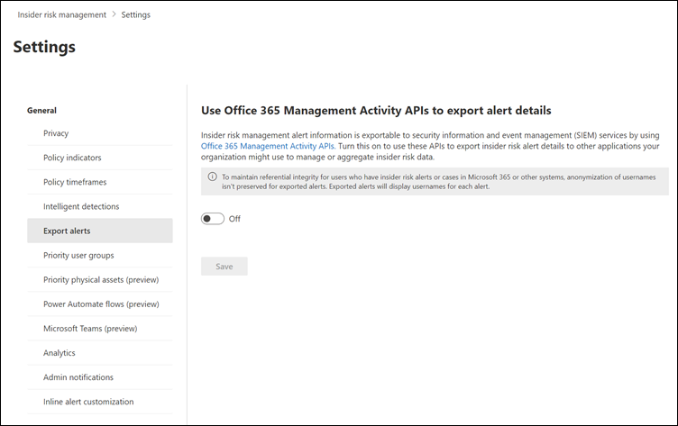

# Export insider risk management alert information 

> [!IMPORTANT]
> Microsoft Purview Insider Risk Management correlates various signals to identify potential malicious or inadvertent insider risks, such as IP theft, data leakage, and security violations. Insider risk management enables customers to create policies to manage security and compliance. Built with privacy by design, users are pseudonymized by default, and role-based access controls and audit logs are in place to help ensure user-level privacy.

Microsoft Purview Insider Risk Management alert information is exportable to security information and event management (SIEM) and security orchestration automated response (SOAR) solutions by using the [Office 365 Management Activity API schema](/office/office-365-management-api/office-365-management-activity-api-schema#security-and-compliance-alerts-schema). You can use the Office 365 Management Activity APIs to export alert information to other applications your organization may use to manage or aggregate insider risk information. Alert information is exported and available every 60 minutes via the Office 365 Management Activity APIs.

[!INCLUDE [purview-preview](../includes/purview-preview.md)]

If your organization uses Microsoft Sentinel, you can also use the out-of-the-box insider risk management data connector to import insider risk alert information to Sentinel. For more information, see [Insider Risk Management (IRM) (preview)](/azure/sentinel/data-connectors-reference#microsoft-365-insider-risk-management-irm-preview) in the Microsoft Sentinel article.

> [!IMPORTANT]
> To maintain referential integrity for users who have insider risk alerts or cases in Microsoft 365 or other systems, anonymization of usernames isn't preserved for exported alerts when using the exporting API or when exporting to [Microsoft Purview eDiscovery solutions](/microsoft-365/compliance/ediscovery). Exported alerts will display usernames for each alert in this case. If you're exporting to CSV files from alerts or cases, anonymization *is* preserved.

To use the APIs to review insider risk alert information:

1. In the insider risk management solutions, select the **Settings** button, and then select **Export alerts**. By default, this setting is disabled for your Microsoft 365 organization.
2. Turn the setting to **On**.
3. Filter the common Office 365 audit activities by *SecurityComplianceAlerts*.
4. Filter *SecurityComplianceAlerts* by the *InsiderRiskManagement* category.

   

Alert information contains information from the Security and Compliance Alerts schema and the [Office 365 Management Activity API](/office/office-365-management-api/office-365-management-activity-api-schema#security-and-compliance-alerts-schema) common schema.

The following fields and values are exported for insider risk management alerts for the Security and Compliance Alerts schema:

| **Alert parameter** | **Description** |
|:------------------|:----------------|
| AlertType | Type of the alert is *Custom*.  |
| AlertId | The GUID of the alert. Insider risk management alerts are mutable. As alert status changes, a new log with the same AlertID is generated. This AlertID can be used to correlate updates for an alert. |
| Category | The category of the alert is *InsiderRiskManagement*. This category can be used to distinguish from these alerts from other security and compliance alerts. |
| Comments | Default comments for the alert. Values are *New Alert* (logged when an alert is created) and *Alert Updated* (logged when there's an update to an alert). Use the AlertID to correlate updates for an alert. |
| Data | The data for the alert, includes the unique user ID, user principal name, and date and time (UTC) when user was triggered into a policy. |
| Name | Policy name for insider risk management policy that generated the alert. |
| PolicyId | The GUID of the insider risk management policy that triggered the alert. |
| Severity | The severity of the alert. Values are *High*, *Medium*, or *Low*. |
| Source | The source of the alert. The value is *Office 365 Security & Compliance*. |
| Status | The status of the alert. Values are *Active* (*Needs Review* in insider risk), *Investigating* (*Confirmed* in insider risk), *Resolved* (*Resolved* in insider risk), *Dismissed* (*Dismissed* in insider risk). |
| Version | The version of the Security and Compliance Alerts schema. |

The following fields and values are exported for insider risk management alerts for the [Office 365 Management Activity API common schema](/office/office-365-management-api/office-365-management-activity-api-schema#common-schema).

- UserId
- Id
- RecordType
- CreationTime
- Operation
- OrganizationId
- UserType
- UserKey