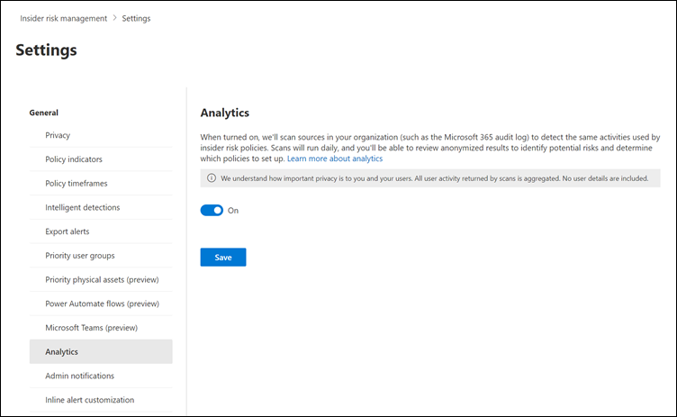
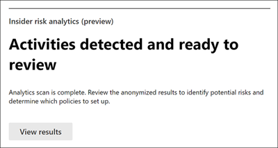
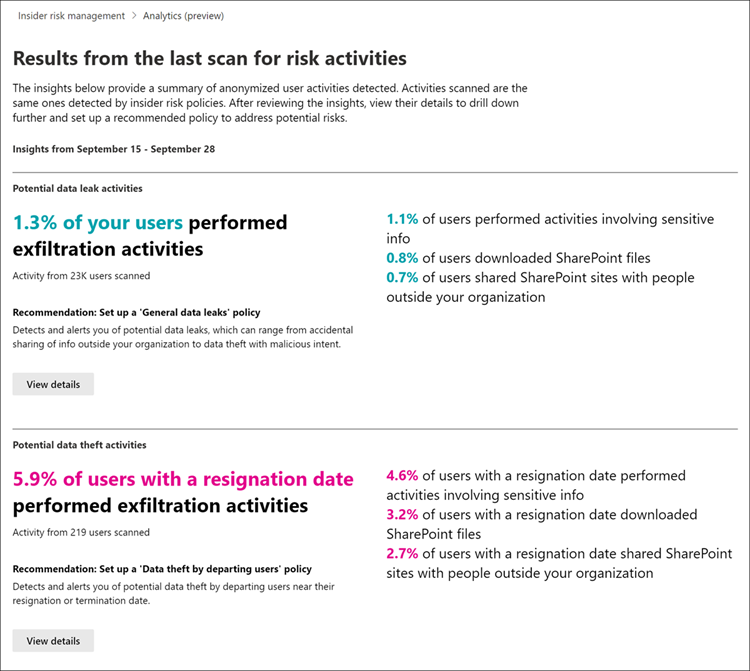
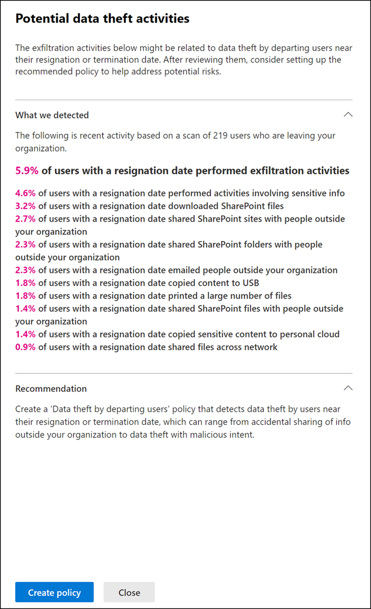

# Enable analytics in insider risk management

> [!IMPORTANT]
> Microsoft Purview Insider Risk Management correlates various signals to identify potential malicious or inadvertent insider risks, such as IP theft, data leakage, and security violations. Insider risk management enables customers to create policies to manage security and compliance. Built with privacy by design, users are pseudonymized by default, and role-based access controls and audit logs are in place to help ensure user-level privacy.

Enabling Microsoft Purview Insider Risk Management analytics offers two important benefits. When analytics is enabled, you can:

- Conduct an evaluation of potential insider risks in your organization without configuring any insider risk policies.
- Receive real-time guidance on configuring indicator threshold settings.

[!INCLUDE [purview-preview](../includes/purview-preview.md)]

## Conduct an evaluation of insider risks in your organization

Microsoft Purview Insider Risk Management analytics enables you to conduct an evaluation of potential insider risks in your organization without configuring any insider risk policies. This evaluation can help your organization identify potential areas of higher user risk and help determine the type and scope of insider risk management policies you might want to configure. Analytics scans offer the following advantages for your organization:

- **Easy to configure**: To get started with analytics scans, select **Run scan** when prompted by the analytics recommendation or go to **Insider risk settings** > **Analytics** and enable analytics.
- **Privacy by design**: Scanned results and insights are returned as aggregated and anonymized user activity.  Individual usernames aren't identifiable by reviewers. Since insider risk management doesn't classify any identity in the organization for analytics, the solution accounts for all the UPNs/identities that might be involved in data leaving the organization boundary. This might involve user accounts, system accounts, guest accounts, and so on.
- **Understand potential risks through consolidated insights**: Scan results can help you quickly identify potential risk areas for your users and which policy would be best to help mitigate these risks.

Check out the [Insider Risk Management Analytics video](https://www.youtube.com/watch?v=5c0P5MCXNXk) to help understand how analytics can help accelerate the identification of potential insider risks.

## Areas scanned

Analytics scans for risk management activity from several sources to help identify insights into potential areas of risk. Depending on your current configuration, analytics looks for qualifying risk activities in the following areas:

- **Microsoft 365 audit logs**: Included in all scans, this is the primary source for identifying most of the potentially risky activities.
- **Exchange Online**: Included in all scans, Exchange Online activity helps identify activities where data in attachments are emailed to external contacts or services.
- **Azure Active Directory**: Included in all scans, Azure AD history helps identify risky activities associated with users with deleted user accounts.
- **Microsoft 365 HR data connector**: If configured, [HR connector](import-hr-data.md) events help identify risky activities associated with users that have resignation or upcoming termination dates.

Analytics insights from scans are based on the same risk management activity signals used by insider risk management policies and report results based on both single and sequence user activities. However, the risk scoring for analytics is based on up to 10 days of activity while insider risk policies use daily activity for insights. When you first enable and run analytics in your organization, you'll see the scan results for one day. If you leave analytics enabled, you'll see the results of each daily scan added to the insight reports for a maximum range of the previous 10 days of activity.

## Receive real-time guidance on configuring indicator threshold settings

Manually tuning policies to reduce "noise" can be a very time-consuming experience that requires you to do a lot of trial and error to determine the desired configuration for your policies. If analytics is turned on, and you decide to customize your indicator threshold settings, you can get real-time insights from analytics if you want to take advantage of a guided (data-driven) threshold configuration experience that will help you configure the appropriate thresholds when you create a new policy or tune an existing one. These insights can help you efficiently adjust the selection of indicators and thresholds of activity occurrence so that you don’t receive too few or too many policy alerts. Real-time analytics (preview) is based on the last 10 days of activity data in your tenant and global exclusions are taken into account. For more information on real-time analytics for threshold settings, [see Indicator level settings](insider-risk-management-settings-policy-indicators.md#indicator-level-settings).

## Enable analytics and start a scan of potential insider risks in your organization

To enable insider risk analytics, you must be a member of the *Insider Risk Management*, *Insider Risk Management Admins*, or *Microsoft 365 Global admin* role group.

1. In the [Microsoft Purview compliance portal](https://compliance.microsoft.com), go to **Insider risk management**.
2. On the **Overview** tab, scroll down to the **Insider risk analytics** card, and then under **Scan for insider risks in your organization**, select **Run scan**. This turns on analytics scanning for your organization. Analytics scan results can take up to 48 hours before insights are available as reports for review.

   > [!TIP]
   > You can also turn on scanning in your organization through the **Settings** button at the top of any insider risk management page. After selecting the button, select **Analytics**, and then turn the setting on.
   >
   >

## View analytics insights after the first analytics scan

After the first analytics scan is complete for your organization, members of the *Insider Risk Management Admins* role group will automatically receive an email notification and can view the initial insights and recommendations for potentially risky activities by your users. Daily scans continue unless you turn off analytics for your organization. Email notifications to admins are provided for each of the three in-scope categories for analytics (data leaks, theft, and exfiltration) after the first instance of potentially risky activity in your organization. Email notifications aren't sent to admins for follow-up risk management activity detection resulting from the daily scans. 

> [!NOTE]
> If the **Analytics** setting is disabled and then re-enabled, automatic email notifications are reset and email notifications are sent to members of the *Insider Risk Management Admins* role group for new scanning insights.

To view potential risks for your organization, go to the **Overview** tab, and then on the **Insider risk analytics** card, select **View results**. 

> [!NOTE]
> If the scan for your organization isn't complete, you'll see a message that the scan is still active.

For completed analyses, you'll see the potential risks discovered in your organization and insights and recommendations to address these risks. Identified risks and specific insights are included in reports grouped by area, the total number of users (all types of Azure AD accounts, including user, guest, system, and so on) with identified risks, the percentage of these users with potentially risky activities, and a recommended insider risk policy to help mitigate these risks. The reports include:

- **Data leaks insights**: For all users that may include accidental oversharing of information outside your organization or data leaks by users with malicious intent.
- **Data theft insights**: For departing users or users with deleted Azure AD accounts that may include risky sharing of information outside your organization or data theft by users with malicious intent.
- **Top exfiltration insights**: For all users that may include sharing data outside of your organization.

To display more information for an insight, select **View details** to display the details pane for the insight. The details pane includes the complete insight results, an insider risk policy recommendation, and the **Create policy** button to quickly help you create the recommended policy. Selecting **Create policy** takes you to the policy wizard and automatically selects the recommended policy template related to the insight. For example, if the analytics insight is for *Data Theft* activity, the *Data Theft* policy template will be pre-selected in the policy wizard for you.

## Turn off analytics

To turn off insider risk analytics, you must be a member of the *Insider Risk Management*, *Insider Risk Management Admins*, or Microsoft 365 *Global admin* role group. 

After you disable analytics:

- Analytics insight reports will remain static and will not be updated for new risks. 
- You won't be able to [see real-time analytics when you customize indicator threshold settings for your policies](insider-risk-management-settings-policy-indicators.md#indicator-level-settings).

To turn off analytics:

1. In the [Microsoft Purview compliance portal](https://compliance.microsoft.com), go to **Insider risk management**.
2. Select the **Settings** button, and then select **Analytics**.
3. On the **Analytics** page, turn the setting to off.