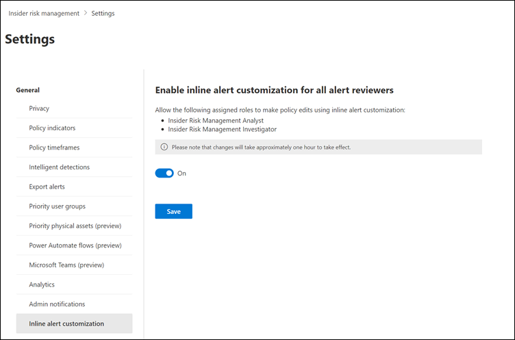

# Configure inline alert customization in insider risk management

> [!IMPORTANT]
> Microsoft Purview Insider Risk Management correlates various signals to identify potential malicious or inadvertent insider risks, such as IP theft, data leakage, and security violations. Insider risk management enables customers to create policies to manage security and compliance. Built with privacy by design, users are pseudonymized by default, and role-based access controls and audit logs are in place to help ensure user-level privacy.

Inline alert customization in Microsoft Purview Insider Risk Management allows you to quickly tune an insider risk management policy directly from the **Alert dashboard** while reviewing the alert. Alerts are generated when a risk management activity meets the thresholds configured in the related policy. To reduce the number of alerts you get from this type of activity, you can change the thresholds or remove the risk management activity from the policy altogether.

[!INCLUDE [purview-preview](../includes/purview-preview.md)]

You can enable inline alert customization to allow users assigned to the *Insider Risk Management Analysts* and *Insider Risk Management Investigators* role groups to edit policy thresholds and to disable specific indicators. If inline alert customization isn't enabled, only users assigned to the *Insider Risk Management Admins* or *Insider Risk Management* role groups can edit these policy conditions. Inline alert customization is supported for alerts regardless of the current alert status, allowing analysts and investigators to update policies for *Dismissed* and *Resolved* alerts if needed.

When enabled, analysts and investigators can select **Reduce alerts for this activity** for an alert on the **Alert dashboard** and can view details about the risk management activity and indicators associated with the alert. Additionally, the current policy thresholds are displayed for the number of events used to create low, medium, and high severity alerts. If **Reduce alerts for this activity** is selected and a previous policy edit has been made that changes the threshold or has removed the associated indicator, you'll see a notification message detailing previous changes to the policy.

Analysts and investigators can choose from the following options on the **Reduce alerts for this activity** pane to quickly edit the policy that created the alert:

- **Reduce alerts using Microsoft's recommended thresholds**: This automatically increases the thresholds in the policy for you. You can review the new recommended threshold settings before changing the policy.
- **Reduce alerts by choosing your own thresholds**: You can manually increase the thresholds for this type of activity for the current and future alerts. You can review the current threshold settings and configure the new threshold settings before changing the policy.
- **Stop getting alerts for this activity**: This removes this indicator from the policy and the risk management activity will no longer be detected by the policy. This applies to all indicators, regardless of whether the indicator is threshold-based.

After choosing an option, analysts and investigators can choose two options to update the policy:

- **Save and dismiss alert**: Saves the changes to the policy and updates the alert status to *Resolved*.
- **Save only**: Saves the changes to the policy, but the alert status remains the same.

## Enable inline alert customization

1. In the [Microsoft Purview compliance portal](https://compliance.microsoft.com), go to **Insider risk management**.
2. Select the **Settings** button, and then select **Inline alert customization**.
3. Turn the setting on.
4. Select **Save**.

   

   > [!NOTE]
   > After turning on the **Inline alert customization** setting, it takes approximately one hour before inline alert customization is available in new and existing policy alerts.
