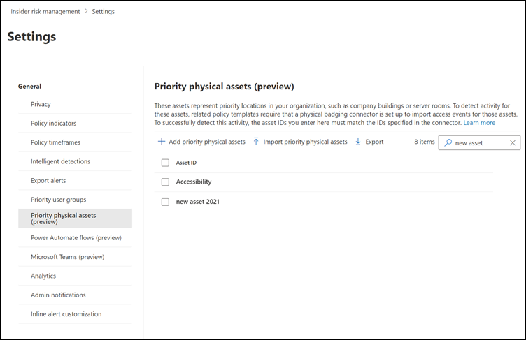

# Identify priority physical assets for insider risk management policies

> [!IMPORTANT]
> Microsoft Purview Insider Risk Management correlates various signals to identify potential malicious or inadvertent insider risks, such as IP theft, data leakage, and security violations. Insider risk management enables customers to create policies to manage security and compliance. Built with privacy by design, users are pseudonymized by default, and role-based access controls and audit logs are in place to help ensure user-level privacy.

Identifying access to priority physical assets and correlating access activity to user events is an important component of your Microsoft Purview Insider Risk Management compliance infrastructure. These physical assets represent priority locations in your organization, such as company buildings, data centers, or server rooms. Insider risk activities may be associated with users working unusual hours, attempting to access these unauthorized sensitive or secure areas, and requests for access to high-level areas without legitimate needs.

[!INCLUDE [purview-preview](../includes/purview-preview.md)]

With priority physical assets enabled and the [Physical badging data connector](import-physical-badging-data.md) configured, insider risk management integrates signals from your physical control and access systems with other user risk activities. By examining patterns of behavior across physical access systems and correlating these activities with other insider risk events, insider risk management can help compliance investigators and analysts make more informed response decisions for alerts. 

Access to priority physical assets is scored and identified in insights differently from access to non-priority assets. For example, your organization has a badging system for users that governs and approves physical access to normal working and sensitive project areas. You have several users working on a sensitive project and these users will return to other areas of your organization when the project is completed. As the sensitive project nears completion, you want to make sure that the project work remains confidential and that access to the project areas is tightly controlled.

You choose to enable the Physical badging data connector in Microsoft 365 to import access information from your physical badging system and specify priority physical assets in insider risk management. By importing information from your badging system and correlating physical access information with other risk activities identified in insider risk management, you notice that one of the users on the project is accessing the project offices after normal working hours and is also exporting large amounts of data to a personal cloud storage service from their normal work area. This physical access activity associated with the online activity may point to possible data theft and compliance investigators and analysts can take appropriate actions as dictated by the circumstances for this user.

## Configure priority physical assets

To configure priority physical assets, you configure the Physical badging connector and use setting controls in the insider risk management solution. To configure priority physical assets, you must be a member of the *Insider Risk Management* or *Insider Risk Management Admin* role group.

1. Follow the configuration steps for insider risk management in the [Getting started with insider risk management](insider-risk-management-configure.md) article. In Step 3, make sure to configure the Physical badging connector.

    > [!IMPORTANT]
    > For insider risk management policies to use and correlate signal data related to departing and terminated users with event data from your physical control and access platforms, you must also configure the Microsoft 365 HR connector. If you enable the Physical badging connector without enabling the Microsoft 365 HR connector, insider risk management policies will only process events for physical access activities for users in your organization.

2. In the [Microsoft Purview compliance portal](https://compliance.microsoft.com), go to **Insider risk management**, select the **Settings** button, and then select **Priority physical assets**.
3. On the **Priority physical assets** page, you can either manually add the physical asset IDs imported by the Physical badging connector or import a CSV file of all physical assets IDs imported by the Physical badging connector:
    1. To manually add physical assets IDs, choose **Add priority physical assets**, enter a physical asset ID, and then select **Add**. Enter other physical asset IDs, and then select **Add priority physical assets** to save all the assets entered.
    2. To add a list of physical asset IDs from a CSV file, choose **Import priority physical assets**. In the file explorer dialog box, select the CSV file you want to import, and then select **Open**. The physical asset IDs from the CSV files are added to the list.
4. In settings, select **Policy indicators**.
5. On the **Policy indicators** page, go to the **Physical access indicators** section, and then select the **Physical access after termination or failed access to sensitive asset** check box.
6. Select **Save**.

## Delete a priority physical asset

You must be a member of the *Insider Risk Management* or *Insider Risk Management Admins* role group to delete a priority physical asset.

> [!IMPORTANT]
> Deleting a priority physical asset removes it from examination by any active policy to which it was previously included. Alerts generated by activities associated with the priority physical asset aren't deleted.

1. In the [Microsoft Purview compliance portal](https://compliance.microsoft.com), go to **Insider risk management**, select the **Settings** button, and then select **Priority physical assets**.
2. On the **Priority physical assets** page, select the asset you want to delete.
3. Select **Delete**.
