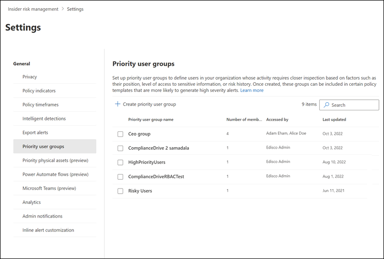

# Prioritize user groups for insider risk management policies

> [!IMPORTANT]
> Microsoft Purview Insider Risk Management correlates various signals to identify potential malicious or inadvertent insider risks, such as IP theft, data leakage, and security violations. Insider risk management enables customers to create policies to manage security and compliance. Built with privacy by design, users are pseudonymized by default, and role-based access controls and audit logs are in place to help ensure user-level privacy.

Users in your organization may have different levels of risk depending on their position, level of access to sensitive information, or risk history. Prioritizing the examination and scoring of the activities of these users can help alert you to potential risks that may have higher consequences for your organization. Priority user groups in Microsoft Purview Insider Risk Management help define the users in your organization that need closer inspection and more sensitive risk scoring. Coupled with the *Security policy violations by priority users* and *Data leaks by priority users* policy templates, users added to a priority user group have an increased likelihood of insider risk alerts and alerts with higher severity levels.

[!INCLUDE [purview-preview](../includes/purview-preview.md)]

Instead of being open to review by all analysts and investigators, priority user groups may also need to restrict review activities to specific users or insider risk role groups. You can choose to assign individual users and role groups to review users, alerts, cases, and reports for each priority user group. Priority user groups can have review permissions assigned to the built-in *Insider Risk Management*, *Insider Risk Management Analysts*, and *Insider Risk Management Investigators* role groups, one or more of these role groups, or to a custom selection of users.

For example, you need to protect against data leaks for a highly confidential project where users have access to sensitive information. You choose to create the *Confidential Project Users* priority user group for users in your organization that work on this project. Also, this priority user group shouldn't have users, alerts, cases, and reports associated with the group visible to all the default insider risk management admins, analysts, and investigators. In settings, you create the *Confidential Project Users* priority user group and assign two users as reviewers that can view data related to the groups. Use the policy wizard and the *Data leaks by priority users* policy template to create a new policy and assign the *Confidential Project Users* priority users group to the policy. Activities examined by the policy for members of the *Confidential Project Users* priority user group are more sensitive to risk and activities by these users are more likely to generate alerts and have alerts with higher severity levels.

## Create a priority user group

You must be a member of the *Insider Risk Management* or *Insider Risk Management Admins* role group to create a priority user group.

1. In the [Microsoft Purview compliance portal](https://compliance.microsoft.com), go to **Insider risk management**, and then select the **Settings** button. 
2. Select **Priority user groups**.
3. On the **Priority user groups** page, select **Create priority user group** to start the group creation wizard.
4. On the **Name and describe the priority user group** page, complete the following fields:
    - **Name (required)**: Enter a friendly name for the priority user group. You can't change the name of the priority user group after you complete the wizard.
    - **Description (optional)**: Enter a description for the priority user group.
5. Select **Next** to continue.
6. On the **Choose members** page, select **Choose members** to search and select which mail-enabled user accounts are included in the group or select the **Select all** check box to add all users in your organization to the group. Select **Add** to continue.
   > [!NOTE]
   > You can add up to 10,000 users to a priority user group. 
7. Select **Next** to continue.
8. On the **Choose who can view this group** page, you must define who can review users, alerts, cases, and reports for the priority user group. At least one user or insider risk management role group must be assigned. Select **Choose users and role groups**, and then select the users or insider risk management role groups you want to assign to the priority user group. Select **Add** to assign the selected users or role groups to the group.
9. Select **Next** to continue.
10. On the **Review** page, review the settings you've chosen for the priority user group. Select the **Edit** links to change any of the group values or select **Submit** to create and activate the priority user group.
11. On the confirmation page, select **Done**.

## Update a priority user group

You must be a member of the *Insider Risk Management* or *Insider Risk Management Admins* role group to update a priority user group.

1. In the [Microsoft Purview compliance portal](https://compliance.microsoft.com), go to **Insider risk management**, and then select the **Settings** button.
2. Select **Priority user groups**.
3. Select the priority user group you want to edit, and then select **Edit group**.
4. On the **Name and describe** page, update the **Description** field if needed. You can't update the name of the priority user group. Select **Next** to continue.
5. On the **Choose members** page, add new members to the group using the **Choose members** control. To remove a user from the group, select the 'X' next to the user you want to remove. Select **Next** to continue.
6. On the **Choose who can view this group** page, add or remove users or role groups that can review users, alerts, cases, and reports for the priority user group.
7. Select **Next** to continue.
8. On the **Review** page, review the update settings you've chosen for the priority user group. Select the **Edit** links to change any of the group values or select **Submit** to update the priority user group.
9. On the confirmation page, select **Done**.

## Delete a priority user group

> [!IMPORTANT]
> Deleting a priority user group will remove it from any active policy to which it is assigned. If you delete a priority user group that is assigned to an active policy, the policy will not contain any in-scope users and will effectively be idle and will not create alerts.

You must be a member of the *Insider Risk Management* or *Insider Risk Management Admin* role group to delete a priority user group.

1. In the [Microsoft Purview compliance portal](https://compliance.microsoft.com), go to **Insider risk management**, and then select the **Settings** button.
2. Select **Priority user groups**.
3. Select the priority user group you want to edit, and then select **Delete**.
4. In the **Delete** dialog box, select **Yes**.