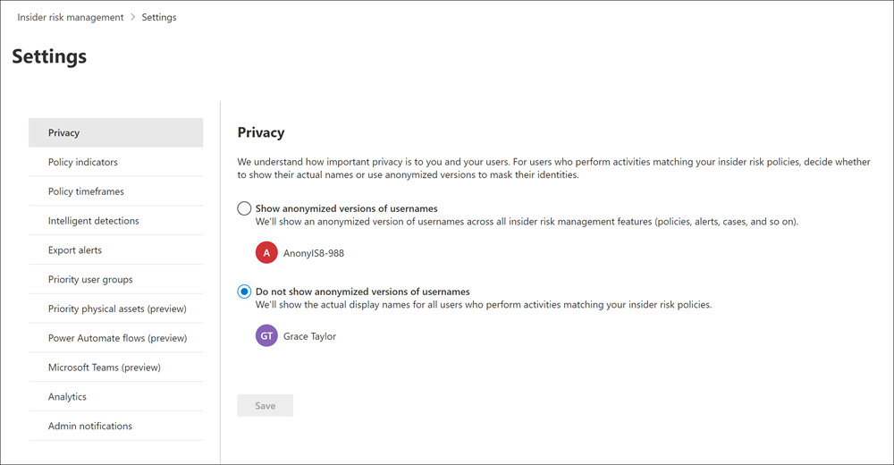

# Manage username privacy in insider risk management

> [!IMPORTANT]
> Microsoft Purview Insider Risk Management correlates various signals to identify potential malicious or inadvertent insider risks, such as IP theft, data leakage, and security violations. Insider risk management enables customers to create policies to manage security and compliance. Built with privacy by design, users are pseudonymized by default, and role-based access controls and audit logs are in place to help ensure user-level privacy.

Protecting the privacy of users that have policy matches in Microsoft Purview Insider Risk Management is important and can help promote objectivity in data investigation and analysis reviews for insider risk alerts. For users with an insider risk policy match, you can choose one of the following settings:

- **Show anonymized versions of usernames**: Names of users are anonymized to prevent admins, data investigators, and reviewers from seeing who is associated with policy alerts. For example, a user 'Grace Taylor' would appear with a randomized pseudonym such as 'AnonIS8-988' in all areas of the insider risk management experience. Choosing this setting anonymizes all users with current and past policy matches and applies to all policies. User profile information in the insider risk alert and case details won't be available when this option is chosen. However, usernames are displayed when adding new users to existing policies or when assigning users to new policies. If you choose to turn off this setting, usernames will be displayed for all users that have current or past policy matches.

    > [!IMPORTANT]
    > To maintain referential integrity for users who have insider risk alerts or cases in Microsoft 365 or other systems, anonymization of usernames isn't preserved for exported alerts when using the exporting API or when exporting to [Microsoft Purview eDiscovery solutions](/microsoft-365/compliance/ediscovery). Exported alerts will display usernames for each alert in this case. If you're exporting to CSV files from alerts or cases, anonymization *is* preserved. 

- **Do not show anonymized versions of usernames**: Usernames are displayed for all current and past policy matches for alerts and cases. User profile information (the name, title, alias, and organization or department) is displayed for the user for all insider risk management alerts and cases.

[!INCLUDE [purview-preview](../includes/purview-preview.md)]

## Change the Privacy setting

1. In insider risk management, select the **Settings** button.
2. Select **Privacy**.
3. Select the option you want, to show anonymized names or not.

   