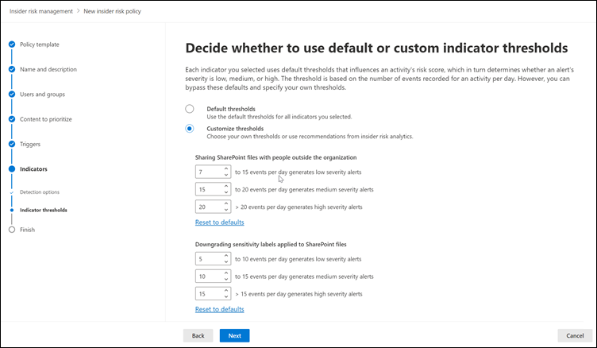
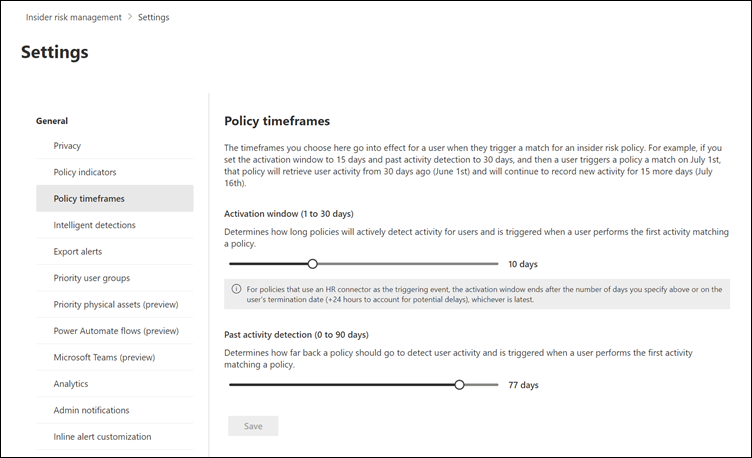

# Get started with insider risk management settings

Insider risk management settings apply to all insider risk management policies, regardless of the template you chose when creating a policy. Settings are configured using the **Insider risk settings** control located at the top of all insider risk management tabs. These settings control policy components for the following areas:

- Privacy
- Indicators
- Policy timelines
- Intelligent detections
- Export alerts (preview)
- Priority user groups (preview)
- Priority physical assets (preview)
- Power Automate flows (preview)
- Microsoft Teams (preview)

Before you get started and create insider risk management policies, it's important to understand these settings and choose setting levels best for the compliance needs for your organization.

## Privacy

Protecting the privacy of users that have policy matches is important and can help promote objectivity in data investigation and analysis reviews for insider risk alerts. For users with an insider risk policy match, you can choose one of the following settings:

- **Show anonymized versions of usernames**: Names of users are anonymized to prevent admins, data investigators, and reviewers from seeing who is associated with policy alerts. For example, a user 'Grace Taylor' would appear with a randomized pseudonym such as 'AnonIS8-988' in all areas of the insider risk management experience. Choosing this setting anonymizes all users with current and past policy matches and applies to all policies. User profile information in the insider risk alert and case details will not be available when this option is chosen. However, usernames are displayed when adding new users to existing policies or when assigning users to new policies. If you choose to turn off this setting, usernames will be displayed for all users that have current or past policy matches.
- **Do not show anonymized versions of usernames**: Usernames are displayed for all current and past policy matches for alerts and cases. User profile information (the name, title, alias, and organization or department) is displayed for the user for all insider risk management alerts and cases.

## Indicators

Insider risk policy templates define the type of risk activities that you want to detect and investigate. Each policy template is based on specific indicators that correspond to specific triggers and risk activities. All indicators are disabled by default, and you must select one or more policy indicators before configuring an insider risk management policy.

Alerts are triggered by policies when users perform activities related to policy indicators that meet a required threshold. Insider risk management uses two types of indicators:

- **Triggering events**: Events that determine if a user is active for an insider risk management policy. If a user is added to an insider risk management policy does not have a triggering event, the user activity is not evaluated by the policy. For example, User A is added to a policy created from the *Data theft by departing users* policy template and the policy and Microsoft 365 HR connector are properly configured. Until User A has a termination date reported by the HR connector, User A activities aren't evaluated by this insider risk management policy for risk. Another example of a triggering event is if a user has a *High* severity DLP policy alert when using *Data leaks* policies.
- **Policy indicators**: Indicators included in insider risk management policies used to determine a risk score for an in-scope user. These policy indicators are only activated after a triggering event occurs for a user. Some examples of policy indicators are when a user copies data to personal cloud storage services or portable storage devices, or if a user shares internal files and folders with unauthorized external parties.

Policy indicators are segmented into the following areas. You can choose the indicators to activate and customize indicator event limits for each indicator level when creating an insider risk policy:

- **Office indicators**: These include policy indicators for SharePoint sites, Teams, and email messaging.
- **Device indicators**: These include policy indicators for activity such as sharing files over the network or with devices. Indicators include activity involving Microsoft Office files, .CSV files, and .PDF files. If you select **Device indicators**, activity is processed only for devices with Windows 10 Build 1809 or higher. For more information on configuring devices for integration with insider risk, see the following [Enable device indicators and onboard devices](insider-risk-management-settings.md#OnboardDevices) section.
- **Security policy violation indicator**: These include indicators from Microsoft Defender for Endpoint related to unapproved or malicious software installation or bypassing security controls. To receive alerts in insider risk management, you must have an active Defender for Endpoint license and insider risk integration enabled. For more information on configuring Defender for Endpoint for insider risk management integration, see [Configure advanced features in Microsoft Defender for Endpoint](https://docs.microsoft.com/windows/security/threat-protection/microsoft-defender-atp/advanced-features\#share-endpoint-alerts-with-microsoft-compliance-center).
- **Risk score boosters**: These include raising the risk score for unusual activities or past policy violations. Enabling risk score boosters increase risk scores and the likelihood of alerts for these types of activities. Risk score boosters can only be selected if one or more indicators above are selected.

In some cases, you may want to limit the insider risk policy indicators that are applied to insider risk policies in your organization. You can turn off the policy indicators for specific areas by disabling them from all insider risk policies. Triggering events cannot be modified for insider risk policy templates.

To define the insider risk policy indicators that are enabled in all insider risk policies, navigate to **Insider risk settings** > **Indicators** and select one or more policy indicators. The indicators selected on the Indicators settings page cannot be individually configured when creating or editing an insider risk policy in the policy wizard.

>[!NOTE]
>It may take several hours for new manually-added users to appear in the **Users dashboard**. Activities for the previous 90 days for these users may take up to 24 hours to display. To view activities for manually added users, select the user on the **Users dashboard** and open the **User activity** tab on the details pane.

### Enable device indicators and onboard devices

To enable the monitoring of risk activities on devices and include policy indicators for these activities, your devices must meet the following requirements and you must complete the following onboarding steps.

#### Step 1: Prepare your endpoints

Make sure that the Windows 10 devices that you plan on reporting in insider risk management meet these requirements.

1. Must be running Windows 10 x64 build 1809 or later and must have installed the [Windows 10 update (OS Build 17763.1075)](https://support.microsoft.com/help/4537818/windows-10-update-kb4537818) from February 20, 2020.
2. All devices must be [Azure Active Directory (AAD) joined](https://docs.microsoft.com/azure/active-directory/devices/concept-azure-ad-join), or Hybrid Azure AD joined.
3. Install Microsoft Chromium Edge browser on the endpoint device to monitor actions for the cloud upload activity. See, [Download the new Microsoft Edge based on Chromium](https://support.microsoft.com/help/4501095/download-the-new-microsoft-edge-based-on-chromium).

#### Step 2: Onboarding devices

You must enable device monitoring and onboard your endpoints before you can monitor for insider risk management activities on a device. Both of these actions are done in the Microsoft 365 Compliance portal.

When you want to onboard devices that haven't been onboarded yet, you'll download the appropriate script and deploy as outlined in the following steps.

If you already have devices onboarded into [Microsoft Defender for Endpoint](https://docs.microsoft.com/windows/security/threat-protection/), they will already appear in the managed devices list. Follow [Step 3: If you have devices onboarded into Microsoft Defender for Endpoint](insider-risk-management-settings.md#OnboardStep3) in the next section.

In this deployment scenario, you'll onboard devices that have not been onboarded yet, and you just want to monitor insider risk activities on Windows 10 devices.

1. Open the [Microsoft compliance center](https://compliance.microsoft.com).
2. Open the Compliance Center settings page and choose **Onboard devices**.

   > [!NOTE]
   > While it usually takes about 60 seconds for device onboarding to be enabled, please allow up to 30 minutes before engaging with Microsoft support.

3. Choose **Device management** to open the **Devices** list. The list will be empty until you onboard devices.
4. Choose **Onboarding** to begin the onboarding process.
5. Choose the way you want to deploy to these additional devices from the **Deployment method** list and then **download package**.
6. Follow the appropriate procedures in [Onboarding tools and methods for Windows 10 machines](https://docs.microsoft.com/windows/security/threat-protection/microsoft-defender-atp/configure-endpoints). This link take you to a landing page where you can access Microsoft Defender for Endpoint procedures that match the deployment package you selected in step 5:
    - Onboard Windows 10 machines using Group Policy
    - Onboard Windows machines using Microsoft Endpoint Configuration Manager
    - Onboard Windows 10 machines using Mobile Device Management tools
    - Onboard Windows 10 machines using a local script
    - Onboard non-persistent virtual desktop infrastructure (VDI) machines.

Once done and endpoint is onboarded, it should be visible in the devices list and the endpoint will start reporting audit activity logs to insider risk management.

> [!NOTE]
> This experience is under license enforcement. Without the required license, data will not be visible or accessible.

#### Step 3: If you have devices onboarded into Microsoft Defender for Endpoint

If Microsoft Defender for Endpoint is already deployed and there are endpoints reporting in, all these endpoints will appear in the managed devices list. You can continue to onboard new devices into insider risk management to expand coverage by using the [Step 2: Onboarding devices](insider-risk-management-settings.md#OnboardStep2) section.

1. Open the [Microsoft compliance center](https://compliance.microsoft.com).
2. Open the Compliance Center settings page and choose **Enable device monitoring**.
3. Choose **Device management** to open the **Devices** list. You should see the list of devices that are already reporting in to Microsoft Defender for Endpoint.
4. Choose **Onboarding** if you need to onboard additional devices.
5. Choose the way you want to deploy to these additional devices from the **Deployment method** list and then **Download package**.
6. Follow the appropriate procedures in [Onboarding tools and methods for Windows 10 machines](https://docs.microsoft.com/windows/security/threat-protection/microsoft-defender-atp/configure-endpoints). This link take you to a landing page where you can access Microsoft Defender for Endpoint procedures that match the deployment package you selected in step 5:
    - Onboard Windows 10 machines using Group Policy
    - Onboard Windows machines using Microsoft Endpoint Configuration Manager
    - Onboard Windows 10 machines using Mobile Device Management tools
    - Onboard Windows 10 machines using a local script
    - Onboard non-persistent virtual desktop infrastructure (VDI) machines.

Once done and endpoint is onboarded, it should be visible under the **Devices** table and the endpoint will start reporting audit activity logs to insider risk management.

> [!NOTE]
>This experience is under license enforcement. Without the required license, data will not be visible or accessible.

### Indicator level settings (preview)

When creating a policy in the policy wizard, you can configure how the daily number of risk events should influence the risk score for insider risk alerts. These indicator settings help you control how the number of occurrences of risk events in your organization should affect the risk score, and consequently the associated alert severity, for these events. If you prefer, you can also choose to keep the default event threshold levels recommended by Microsoft for all enabled indicators.

For example, you decide to enable SharePoint indicators in the insider risk policy settings and to set custom thresholds for SharePoint events when configuring indicators for a new insider risk *Data leaks* policy. While in the insider risk policy wizard, you configure three different daily event levels for each SharePoint indicator to influence the risk score for alerts associated with these events.

For the first daily event level, you set the threshold at *10 or more events per day* for a lower impact to the risk score for the events, *20 or more events per day* for a medium impact to the risk score for the events, and *30 or more events per day* a higher impact to the risk score for the events. These settings effectively mean:

- If there are 1-9 SharePoint events that take place after triggering event, risk scores are minimally impacted and would tend not to generate an alert.
- If there are 10-19  SharePoint events that take place after a triggering event, the risk score is inherently lower and alert severity levels would tend to be at a low level.
- If there are 20-29 SharePoint events that take place after a triggering, the risk score is inherently higher and alert severity levels would tend to be at a medium level.
- If there are 30 or more SharePoint events that take place after a triggering, the risk score is inherently higher and alert severity levels would tend to be at a high level.

## Policy timeframes

Policy timeframes allow you to define past and future review periods that are triggered after policy matches based on events and activities for the insider risk management policy templates. Depending on the policy template you choose, the following policy timeframes are available:

- **Activation window**: Available for all policy templates, the *Activation window* is the defined number of days that the window activates **after** a triggering event. The window activates for 1 to 30 days after a triggering event occurs for any user assigned to the policy. For example, you've configured an insider risk management policy and set the *Activation window* to 30 days. Several months have passed since you configured the policy and a triggering event occurs for one of the users included in the policy. The triggering event activates the *Activation window* and the policy is active for that user for 30 days after the triggering event occurred.
- **Past activity detection**: Available for all policy templates, the *Past activity detection* is the defined number of days that the window activates **before** a triggering event. The window activates for 0 to 180 days before a triggering event occurs for any user assigned to the policy. For example, you've configured an insider risk management policy and set the *Past activity detection* to 90 days. Several months have passed since you configured the policy and a triggering event occurs for one of the users included in the policy. The triggering event activates the *Past activity detection* and the policy gathers historic activities for that user for 90 days prior to the triggering event.

## Intelligent detections

Intelligent detection settings help refine how the detections of risky activities are processed for alerts. In certain circumstances, you may need to define files types to ignore or you want to enforce a detection level for files to help define a minimum bar for alerts. When using offensive language policies, you may need to increase or decrease the detection sensitivity to control the amount of reported policy matches. Use these settings to control overall alert volume, file type exclusions, file volume limits, and the offensive language detection sensitivity.

### Anomaly detections

Anomalous detections include settings for file type exclusions and file volume limits.

- **File type exclusions**: To exclude specific file types from all insider risk management policy matching, enter file type extensions separated by commas. For example, to exclude certain types of music files from policy matches you may enter *aac,mp3,wav,wma* in the **File type exclusions** field. Files with these extensions would be ignored by all insider risk management policies.
- **File volume cut-off limit**: To define a minimum file level before activity alerts are reported in insider risk policies, enter the number of files. For example, you would enter '10' if you do not want to generate insider risk alerts when a user downloads 10 files or less, even if the policies consider this activity an anomaly.

### Offensive language detections

>[!IMPORTANT]
>Starting October 16, 2020, you will no longer be able to create policies using this template. Any active policies that use this template will work until they're permanently removed in January 2021. We are deprecating the Offensive Language built-in classifier that supports this template because it has been producing a high number of false positives. To address risk issues for offensive language, we recommend using Microsoft 365 [communication compliance](communication-compliance.md) policies. For more information about built-in classifiers, see [Getting started with trainable classifiers](classifier-get-started-with.md).

To adjust the sensitivity of the offensive language classifier for policies using the *Offensive language in email* template, choose one of the following settings:

- **Low**: The lowest sensitivity level with the broadest range for detection offensive language and sentiment. The probability of false positives for offensive language matching is elevated.
- **Medium**: The mid-level sensitivity level with a balanced range for detection offensive language and sentiment. The probability of false positives for offensive language matching is average.
- **High**: The highest sensitivity level with a narrow range for detection offensive language and sentiment. The probability of false positives for offensive language matching is low.

### Alert volume

User activities detected by insider risk policies are assigned a specific risk score, which in turn determines the alert severity (low, medium, high). By default, we'll generate a certain amount of low, medium, and high severity alerts, but you can increase or decrease the volume to suit your needs. To adjust the volume of alerts for all insider risk management policies, choose one of the following settings:

- **Fewer alerts**: You'll see all high severity alerts, fewer medium severity alerts, and no low severity ones. This setting level means you might miss some true positives.
- **Default volume**: You'll see all high severity alerts and a balanced amount of medium and low severity alerts.
- **More alerts**: You'll see all medium and high severity alerts and most low severity alerts. This setting level might result in more false positives.

### Microsoft Defender for Endpoint (preview)

[Microsoft Defender for Endpoint](https://docs.microsoft.com/windows/security/threat-protection/microsoft-defender-atp/microsoft-defender-advanced-threat-protection) is an enterprise endpoint security platform designed to help enterprise networks prevent, detect, investigate, and respond to advanced threats. To have better visibility of security violation in your organization, you can import and filter Defender for Endpoint alerts for activities used in policies created from insider risk management security violation policy templates.

Depending on the types of signals you are interested in, you can choose to import alerts to insider risk management based on the Defender for Endpoint alert triage status. You can define one or more of the following alert triage statuses in the global settings to import:

- Unknown
- New
- In progress
- Resolved

Alerts from Defender for Endpoint are imported daily. Depending on the triage status you choose, you may see multiple user activities for the same alert as the triage status changes in Defender for Endpoint.

For example, if you select *New*, *In progress*, and *Resolved* for this setting, when a Microsoft Defender for Endpoint alert is generated and the status is *New*, an initial alert activity is imported for the user in insider risk. When the Defender for Endpoint triage status changes to *In progress*, a second activity for this alert is imported for the user in insider risk. When the final Defender for Endpoint triage status of *Resolved* is set, a third activity for this alert is imported for the user in insider risk. This functionality allows investigators to follow the progression of the Defender for Endpoint alerts and choose the level of visibility that their investigation requires.

>[!IMPORTANT]
>You'll need to have Microsoft Defender for Endpoint configured in your organization and enable Defender for Endpoint for insider risk management integration in the Defender Security Center to import security violation alerts. For more information on configuring Defender for Endpoint for insider risk management integration, see [Configure advanced features in Defender for Endpoint](https://docs.microsoft.com/windows/security/threat-protection/microsoft-defender-atp/advanced-features\#share-endpoint-alerts-with-microsoft-compliance-center).

### Domains (preview)

Domain settings help you define risk levels for communications to specific domains. These communications include sharing files, email messages, or downloading content. By specifying domains in these settings, you can increase or decrease the risk scoring for activity that takes place with these domains. For example, to specify contoso.com and sales.wingtiptoys.com as allowed domains, you will enter 'contoso.com sales.wingtiptoys.com' in the **Allowed domains** field.

For each of the following domain settings, you can enter up to 500 domains:

- **Unallowed domains:** By specifying unallowed domains, activity that takes place with these domains will have *higher* risk scores.
- **Allowed domains:** By specifying allowed domains in settings, activity that takes place with these domains will have *lower* risk scores and is treated similarly to how internal organization activity is treated. For example, email activities to these domains are analyzed similarly to how internal email activity is analyzed.
- **Third party domains:** Third party domains are domains used for business purposes at your organization and sensitive content may be stored across these locations. By specifying a third party domain, you can receive alerts for any risky activity on these domains.

## Export alerts (preview)

Insider risk management alert information is exportable to security information and event management (SIEM) services via the [Office 365 Management Activity API schema](https://docs.microsoft.com/office/office-365-management-api/office-365-management-activity-api-schema#security-and-compliance-alerts-schema). You can use the Office 365 Management Activity APIs to export alert information to other applications your organization may use to manage or aggregate insider risk information.

To use the APIs to review insider risk alert information:

1. Enable Office 365 Management Activity API support in **Insider risk management** > **Settings** > **Export**. By default, this setting is disabled for your Microsoft 365 organization.
2. Filter the common Office 365 audit activities by *SecurityComplianceAlerts*.
3. Filter *SecurityComplianceAlerts* by the *InsiderRiskManagement* category.

Alert information contains information from the security and compliance alert schema and the Office 365 Management Activity API common schema.

The following fields and values are exported for insider risk management alerts for the Security & Compliance alert schema:

| **Alert parameter** | **Description** |
|:------------------|:----------------|
| AlertType | Type of the alert is *Custom*.  |
| AlertId | The GUID of the alert. Insider risk management alerts are mutable. As alert status changes, a new log with the same AlertID is generated. This AlertID can be used to correlate updates for an alert. |
| Category | The category of the alert is *InsiderRiskManagement*. This category can be used to distinguish from these alerts from other Security & Compliance alerts. |
| Comments | Default comments for the alert. Values are *New Alert* (logged when an alert is created) and *Alert Updated* (logged when there is an update to an alert). Use the AlertID to correlate updates for an alert. |
| Data | The data for the alert, includes the unique user ID, user principal name, and date and time (UTC) when user was triggered into a policy. |
| Name | Policy name for insider risk management policy that generated the alert. |
| PolicyId | The GUID of the insider risk management policy that triggered the alert. |
| Severity | The severity of the alert. Values are *High*, *Medium*, or *Low*. |
| Source | The source of the alert. The value is *Office 365 Security & Compliance*. |
| Status | The status of the alert. Values are *Active* (*Needs Review* in insider risk), *Investigating* (*Confirmed* in insider risk), *Resolved* (*Resolved* in insider risk), *Dismissed* (*Dismissed* in insider risk). |
| Version | The version of the security and compliance alert schema. |

The following fields and values are exported for insider risk management alerts for the [Office 365 Management Activity API common schema](https://docs.microsoft.com/office/office-365-management-api/office-365-management-activity-api-schema#common-schema).

- UserId
- Id
- RecordType
- CreationTime
- Operation
- OrganizationId
- UserType
- UserKey

## Priority user groups (preview)

Users in your organization may have different levels of risk depending on their position, level of access to sensitive information, or risk history. Prioritizing the examination and scoring of the activities of these users can help alert you to potential risks that may have higher consequences for your organization. Priority user groups in insider risk management help define the users in your organization that need closer inspection and more sensitive risk scoring. Coupled with the *Security policy violations by priority users* and *Data leaks by priority users* policy templates, users added to a priority user group have an increased likelihood of insider risk alerts and alerts with higher severity levels.

For example, you need to protect against data leaks for a highly confidential project where users have access to sensitive information. You choose to create *Confidential Project* *Users* priority user group for users in your organization that work on this project. Using the policy wizard and the *Data leaks by priority users* policy template, you create a new policy and assign the *Confidential Project Users* priority users group to the policy. Activities examined by the policy for members of the *Confidential Project Users* priority user group are more sensitive to risk and activities by these users will be more likely to generate an alert and have alerts with higher severity levels.

### Create a priority user group

To create a new priority user group, you'll use setting controls in the **Insider risk management** solution in the Microsoft 365 compliance center. To create a priority user group, you must be a member of the *Insider Risk Management* or *Insider Risk Management Admin* role group.

Complete the following steps to create a priority user group:

1. In the [Microsoft 365 compliance center](https://compliance.microsoft.com), go to **Insider risk management** and select **Insider risk settings**.
2. Select the **Priority user groups** tab
3. On the **Priority user groups** tab, select **Create priority user group** to start the group creation wizard.
4. On the **Define group** page, complete the following fields:
    - **Name (required)**: Enter a friendly name for the priority user group. You can't change the name of the priority user group after you complete the wizard.
    - **Description (optional)**: Enter a description for the priority user group.
5. Select **Next** to continue.
6. On the **Choose members** page, select **Choose members** to search and select which mail-enabled user accounts are included in the group or select the **Select all** checkbox to add all users in your organization to the group. Select **Add** to continue or **Cancel** to close without adding any users to the group.
7. Select **Next** to continue.
8. On the **Review** page, review the settings you've chosen for the priority user group. Select **Edit** to change any of the group values or select **Submit** to create and activate the priority user group.
9. On the confirmation page, select **Done** to exit the wizard.

### Update a priority user group

To update an existing priority user group, you'll use setting controls in the **Insider risk management** solution in the Microsoft 365 compliance center. To update a priority user group, you must be a member of the *Insider Risk Management* or *Insider Risk Management Admin* role group.

Complete the following steps to edit a priority user group:

1. In the [Microsoft 365 compliance center](https://compliance.microsoft.com), go to **Insider risk management** and select **Insider risk settings**.
2. Select the **Priority user groups** tab
3. Select the priority user group you want to edit and select **Edit group**.
4. On the **Define group** page, update the Description field if needed. You can't update the name of the priority user group. Select **Next** to continue.
5. On the **Choose members** page, add new members to the group using the **Choose members** control. To remove a user from the group, select the 'X' next to the user you wish to remove. Select **Next** to continue.
6. On the **Review** page, review the update settings you've chosen for the priority user group. Select **Edit** to change any of the group values or select **Submit** to update the priority user group.
7. On the confirmation page, select **Done** to exit the wizard.

### Delete a priority user group

To delete an existing priority user group, you'll use setting controls in the **Insider risk management** solution in the Microsoft 365 compliance center. To delete a priority user group, you must be a member of the *Insider Risk Management* or *Insider Risk Management Admin* role group.

>[!IMPORTANT]
>Deleting a priority user group will remove it from any active policy to which it is assigned. If you delete a priority user group that is assigned to an active policy, the policy will not contain any in-scope users and will effectively be idle and will not create alerts.

Complete the following steps to delete a priority user group:

1. In the [Microsoft 365 compliance center](https://compliance.microsoft.com), go to **Insider risk management** and select **Insider risk settings**.
2. Select the **Priority user groups** tab
3. Select the priority user group you want to edit and select **Delete** from the dashboard menu.
4. On the **Delete** dialog, select **Yes** to delete the priority user group or select **Cancel** to return to the dashboard.

## Priority physical assets (preview)

Identifying access to priority physical assets and correlating access activity to user events is an important component of your compliance infrastructure. These physical assets represent priority locations in your organization, such as company buildings, data centers, or server rooms. Insider risk activities may be associated with users working unusual hours, attempting to access these unauthorized sensitive or secure areas, and requests for access to high-level areas without legitimate needs.

With priority physical assets enabled and the [Physical badging data connector](import-physical-badging-data.md) configured, insider risk management integrates signals from your physical control and access systems with other user risk activities. By examining patterns of behavior across physical access systems and correlating these activities with other insider risk events, insider risk management can help compliance investigators and analysts make more informed response decisions for alerts. Access to priority physical assets are scored and identified in insights differently from access to non-priority assets.

For example, your organization has a badging system for users that monitors and approves physical access to normal working and sensitive project areas. You have several users working on a sensitive project and these users will return to other areas of your organization when the project is completed. As the sensitive project nears completion, you want to make sure that the project work remains confidential and that access to the project areas is tightly controlled.

You choose to enable the Physical badging data connector in Microsoft 365 to import access information from your physical badging system and specify priority physical assets in insider risk management. By importing information from your badging system and correlating physical access information with other risk activities identified in insider risk management, you notice that one of the users on the project is accessing the project offices after normal working hours and is also exporting large amounts of data to a personal cloud storage service from their normal work area. This physical access activity associated with the online activity may point to possible data theft and compliance investigators and analysts can take appropriate actions as dictated by the circumstances for this user.

### Configure priority physical assets

To configure priority physical assets, you'll configure the Physical badging connector and use setting controls in the **Insider risk management** solution in the Microsoft 365 compliance center. To configure priority physical assets, you must be a member of the *Insider Risk Management* or *Insider Risk Management Admin role group*.

Complete the following steps to configure priority physical assets:

1. Follow the configuration steps for insider risk management in the [Getting started with insider risk management](insider-risk-management-configure.md) article. In Step 3, make sure you configure the Physical badging connector.

    >[!IMPORTANT]
    >For insider risk management policies to use and correlate signal data related to departing and terminated users with event data from your physical control and access platforms, you must also configure the Microsoft 365 HR connector. If you enable the Physical badging connector without enabling the Microsoft 365 HR connector, insider risk management policies will only process events for physical access activities for users in your organization.

2. In the [Microsoft 365 compliance center](https://compliance.microsoft.com), go to **Insider risk management** and select **Insider risk settings** > **Priority physical assets**.
3. On the **Priority physical assets** page, you can either manually add the physical asset IDs you want to monitor for the asset events imported by the Physical badging connector or import a .CSV file of all physical assets IDs imported by the Physical badging connector:
    a) To manually add physical assets IDs, choose **Add priority physical assets**, enter a physical asset ID, then select **Add**. Enter additional physical asset IDs and then select **Add priority physical assets** to save all the assets entered.
    b) To add a list of physical asset IDs from a .CSV file, choose **Import priority physical assets**. From the file explorer dialog, select the .CSV file you wish to import, then select **Open**. The physical asset IDs from the .CSV files are added to the list.
4. Navigate to the **Policy indicators** tab in Settings.
5. On the **Policy indicators** page, navigate to the **Physical access indicators** section and select the checkbox for **Physical access after termination or failed access to sensitive asset**.
6. Select **Save** to configure and exit.

### Delete a priority physical asset

To delete an existing priority physical asset, you'll use setting controls in the Insider risk management solution in the Microsoft 365 compliance center. To delete a priority physical asset, you must be a member of the Insider Risk Management or Insider Risk Management Admin role group.

>[!IMPORTANT]
>Deleting a priority physical asset removes it from examination by any active policy to which it was previously included. Alerts generated by activities associated with the priority physical asset aren't deleted.

Complete the following steps to delete a priority physical asset:

1. In the [Microsoft 365 compliance center](https://compliance.microsoft.com), go to **Insider risk management** and select **Insider risk settings** > **Priority physical assets**.
2. On the **Priority physical assets** page, select the asset you want to delete.
3. Select **Delete** on the action menu to delete the asset.

## Power Automate flows (preview)

[Microsoft Power Automate](https://docs.microsoft.com/power-automate/getting-started) is a workflow service that automates actions across applications and services. By using flows from templates or created manually, you can automate common tasks associated with these applications and services. When you enable Power Automate flows for insider risk management, you can automate important tasks for cases and users. You can configure Power Automate flows to retrieve user, alert, and case information and share this information with stakeholders and other applications, as well as automate actions in insider risk management, such as posting to case notes. Power Automate flows are applicable for cases and any user in scope for a policy.

Customers with Microsoft 365 subscriptions that include insider risk management do not need additional Power Automate licenses to use the recommended insider risk management Power Automate templates. These templates can be customized to support your organization and cover core insider risk management scenarios. If you choose to use premium Power Automate features in these templates, create a custom template using the Microsoft 365 compliance connector, or use Power Automate templates for other compliance areas in Microsoft 365, you may need additional Power Automate licenses.

>[!IMPORTANT]
>Are you receiving prompts for additional license validation when testing Power Automate flows? Your organization may not have received service updates for this preview feature yet. Updates are being deployed and all organizations with Microsoft 365 subscriptions that include insider risk management should have license support for flows created from the recommended Power Automate templates by October 30, 2020.

The following Power Automate templates are provided to customers to support process automation for insider risk management users and cases:

- **Notify users when they're added to an insider risk policy**: This template is for organizations that have internal policies, privacy, or regulatory requirements that users must be notified when they are subject to insider risk management policies. When this flow is configured and selected for a user in the users page, users and their managers are sent an email message when the user is added to an insider risk management policy. This template also supports updating a SharePoint list hosted on a SharePoint site to help track notification message details like date/time and the message recipient. If you've chosen to anonymize users in **Privacy settings**, flows created from this template will not function as intended so that user privacy is maintained. Power Automate flows using this template are available on the **Users dashboard**.
- **Request information from HR or business about a user in an insider risk case**: When acting on a case, insider risk analysts and investigators may need to consult with HR or other stakeholders to understand the context of the case activities. When this flow is configured and selected for a case, analysts and investigators send an email message to HR and business stakeholders configured for this flow. Each recipient is sent a message with pre-configured or customizable response options. When recipients select a response option, the response is recorded as a case note and includes recipient and date/time information. If you've chosen to anonymize users in **Privacy settings**, flows created from this template will not function as intended so that user privacy is maintained. Power Automate flows using this template are available on the **Cases dashboard**.
- **Notify manager when a user has an insider risk alert**: Some organizations may need to have immediate management notification when a user has an insider risk management alert. When this flow is configured and selected, the manager for the case user is sent an email message with the following information about all case alerts: 
    - Applicable policy for the alert
    - Date/Time of the alert
    - Severity level of the alert

    The flow automatically updates the case notes that the message was sent and that the flow was activated. If you've chosen to anonymize users in **Privacy settings**, flows created from this template will not function as intended so that user privacy is maintained. Power Automate flows using this template are available on the **Cases dashboard**.

- **Add calendar reminder to follow up on an insider risk case**: This template allows risk investigators and analysts to add calendar reminders for cases to their Office 365 Outlook calendar. This flow eliminates the need for users to exit or switch out of the insider risk management workflow when processing cases and triaging alerts. When this flow is configured and selected, a reminder is added to Office 365 Outlook calendar for the user running the flow. Power Automate flows using this template are available on the **Cases dashboard**.

### Create a Power Automate flow from insider risk management template

To create a Power Automate flow from a recommended  insider risk management template, you'll use the settings controls in the **Insider risk management** solution in the Microsoft 365 compliance center or the **Manage Power Automate flows** option from the **Automate** control when working directly in the **Cases** or **Users dashboards**.

To create a Power Automate flow in the settings area, you must be a member of the *Insider Risk Management* or *Insider Risk Management Admin* role group. To create a Power Automate flow with the **Manage Power Automate flows** option, you must be a member of at least one insider risk management role group.

Complete the following steps to create a Power Automate flow from a recommended insider risk management template:

1. In the [Microsoft 365 compliance center](https://compliance.microsoft.com/), go to **Insider risk management** and select **Insider risk settings** > **Power Automate flows**. You can also access from the **Cases** or **Users dashboards** pages by choosing **Automate** > **Manage Power Automate flows**.
2. On the **Power Automate flows** page, select a recommended template from the **Insider risk management templates you may like** section on the page.
3. The flow lists the embedded connections needed for the flow and will note if the connection statuses are available. If needed, update any connections that aren't displayed as available. Select **Continue**.
4. By default, the recommended flows are pre-configured with the recommended insider risk management and Microsoft 365 service data fields required to complete the assigned task for the flow. If needed, customize the flow components by using the **Show advanced options** control and configuring the available properties for the flow component.
5. If needed, add any additional steps to the flow by selecting the **New step** button. In most cases, this should not be needed for the recommended default templates.
6. Select **Save draft** to save the flow for further configuration or select **Save** to complete the configuration for the flow.
7. Select **Close** to return to the **Power Automate flow** page. The new template will be listed as a flow on the **My flows** tabs and is automatically available from the **Automate** dropdown control when working with insider risk management cases for the user creating the flow.

>[!IMPORTANT]
>If other users in your organization need access to the flow, the flow must be shared.

### Create a custom Power Automate flow for insider risk management

Some processes and workflows for your organization may be outside of the recommended insider risk management flow templates and you may have the need to create custom Power Automate flows for insider risk management areas. Power Automate flows are flexible and support extensive customization, but there are steps that need to be taken to integrate with insider risk management features.

Complete the following steps to create a custom Power Automate template for insider risk management:

1. **Check your Power Automate flow license**: To create customized Power Automate flows that use insider risk management triggers, you'll need a Power Automate license. The recommended insider risk management flow templates do not require additional licensing and are included as part of your insider risk management license.
2. **Create an automated flow**: Create a flow that performs one or more tasks after it's triggered by an insider risk management event. For details on how to create an automated flow, see [Create a flow in Power Automate](https://docs.microsoft.com/power-automate/get-started-logic-flow).
3. **Select the Microsoft 365 compliance connector**: Search for and select the Microsoft 365 compliance connector. This connector enables insider risk management triggers and actions. For more information on connectors, see the [Connector reference overview](https://docs.microsoft.com/connectors/connector-reference/) article.
4. **Choose insider risk management triggers for your flow**: Insider risk management has two triggers available for custom Power Automate flows:
    - **For a selected insider risk management case**: Flows with this trigger can be selected from the insider risk management Cases dashboard page.
    - **For a selected insider risk management user**: Flows with this trigger can be selected from the insider risk management Users dashboard page.
5. Choose insider risk management actions for your flow: You can choose from several actions for insider risk management to include in your custom flow:
    - Get insider risk management alert
    - Get insider risk management case
    - Get insider risk management user
    - Get insider risk management alerts for a case
    - Add insider risk management case note

### Share a Power Automate flow

By default, Power Automate flows created by a user are only available to that user. For other insider risk management users to have access and use a flow, the flow must be shared by the flow creator. To share a flow, you'll use the settings controls in the **Insider risk management solution** in the Microsoft 365 compliance center or the **Manage Power Automate flows** option from the Automate control when working directly in the **Cases** or **Users dashboard** pages. Once you have shared a flow, everyone who it has been shared with can access the flow in the **Automate** control dropdown in the **Case** and **User dashboards**.

To share a Power Automate flow in the settings area, you must be a member of the *Insider Risk Management* or *Insider Risk Management Admin* role group. To share a Power Automate flow with the **Manage Power Automate flows** option, you must be a member of at least one insider risk management role group.

Complete the following steps to share a Power Automate flow:

1. In the [Microsoft 365 compliance center](htttps://compliance.microsoft.com), go to **Insider risk management** and select **Insider risk settings** > **Power Automate flows**. You can also access from the **Cases** or **Users dashboards** pages by choosing **Automate** > **Manage Power Automate flows**.
2. On the **Power Automate flows** page, select the **My flows** or **Team flows** tab.
3. Select the flow to share, then select **Share** from the flow options menu.
4. On the flow sharing page, enter the name of the user or group you want to add as an owner for the flow.
5. On the **Connection Used** dialog, select **OK** to acknowledge that the added user or group will have full access to the flow.

### Edit a Power Automate flow

To edit a flow, you'll use the settings controls in the **Insider risk management** solution in the Microsoft 365 compliance center or the **Manage Power Automate flows** option from the **Automate** control when working directly in the **Cases** or **Users dashboards**.

To edit a Power Automate flow in the settings area, you must be a member of the *Insider Risk Management* or *Insider Risk Management Admin* role group. To edit a Power Automate flow with the **Manage Power Automate flows** option, you must be a member of at least one insider risk management role group.

Complete the following steps to edit a Power Automate flow:

1. In the [Microsoft 365 compliance center](htttps://compliance.microsoft.com), go to **Insider risk management** and select **Insider risk settings** > **Power Automate flows**. You can also access from the **Cases** or **Users dashboards** pages by choosing **Automate** > **Manage Power Automate flows**.
2. On the **Power Automate flows** page, select a flow to edit and select **Edit** from the flow control menu.
3. Select the **ellipsis** > **Settings** to change a flow component setting or **ellipsis** > **Delete** to delete a flow component.
4. Select **Save** and then **Close** to complete editing the flow.

### Delete a Power Automate flow

To delete a flow, you'll use the settings controls in the **Insider risk management** solution in the Microsoft 365 compliance center or the **Manage Power Automate flows** option from the **Automate** control when working directly in the **Cases** or **Users dashboards**. When a flow is deleted, it is removed as an option for all users.

To delete a Power Automate flow in the settings area, you must be a member of the *Insider Risk Management* or *Insider Risk Management Admin* role group. To delete a Power Automate flow with the **Manage Power Automate flows** option, you must be a member of at least one insider risk management role group.

Complete the following steps to delete a Power Automate flow:

1. In the [Microsoft 365 compliance center](htttps://compliance.microsoft.com), go to **Insider risk management** and select **Insider risk settings** > **Power Automate flows**. You can also access from the **Cases** or **Users dashboards** pages by choosing **Automate** > **Manage Power Automate flows**.
2. On the **Power Automate flows** page, select a flow to delete and select **Delete** from the flow control menu.
3. On the deletion confirmation dialog, select **Delete** to remove the flow or select **Cancel** to exit the deletion action.

## Microsoft Teams (preview)

Compliance analysts and investigators can easily use Microsoft Teams for collaboration on insider risk management cases. They can coordinate and communicate with other stakeholders in Microsoft Teams to:

- Coordinate and review response activities for cases in private Teams channels
- Securely share and store files and evidence related to individual cases
- Track and review response activities by analysts and investigators

After Microsoft Teams is enabled for insider risk management, a dedicated Microsoft Teams team is created every time an alert is confirmed and a case is created. By default, the team automatically includes all members of the *Insider Risk Management*, *Insider Risk Management Analysts*, and *Insider Risk Management Investigators* role groups (up to 100 initial users). Additional organization contributors may be added to the team after it is created and as appropriate. For existing cases created before enabling Microsoft Teams, analysts and investigators can choose to create a new Microsoft Teams team when working in a case if needed.  Once you resolve the associated case in insider risk management, the team is automatically archived (moved to hidden and read-only).

For more information on how to use teams and channels in Microsoft Teams, see [Overview of teams and channels in Microsoft Teams](https://docs.microsoft.com/MicrosoftTeams/teams-channels-overview).

Enabling Microsoft Teams support for cases is quick and easy to configure. To enable Microsoft Teams for insider risk management, complete the following steps:

1. In the [Microsoft 365 compliance center](htttps://compliance.microsoft.com), go to **Insider risk management** > **Insider risk settings**.
2. Select the **Microsoft Teams** tab.
3. Enable Microsoft Teams integration for insider risk management.
4. Select **Save** to configure and exit.

### Create a Microsoft Teams team for existing cases

If you enable Microsoft Teams support for insider risk management after you have existing cases, you'll need to manually create a team for each case as needed. After enabling Microsoft Teams support in insider risk management settings, new cases will automatically create a new Microsoft Teams team.

Users need permission to create Microsoft 365 groups in your organization to create a Microsoft Teams team from a case. For more information about managing permissions for Microsoft 365 Groups, see [Manage who can create Microsoft 365 Groups](https://docs.microsoft.com/microsoft-365/solutions/manage-creation-of-groups).

To create a team for a case, you'll use the Create Microsoft Team control when working directly in an existing case. Complete the following steps to create a new team:

1. In the [Microsoft 365 compliance center](htttps://compliance.microsoft.com), go to **Insider risk management** > **Cases** and select an existing case.
2. On the case action menu, select **Create Microsoft Team**.
3. In the **Team name** field, enter a name for the new Microsoft Teams team.
4. Select **Create Microsoft team** and then select **Close**.

Depending on the number of users assigned to insider risk management role groups, it may take 15 minutes for all investigators and analysts to be added to the Microsoft Teams team for a case.
