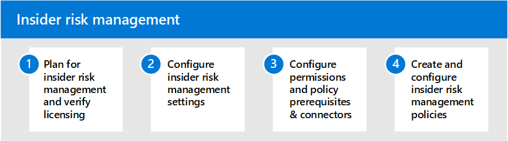

# Insider risk management in Microsoft 365

Increasingly, employees have more access to create, manage, and share data across a broad spectrum of platforms and services. In most cases, organizations have limited resources and tools to identify and mitigate organization-wide risks while also meeting compliance requirements and employee privacy standards. These risks may include data theft by departing employees and data leaks of information outside your organization by accidental oversharing or malicious intent.

Insider risk management in Microsoft 365 uses the full breadth of service and 3rd-party indicators to help you quickly identify, triage, and act on risky user activity. By using logs from Microsoft 365 and Microsoft Graph, insider risk management allows you to define specific policies to identify risk indicators and to take action to mitigate these risks.

## Configure insider risk management for Microsoft 365

Use the following steps to configure insider risk management for your organization:

1. Learn about [insider risk management](insider-risk-management.md) in Microsoft 365
2. Plan for [insider risk management and verify licensing](insider-risk-management-plan.md)
3. Configure [insider risk management settings](insider-risk-management-settings.md)
4. Configure [permissions](insider-risk-management-configure.md#step-1-enable-permissions-for-insider-risk-management) and [policy prerequisites & connectors](insider-risk-management-configure.md#step-4-configure-prerequisites-for-policies)
5. Create and configure [insider risk management policies](insider-risk-management-configure.md#step-6-create-an-insider-risk-management-policy)

## More information about insider risk management

- [Manage insider risk policies](insider-risk-management-policies.md)
- [Investigate insider risk alerts](insider-risk-management-alerts.md)
- [Act on insider risk cases](insider-risk-management-cases.md)