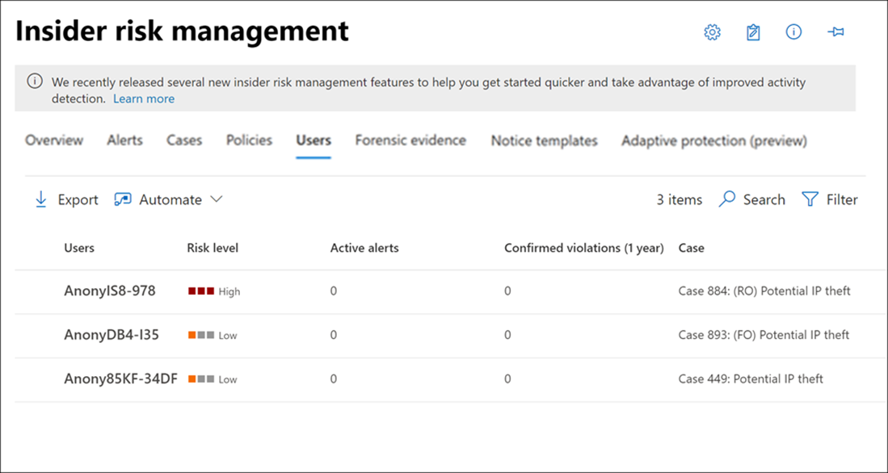

# Insider risk management Users dashboard

The **Users dashboard** is an important tool in the insider risk management workflow and helps investigators and analysts have a more complete understanding of risk activities. This dashboard offers views and management features to meet administrative needs between the creating insider risk management policies and managing insider risk management cases.

After users are added to insider risk management policies, background processes are automatically evaluating user activities for [triggering indicators](insider-risk-management-settings.md#indicators). After triggering indicators are present, user activities are assigned risk scores. Some of these activities may result in an insider risk alert, but some activities may not meet a minimum risk score level and an insider risk alert won't be created. The **Users dashboard** allows you to view users with these types of indicators and risk scores, as well users that have active insider risk alerts.

Learn more about how the Users dashboard displays users in the following scenarios:

- Users with active insider risk policy alerts
- Users with triggering events
- Users added temporarily to policies

## Users with active insider risk policy alerts

The **Users dashboard** automatically displays all users with active insider risk policy alerts. These users with alerts have both a triggering indicator and an activity risk score that meets the requirements for creating an insider risk alert. Activities for these users are viewed by selecting the user in the **Users dashboard** and navigating to the **User activity** tab.

## Users with triggering events

The **Users dashboard** automatically displays all users with triggering events, but that don't have an activity risk score that would create an insider risk alert. For example, a user with a reported resignation date is displayed because this activity is a triggering event but isn't an activity that has a risk score. Activities for these users are viewed by selecting the user in the **Users dashboard** and navigating to the **User activity** tab.

## Users added temporarily to policies

The **Users dashboard** includes users added to insider risk management policies after an unusual event outside of the insider risk management workflow. Temporarily adding users (from the Policies dashboard) is also a way to start scoring user activity for an insider risk management policy for testing the policy, even if a required connector isn't configured.

When a user is manually added to a policy, the user activities for the previous 90 days are scored and added to the **User activity** timeline. For example, you have a user not currently being assigned risk scores for an insider risk policy and the user has data leak activities reported to the legal department in your organization. The legal department recommends that you configure new short-term monitoring requirements for the user. You can temporarily assign the user to your *Data leaks* policy for a designated length of time (activation window). All users added temporarily are displayed in the **Users dashboard** because triggering event requirements are waived.

>[!NOTE]
>It may take several hours for new manually-added users to appear in the **Users dashboard**. Activities for the previous 90 days for these users may take up to 24 hours to display. To view activities for manually added users, select the user on the **Users dashboard** and open the **User activity** tab on the details pane.

The user is automatically removed from the **Users dashboard** and scoring stops when the time defined in the **Activation window** expires if:

- the user doesn't have any additional triggering events or insider risk policy alerts, and
- if the manually defined **Activation window** duration is longer than the global policy **Activation window** duration.

The **Activation window** setting with the longest duration always overrides the **Activation window** setting with a shorter duration. For example, you've configured the **Activation window** on the global **Policy timeframes** tab in the insider risk management global settings for 15 days, which is automatically applied to all your insider risk policies. 

You temporarily add a user to your *Data leaks* insider risk policy and define 30 days as the **Activation window** for this user. The global **Activation window** setting of 15 days is overridden by defining the **Activation window** setting of 30 days for the temporarily added user. The temporarily added user will remain in the **Users dashboard** and be in-scope for the policy for 30 days.

In the opposite scenario where the global **Activation window** setting is longer than the **Activation window** setting defined for a temporarily added user, the global **Activation window** setting would override the **Activation window** setting for the temporarily added user. The temporarily added user will remain in the **Users dashboard** and be in-scope for the policy for the number of days defined in the global **Activation window** settings.

## View user information on the Users dashboard

Each user displayed in the **Users dashboard** has the following information:

- **Users**: The username for a user. This field is anonymized if the global anonymization setting for insider risk management is enabled.
- **Risk level**: The current calculated risk level of the user. This score is calculated every 24 hours and uses the alert risk scores from all active alerts associated to the user. For users with only triggering indicators, the risk level is zero.
- **Active alerts**: The number of active alerts for all policies.
- **Confirmed violations**: The number of cases resolved as *confirmed policy violation* for the user.
- **Case**: The current active case for the user.

>[!NOTE]
>The number of users displayed on the **Users dashboard** may be limited in some instances, depending on the volume of active alerts and matching policies. Users with active alerts are displayed on the **Users dashboard** as the alerts are generated, and there may be rare cases when the maximum number of displayed users is reached. If this limit happens, users with active alerts who aren't displayed will be added to the **Users dashboard** as existing user alerts are triaged.

## View user details

To view more details about risk activity for a user, open the user details pane by double-clicking a user in the **Users dashboard**. On the details pane, you can view the following information:

- **User profile** tab
    - **Name and title**: The name and position title for the user from Azure Active Directory. These user fields will be anonymized or empty if the global anonymization setting for insider risk management is enabled.
    - **User email**: The email address for the user.
    - **Alias**: The network alias for the user.
    - **Organization or department**: The organization or department for the user.

- **User activity** tab
    - **History of recent user activity**: Lists both triggering indicators and insider risk indicators for user activities up to the last 180 days. All activities pertinent to insider risk indicators are also scored, though the activities may or may not have generated an insider risk alert. Triggering indicator examples may be a resignation date or the last scheduled date of work for the user. Insider risk indicators are activities determined to have an element of risk and are defined in policies that the user is included in. Event and risk activities are listed with the most recent item listed first.

## Remove users from in-scope assignment to policies

There may be scenarios where you need to stop assigning risk scores to a user's activity in insider risk management policies. Use **Remove users** on the **Users dashboard** page to stop assigning risk scores for one or more users from all insider risk management policies that they are currently in-scope for. This action does not remove users from the overall policy assignment (when you add users or groups to a policy configuration), but simply removes the users from active processing by policies after current triggering events. If the users have another triggering event in the future, risk scores from policies will automatically begin to be assigned to the users again. Any existing alerts or cases for this user will not be removed.

>[!NOTE]
>Removing a user from a policy may take several minutes to complete. Once complete, the user will no longer be listed on the Users page. If the removed user has active alerts or cases, then the user will remain on the Users page and the details for the user will show that they are no longer in-scope for a policy.

To manually remove users from in-scope status in all insider risk management policies, complete the following steps:

1. In the [Microsoft 365 compliance center](https://compliance.microsoft.com), go to **Insider risk management** and select the **Users** tab.
2. On the **Users dashboard**, select the user or users you want to remove from being in-scope in insider risk management policies.
3. Select **Remove users**.
4. On the **Remove user** pane, Select **Remove** or **Cancel** to discard the changes and close the dialog.
5. Select **Remove** on the confirmation pane to remove the user.

## Run automated tasks with Power Automate flows for a user

Using recommended Power Automate flows, risk investigators and analysts can quickly take action to:

- Notify users when they're added to an insider risk policy

To run, manage, or create Power Automate flows for an insider risk management user:

1. Select **Automate** on the user action toolbar.
2. Choose the Power Automate flow to run, then select **Run flow**.
3. After the flow has completed, select **Done**.

To learn more about Power Automate flows for insider risk management, see [Getting started with insider risk management settings](insider-risk-management-settings.md#power-automate-flows-preview).
