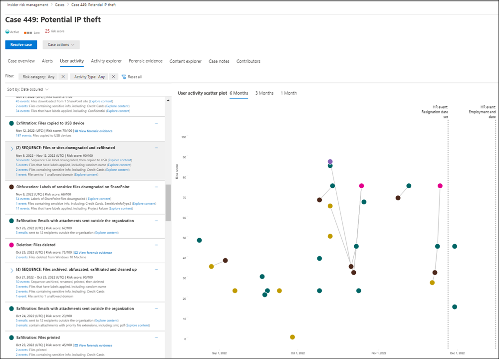

# Learn about insider risk management in Microsoft 365

Insider risk management is a compliance solution in Microsoft 365 that helps minimize internal risks by enabling you to detect, investigate, and act on malicious and inadvertent activities in your organization. Insider risk policies allow you to define the types of risks to identify and detect in your organization, including acting on cases and escalating cases to Microsoft Advanced eDiscovery if needed. Risk analysts in your organization can quickly take appropriate actions to make sure users are compliant with your organization's compliance standards.

Watch the video below to learn how insider risk management can help your organization prevent, detect, and contain risks while prioritizing your organization values, culture, and user experience:
 
 
>[!VIDEO https://www.microsoft.com/videoplayer/embed/RE4j9CN]

## Modern risk pain points

Managing and minimizing risk in your organization starts with understanding the types of risks found in the modern workplace. Some risks are driven by external events and factors that are outside of direct control. Other risks are driven by internal events and user activities that can be minimized and avoided. Some examples are risks from illegal, inappropriate, unauthorized, or unethical behavior and actions by users in your organization. These behaviors include a broad range of internal risks from users:

- Leaks of sensitive data and data spillage
- Confidentiality violations
- Intellectual property (IP) theft
- Fraud
- Insider trading
- Regulatory compliance violations

Users in the modern workplace have access to create, manage, and share data across a broad spectrum of platforms and services. In most cases, organizations have limited resources and tools to identify and mitigate organization-wide risks while also meeting user privacy standards.

Insider risk management uses the full breadth of service and 3rd-party indicators to help you quickly identify, triage, and act on risk activity. By using logs from Microsoft 365 and Microsoft Graph, insider risk management allows you to define specific policies to identify risk indicators. These policies allow you to identify risky activities and to act to mitigate these risks.

Insider risk management is centered around the following principles:

- **Transparency**: Balance user privacy versus organization risk with privacy-by-design architecture.
- **Configurable**: Configurable policies based on industry, geographical, and business groups.
- **Integrated**: Integrated workflow across Microsoft 365 compliance solutions.
- **Actionable**: Provides insights to enable reviewer notifications, data investigations, and user investigations.

## Identifying potential risks with analytics (preview)

Insider risk analytics enables you to conduct an evaluation of potential insider risks in your organization without configuring any insider risk policies. This evaluation can help your organization identify potential areas of higher user risk and help determine the type and scope of insider risk management policies you may consider configuring. This evaluation may also help you determine needs for additional licensing or future optimization of existing insider risk policies.

To learn more about insider risk analytics, see [Insider risk management settings: Analytics](insider-risk-management-settings.md#analytics-preview).

## Workflow

The insider risk management workflow helps you identify, investigate, and take action to address internal risks in your organization. With focused policy templates, comprehensive activity signaling across the Microsoft 365 service, and alert and case management tools, you can use actionable insights to quickly identify and act on risky behavior.

Identifying and resolving internal risk activities and compliance issues with insider risk management in Microsoft 365 uses the following workflow:

### Policies

[Insider risk management policies](insider-risk-management-policies.md) are created using pre-defined templates and policy conditions that define what triggering events and risk indicators are examined in your organization. These conditions include how risk indicators are used for alerts, what users are included in the policy, which services are prioritized, and the monitoring time period.

You can select from the following policy templates to quickly get started with insider risk management:

- [Data theft by departing users](insider-risk-management-policies.md#data-theft-by-departing-users)
- [General data leaks](insider-risk-management-policies.md#general-data-leaks)
- [Data leaks by priority users (preview)](insider-risk-management-policies.md#data-leaks-by-priority-users-preview)
- [Data leaks by disgruntled users (preview)](insider-risk-management-policies.md#data-leaks-by-disgruntled-users-preview)
- [General security policy violations (preview)](insider-risk-management-policies.md#general-security-policy-violations-preview)
- [Security policy violations by departing users (preview)](insider-risk-management-policies.md#security-policy-violations-by-departing-users-preview)
- [Security policy violations by priority users (preview)](insider-risk-management-policies.md#security-policy-violations-by-priority-users-preview)
- [Security policy violations by disgruntled users (preview)](insider-risk-management-policies.md#security-policy-violations-by-disgruntled-users-preview)

### Alerts

Alerts are automatically generated by risk indicators that match policy conditions and are displayed in the [Alerts dashboard](insider-risk-management-alerts.md). This dashboard enables a quick view of all alerts needing review, open alerts over time, and alert statistics for your organization. All policy alerts are displayed with the following information to help you quickly identify the status of existing alerts and new alerts that need action:

- Status
- Severity
- Time detected
- Case
- Case status

### Triage

New user activities that need investigation automatically generate alerts that are assigned a *Needs review* status. Reviewers can quickly identify and review, evaluate, and triage these alerts.

Alerts are resolved by opening a new case, assigning the alert to an existing case, or dismissing the alert. Using alert filters, it's easy to quickly identify alerts by status, severity, or time detected. As part of the triage process, reviewers can view alert details for the activities identified by the policy, view user activity associated with the policy match, see the severity of the alert, and review user profile information.

### Investigate

[Cases](insider-risk-management-cases.md) are created for alerts that require deeper review and investigation of the activity details and circumstances around the policy match. The **Case dashboard** provides an all-up view of all active cases, open cases over time, and case statistics for your organization. Reviewers can quickly filter cases by status, the date the case was opened, and the date the case was last updated.

Selecting a case on the case dashboard opens the case for investigation and review. This step is the heart of the insider risk management workflow. This area is where risk activities, policy conditions, alerts details, and user details are synthesized into an integrated view for reviewers. The primary investigation tools in this area are:

- **User activity**: User activity is automatically displayed in an interactive chart that plots activities over time and by risk level for current or past risk activities. Reviewers can quickly filter and view the entire risk history for the user and drill into specific activities for more details.
- **Content explorer**: All data files and email messages associated with alert activities are automatically captured and displayed in the Content explorer. Reviewers can filter and view files and messages by data source, file type, tags, conversation, and many more attributes.
- **Case notes**: Reviewers can provide notes for a case in the Case Notes section. This list consolidates all notes in a central view and include reviewer and date submitted information.

Additionally, the new [Audit log (preview)](insider-risk-management-audit-log.md) enables you to stay informed of the actions that were taken on insider risk management features. This resource allows an independent review of the actions taken by users assigned to one or more insider risk management role groups.

### Action

After cases are investigated, reviewers can quickly act to resolve the case or collaborate with other risk stakeholders in your organization. If users accidentally or inadvertently violate policy conditions, a simple reminder notice can be sent to the user from notice templates you can customize for your organization. These notices may serve as simple reminders or may direct the user to refresher training or guidance to help prevent future risky behavior. For more information, see [Insider risk management notice templates](insider-risk-management-notices.md).

In the more serious situations, you may need to share the insider risk management case information with other reviewers or services in your organization. Insider risk management is tightly integrated with other Microsoft 365 compliance solutions to help you with end-to-end risk resolution.

- **Advanced eDiscovery**: Escalating a case for investigation allows you to transfer data and management of the case to Advanced eDiscovery in Microsoft 365. Advanced eDiscovery provides an end-to-end workflow to preserve, collect, review, analyze, and export content that's responsive to your organization's internal and external investigations. It allows legal teams to manage the entire legal hold notification workflow. To learn more about Advanced eDiscovery cases, see [Overview of Advanced eDiscovery in Microsoft 365](overview-ediscovery-20.md).
- **Office 365 Management APIs integration (preview)**: Insider risk management supports exporting alert information to security information and event management (SIEM) services via the Office 365 Management APIs. Having access to alert information in the platform the best fits your organization's risk processes gives you more flexibility in how to act on risk activities. To learn more about exporting alert information with Office 365 Management APIs, see [Export alerts](insider-risk-management-settings.md#export-alerts-preview).

>[!NOTE]
>Thank you for your feedback and support during the preview of the ServiceNow connector. We've decided to end the preview of ServiceNow connector and discontinue support in insider risk management on November 30, 2020. We are actively evaluating alternative methods to provide customers with ServiceNow integration in insider risk management.

## Scenarios

Insider risk management can help you detect, investigate, and take action to mitigate internal risks in your organization in several common scenarios:

### Data theft by departing users

When users leave an organization, either voluntarily or as the result of termination, there is often legitimate concerns that company, customer, and user data are at risk. Users may innocently assume that project data isn't proprietary, or they may be tempted to take company data for personal gain and in violation of company policy and legal standards. Insider risk management policies that use the [Data theft by departing users](insider-risk-management-policies.md#policy-templates) policy template automatically detect activities typically associated with this type of theft. With this policy, you'll automatically receive alerts for suspicious activities associated with data theft by departing users so you can take appropriate investigative actions. Configuring a [Microsoft 365 HR connector](import-hr-data.md) for your organization is required for this policy template.

### Intentional or unintentional leak of sensitive or confidential information

In most cases, users try their best to properly handle sensitive or confidential information. But occasionally users may make mistakes and information is accidentally shared outside your organization or in violation of your information protection policies. In other circumstances, users may intentionally leak or share sensitive and confidential information with malicious intent and for potential personal gain. Insider risk management policies created using the following Data leaks policy templates automatically detect activities typically associated with sharing sensitive or confidential information:

- [General data leaks](insider-risk-management-policies.md#general-data-leaks)
- [Data leaks by priority users (preview)](insider-risk-management-policies.md#data-leaks-by-priority-users-preview)
- [Data leaks by disgruntled users (preview)](insider-risk-management-policies.md#data-leaks-by-disgruntled-users-preview)

## Intentional or unintentional security policy violations (preview)

Users typically have a large degree of control when managing their devices in the modern workplace. This control may include permissions to install or uninstall applications needed in the performance of their duties or the ability to temporarily disable device security features. Whether this activity is inadvertent, accidental, or malicious, this conduct can pose risk to your organization and is important to identify and act to minimize. To help identity these risky security activities, the following insider risk management security policy violation templates scores security risk indicators and uses Microsoft Defender for Endpoint alerts to provide insights for security-related activities:

- [General security policy violations (preview)](insider-risk-management-policies.md#general-security-policy-violations-preview)
- [Security policy violations by departing users (preview)](insider-risk-management-policies.md#security-policy-violations-by-departing-users-preview)
- [Security policy violations by priority users (preview)](insider-risk-management-policies.md#security-policy-violations-by-priority-users-preview)
- [Security policy violations by disgruntled users (preview)](insider-risk-management-policies.md#security-policy-violations-by-disgruntled-users-preview)

## Policies for users based on position, access level, or risk history (preview)

Users in your organization may have different levels of risk depending on their position, level of access to sensitive information, or risk history. This structure may include members of your organization's executive leadership team, IT administrators that have extensive data and network access privileges, or users with a past history of risky activities. In these circumstances, closer inspection and more aggressive risk scoring are important to help surface alerts for investigation and quick action. To help identify risky activities for these types of users, you can create priority user groups and create policies from the following policy templates:

- [Security policy violations by priority users (preview)](insider-risk-management-policies.md#security-policy-violations-by-priority-users-preview)
- [Data leaks by priority users (preview)](insider-risk-management-policies.md#data-leaks-by-priority-users-preview)

## Actions and behaviors by disgruntled users (preview)

Employment stresses events can impact user behavior in several ways that relate to insider risks. These stressors may be a poor performance review, a position demotion, or the user being placement on a performance review plan. Though most users do not respond maliciously to these events, the stress of these actions may result in some users to take actions they may not normally consider during normal circumstances. To help identity these types risky activities, the following insider risk management policy templates use the Microsoft 365 HR connector and starts scoring risk indicators relating to behaviors that may occur near employment stressor events:

- [Data leaks by disgruntled users (preview)](insider-risk-management-policies.md#data-leaks-by-disgruntled-users-preview)
- [Security policy violations by disgruntled users (preview)](insider-risk-management-policies.md#security-policy-violations-by-disgruntled-users-preview)

## Ready to get started?

- See [Plan for insider risk management](insider-risk-management-plan.md) for how to prepare to enable insider risk management policies in your organization.
- See [Get started with insider risk management settings](insider-risk-management-settings.md) to configure global settings for insider risk policies.
- See [Get started with insider risk management](insider-risk-management-configure.md) to configure prerequisites, create policies, and start receiving alerts.
