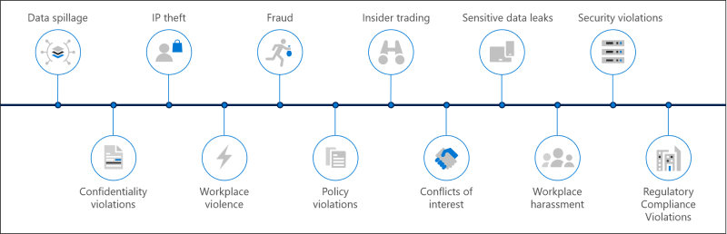
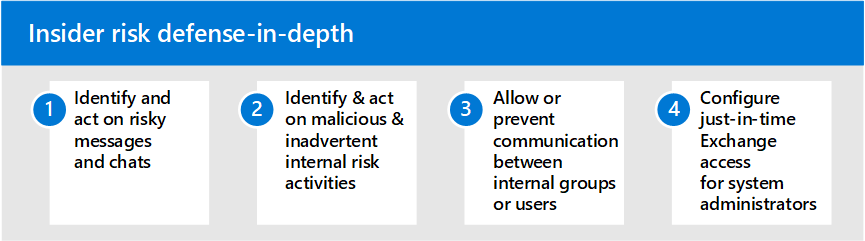

# Insider risk solutions in Microsoft 365

Insider risks are one of the top concerns of security and compliance professionals in the modern workplace. Industry studies have shown that insider risks are often associated with specific user events or activities. Protecting your organization against these risks can be challenging to identify and difficult to mitigate. Insider risks include vulnerabilities in a variety of areas and can cause major problems for your organization, ranging from the loss of intellectual property to workplace harassment, and more. The following figure outlines common insider risks:

Microsoft 365 risk prevention features are designed and built-in to our insider risk products and solutions. These solutions work together and use advanced service and 3rd-party indicators to help you quickly identify, triage, and act on risk activity. Most solutions offer a comprehensive detection, alert, and remediation workflow for your data analysts and investigators to use to quickly act on and minimize these risks.

| Risk icon | Risks | Communication compliance | Insider risk management | Information barriers | Privileged access management |
| :---- | :-------- | :--------------------------- | :-------------------------- |:-------------------------| :--------------------------------|
| | Data spillage |  |  |  |  |
| | Confidentiality violations |  |  |  |  |
| | IP theft |  |  |  |  |
| | Workplace violence |  |  |  |  |
| | Fraud |  |  |  |  |
| | Policy violations |  |  |  |  |
| | Insider trading |  |  |  |  |
| | Conflicts of interest |  |  |  |  |
| | Sensitive data leaks |  |  |  |  |
| | Workplace harassment |  |  |  |  |
| | Security violations |  |  |  |  |
| | Regulatory compliance violations |  |  |  |  |

## Microsoft 365 insider risk solutions

To help protect your organization against insider risks, use these Microsoft 365 capabilities and features.

### Communication compliance

Communication compliance helps minimize communication risks by helping you detect, capture, and act on inappropriate messages in your organization. Communication compliance is available in the following subscriptions:

- Microsoft 365 E5 subscription (paid or trial version)
- Microsoft 365 E3 subscription + the Microsoft 365 E5 Compliance add-on
- Microsoft 365 E3 subscription + the Microsoft 365 E5 Insider Risk Management add-on
- Microsoft 365 A5 subscription (paid or trial version)
- Microsoft 365 A3 subscription + the Microsoft 365 A5 Compliance add-on
- Microsoft 365 A3 subscription + the Microsoft 365 A5 Insider Risk Management add-on
- Microsoft 365 G5 subscription (paid or trial version)
- Microsoft 365 G5 subscription + the Microsoft 365 G5 Compliance add-on
- Microsoft 365 G5 subscription + the Microsoft 365 G5 Insider Risk Management add-on
- Office 365 Enterprise E5 subscription (paid or trial version)
- Office 365 A5 subscription (paid or trial version)
- Office 365 Enterprise E3 subscription + the Office 365 Advanced Compliance add-on (no longer available for new subscriptions)

### Insider risk management

Insider risk management helps minimize internal risks by enabling you to detect, investigate, and act on malicious and inadvertent activities in your organization.

Insider risk management is available in the following subscriptions:

- Microsoft 365 E5 subscription (paid or trial version)
- Microsoft 365 E3 subscription + the Microsoft 365 E5 Compliance add-on
- Microsoft 365 E3 subscription + the Microsoft 365 E5 Insider Risk Management add-on
- Microsoft 365 A5 subscription (paid or trial version)
- Microsoft 365 A3 subscription + the Microsoft 365 A5 Compliance add-on
- Microsoft 365 A3 subscription + the Microsoft 365 A5 Insider Risk Management add-on
- Microsoft 365 G5 subscription (paid or trial version)
- Microsoft 365 G3 subscription + the Microsoft 365 G5 Compliance add-on
- Microsoft 365 G3 subscription + the Microsoft 365 G5 Insider Risk Management add-on
- Office 365 E3 subscription + Enterprise Mobility and Security E3 + the Microsoft 365 E5 Compliance add-on

### Information barriers

Information barriers allow you to restrict communication and collaboration between two internal groups to avoid a conflict of interest from occurring in your organization.

Information barriers are available in the following subscriptions:

- Microsoft 365 E5 subscription (paid or trial version)
- Microsoft 365 A5 subscription (paid or trial version)
- Office 365 Enterprise E5 subscription (paid or trial version)
- Office 365 A5 subscription (paid or trial version)
- Office 365 Advanced Compliance add-on (no longer available for new subscriptions)
- Microsoft 365 E3 subscription + the Microsoft 365 E5 Compliance add-on
- Microsoft 365 E3 subscription + the Microsoft 365 E5 Insider Risk Management add-on
- Microsoft 365 A3 subscription + the Microsoft 365 A5 Compliance add-on
- Microsoft 365 A3 subscription + the Microsoft 365 A5 Insider Risk Management add-on

### Privileged access management

Privileged access management allows granular access control over privileged Exchange Online admin tasks in Office 365. It can help protect your organization from breaches that use existing privileged admin accounts with standing access to sensitive data or access to critical configuration settings.

Privileged access management is available in the following subscriptions:

- Microsoft 365 E5 subscription (paid or trial version)
- Microsoft 365 A5 subscription (paid or trial version)
- Office 365 Enterprise E5 subscription (paid or trial version)
- Office 365 A5 subscription (paid or trial version)
- Microsoft 365 E3 subscription + the Microsoft 365 E5 Compliance add-on
- Microsoft 365 E3 subscription + the Microsoft 365 E5 Information Protection and Governance add-on
- Microsoft 365 A3 subscription + the Microsoft 365 A5 Compliance add-on
- Microsoft 365 A3 subscription + the Microsoft 365 A5 Information Protection and Governance add-on

## Deploy Microsoft 365 insider risk solutions

To help protect your organization against insider risks, set up and deploy the following Microsoft 365 solutions:

1. Configure and create [communication compliance policies](communication-compliance-solution-overview.md).
2. Configure and create [insider risk management policies](insider-risk-management-solution-overview.md).
3. Optional: Configure and create [information barrier policies](information-barriers-solution-overview.md).
4. Optional: Enable and configure [privileged access management](privileged-access-management-solution-overview.md).

## Illustrations with examples

To help you plan an integrated strategy for implementing Microsoft 365 insider risk capabilities, download the *Microsoft 365 information protection and compliance capabilities* set of illustrations. For insider risk capabilities, see the architecture illustration pages 5-7. Feel free to adapt these illustrations for your own use.

| Item | Description |
|:-----|:------------|
|   [Download as a PDF](https://download.microsoft.com/download/3/a/6/3a6ab1a3-feb0-4ee2-8e77-62415a772e53/m365-compliance-illustrations.pdf)  \| [Download as a Visio](https://download.microsoft.com/download/3/a/6/3a6ab1a3-feb0-4ee2-8e77-62415a772e53/m365-compliance-illustrations.vsdx)   Updated October 2020|Includes: <ul><li>  Microsoft information protection and data loss prevention</li><li>Retention policies and retention labels </li><li>Information barriers</li><li>Communication compliance</li><li>Insider risk management</li><li>Third-party data ingestion</li>|

## Training

Training your administrators and compliance team in the basics for each insider risk solution can help your organization get started more quickly with your deployment and implementation efforts. 

Microsoft 365 provides the following resources to help inform and train these users in your organization:

| Solution/Area | Resources |
|:------------------|:--------------|
| Manage insider risk in Microsoft 365 |[Complete learning path](/learn/paths/m365-compliance-insider)   This learning path includes all the individual solution modules for communication compliance, insider risk management, information barriers, and privileged access management. Select this learning path to complete all the modules. |
| Communication compliance | [Learning module: Prepare communication compliance in Microsoft 365](/learn/modules/m365-compliance-insider-prepare-communication-compliance)   This module helps you learn the basics on how to identify and remediate code-of-conduct policy violations with communication compliance, cover the prerequisites needed before creating communication compliance policies, and learn about the types of built-in, pre-defined policy templates in communication compliance. |
| Insider risk management | [Learning module: Insider risk management in Microsoft 365](/learn/modules/m365-compliance-insider-manage-insider-risk)   This module helps you learn how insider risk management in Microsoft 365 can help prevent, detect, and contain internal risks in an organization, learn about the types of built-in, pre-defined policy templates, understand the basic prerequisites needed before creating insider risk policies, and explains the types of actions you can take on insider risk management cases. |
| Information barriers | [Learning module: Plan for information barriers](/learn/modules/m365-compliance-insider-plan-information-barriers)   This module helps you learn how information barrier policies can help your organization maintain compliance with relevant industry standards and regulations, lists the types of situations when information barriers would be applicable, helps explain the process of creating an information barrier policy, and helps explain how to troubleshoot unexpected issues after information barriers are in place. |
| Privileged access management | [Learning module: Implement privileged access management](/learn/modules/m365-compliance-insider-implement-privileged-access-management)   This module helps you understand the difference between privileged access management and privileged identity management, understand the privileged access management process flow, and understand the basics of how to configure and enable privileged access management. |
