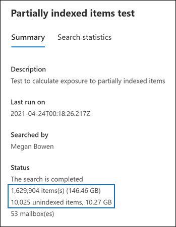

# Investigating partially indexed items in eDiscovery

An eDiscovery search that you run from the Microsoft Purview compliance portal automatically includes partially indexed items in the estimated search results when you run a search. Partially indexed items are Exchange mailbox items and documents on SharePoint and OneDrive for Business sites that for some reason weren't completely indexed for search. Most email messages and site documents are successfully indexed because they fall within the [Indexing limits for email messages](limits-for-content-search.md#indexing-limits-for-email-messages). However, some items may exceed these indexing limits, and will be partially indexed. Here are other reasons why items can't be indexed for search and are returned as partially indexed items when you run an eDiscovery search:
  
- Email messages have an attached file that can't be opened; this is the most common cause of partially indexed email items.
- Too many files attached to an email message.
- A file attached to an email message is too large.
- The file type is supported for indexing but an indexing error occurred for a specific file.

Although it varies, most organizations customers have less than 1% of content by volume and less than 12% of content by size that is partially indexed. The reason for the difference between the volume versus size is that larger files have a higher probability of containing content that can't be completely indexed.

For more information about partially index items in Content search, see [Investigating partially indexed items in Content search](partially-indexed-items-in-content-search.md).
  
[!INCLUDE [purview-preview](../includes/purview-preview.md)]

## Why does the partially indexed item count change for a search?

After you run an eDiscovery search, the total number and size of partially indexed items in the locations that were searched are listed in the search result statistics that are displayed in the detailed statistics for the search. Note these are called  *unindexed items*  in the search statistics. Here are a few things that will affect the number of partially indexed items that are returned in the search results:
  
- If an item is partially indexed and matches the search query, it's included in both the count (and size) of search result items and partially indexed items. However, when the results of that same search are exported, the item is included only with set of search results; it's not included as a partially indexed item.
- Partially indexed items located in SharePoint and OneDrive sites *aren't* included in the estimate of partially indexed items that's displayed in the detailed statistics for the search. However, partially indexed items can be exported when you export the results of an eDiscovery search. For example, if you only search sites, the estimated number partially indexed items will be zero.
  
## Calculating the ratio of partially indexed items in your organization

To understand your organization's exposure to partially indexed items, you can run a search for all content in all mailboxes (by using a blank keyword query). In the following example, there are 1,629,904 (146.46 GB) fully indexed items and 10,025 (10.27 GB) partially indexed items.
  

  
You can determine the percentage of partially indexed items by using the following calculations.
  
 **To calculate the ratio of partially indexed items in your organization:**

`(Total number of partially indexed items/Total number of items) x 100`

`(10025/1629904) x 100 = 0.62%`

By using the search results from the previous example, 0.62% of all mailboxes items are partially indexed.
  
 **To calculate the percentage of the size of partially indexed items in your organization:**

`(Size of all partially indexed items/Size of all items) x 100`

`(10.27 GB/146.46 GB) x 100 = 7.0%`

So in the previous example, 7% of the total size of mailbox items are from partially indexed items. As previously stated, most organizations customers have less than 1% of content by volume and less than 12% of content by size that is partially indexed.

## Working with partially indexed items

In cases when you need to examine partially indexed items to validate that they don't contain relevant information, you can [export a content search report](export-a-content-search-report.md) that contains information about partially indexed items. When you export a content search report, be sure to choose one of the export options that includes partially indexed items.
  

  
When you export eDiscovery search results or a search report using one of these options, the export includes a report named Unindexed Items.csv. This report includes most of the same information as the ResultsLog.csv file; however, the Unindexed Items.csv file also includes two fields related to partially indexed items: **Error Tags** and **Error Properties**. These fields contain information about the indexing error for each partially indexed item. Using the information in these two fields can help you determine whether or not the indexing error for a particular impacts your investigation. 

> [!NOTE]
> The Unindexed Items.csv file also contains fields named **Error Type** and **Error Message**. These are legacy fields that contain information that is similar to the information in the **Error Tags** and **Error Properties** fields, but with less detailed information. You can safely ignore these legacy fields.
  
## Errors related to partially indexed items

Error tags are made up of two pieces of information, the error and the file type. For example, in this error/file-type pair:

```text
 parseroutputsize_xls
```

 `parseroutputsize` is the error and `xls` is the file type of the file the error occurred on. In cases where the file type wasn't recognized or the file type didn't apply to the error, you will see the value `noformat` in place of the file type.
  
The following is a list of indexing errors and a description of the possible cause of the error.
  
| Error tag | Description |
|:-----|:-----|
| `attachmentcount` <br/> |An email message had too many attachments, and some of these attachments weren't processed.  <br/> |
| `attachmentdepth` <br/> |The content retriever and document parser found too many levels of attachments nested inside other attachments. Some of these attachments weren't processed.  <br/> |
| `attachmentrms` <br/> |An attachment failed decoding because it was RMS-protected.  <br/> |
| `attachmentsize` <br/> |A file attached to an email message was too large and couldn't be processed.  <br/> |
| `indexingtruncated` <br/> |When writing the processed email message to the index, one of the indexable properties was too large and was truncated. The truncated properties are listed in Error Properties field.  <br/> |
| `invalidunicode` <br/> |An email message contained text that couldn't be processed as valid Unicode. Indexing for this item may be incomplete.  <br/> |
| `parserencrypted` <br/> |The content of attachment or email message is encrypted, and Microsoft 365 couldn't decode the content.  <br/> |
| `parsererror` <br/> |An unknown error occurred during parsing. This typically results from a software bug or a service crash.  <br/> |
| `parserinputsize` <br/> |An attachment was too large for the parser to handle, and the parsing of that attachment didn't happen or wasn't completed.  <br/> |
| `parsermalformed` <br/> |An attachment was malformed and couldn't be handled by the parser. This result can be due to old file formats, files created by incompatible software, or viruses pretending to be something other than claimed.  <br/> |
| `parseroutputsize` <br/> |The output from the parsing of an attachment was too large and had to be truncated.  <br/> |
| `parserunknowntype` <br/> |An attachment had a file type that Microsoft 365 couldn't detect.  <br/> |
| `parserunsupportedtype` <br/> |An attachment had a file type that Office 365 could detect, but parsing that file type isn't supported.  <br/> |
| `propertytoobig` <br/> |The value of an email property in Exchange Store was too large to be retrieved and the message couldn't be processed. This typically only happens to the body property of an email message.  <br/> |
| `retrieverrms` <br/> |The content retriever failed to decode an RMS-protected message.  <br/> |
| `wordbreakertruncated` <br/> |Too many words were identified in the document during indexing. Processing of the property stopped when reaching the limit, and the property is truncated.  <br/> |

Error fields describe which fields are affected by the processing error listed in the Error Tags field. If you're searching a property such as  `subject` or  `participants`, errors in the body of the message won't impact the results of your search. This can be useful when determining exactly which partially indexed items you might need to further investigate.