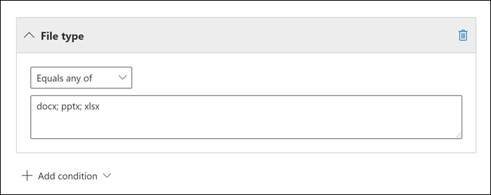
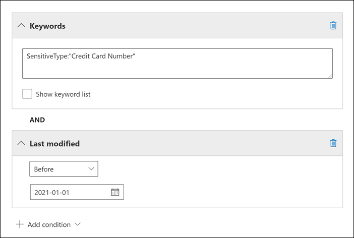
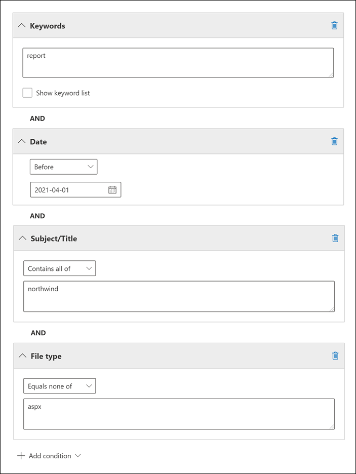
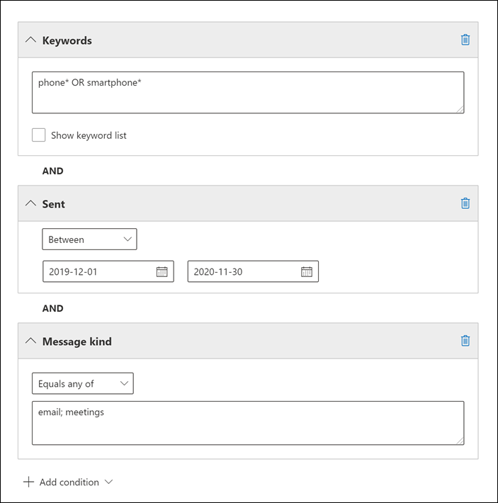
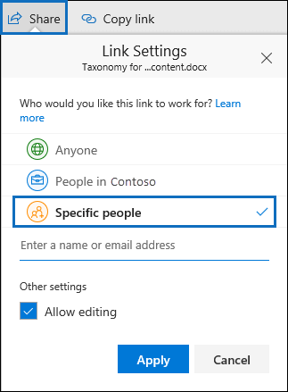

# Keyword queries and search conditions for eDiscovery

This topic describes the email and document properties that you can search for in email items and Microsoft Teams chat conversations in Exchange Online, and documents stored on SharePoint and OneDrive for Business sites using the eDiscovery search tools in the Microsoft 365 compliance center. This includes Content search, Core eDiscovery, and Advanced eDiscovery (eDiscovery searches in Advanced eDiscovery are called *collections*). You can also use the **\*-ComplianceSearch** cmdlets in Security & Compliance Center PowerShell to search for these properties. The topic also describes:
  
- Using Boolean search operators, search conditions, and other search query techniques to refine your search results.

- Searching for sensitive data types and custom sensitive data types in SharePoint and OneDrive for Business.

- Searching for site content that's shared with users outside of your organization

For step-by-step instructions on how to create different eDiscovery searches, see:

- [Content search](content-search.md)

- [Search for content in Core eDiscovery](search-for-content-in-core-ediscovery.md)

- [Create a draft collection in Advanced eDiscovery](create-draft-collection.md)

> [!NOTE]
> eDiscovery searches in the Microsoft 365 compliance center and the corresponding **\*-ComplianceSearch** cmdlets in Security & Compliance Center PowerShell use the Keyword Query Language (KQL). For more detailed information, see [Keyword Query Language syntax reference](/sharepoint/dev/general-development/keyword-query-language-kql-syntax-reference).
  
## Searchable email properties

The following table lists email message properties that can be searched by using the eDiscovery search tools in the Microsoft 365 compliance center or by using the **New-ComplianceSearch** or the **Set-ComplianceSearch** cmdlet. The table includes an example of the  _property:value_ syntax for each property and a description of the search results returned by the examples. You can type these  `property:value` pairs in the keywords box for an eDiscovery search. 

> [!NOTE]
> When searching email properties, it's not possible to search for items in which the specified property is empty or blank. For example, using the *property:value* pair of **subject:""** to search for email messages with an empty subject line will return zero results. This also applies when searching site and contact properties.
  
| Property | Property description | Examples | Search results returned by the examples |
|:-----|:-----|:-----|:-----|
|AttachmentNames|The names of files attached to an email message.|`attachmentnames:annualreport.ppt`  <br/> `attachmentnames:annual*` <br/> `attachmentnames:.pptx` |Messages that have an attached file named annualreport.ppt. In the second example, using the wildcard returns messages with the word "annual" in the file name of an attachment. The third example returns all attachments with the pptx file extension.|
|Bcc|The Bcc field of an email message.<sup>1</sup>|`bcc:pilarp@contoso.com`  <br/> `bcc:pilarp`  <br/> `bcc:"Pilar Pinilla"`|All examples return messages with Pilar Pinilla included in the Bcc field.|
|Category| The categories to search. Categories can be defined by users by using Outlook or Outlook on the web (formerly known as Outlook Web App). The possible values are:  <br/><br/>  blue  <br/>  green  <br/>  orange  <br/>  purple  <br/>  red  <br/>  yellow|`category:"Red Category"`|Messages that have been assigned the red category in the source mailboxes.|
|Cc|The Cc field of an email message.<sup>1</sup>|`cc:pilarp@contoso.com`  <br/> `cc:"Pilar Pinilla"`|In both examples, messages with Pilar Pinilla specified in the Cc field.|
|Folderid|The folder ID (GUID) of a specific mailbox folder. If you use this property, be sure to search the mailbox that the specified folder is located in. Only the specified folder will be searched. Any subfolders in the folder won't be searched. To search subfolders, you need to use the Folderid property for the subfolder you want to search.  <br/> For more information about searching for the Folderid property and using a script to obtain the folder IDs for a specific mailbox, see [Use Content search for targeted collections](use-content-search-for-targeted-collections.md).|`folderid:4D6DD7F943C29041A65787E30F02AD1F00000000013A0000`  <br/> `folderid:2370FB455F82FC44BE31397F47B632A70000000001160000 AND participants:garthf@contoso.com`|The first example returns all items in the specified mailbox folder. The second example returns all items in the specified mailbox folder that were sent or received by garthf@contoso.com.|
|From|The sender of an email message.<sup>1</sup>|`from:pilarp@contoso.com`  <br/> `from:contoso.com`|Messages sent by the specified user or sent from a specified domain.|
|HasAttachment|Indicates whether a message has an attachment. Use the values **true** or **false**.|`from:pilar@contoso.com AND hasattachment:true`|Messages sent by the specified user that have attachments.|
|Importance|The importance of an email message, which a sender can specify when sending a message. By default, messages are sent with normal importance, unless the sender sets the importance as **high** or **low**.|`importance:high`  <br/> `importance:medium`  <br/> `importance:low`|Messages that are marked as high importance, medium importance, or low importance.|
|IsRead|Indicates whether messages have been read. Use the values **true** or **false**.|`isread:true`  <br/> `isread:false`|The first example returns messages with the IsRead property set to **True**. The second example returns messages with the IsRead property set to **False**.|
|ItemClass|Use this property to search specific third-party data types that your organization imported to Office 365. Use the following syntax for this property:  `itemclass:ipm.externaldata.<third-party data type>*`|`itemclass:ipm.externaldata.Facebook* AND subject:contoso`  <br/> `itemclass:ipm.externaldata.Twitter* AND from:"Ann Beebe" AND "Northwind Traders"`|The first example returns Facebook items that contain the word "contoso" in the Subject property. The second example returns Twitter items that were posted by Ann Beebe and that contain the keyword phrase "Northwind Traders".  <br/> For a complete list of values to use for third-party data types for the ItemClass property, see [Use Content search to search third-party data that was imported to Office 365](use-content-search-to-search-third-party-data-that-was-imported.md).|
|Kind| The type of email message to search for. Possible values:  <br/>  contacts  <br/>  docs  <br/>  email  <br/>  externaldata  <br/>  faxes  <br/>  im  <br/>  journals  <br/>  meetings  <br/>  microsoftteams (returns items from chats, meetings, and calls in Microsoft Teams)  <br/>  notes  <br/>  posts  <br/>  rssfeeds  <br/>  tasks  <br/>  voicemail|`kind:email`  <br/> `kind:email OR kind:im OR kind:voicemail`  <br/> `kind:externaldata`|The first example returns email messages that meet the search criteria. The second example returns email messages, instant messaging conversations (including Skype for Business conversations and chats in Microsoft Teams), and voice messages that meet the search criteria. The third example returns items that were imported to mailboxes in Microsoft 365 from third-party data sources, such as Twitter, Facebook, and Cisco Jabber, that meet the search criteria. For more information, see [Archiving third-party data in Office 365](https://www.microsoft.com/?ref=go).|
|Participants|All the people fields in an email message. These fields are From, To, Cc, and Bcc.<sup>1</sup>|`participants:garthf@contoso.com`  <br/> `participants:contoso.com`|Messages sent by or sent to garthf@contoso.com. The second example returns all messages sent by or sent to a user in the contoso.com domain.|
|Received|The date that an email message was received by a recipient.|`received:04/15/2016`  <br/> `received>=01/01/2016 AND received<=03/31/2016`|Messages that were received on April 15, 2016. The second example returns all messages received between January 1, 2016 and March 31, 2016.|
|Recipients|All recipient fields in an email message. These fields are To, Cc, and Bcc.<sup>1</sup>|`recipients:garthf@contoso.com`  <br/> `recipients:contoso.com`|Messages sent to garthf@contoso.com. The second example returns messages sent to any recipient in the contoso.com domain.|
|Sent|The date that an email message was sent by the sender.|`sent:07/01/2016`  <br/> `sent>=06/01/2016 AND sent<=07/01/2016`|Messages that were sent on the specified date or sent within the specified date range.|
|Size|The size of an item, in bytes.|`size>26214400`  <br/> `size:1..1048567`|Messages larger than 25 MB. The second example returns messages from 1 through 1,048,567 bytes (1 MB) in size.|
|Subject|The text in the subject line of an email message.  <br/> **Note:** When you use the Subject property in a query, the search returns all messages in which the subject line contains the text you're searching for. In other words, the query doesn't return only those messages that have an exact match. For example, if you search for  `subject:"Quarterly Financials"`, your results will include messages with the subject "Quarterly Financials 2018".|`subject:"Quarterly Financials"`  <br/> `subject:northwind`|Messages that contain the phrase "Quarterly Financials" anywhere in the text of the subject line. The second example returns all messages that contain the word northwind in the subject line.|
|To|The To field of an email message.<sup>1</sup>|`to:annb@contoso.com`  <br/> `to:annb ` <br/> `to:"Ann Beebe"`|All examples return messages where Ann Beebe is specified in the To: line.|
|||||
   
> [!NOTE]
> <sup>1</sup> For the value of a recipient property, you can use email address (also called *user principal name* or UPN), display name, or alias to specify a user. For example, you can use annb@contoso.com, annb, or "Ann Beebe" to specify the user Ann Beebe.

### Recipient expansion

When searching any of the recipient properties (From, To, Cc, Bcc, Participants, and Recipients), Microsoft 365 attempts to expand the identity of each user by looking them up in Azure Active Directory (Azure AD).  If the user is found in Azure AD, the query is expanded to include the user's email address (or UPN), alias, display name, and LegacyExchangeDN. For example, a query such as `participants:ronnie@contoso.com` expands to `participants:ronnie@contoso.com OR participants:ronnie OR participants:"Ronald Nelson" OR participants:"<LegacyExchangeDN>"`.

To prevent recipient expansion, add a wild card character (asterisk) to the end of the email address and use a reduced domain name; for example, `participants:"ronnie@contoso*"` Be sure to surround the email address with double quotation marks.

However, be aware that preventing recipient expansion in the search query may result in relevant items not being returned in the search results. Email messages in Exchange can be saved with different text formats in the recipient fields. Recipient expansion is intended to help mitigate this fact by returning messages that may contain different text formats. So preventing recipient expansion may result in the search query not returning all items that may be relevant to your investigation.

> [!NOTE]
> If you need to review or reduce the items returned by a search query due to recipient expansion, consider using Advanced eDiscovery. You can search for messages (taking advantage of recipient expansion), add them to a review set, and then use review set queries or filters to review or narrow the results. For more information, see [Collect data for a case](collecting-data-for-ediscovery.md) and [Query the data in a review set](review-set-search.md).

## Searchable site properties

The following table lists some of the SharePoint and OneDrive for Business properties that can be searched by using the eDiscovery search tools in the Microsoft 365 compliance Center or by using the **New-ComplianceSearch** or the **Set-ComplianceSearch** cmdlet. The table includes an example of the  _property:value_ syntax for each property and a description of the search results returned by the examples. 
  
For a complete list of SharePoint properties that can be searched, see [Overview of crawled and managed properties in SharePoint](/SharePoint/technical-reference/crawled-and-managed-properties-overview). Properties marked with a **Yes** in the **Queryable** column can be searched.
  
| Property | Property description | Example | Search results returned by the examples |
|:-----|:-----|:-----|:-----|
|Author|The author field from Office documents, which persists if a document is copied. For example, if a user creates a document and the emails it to someone else who then uploads it to SharePoint, the document will still retain the original author. Be sure to use the user's display name for this property.|`author:"Garth Fort"`|All documents that are authored by Garth Fort.|
|ContentType|The SharePoint content type of an item, such as Item, Document, or Video.|`contenttype:document`|All documents would be returned.|
|Created|The date that an item is created.|`created>=06/01/2016`|All items created on or after June 1, 2016.|
|CreatedBy|The person that created or uploaded an item. Be sure to use the user's display name for this property.|`createdby:"Garth Fort"`|All items created or uploaded by Garth Fort.|
|DetectedLanguage|The language of an item.|`detectedlanguage:english`|All items in English.|
|DocumentLink|The path (URL) of a specific folder on a SharePoint or OneDrive for Business site. If you use this property, be sure to search the site that the specified folder is located in.  <br/> To return items located in subfolders of the folder that you specify for the documentlink property, you have to add /\* to the URL of the specified folder; for example,  `documentlink: "https://contoso.sharepoint.com/Shared Documents/*"`  <br/> <br/>For more information about searching for the documentlink property and using a script to obtain the documentlink URLs for folders on a specific site, see [Use Content search for targeted collections](use-content-search-for-targeted-collections.md).|`documentlink:"https://contoso-my.sharepoint.com/personal/garthf_contoso_com/Documents/Private"`  <br/> `documentlink:"https://contoso-my.sharepoint.com/personal/garthf_contoso_com/Documents/Shared with Everyone/*" AND filename:confidential`|The first example returns all items in the specified OneDrive for Business folder. The second example returns documents in the specified site folder (and all subfolders) that contain the word "confidential" in the file name.|
|FileExtension|The extension of a file; for example, docx, one, pptx, or xlsx.|`fileextension:xlsx`|All Excel files (Excel 2007 and later)|
|FileName|The name of a file.|`filename:"marketing plan"`  <br/> `filename:estimate`|The first example returns files with the exact phrase "marketing plan" in the title. The second example returns files with the word "estimate" in the file name.|
|LastModifiedTime|The date that an item was last changed.|`lastmodifiedtime>=05/01/2016`  <br/> `lastmodifiedtime>=05/10/2016 AND lastmodifiedtime<=06/1/2016`|The first example returns items that were changed on or after May 1, 2016. The second example returns items changed between May 1, 2016 and June 1, 2016.|
|ModifiedBy|The person who last changed an item. Be sure to use the user's display name for this property.|`modifiedby:"Garth Fort"`|All items that were last changed by Garth Fort.|
|Path|The path (URL) of a specific site in a SharePoint or OneDrive for Business site.<br/><br/>To return items only from the specified site, you have to add the trailing `/` to the end of the URL; for example, `path: "https://contoso.sharepoint.com/sites/international/"` <br/><br/> To return items located in folders in the site that you specify in the path property, you have to add `/*` to the end of the URL; for example,  `path: "https://contoso.sharepoint.com/Shared Documents/*"`  <br/><br/> **Note:** Using the  `Path` property to search OneDrive locations won't return media files, such as .png, .tiff, or .wav files, in the search results. Use a different site property in your search query to search for media files in OneDrive folders. <br/>|`path:"https://contoso-my.sharepoint.com/personal/garthf_contoso_com/"`  <br/> `path:"https://contoso-my.sharepoint.com/personal/garthf_contoso_com/*" AND filename:confidential`|The first example returns all items in the specified OneDrive for Business site. The second example returns documents in the specified site (and folders in the site) that contain the word "confidential" in the file name.|
|SharedWithUsersOWSUser|Documents that have been shared with the specified user and displayed on the **Shared with me** page in the user's OneDrive for Business site. These are documents that have been explicitly shared with the specified user by other people in your organization. When you export documents that match a search query that uses the SharedWithUsersOWSUser property, the documents are exported from the original content location of the person who shared the document with the specified user. For more information, see [Searching for site content shared within your organization](#searching-for-site-content-shared-within-your-organization).|`sharedwithusersowsuser:garthf`  <br/> `sharedwithusersowsuser:"garthf@contoso.com"`|Both examples return all internal documents that have been explicitly shared with Garth Fort and that appear on the **Shared with me** page in Garth Fort's OneDrive for Business account.|
|Site|The URL of a site or group of sites in your organization.|`site:"https://contoso-my.sharepoint.com"`  <br/> `site:"https://contoso.sharepoint.com/sites/teams"`|The first example returns items from the OneDrive for Business sites for all users in the organization. The second example returns items from all team sites.|
|Size|The size of an item, in bytes.|`size>=1`  <br/> `size:1..10000`|The first example returns items larger than 1 byte. The second example returns items from 1 through 10,000 bytes in size.|
|Title|The title of the document. The Title property is metadata that's specified in Microsoft Office documents. It's different from the file name of the document.|`title:"communication plan"`|Any document that contains the phrase "communication plan" in the Title metadata property of an Office document.|
|||||

## Searchable contact properties

The following table lists the contact properties that are indexed and that you can search for using eDiscovery search tools. These are the properties that are available for users to configure for the contacts (also called personal contacts) that are located in the personal address book of a user's mailbox. To search for contacts, you can select the mailboxes to search and then use one or more contact properties in the keyword query.
  
> [!TIP]
> To search for values that contain spaces or special characters, use double quotation marks ("  ") to contain the phrase; for example, `businessaddress:"123 Main Street"`.
  
| Property | Property description |
|:-----|:-----|
|BusinessAddress|The address in the **Business Address** property. The property is also called the **Work** address on the contact properties page.|
|BusinessPhone|The phone number in any of the **Business Phone** number properties.|
|CompanyName|The name in the **Company** property.|
|Department|The name in the **Department** property.|
|DisplayName|The display name of the contact. This is the name in the **Full Name** property of the contact.|
|EmailAddress|The address for any email address property for the contact. Users can add multiple email addresses for a contact. Using this property would return contacts that match any of the contact's email addresses.|
|FileAs|The **File as** property. This property is used to specify how the contact is listed in the user's contact list. For example, a contact could be listed as  *FirstName,LastName*  or  *LastName,FirstName*.|
|GivenName|The name in the **First Name** property.|
|HomeAddress|The address in any of the **Home** address properties.|
|HomePhone|The phone number in any of the **Home** phone number properties.|
|IMAddress|The IM address property, which is typically an email address used for instant messaging.|
|MiddleName|The name in the **Middle** name property.|
|MobilePhone|The phone number in the **Mobile** phone number property.|
|Nickname|The name in the **Nickname** property.|
|OfficeLocation|The value in **Office** or **Office location** property.|
|OtherAddress|The value for the **Other** address property.|
|Surname|The name in the **Last** name property.|
|Title|The title in the **Job title** property.|
|||||

## Searchable sensitive data types

You can use eDiscovery search tools in the Microsoft 365 compliance center to search for sensitive data, such as credit card numbers or social security numbers, that is stored in documents on SharePoint and OneDrive for Business sites. You can do this by using the `SensitiveType` property and the name (or ID) of a sensitive information type in a keyword query. For example, the query `SensitiveType:"Credit Card Number"` returns documents that contain a credit card number. The query  `SensitiveType:"U.S. Social Security Number (SSN)"` returns documents that contain a U.S. social security number.

To see a list of the sensitive information types that you can search for, go to **Data classifications** \> **Sensitive info types** in the Microsoft 365 compliance center. Or you can use the **Get-DlpSensitiveInformationType** cmdlet in Security & Compliance Center PowerShell to display a list of sensitive information types.
  
For more information about creating queries using the `SensitiveType` property, see [Form a query to find sensitive data stored on sites](form-a-query-to-find-sensitive-data-stored-on-sites.md).

### Limitations for searching sensitive data types

- To search for custom sensitive information types, you have to specify the ID of the sensitive information type in the `SensitiveType` property. Using the name of a custom sensitive information type (as shown in the example for built-in sensitive information types in the previous section) will return no results. Use the **Publisher** column on the **Sensitive info types** page in the compliance center (or the **Publisher** property in PowerShell) to differentiate between built-in and custom sensitive information types. Built-in sensitive data types have a value of `Microsoft Corporation` for the **Publisher** property.

  To display the name and ID for the custom sensitive data types in your organization, run the following command in Security & Compliance Center PowerShell:

  ```powershell
  Get-DlpSensitiveInformationType | Where-Object {$_.Publisher -ne "Microsoft Corporation"} | FT Name,Id
  ```

  Then you can use the ID in the `SensitiveType` search property to return documents that contain the custom sensitive data type; for example, `SensitiveType:7e13277e-6b04-3b68-94ed-1aeb9d47de37`
  
- You can't use sensitive information types and the `SensitiveType` search property to search for sensitive data at-rest in Exchange Online mailboxes. This includes 1:1 chat messages, 1:N group chat messages, and team channel conversations in Microsoft teams because all of this content is stored in mailboxes. However, you can use data loss prevention (DLP) policies to protect sensitive email data in transit. For more information, see [Learn about data loss prevention](dlp-learn-about-dlp.md) and [Search for and find personal data](/compliance/regulatory/gdpr).
  
## Search operators

Boolean search operators, such as **AND**, **OR**, and **NOT**, help you define more-precise searches by including or excluding specific words in the search query. Other techniques, such as using property operators (such as `>=` or `..`), quotation marks, parentheses, and wildcards, help you refine a search query. The following table lists the operators that you can use to narrow or broaden search results. 
  
| Operator | Usage | Description |
|:-----|:-----|:-----|
|AND|keyword1 AND keyword2|Returns items that include all of the specified keywords or  `property:value` expressions. For example,  `from:"Ann Beebe" AND subject:northwind` would return all messages sent by Ann Beebe that contained the word northwind in the subject line. <sup>2</sup>|
|+|keyword1 + keyword2 + keyword3|Returns items that contain  *either*  `keyword2` or  `keyword3` *and*  that also contain  `keyword1`. Therefore, this example is equivalent to the query  `(keyword2 OR keyword3) AND keyword1`.  <br/> The query  `keyword1 + keyword2` (with a space after the **+** symbol) isn't the same as using the **AND** operator. This query would be equivalent to  `"keyword1 + keyword2"` and return items with the exact phase  `"keyword1 + keyword2"`.|
|OR|keyword1 OR keyword2|Returns items that include one or more of the specified keywords or  `property:value` expressions. <sup>2</sup>|
|NOT|keyword1 NOT keyword2  <br/> NOT from:"Ann Beebe"  <br/> NOT kind:im|Excludes items specified by a keyword or a  `property:value` expression. In the second example excludes messages sent by Ann Beebe. The third example excludes any instant messaging conversations, such as Skype for Business conversations that are saved to the Conversation History mailbox folder. <sup>2</sup>|
|-|keyword1 -keyword2|The same as the **NOT** operator. So this query returns items that contain  `keyword1` and would exclude items that contain  `keyword2`.|
|NEAR|keyword1 NEAR(n) keyword2|Returns items with words that are near each other, where n equals the number of words apart. For example, `best NEAR(5) worst` returns any item where the word "worst" is within five words of "best". If no number is specified, the default distance is eight words. <sup>2</sup>|
|:|property:value|The colon (:) in the  `property:value` syntax specifies that the value of the property being searched for contains the specified value. For example,  `recipients:garthf@contoso.com` returns any message sent to garthf@contoso.com.|
|=|property=value|The same as the **:** operator.|
|\<|property\<value|Denotes that the property being searched is less than the specified value. <sup>1</sup>|
|\>|property\>value|Denotes that the property being searched is greater than the specified value.<sup>1</sup>|
|\<=|property\<=value|Denotes that the property being searched is less than or equal to a specific value.<sup>1</sup>|
|\>=|property\>=value|Denotes that the property being searched is greater than or equal to a specific value.<sup>1</sup>|
|..|property:value1..value2|Denotes that the property being searched is greater than or equal to value1 and less than or equal to value2.<sup>1</sup>|
|"  "|"fair value"  <br/> subject:"Quarterly Financials"|Use double quotation marks ("  ") to search for an exact phrase or term in keyword and  `property:value` search queries.|
|\*|cat\*  <br/> subject:set\*|Prefix wildcard searches (where the asterisk is placed at the end of a word) match for zero or more characters in keywords or  `property:value` queries. For example,  `title:set*` returns documents that contain the word set, setup, and setting (and other words that start with "set") in the document title.  <br/><br/> **Note:** You can use only prefix wildcard searches; for example, **cat\*** or **set\***. Suffix searches (**\*cat** ), infix searches (**c\*t**), and substring searches (**\*cat\***) are not supported.<br/><br/>Also, adding a period ( \. ) to a prefix wild card search will change the results that are returned. That's because a period is treated as a stop word. For example, searching for **cat\*** and searching for **cat.\*** will return different results. We recommend not using a period in a prefix wild card search. |
|(  )|(fair OR free) AND (from:contoso.com)  <br/> (IPO OR initial) AND (stock OR shares)  <br/> (quarterly financials)|Parentheses group together Boolean phrases,  `property:value` items, and keywords. For example,  `(quarterly financials)` returns items that contain the words quarterly and financials.|
|||||
   
> [!NOTE]
> <sup>1</sup> Use this operator for properties that have date or numeric values.<br/> <sup>2</sup> Boolean search operators must be uppercase; for example, **AND**. If you use a lowercase operator, such as **and**, it will be treated as a keyword in the search query. 
  
## Search conditions

You can add conditions to a search query to narrow a search and return a more refined set of results. Each condition adds a clause to the KQL search query that is created and run when you start the search.
  
[Conditions for common properties](#conditions-for-common-properties)

[Conditions for mail properties](#conditions-for-mail-properties)

[Conditions for document properties](#conditions-for-document-properties)

[Operators used with conditions](#operators-used-with-conditions)

[Guidelines for using conditions](#guidelines-for-using-conditions)

[Examples of using conditions in search queries](#examples-of-using-conditions-in-search-queries)
  
### Conditions for common properties

Create a condition using common properties when searching mailboxes and sites in the same search. The following table lists the available properties to use when adding a condition.
  
| Condition | Description |
|:-----|:-----|
|Date|For email, the date a message was received by a recipient or sent by the sender. For documents, the date a document was last modified.|
|Sender/Author|For email, the person who sent a message. For documents, the person cited in the author field from Office documents. You can type more than one name, separated by commas. Two or more values are logically connected by the **OR** operator.|
|Size (in bytes)|For both email and documents, the size of the item (in bytes).|
|Subject/Title|For email, the text in the subject line of a message. For documents, the title of the document. As previously explained, the Title property is metadata specified in Microsoft Office documents. You can type the name of more than one subject/title, separated by commas. Two or more values are logically connected by the **OR** operator.|
|Retention label|For both email and documents, retention labels that have been assigned to messages and documents automatically by auto-label policies or retention labels that have been manually assigned by users. Retention labels are used to classify email and documents for information governance and enforce retention rules based on the settings defined by the label. You can type part of the retention label name and use a wildcard or type the complete label name. For more information about retention labels, see [Learn about retention policies and retention labels](retention.md).|
|||
  
### Conditions for mail properties

Create a condition using mail properties when searching mailboxes or public folders. The following table lists the email properties that you can use for a condition. These properties are a subset of the email properties that were previously described. These descriptions are repeated for your convenience.
  
| Condition | Description |
|:-----|:-----|
|Message kind| The message type to search. This is the same property as the Kind email property. Possible values:  <br/><br/>  contacts  <br/>  docs  <br/>  email  <br/>  externaldata  <br/>  faxes  <br/>  im  <br/>  journals  <br/>  meetings  <br/>  microsoftteams  <br/>  notes  <br/>  posts  <br/>  rssfeeds  <br/>  tasks  <br/>  voicemail|
|Participants|All the people fields in an email message. These fields are From, To, Cc, and Bcc.|
|Type|The message class property for an email item. This is the same property as the ItemClass email property. It's also a multi-value condition. So to select multiple message classes, hold the **CTRL** key and then click two or more message classes in the drop-down list that you want to add to the condition. Each message class that you select in the list will be logically connected by the **OR** operator in the corresponding search query.  <br/> For a list of the message classes (and their corresponding message class ID) that are used by Exchange and that you can select in the **Message class** list, see [Item Types and Message Classes](/office/vba/outlook/Concepts/Forms/item-types-and-message-classes).|
|Received|The date that an email message was received by a recipient. This is the same property as the Received email property.|
|Recipients|All recipient fields in an email message. These fields are To, Cc, and Bcc.|
|Sender|The sender of an email message.|
|Sent|The date that an email message was sent by the sender. This is the same property as the Sent email property.|
|Subject|The text in the subject line of an email message.|
|To|The recipient of an email message in the To field.|
|||
  
### Conditions for document properties

Create a condition using document properties when searching for documents on SharePoint and OneDrive for Business sites. The following table lists the document properties that you can use for a condition. These properties are a subset of the site properties that were previously described. These descriptions are repeated for your convenience.
  
| Condition | Description |
|:-----|:-----|
|Author|The author field from Office documents, which persists if a document is copied. For example, if a user creates a document and the emails it to someone else who then uploads it to SharePoint, the document will still retain the original author.|
|Title|The title of the document. The Title property is metadata that's specified in Office documents. It's different than the file name of the document.|
|Created|The date that a document is created.|
|Last modified|The date that a document was last changed.|
|File type|The extension of a file; for example, docx, one, pptx, or xlsx. This is the same property as the FileExtension site property.|
|||
  
### Operators used with conditions

When you add a condition, you can select an operator that is relevant to type of property for the condition. The following table describes the operators that are used with conditions and lists the equivalent that is used in the search query.
  
| Operator | Query equivalent | Description |
|:-----|:-----|:-----|
|After|`property>date`|Used with date conditions. Returns items that were sent, received, or modified after the specified date.|
|Before|`property<date`|Used with date conditions. Returns items that were sent, received, or modified before the specified date.|
|Between|`date..date`|Use with date and size conditions. When used with a date condition, returns items there were sent, received, or modified within the specified date range. When used with a size condition, returns items whose size is within the specified range.|
|Contains any of|`(property:value) OR (property:value)`|Used with conditions for properties that specify a string value. Returns items that contain any part of one or more specified string values.|
|Doesn't contain any of|`-property:value`  <br/> `NOT property:value`|Used with conditions for properties that specify a string value. Returns items that don't contain any part of the specified string value.|
|Doesn't equal any of|`-property=value`  <br/> `NOT property=value`|Used with conditions for properties that specify a string value. Returns items that don't contain the specific string.|
|Equals|`size=value`|Returns items that are equal to the specified size.<sup>1</sup>|
|Equals any of|`(property=value) OR (property=value)`|Used with conditions for properties that specify a string value. Returns items that are an exact match of one or more specified string values.|
|Greater|`size>value`|Returns items where the specified property is greater than the specified value.<sup>1</sup>|
|Greater or equal|`size>=value`|Returns items where the specified property is greater than or equal to the specified value.<sup>1</sup>|
|Less|`size<value`|Returns items that are greater than or equal to the specific value.<sup>1</sup>|
|Less or equal|`size<=value`|Returns items that are greater than or equal to the specific value.<sup>1</sup>|
|Not equal|`size<>value`|Returns items that don't equal the specified size.<sup>1</sup>|
|||
   
> [!NOTE]
> <sup>1</sup> This operator is available only for conditions that use the Size property. 
  
### Guidelines for using conditions

Keep the following in mind when using search conditions.
  
- A condition is logically connected to the keyword query (specified in the keyword box) by the **AND** operator. That means that items have to satisfy both the keyword query and the condition to be included in the results. This is how conditions help to narrow your results. 
    
- If you add two or more unique conditions to a search query (conditions that specify different properties), those conditions are logically connected by the **AND** operator. That means only items that satisfy all the conditions (in addition to any keyword query) are returned. 
    
- If you add more than one condition for the same property, those conditions are logically connected by the **OR** operator. That means items that satisfy the keyword query and any one of the conditions are returned. So, groups of the same conditions are connected to each other by the **OR** operator and then sets of unique conditions are connected by the **AND** operator. 
    
- If you add multiple values (separated by commas or semi-colons) to a single condition, those values are connected by the **OR** operator. That means items are returned if they contain any of the specified values for the property in the condition. 
    
- The search query that is created by using the keywords box and conditions is displayed on the **Search** page, in the details pane for the selected search. In a query, everything to the right of the notation  `(c:c)` indicates conditions that are added to the query. 
    
- Conditions only add properties to the search query; the don't add operators. This is why the query displayed in the detail pane doesn't show operators to the right of the  `(c:c)` notation. KQL adds the logical operators (according to the previously explained rules) when the executing the query. 
    
- You can use the drag and drop control to resequence the order of conditions. Click on the control for a condition and move it up or down.
    
- As previously explained, some condition properties allow you to type multiple values (separated by semi-colons). Each value is logically connected by the **OR** operator, and results in the query `(filetype:docx) OR (filetype:pptx) OR (filetype:xlsx)`. The following illustration shows an example of a condition with multiple values.

    
  
  > [!NOTE]
  > You can't add multiple conditions (by clicking **Add condition** for the same property. Instead, you have to provide multiple values for the condition (separated by semi-colons), as shown in the previous example.
  
### Examples of using conditions in search queries

The following examples show the GUI-based version of a search query with conditions, the search query syntax that is displayed in the details pane of the selected search (which is also returned by the **Get-ComplianceSearch** cmdlet), and the logic of the corresponding KQL query.
  
#### Example 1

This example returns documents on SharePoint and OneDrive for Business sites that contain a credit card number and were last modified before January 1, 2021.
  
 **GUI**
  

  
 **Search query syntax**
  
 `SensitiveType:"Credit Card Number"(c:c)(lastmodifiedtime<2021-01-01)`
  
 **Search query logic**
  
 `SensitiveType:"Credit Card Number" AND (lastmodifiedtime<2021-01-01)`
  
Notice in the previous screenshot that the search UI reinforces that the keyword query and condition are connected by the **AND** operator.

#### Example 2

This example returns email items or documents that contain the keyword "report", that were sent or created before April 1, 2021, and that contain the word "northwind" in the subject field of email messages or in the title property of documents. The query excludes Web pages that meet the other search criteria.
  
 **GUI**
  

  
 **Search query syntax**
  
 `report(c:c)(date<2021-04-01)(subjecttitle:"northwind")(-filetype:aspx)`
  
 **Search query logic**
  
 `report AND (date<2021-04-01) AND (subjecttitle:"northwind") NOT (filetype:aspx)`
  
#### Example 3

This example returns email messages or calendar meetings that were sent between 12/1/2019 and 11/30/2020 and that contain words that start with "phone" or "smartphone".
  
 **GUI**
  

  
 **Search query syntax**
  
 `phone* OR smartphone*(c:c)(sent=2019-12-01..2020-11-30)(kind="email")(kind="meetings")`
  
 **Search query logic**
  
 `phone* OR smartphone* AND (sent=2029-12-01..2020-11-30) AND ((kind="email") OR (kind="meetings"))`
  
## Special characters

Some special characters are not included in the search index and therefore are not searchable. This also includes the special characters that represent search operators in the search query. Here's a list of special characters that are either replaced by a blank space in the actual search query or cause a search error.

`+ - = : ! @ # % ^ & ; _ / ? ( ) [ ] { }`

## Searching for site content shared with external users

You can also use eDiscovery search tools in the compliance center to search for documents stored on SharePoint and OneDrive for Business sites that have been shared with people outside of your organization. This can help you identify sensitive or proprietary information that's being shared outside your organization. You can do this by using the  `ViewableByExternalUsers` property in a keyword query. This property returns documents or sites that have been shared with external users by using one of the following sharing methods: 
  
- A sharing invitation that requires users to sign in to your organization as an authenticated user.

- An anonymous guest link, which allows anyone with this link to access the resource without having to be authenticated.

Here are some examples:
  
- The query  `ViewableByExternalUsers:true AND SensitiveType:"Credit Card Number"` returns all items that have been shared with people outside your organization and contain a credit card number.
  
- The query  `ViewableByExternalUsers:true AND ContentType:document AND site:"https://contoso.sharepoint.com/Sites/Teams"` returns a list of documents on all team sites in the organization that have been shared with external users.

> [!TIP]
> A search query such as  `ViewableByExternalUsers:true AND ContentType:document` might return a lot of .aspx files in the search results. To eliminate these (or other types of files), you can use the  `FileExtension` property to exclude specific file types; for example  `ViewableByExternalUsers:true AND ContentType:document NOT FileExtension:aspx`.
  
What is considered content that is shared with people outside your organization? Documents in your organization's SharePoint and OneDrive for Business sites that are shared by sending a sharing invitation or that are shared in public locations. For example, the following user activities result in content that is viewable by external users:
  
- A user shares a file or folder with a person outside your organization.
  
- A user creates and sends a link to a shared file to a person outside your organization. This link allows the external user to view (or edit) the file.
  
- A user sends a sharing invitation or a guest link to a person outside your organization to view (or edit) a shared file.
  
### Issues using the ViewableByExternalUsers property

While the  `ViewableByExternalUsers` property represents the status of whether a document or site is shared with external users, there are some caveats to what this property does and doesn't reflect. In the following scenarios, the value of the  `ViewableByExternalUsers` property won't be updated, and the results of a search query that uses this property may be inaccurate. 
  
- Changes to sharing policy, such as turning off external sharing for a site or for the organization. The property will still show previously shared documents as being externally accessible even though external access might have been revoked.
    
- Changes to group membership, such as adding or removing external users to Microsoft 365 Groups or Microsoft 365 security groups. The property won't automatically be updated for items the group has access to.
    
- Sending sharing invitations to external users where the recipient hasn't accepted the invitation, and therefore doesn't yet have access to the content.
    
In these scenarios, the  `ViewableByExternalUsers` property won't reflect the current sharing status until the site or document library is recrawled and reindexed. 

## Searching for site content shared within your organization

As previously explained, you can use the  `SharedWithUsersOWSUser` property so search for documents that have been shared between people in your organization. When a person shares a file (or folder) with another user inside your organization, a link to the shared file appears on the **Shared with me** page in the OneDrive for Business account of the person who the file was shared with. For example, to search for the documents that have been shared with Sara Davis, you can use the query  `SharedWithUsersOWSUser:"sarad@contoso.com"`. If you export the results of this search, the original documents (located in the content location of the person who shared the documents with Sara) will be downloaded.
  
Documents must be explicitly shared with a specific user to be returned in search results when using the  `SharedWithUsersOWSUser` property. For example, when a person shares a document in their OneDrive account, they have the option to share it with anyone (inside or outside the organization), share it only with people inside the organization, or share it with a specific person. Here's a screenshot of the **Share** window in OneDrive, that shows the three sharing options. 
  

  
Only documents that are shared by using the third option (shared with **Specific people**) will be returned by a search query that uses the  `SharedWithUsersOWSUser` property. 

## Searching for Skype for Business conversations

You can use the following keyword query to specifically search for content in Skype for Business conversations:

```powershell
kind:im
```

The previous search query also returns chats from Microsoft Teams. To prevent this, you can narrow the search results to include only Skype for Business conversations by using the following keyword query:

```powershell
kind:im AND subject:conversation
```

The previous keyword query excludes chats in Microsoft Teams because Skype for Business conversations are saved as email messages with a Subject line that starts with the word "Conversation".

To search for Skype for Business conversations that occurred within a specific date range, use the following keyword query:

```powershell
kind:im AND subject:conversation AND (received=startdate..enddate)
```

## Character limits for searches

There is a 4,000 character limit for search queries when searching for content in SharePoint sites and OneDrive accounts.  
Here is how the total number of characters in the search query are calculated:

- The characters in keyword search query (including both user and filter fields) count against this limit.

- The characters in any location property (such as the URLs for all the SharePoint sites or OneDrive locations being searched) count against this limit.

- The characters in all the search permissions filters that are applied to the user running the search count against the limit.

For more information about character limits, see [eDiscovery search limits](limits-for-content-search.md#search-limits).

> [!NOTE]
> The 4,000 character limit applies to Content search, Core eDiscovery, and Advanced eDiscovery.

## Search tips and tricks

- Keyword searches are not case-sensitive. For example, **cat** and **CAT** return the same results.

- The Boolean operators **AND**, **OR**, **NOT**, and **NEAR** must be uppercase. 

- A space between two keywords or two  `property:value` expressions is the same as using **AND**. For example,  `from:"Sara Davis" subject:reorganization` returns all messages sent by Sara Davis that contain the word reorganization in the subject line. 

- Use syntax that matches the `property:value` format. Values are not case-sensitive, and they can't have a space after the operator. If there is a space, your intended value will be a full-text search. For example `to: pilarp` searches for "pilarp" as a keyword, rather than for messages that were sent to pilarp. 

- When searching a recipient property, such as To, From, Cc, or Recipients, you can use an SMTP address, alias, or display name to denote a recipient. For example, you can use pilarp@contoso.com, pilarp, or "Pilar Pinilla".

- You can use only prefix wildcard searches; for example, **cat\*** or **set\***. Suffix searches (**\*cat**), infix searches (**c\*t**), and substring searches (**\*cat\***) are not supported.

- When searching a property, use double quotation marks ("  ") if the search value consists of multiple words. For example `subject:budget Q1` returns messages that contain **budget** in the subject line and that contain **Q1** anywhere in the message or in any of the message properties. Using `subject:"budget Q1"` returns all messages that contain **budget Q1** anywhere in the subject line.

- To exclude content marked with a certain property value from your search results, place a minus sign (-) before the name of the property. For example, `-from:"Sara Davis"` excludes any messages sent by Sara Davis.

- You can export items based on message type. For example, to export Skype conversations and chats in Microsoft Teams, use the syntax `kind:im`. To return only email messages, you would use `kind:email`. To return chats, meetings, and calls in Microsoft Teams, use `kind:microsoftteams`.

- As previously explained, when searching sites you have to add the trailing `/` to the end of the URL when using the `path` property to return only items in a specified site. If you don't include the trailing `/`, items from a site with a similar path name will also be returned. For example, if you use `path:sites/HelloWorld` then items from sites named `sites/HelloWorld_East` or `sites/HelloWorld_West` would also be returned. To return items only from the HelloWorld site, you have to use `path:sites/HelloWorld/`.
