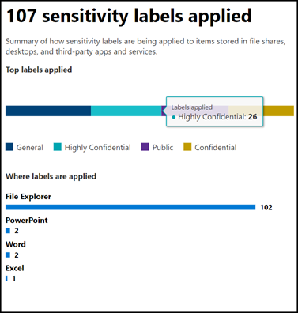
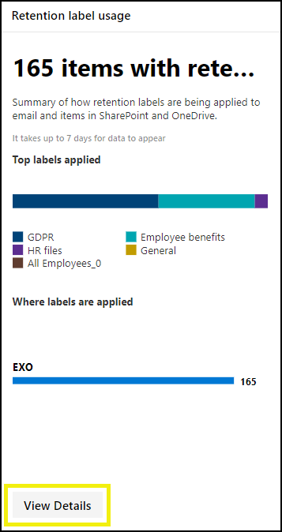

# View label usage with label analytics

After you create your retention labels and sensitivity labels, you’ll want to see how they’re being used across your tenant. With label analytics in the Microsoft 365 compliance center and Microsoft 365 security center, you can quickly see which labels are used the most and where they’re being applied.

For example, with label analytics, you can view the:

- Total number of retention labels and sensitivity labels applied to content.
- Top labels and the count of how many times each label was applied.
- Locations where labels are applied and the count for each location.
- Count for how many files and folders had their retention label changed or removed.

You can find label analytics in the [Microsoft 365 compliance center](https://compliance.microsoft.com/labelanalytics) or [Microsoft 365 security center](https://security.microsoft.com/labelanalytics) > **Classification** > **Label analytics**.

## Sensitivity label usage

The data on sensitivity label usage is pulled from the reports for Azure Information Protection – for more information, see [Central reporting for Azure Information Protection](https://docs.microsoft.com/azure/information-protection/reports-aip).

Note that the Azure Information Protection reports have [prerequisites](/azure/information-protection/reports-aip#prerequisites) that also apply to label analytics on sensitivity labels in the Microsoft 365 compliance center and Microsoft 365 security center. For example, you need an Azure subscription that includes the Log Analytics because these reports are a result of sending information protection audit events from Azure Information Protection clients and scanners to a centralized location based on Azure Log Analytics service.

For sensitivity label usage:

- There is no latency in the data. This is a real-time report.
- To see the count for each top label, point to the bar graph and read the tool tip that appears.
- The report shows where sensitivity labels are applied per app (whereas retention labels are shown per location).

## Retention label usage

This report shows a quick view of what the top labels are and where they’re applied. For more detailed information on how content in SharePoint and OneDrive is labeled, see [View label activity for documents](view-label-activity-for-documents.md).

For retention label usage:

- Data is aggregated weekly, so it may take up to seven days for data to appear in the report.
- To see the count for each top label, point to the bar graph and read the tool tip that appears.
- The report shows where retention labels are applied per location (whereas sensitivity labels are shown per app).
- For retention labels, this is a summary of the all-time data in your tenant; it’s not filtered to a specific date range. By contrast, the [Label Activity Explorer](view-label-activity-for-documents.md) shows data from only the past 30 days.

## View all content with a specific retention label

From the retention label usage report, you can quickly explore all content with that label applied. (Note that we're currently working on this feature, so that it will take fewer steps to view all the labeled content.)

First, choose **View Details** at the bottom of the report.

Then choose a retention label > **Explore items** in the right pane.

For that label, you can choose the **Activity** tab to view a count of items with that label by location.

You can also choose the **Items with this label** tab. Then you can drill into specific locations:

- For Exchange Online, you see a list of mailboxes with the count of labeled items in each mailbox.
- For SharePoint Online and OneDrive for Business, you see a list of site collections and OneDrive accounts with the count of labeled items in each location.

When you choose a mailbox or site collection, you can view a list of items with that retention label in that location.

## Permissions

To view label analytics, you must be assigned one of the following roles in Azure Active Directory:

- Global administrator
- Compliance administrator
- Security administrator
- Security reader

In addition, note these reports use Azure Monitor to store the data in a Log Analytics workspace that your organization owns. Therefore, the user should be added as a reader to the Azure Monitoring worksapce that holds the data - for more information, see [Permissions required for Azure Information Protection analytics](https://docs.microsoft.com/azure/information-protection/reports-aip#permissions-required-for-azure-information-protection-analytics).

