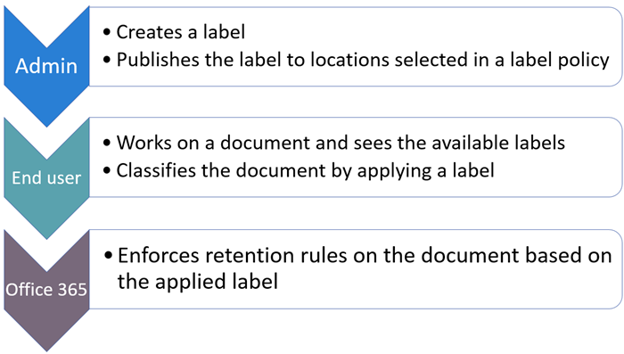
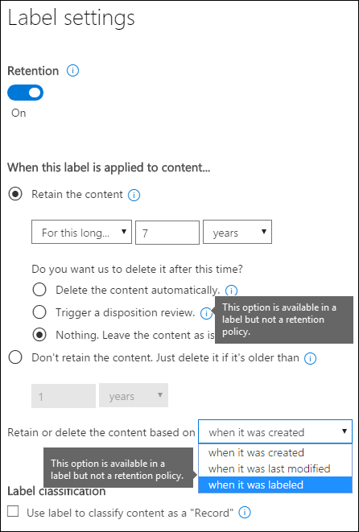
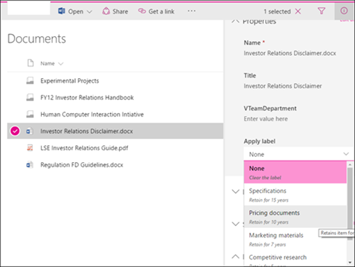
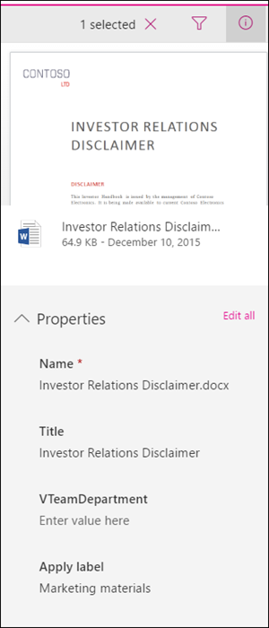
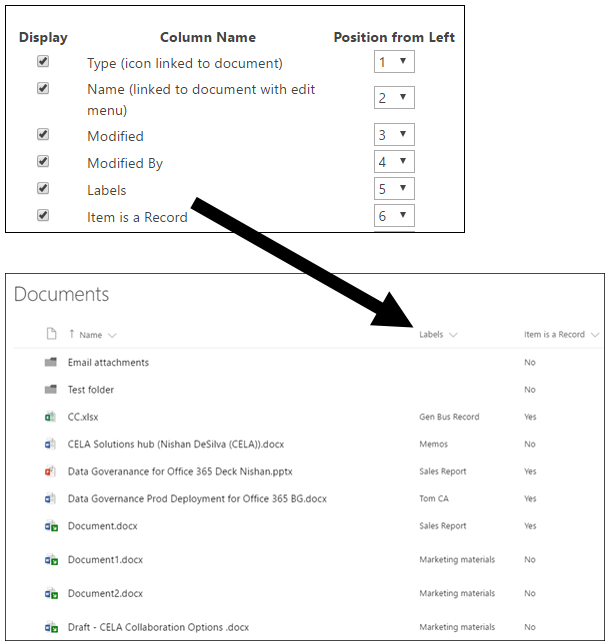
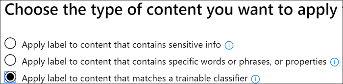
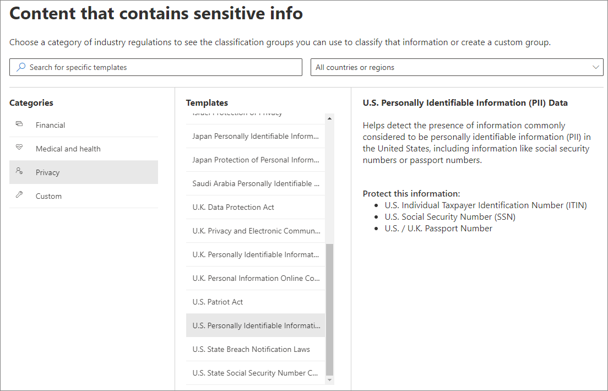
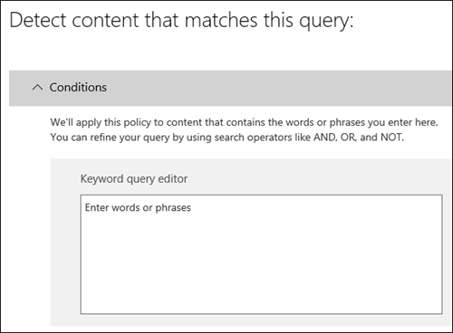
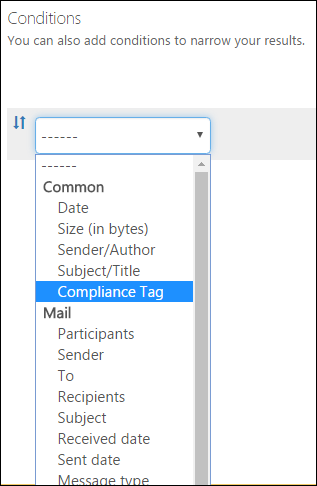

# Overview of retention labels

>*[Microsoft 365 licensing guidance for security & compliance](https://aka.ms/ComplianceSD).*

Across your organization, you probably have different types of content that require different actions taken on them in order to comply with industry regulations and internal policies. For example, you might have:
  
- Tax forms that need to be **retained** for a minimum period of time. 
    
- Press materials that need to be **permanently deleted** when they reach a certain age. 
    
- Competitive research that needs to be both **retained** and then **permanently deleted**. 
    
- Work visas that must be **marked as a record** so that they can't be edited or deleted. 
    
In all of these cases, retention labels in Office 365 can help you take the right actions on the right content. With retention labels, you can classify data across your organization for governance, and enforce retention rules based on that classification.
  
With retention labels, you can:
  
- **Enable people in your organization to apply a retention label manually** to content in Outlook on the web, Outlook 2010 and later, OneDrive, SharePoint, and Office 365 groups. Users often know best what type of content they're working with, so they can classify it and have the appropriate policy applied. 
    
- **Apply retention labels to content automatically** if it matches specific conditions, such as when the content contains: 
    
    - Specific types of sensitive information.
    
    - Specific keywords that match a query you create.
    
    - Pattern matches for a trainable classifier.
    
  The ability to apply retention labels to content automatically is important because:
    
     - You don't need to train your users on all of your classifications.
    
     - You don't need to rely on users to classify all content correctly.
    
   - Users no longer need to know about data governance policies - they can instead focus on their work.

- **Implement records management across Office 365**, including both email and documents. You can use a retention label to classify content as a record. When this happens, the label can't be changed or removed, and the content can't be edited or deleted. 

- **Apply a default retention label to a document library, folder, or document set** in SharePoint, so that all documents that arrive in that location inherit the default retention label.  
    
You create retention labels in the Microsoft 365 compliance center, Microsoft 365 security center, or Office 365 Security & Compliance Center.

## How retention labels work with retention label policies

Making retention labels available to people in your organization so that they can classify content is a two-step process: first you create the retention labels, and then you publish them to the locations you choose. When you publish retention labels, a retention label policy gets created.
  

  
Retention labels are independent, reusable building blocks that are included in one or more retention label policies. The primary purpose of a retention label policy is to group a set of retention labels and specify the locations where you want those labels to appear.
  

  
1. When you publish retention labels, they're included in a retention label policy. Retention label names are immutable, which means that they and cannot be edited after they're created.


2. A single retention label can be included in many retention label policies.

3. A single location can also be included in many retention label policies.    
    
3. Retention label policies specify the locations to publish the retention labels.
    
## Only one retention label at a time

It's important to know that content like an email or document can have only a single retention label assigned to it at a time:
  
- For retention labels assigned manually by end users, people can remove or change the retention label that's assigned.
    
- If content has an auto-apply label assigned, an auto-apply label can be replaced by a retention label assigned manually by an end user.
    
- If content has a retention label assigned manually by an end user, an auto-apply label cannot replace the manually assigned retention label.
    
- If there are multiple rules that assign an auto-apply label and content meets the conditions of multiple rules, the retention label for the oldest rule is assigned.
    
Manually assigned labels are explicitly assigned; auto-apply labels are implicitly assigned; an explicit retention label takes precedence over an implicit label. For more information, see the below section on [The principles of retention, or what takes precedence?](#the-principles-of-retention-or-what-takes-precedence).

All the information in this section applies only to retention labels. Note that an item of content can also have one sensitivity label applied to it, in addition to one retention label.
  
## How long it takes for retention labels to take effect

When you publish or auto-apply retention labels, they don't take effect immediately:
  
1. First the label policy needs to be synced from the admin center to the locations in the policy.
    
2. Then the location may require time to make published retention labels available to end users or time to auto-apply labels to content. How long this takes depends on the location and type of retention label.
    
### Published retention labels

If you publish retention labels to SharePoint or OneDrive, it can take one day for those retention labels to appear for end users. In addition, if you publish retention labels to Exchange, it can take 7 days for those retention labels to appear for end users, and the mailbox needs to contain at least 10 MB of data.
  

  
### Auto-apply retention labels

If you auto-apply retention labels to content matching specific conditions, it can take seven days for the retention labels to be applied to all existing content that matches the conditions.
  

  
### How to check on the status of retention labels published to Exchange

In Exchange Online, retention labels are made available to end users by a process that runs every seven days. By using Powershell, you can see when this process last ran and thus determine when it will run again.
  
1. [Connect to Exchange Online PowerShell](https://go.microsoft.com/fwlink/?linkid=799773).
    
2. Run these commands.
    
   ```powershell
   $logProps = Export-MailboxDiagnosticLogs <user> -ExtendedProperties
   ```

   ```powershell
   $xmlprops = [xml]($logProps.MailboxLog)
   ```

   ```powershell
   $xmlprops.Properties.MailboxTable.Property | ? {$_.Name -like "ELC*"}
   ```

In the results, the `ELCLastSuccessTimeStamp` (UTC) property shows when the system last processed your mailbox. If it has not happened since the time you created the policy, the labels are not going to appear. To force processing, run  `Start-ManagedFolderAssistant -Identity <user>`.
    
If labels aren't appearing in Outlook on the web and you think they should be, make sure to clear the cache in your browser (CTRL+F5).
    
## Retention label policies and locations

Different types of retention labels can be published to different locations, depending on what the retention label does.
  
|**If the retention label is…**|**Then the label policy can be applied to…**|
|:-----|:-----|
|Published to end users  <br/> |Exchange, SharePoint, OneDrive, Office 365 groups  <br/> |
|Auto-applied based on sensitive information types  <br/> |Exchange (all mailboxes only), SharePoint, OneDrive  <br/> |
|Auto-applied based on a query  <br/> |Exchange, SharePoint, OneDrive, Office 365 groups  <br/> |
   
In Exchange, auto-apply retention labels (for both queries and sensitive information types) are applied only to messages newly sent (data in transit), not to all items currently in the mailbox (data at rest). Also, auto-apply retention labels for sensitive information types can apply only to all mailboxes; you can't select the specific mailboxes.
  
Exchange public folders and Skype do not support labels.
  
## How retention labels enforce retention

Retention labels can enforce the same retention actions that a retention policy can. You can use retention labels to implement a sophisticated content plan (or file plan). For more information on how retention works, see [Overview of retention policies](retention-policies.md).
  
In addition, a retention label has two retention options that are available only in a retention label and not in a retention policy. With a retention label, you can:
  
- Trigger a disposition review at the end of the retention period, so that SharePoint and OneDrive documents must be reviewed before they can be deleted. For more information, see [Overview of disposition reviews](disposition-reviews.md).
    
- Start the retention period from when the content was labeled, instead of the age of the content or when it was last modified. This option applies only to content in SharePoint sites and OneDrive accounts. For Exchange email, the retention period is always based on the date when the message was sent or received, no matter which option you choose here.
    

  
## Where published retention labels can appear to end users

If your retention label will be assigned to content by end users, you can publish it to:
  
- Outlook on the web
    
- Outlook 2010 and later
    
- OneDrive
    
- SharePoint
    
- Office 365 groups (both the group site and group mailbox in Outlook on the web)
    
The sections that follow explain how labels appear in different apps to people in your organization.
  
### Outlook on the web

To label an item in Outlook on the web, right-click the item \> **Assign policy** \> choose the retention label. 
  

  
After the retention label is applied, you can view that retention label and what action it takes at the top of the item. If an email is classified and has an associated retention period, you can know at a glance when the email will expire.
  

  
You can also apply retention labels to folders, in which case:
  
- All items in the folder automatically get the same retention label, **except** for items that have had a retention label applied explicitly to them. Explicitly labeled items keep their existing retention label. For more information, see the below section on the principles of retention. 
    
- If you change or remove the default retention label for a folder, the retention label's also changed or removed for all items in the folder, **except** items with explicit retention labels. 
    
- If you move an item with a default retention label from one folder to another folder with a different default retention label, the item gets the new default retention label.
    
- If you move an item with a default retention label from one folder to another folder with no default retention label, the old default retention label is removed.
    
### Outlook 2010 and later

To label an item in the Outlook desktop client, select the item. On the **Home** tab on the ribbon, click **Assign Policy**, and then choose the retention label. 
  

  
You can also right-click an item, click **Assign Policy** in the context menu, and then choose the retention label. 

After the retention label is applied, you can view that retention label and what action it takes at the top of the item. If an email has a retention label applied that has an associated retention period, you can see at a glance when the email expires.
  
You can also apply retention labels to folders. This works the same in Outlook 2010 and later as it does in Outlook on the web. See the previous section for more info.
  
### OneDrive and SharePoint

To label a document (including OneNote files) in OneDrive or SharePoint, select the item \> in the upper-right corner, choose **Open the details pane** \> **Apply retention label** \> choose the retention label. 
  
You can also apply a retention label to a folder or document set, and you can set a default retention label for a document library. See the section below for more information.
  

  
After a retention label is applied to an item, you can view it in the details pane when that item's selected.
  

  
You can also create a view of the library that contains the **Labels** column or **Item is a Record** column, so that you can see at a glance the retention labels assigned to all items and which items are records. Note, however, that you can't filter the view by the **Item is a Record** column. 
  

  
### Office 365 groups

When you publish retention labels to an Office 365 group, the retention labels appear in both the group site and group mailbox in Outlook on the web. The experience of applying a retention label to content is identical to that shown above for email and documents.

To retain content for an Office 365 group, you need to use the Office 365 groups location. Even though an Office 365 group has an Exchange mailbox, a retention policy that includes the entire Exchange location won't include content in Office 365 group mailboxes.

In addition, it's not possible to use the Exchange location to include or exclude a specific group mailbox. Although the Exchange location initially allows a group mailbox to be selected, when you try to save the retention policy, you receive an error that "RemoteGroupMailbox" is not a valid selection for the Exchange location.
  
## Applying a retention label automatically based on conditions

One of the most powerful features of retention labels is the ability to apply them automatically to content that matches certain conditions. In this case, people in your organization don't need to apply the retention labels. Office 365 does the work for them.
  

  
Auto-apply retention labels are powerful because:
  
- You don't need to train your users on all of your classifications.
    
- You don't need to rely on users to classify all content correctly.
    
- Users no longer need to know about data governance policies - they can focus on their work.
    
You can choose to apply retention labels to content automatically when that content contains:
  
- [Specific types of sensitive information](#auto-apply-retention-labels-to-content-with-specific-types-of-sensitive-information)
    
- [Specific keywords that match a query you create](#auto-apply-labels-to-content-with-keywords-or-searchable-properties)

- [A match for trainable classifiers](#auto-apply-labels-to-content-by-using-trainable-classifiers)
    


It can take up to seven days for auto-apply retention labels to be applied to all content that matches the conditions you've configured.
  
> [!TIP]
> See [Manage the lifecycle of SharePoint documents with retention labels](auto-apply-retention-labels-scenario.md) for a detailed scenario about using managed properties in SharePoint to auto-apply retention labels and implement event-driven retention.

### Auto-apply retention labels to content with specific types of sensitive information

When you create auto-apply retention labels for sensitive information, you see the same list of policy templates as when you create a data loss prevention (DLP) policy. Each policy template is preconfigured to look for specific types of sensitive information. For example, the template shown here looks for U.S. ITIN, SSN, and passport numbers. To learn more about DLP, see [Overview of data loss prevention policies](data-loss-prevention-policies.md).
  

  
After you select a policy template, you can add or remove any types of sensitive information, and you can change the instance count and match accuracy. In the example shown here, a retention label will be auto-applied only when:
  
- The content contains between 1 and 9 instances of any of these three sensitive information types. You can delete the **max** value so that it changes to **any**.
    
- The type of sensitive information that's detected has a match accuracy (or confidence level) of at least 75. Many sensitive information types are defined with multiple patterns, where a pattern with a higher match accuracy requires more evidence to be found (such as keywords, dates, or addresses), while a pattern with a lower match accuracy requires less evidence. Simply put, the lower the **min** match accuracy, the easier it is for content to match the condition. 
    
For more information on these options, see [Tuning rules to make them easier or harder to match](data-loss-prevention-policies.md#tuning-rules-to-make-them-easier-or-harder-to-match).
    

  
### Auto-apply labels to content with keywords or searchable properties

You can auto-apply labels to content that satisfies certain conditions. The conditions now available support applying a label to content that contains specific words, phrases, or values of searchable properties. You can refine your query by using search operators like AND, OR, and NOT.

For more information on query syntax, see:

- [Keyword Query Language (KQL) syntax reference](https://docs.microsoft.com/sharepoint/dev/general-development/keyword-query-language-kql-syntax-reference)

Query-based labels use the search index to identify content. For more information on valid searchable properties, see:

- [Keyword queries and search conditions for Content Search](keyword-queries-and-search-conditions.md)
- [Overview of crawled and managed properties in SharePoint Server](https://docs.microsoft.com/SharePoint/technical-reference/crawled-and-managed-properties-overview)

Examples queries:

- Exchange
    - subject:"Quarterly Financials"
    - recipients:garthf<!--nolink-->@contoso.com
- SharePoint and OneDrive for Business
    - contenttype:contract
    - site:https<!--nolink-->://contoso.sharepoint.com/sites/teams/procurement AND contenttype:contract




### Auto-apply labels to content by using trainable classifiers

When you choose the option for a trainable classifier, you can select one of the built-in classifiers, or a custom classifier. The built-in classifiers include **Offensive Language**, **Resumes**, **SourceCode**, **Targeted Harassment**, **Profanity**, and **Threat**:


To automatically apply a label by using this option, SharePoint Online sites and mailboxes must have at least 10 MB of data.

For more information about trainable classifiers, see [Getting started with trainable classifiers (preview)](classifier-getting-started-with.md).

For an example configuration, see [How to prepare for and use a built-in classifier](classifier-using-a-ready-to-use-classifier.md#how-to-prepare-for-and-use-a-built-in-classifier).

## Applying a default retention label to all content in a SharePoint library, folder, or document set

In addition to enabling people to apply a retention label to individual documents, you can also apply a default retention label to a SharePoint library, folder, or document set, so that all documents in that location get the default retention label.
  
For a document library, this is done on the **Library settings** page for a document library. When you choose the default retention label, you can also choose to apply it to existing items in the library. 
  
For example, if you have a tag for marketing materials, and you know a specific document library contains only that type of content, you can make the Marketing Materials tag the default for all documents in that library.
  

  
If you apply a default retention label to existing items in the library, folder, or document set:
  
- All items in the library, folder, or document set automatically get the same retention label, **except** for items that have had a retention label applied explicitly to them (such as records). Explicitly labeled items keep their existing label. For more information, see the below section on [The principles of retention, or what takes precedence](#the-principles-of-retention-or-what-takes-precedence).
    
- If you change or remove the default retention label for a library, folder, or document set, the retention label is also changed or removed for all items in the library, folder, or document set, **except** items with explicit retention labels (such as records).
    
- If you move an item with a default retention label from one site collection, library, folder, or document set to another site collection, library, folder, or document set that has a different label, the item keeps its existing default retention label, even if the new location has a different default retention label. If the item does not have a label before moving, it will take on the default retention label of the new location.

**Records:** If you apply a default record label to a library, folder, or document set, then a record label is applied to all the individual items within those locations. When you move a new item into a location with a record label, that item is labeled a record. However, if you change the default retention label to a label that doesn't declare content as a record, that action **does not** remove the record label from the individual items; those items retain their record label. Only a site collection admin can explicitly remove or change the retention label of record items.

For more information about retention labels that declare content as a record, see [Overview of records](records.md).
    
## Applying a retention label to email by using rules

In Outlook 2010 or later, you can create rules to apply a retention label or retention policy.
  
For example, you can create a rule that applies a specific retention label to all messages sent to or from a specific distribution group.
  
To create a rule, right-click an item \> **Rules** \> **Create Rule** \> **Advanced Options** \> **Rules Wizard** \> **apply retention policy**.
  

  
## Classifying content without applying any actions

When you create a retention label, you can do so without turning on any retention or other actions, as shown below. In this case, you can use a retention label simply as a text label, without enforcing any actions.
  
For example, you can create a retention label named "Review later" with no actions, and then auto-apply that retention label to content with sensitive information types or queried content.
  

  
## Using retention labels for records management
    
You can use retention labels to declare content as a record. This lets you implement a single, consistent records-management strategy across Office 365. For more information, see [Overview of records](records.md).
  
## Using a retention label as a condition in a DLP policy

A retention label can enforce retention actions on content. In addition, you can use a retention label as a condition in a data loss prevention (DLP) policy, and the DLP policy can enforce other actions, such as restricting access, on content that contains a specific label. 
  
For more information, see [Using a label as a condition in a DLP policy](data-loss-prevention-policies.md#using-a-label-as-a-condition-in-a-dlp-policy).
  
## Monitor retention labels

After you publish or auto-apply your retention labels, you'll want to verify that they're being applied to content as you intended. To monitor your retention labels, you can use the:
  
- **Label Activity Explorer**. With the explorer (shown below), you can quickly search and view retention label activity for all content across SharePoint and OneDrive for Business over the past 30 days. For more information, see [View label activity for documents](view-label-activity-for-documents.md).

- **Label analytics** page. In the Microsoft 365 compliance center and Microsoft 365 security center, you can quickly view your top labels and where they're applied. You can also view all content with a specific label. For more information, see [View label usage with label analytics](label-analytics.md).
    
- **Data governance reports**. With these reports, you can quickly view retention label trends and activity for all content across Exchange, SharePoint, and OneDrive for Business over the past 90 days. For more information, see [View the data governance reports](view-the-data-governance-reports.md).
    

  
## Using Content Search to find all content with a specific retention label applied to it

After retention labels are assigned to content, either by users or auto-applied, you can use content search to find all content that's classified with a specific retention label.
  
When you create a content search, choose the **Compliance Tag** condition, and then enter the complete label name or part of the label name and use a wildcard. For more information, see [Keyword queries and search conditions for Content Search](keyword-queries-and-search-conditions.md).
  

  
## The principles of retention, or what takes precedence?

It's possible or even likely that content might have several retention policies applied to it, each with a different action (retain, delete, or both) and retention period. What takes precedence? At the highest level, rest assured that content being retained by one policy can't be permanently deleted by another policy.
  

  
To understand how different labels with retention actions are applied to content, keep these principles of retention in mind:
  
1. **Retention wins over deletion.** Suppose that one retention policy says to delete Exchange email after three years, but another retention policy says to retain Exchange email for five years and then delete it. Any content that reaches three years old will be deleted and hidden from the users' view, but still retained in the Recoverable Items folder until the content reaches five years old, when it will be permanently deleted. 
    
2. **The longest retention period wins.** If content's subject to multiple policies that retain content, it will be retained until the end of the longest retention period. 
    
3. **Explicit inclusion wins over implicit inclusion.** This means: 
    
    1. If a retention label with retention settings is manually assigned by a user to an item, such as an Exchange email or OneDrive document, that retention label takes precedence over both a policy assigned at the site or mailbox level and a default retention label assigned by the document library. For example, if the explicit retention label says to retain for 10 years, but the retention policy assigned to the site says to retain for only five years, the retention label takes precedence. Auto-applied retention labels are considered implicit, not explicit, because they're applied automatically by Office 365.
    
    2. If a retention policy includes a specific location, such as a specific user's mailbox or OneDrive for Business account, that policy takes precedence over another retention policy that applies to all users' mailboxes or OneDrive for Business accounts but doesn't specifically include that user's mailbox.
    
4. **The shortest deletion period wins.** Similarly, if content's subject to multiple policies that delete content (with no retention), it will be deleted at the end of the shortest retention period. 
    
Understand that the principles of retention work as a tie-breaking flow from top to bottom: If the rules applied by all policies or labels are the same at one level, the flow moves down to the next level to determine precedence for which rule is applied.
  
Finally, a retention policy or label cannot permanently delete any content that's on hold for eDiscovery. When the hold is released, the content again becomes eligible for the cleanup process described above.

### Precedence for auto-labeling with trainable classifiers

All retention labels that are configured for trainable classifiers are evaluated simultaneously. If an item is detected by more than one trainable classifier, the following criteria is used to determine which retention label to apply:

1. Retention labels configured for retain-only or retain and then delete have a higher priority over retention labels that are configured for delete-only.

2. For retention labels that are configured for retain-only or retain and then delete, the retention label that is configured for the longest retention period wins.

3. For retention labels that are configured for delete-only, the retention label that has been configured for the shortest period wins.

4. Retention labels with the same action and the same period result in a retention label selection that is non-deterministic.

## Use retention labels instead of these features

Retention labels can easily be made available to an entire organization and its content across Office 365, including Exchange, SharePoint, OneDrive, and Office 365 groups. If you need to classify content or manage records anywhere in Office 365, we recommend that you use retention labels.
  
There are several other features that have previously been used to classify content or manage records in Office 365. These are listed below. These features will continue to work side by side with retention labels. While there are instances where the implementation of retention labels differs from previous features, the evolution of retention labels will drive the future of records management across Office 365. Therefore, moving forward, for data governance, we recommend that you use retention labels instead of these features.
  
### Exchange Online

- [Retention tags and retention policies](https://go.microsoft.com/fwlink/?linkid=846125), also known as [messaging records management (MRM)](https://go.microsoft.com/fwlink/?linkid=846126) (Deletion only) 
    
### SharePoint Online and OneDrive for Business

- [Configuring in place records management](https://support.office.com/article/7707a878-780c-4be6-9cb0-9718ecde050a) (Retention) 
    
- [Introduction to the Records Center](https://support.office.com/article/bae6ca5a-7b19-40e0-b433-e3613a747c2c) (Retention) 
    
- [Information management policies](intro-to-info-mgmt-policies.md) (Deletion only) 
    
## Permissions

Members of your compliance team who will create retention labels need permissions to the Security &amp; Compliance Center. By default, your tenant admin has access to this location and can give compliance officers and other people access to the Security &amp; Compliance Center, without giving them all of the permissions of a tenant admin. To do this, we recommend that you go to the **Permissions** page of the Security &amp; Compliance Center, edit the **Compliance Administrator** role group, and add members to that role group. 
  
For more information, see [Give users access to the Office 365 Security &amp; Compliance Center](../security/office-365-security/grant-access-to-the-security-and-compliance-center.md).
  
These permissions are required only to create and apply retention labels and a label policy. Policy enforcement does not require access to the content.  
## Find the PowerShell cmdlets for labels

To use the label cmdlets, you need to:
  
1. [Connect to the Office 365 Security & Compliance Center Powershell](https://docs.microsoft.com/powershell/exchange/office-365-scc/connect-to-scc-powershell/connect-to-scc-powershell)
    
2. Use these Office 365 Security & Compliance Center cmdlets:

  - [Get-ComplianceTag](https://docs.microsoft.com/powershell/module/exchange/policy-and-compliance-retention/get-compliancetag)

  - [New-ComplianceTag](https://docs.microsoft.com/powershell/module/exchange/policy-and-compliance-retention/new-compliancetag)

  - [Remove-ComplianceTag](https://docs.microsoft.com/powershell/module/exchange/policy-and-compliance-retention/remove-compliancetag)

  - [Set-ComplianceTag](https://docs.microsoft.com/powershell/module/exchange/policy-and-compliance-retention/set-compliancetag)

  - [Enable-ComplianceTagStorage](https://docs.microsoft.com/powershell/module/exchange/policy-and-compliance-retention/enable-compliancetagstorage)

  - [Get-ComplianceTagStorage](https://docs.microsoft.com/powershell/module/exchange/policy-and-compliance-retention/get-compliancetagstorage)

  - [Get-RetentionCompliancePolicy](https://docs.microsoft.com/powershell/module/exchange/policy-and-compliance-retention/get-retentioncompliancepolicy)

  - [New-RetentionCompliancePolicy](https://docs.microsoft.com/powershell/module/exchange/policy-and-compliance-retention/new-retentioncompliancepolicy)

  - [Remove-RetentionCompliancePolicy](https://docs.microsoft.com/powershell/module/exchange/policy-and-compliance-retention/remove-retentioncompliancepolicy)

  - [Set-RetentionCompliancePolicy](https://docs.microsoft.com/powershell/module/exchange/policy-and-compliance-retention/set-retentioncompliancepolicy)

  - [Get-RetentionComplianceRule](https://docs.microsoft.com/powershell/module/exchange/policy-and-compliance-retention/get-retentioncompliancerule)

  - [New-RetentionComplianceRule](https://docs.microsoft.com/powershell/module/exchange/policy-and-compliance-retention/new-retentioncompliancerule)

  - [Remove-RetentionComplianceRule](https://docs.microsoft.com/powershell/module/exchange/policy-and-compliance-retention/remove-retentioncompliancerule)

  - [Set-RetentionComplianceRule](https://docs.microsoft.com/powershell/module/exchange/policy-and-compliance-retention/set-retentioncompliancerule)
